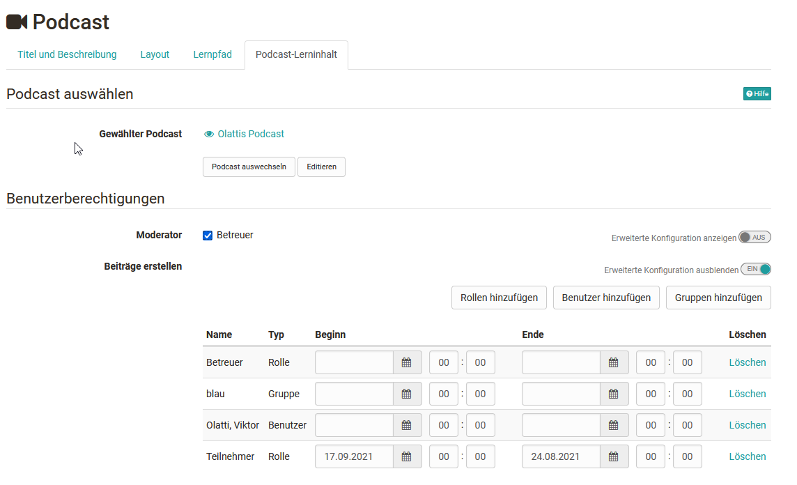

# Podcast - Weitere Konfigurationen

## Konfiguration im Kurseditor

Im Kurseditor konfigurieren Sie Ihren Podcast.

## Tab "Podcast-Lerninhalt"

Wenn Sie einen neuen Kursbaustein Podcast Ihrem Kurs hinzugefügt haben, können
Sie als erstes

* eine bereits erstellte Lernressource Podcast auswählen,
* einen neuen Podcast erstellen oder
* einen Podcast importieren

Siehe Schritt 2 der [4-Schritte Anleitung](Four_Steps_to_Your_Podcast.de.md). Wurde
bereits eine Verknüpfung zu einer Lernressource Podcast hergestellt, kann
diese ausgewechselt oder editiert werden (siehe Schritt 3 der [4-Schritte
Anleitung](Podcast+erstellen.html)).

### Externen Podcast einbinden

Sie können den Podcast-Kursbaustein auch dazu verwenden, einen externen
Podcast einzubinden. Wählen Sie beim erstmaligen Editieren des Podcasts „Einen
bestehenden externen Podcast einbinden“. Im Feld „URL“ geben Sie den Feed-Link
des externen Podcasts ein. In der Regel ist dies eine URL mit der Erweiterung
.xml. Im Kursbaustein werden die Episoden des externen Podcasts angezeigt.

!!! warning "Achtung"

    Wenn Sie sich für eine Art des Podcasts (Episoden selber erstellen oder externen Podcast einbinden) entschieden haben, können Sie dies später nicht mehr ändern.

### Benutzerberechtigungen

Im Tab "Podcast-Lerninhalt können sie auch die Benutzerberechtigungen
definieren und einstellen wer einen Podcast moderieren und wer Beiträge
erstellen darf. Auf diesen Weg können auch Teilnehmenden die Rechte erteilt
werden Podcasts in OpenOlat hochzuladen.

Mit Hilfe der erweiterten Konfiguration der Berechtigungen können die
Einstellungen noch differenzierter vorgenommen werden und beispielsweise
bestimmten Rollen, Gruppen oder auch einzelnen Gruppen die Berechtigung zum
erstellen der Podcasts oder das Moderationsrecht erteilt werden.
Moderationsrecht bedeutet, dass die definierten Personen den Podcast
bearbeiten und alle Episoden und Kommentare löschen dürfen. Zudem können
Moderatoren auch den Titel und die Beschreibung des ganzen Feeds anpassen.
Diese Konfiguration ist nur dann relevant, wenn die Episoden in OpenOlat
erstellt werden. Wird ein externer Podcast eingebunden, können Sie in OpenOlat
keinen Einfluss darauf nehmen, wer Episoden erstellen darf.

Standardmässig dürfen nur Kursautoren Episoden erstellen. Kursteilnehmende
können Episoden herunterladen, kommentieren und bewerten. Damit die Lernenden
eigene Podcasts hinzufügen können, muss ein erstes Video vorhanden sein, z.B.
könnte der Lehrende in einem ersten Video kurz erläutern, was die Lernenden
hier machen sollen.

!!! warning ""

    Beachten Sie auch die vom OpenOlat Administrator definierten Upload- und Speichergrenzen und versuchen Sie eher kleine Dateien hochzuladen.

## Konfiguration im Kursrun

### Ersteller

Ist der Kursbaustein Podcast entsprechend der 4 Erstellungsschritte im
Kurseditor eingerichtet, können weitere Konfigurationen bei geschlossenem
Kureditor vorgenommen werden.

Personen mit Ersteller-Rechten können hier über den Button "**Episode hinzufügen**" neue Audio- oder Video-Dateien in den Kursbaustein hochladen.

### Kursteilnehmer

Kursteilnehmende können sich über Änderungen informieren lassen (Änderungen
einschalten). Sie können sich die Dateien einhören bzw. ansehen und auch
Kommentare und Sternchenbewertungen zu jeder Mediendatei hinterlassen. Darüber
hinaus können sie die Podcast Episoden auch per RSS-Feed abonnieren.  Auf der
Startseite des Podcasts finden Sie verschiedene Möglichkeiten, den Podcast
über die Feed-URL in einem Portal wie iTunes zu abonnieren.
