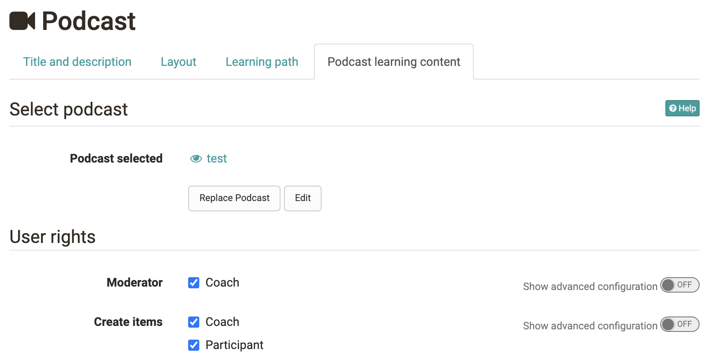

# Podcast - Further Configurations

## Configuration in the course editor

In the course editor you configure your podcast.

## Tab: Podcast learning content

When you have added a new course element Podcast to your course, you can first

  * select an already created learning resource podcast,
  * create a new podcast or
  * import a podcast

See step 2 of the [4-step guide](Four_Steps_to_Your_Podcast.md). If a link
to a learning resource podcast has already been created, it can be replaced or
edited (see step 3 of the [4-step guide](Four+Steps+to+Your+Podcast.html)).

### Include external podcast

You can also use the podcast course element to include an external podcast.
When editing the podcast for the first time, select "Embed an already existing
external podcast". Enter the feed link of the external podcast in the "URL"
field. Usually this is a URL with the extension .xml. The course element
displays the episodes of the external podcast.

If you have decided on a type of podcast (create your own episodes or include
an external podcast), you cannot change this later.

### User rights

In the tab "Podcast learning content" you can also define the user rights and
set who can moderate a podcast and who can create contributions. This way,
participants can also be given the rights to upload podcasts to OpenOlat.

With the help of the advanced configuration of the rights, the settings can be
made even more differentiated and, for example, certain roles, groups or even
individual users can be granted the right to create podcasts or the moderation
right. Moderation right means that the defined persons are allowed to edit the
podcast and delete all episodes and comments. In addition, moderators can also
customize the title and description of the entire feed. This configuration is
only relevant if the episodes are created in OpenOlat. If an external podcast
is included, you cannot influence who is allowed to create episodes in
OpenOlat.

By default, only course authors can create episodes. Course participants can
download, comment, and rate episodes. In order for learners to add their own
podcasts, an initial video must be available, e.g. the instructor could
briefly explain what learners should do here in an initial video.

Also, be aware of the upload and storage limits defined by the OpenOlat
administrator and try to upload rather small files.

# Configuration of the Podcast in the Course run

#### Creator

Once the course element Podcast has been set up according to the 4 creation
steps in the course editor, further configurations can be made with the course
editor closed.

Users with creator rights can upload new audio or video files to the course
element by clicking on the button "Add episode".

#### Course participants

Course participants can be informed about changes (activate changes). They can
listen to or watch the files and also leave comments and star ratings for each
media file. They can also subscribe to the podcast episodes via RSS feed. On
the podcast's home page, you will find several ways to subscribe to the
podcast via the feed URL in a portal like iTunes.

  

