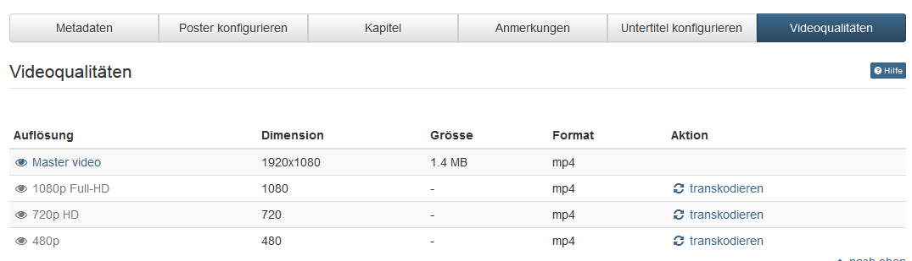

# Lernressource: Video

Eine Video-Lernressource wird im Autorenbereich über die Funktion
"[Importieren](../../pages/viewpage.action%EF%B9%96pageId=108593439.html#Aktionenim%E2%80%9EAutorenbereich%22-_importieren)"
oder "Importieren URL" erstellt.

Dazu im Upload-Fenster die gewünschte Video-Datei auswählen, einen Titel
vergeben und auf "Importieren" klicken. Es öffnet sich im nächsten Schritt die
Eingabeseite der "Einstellungen".

  

Eine zum Import [vorbereitete](Video_Upload.de.md) Videodatei muss im .mp4
Format vorliegen, damit sie in OpenOlat als Video-Lernressource erkannt werden
kann.

Wird nach dem Import auf der Infoseite eine Beschreibung eingegeben, kann
diese beim Einbetten in den Kurs als Beschreibung im Kurs angezeigt werden.

Werden über "Importieren URL" YouTube Videos importiert, werden dabei auch
Metadaten der YouTube Datei, wie der Titel oder ein Startbild übernommen.

  

## Videokonfiguration

In den Tabs des Menüs "Einstellungen" können Sie nun Ihr Video weiter
konfigurieren. Die Tabs "Info", "Freigabe" und "Katalog" sind analog zu
anderen Lernressourcen. Generelle Informationen zum Menü "Einstellungen"
finden Sie [hier](../course_create/Course_Settings.de.md).

### Metadaten

Im Tab "Metadaten" finden Sie generelle Angaben zum Video wie Erstelldatum und
Dateigrösse. Ferner haben Sie die Möglichkeit wie in anderen Lernressourcen
auch, Informationen zu Autoren, Fachbereichen, Hauptsprache, Zeitaufwand und
Lizenz zu hinterlegen.

### Poster konfigurieren

Im Tab "Poster konfigurieren" legen Sie fest, mit welchem Vorschaubild das
Video im Kursbereich, im Katalog, auf der Video Collection-Seite, auf der
Infoseite, im Autorenbereich sowie im Kurs angezeigt werden soll. Mit Hilfe
der Schaltfläche "Poster ersetzen" können Sie zwischen verschiedenen
Standbildern des Videos wählen oder alternativ über die Schaltfläche "Poster
hochladen" ein eigenes Bild als Startbild (Poster) hochladen. Falls kein
Poster ausgewählt wurde, erscheint das Standbild vom Beginn des Videos.

Bitte beachten Sie, dass ein solches Bild dieselben Abmessungen in Pixel haben
sollte wie das Originalvideo. Die entsprechenden Daten dazu finden Sie im Tab
"Metadaten".

### Kapitel

Jedem Video können "Kapitel" als Sprungmarken hinzugefügt werden. Dies
erleichtert die Navigation im Video und sollte bei längeren Videos auf jeden
Fall vorgenommen werden. Ein Kapitel wird mit der Schaltfläche "Kapitel
hinzufügen" hinzugefügt. Dann kann ein Kapitelname eingetragen werden. Zudem
muss die Anfangszeit des Videos definiert werden.

Alternativ kann im Video an der Stelle gestoppt werden, wo das neue Kapitel
beginnen soll. Anschliessend klicken Sie wiederum auf die Schaltfläche
"Kapitel hinzufügen". Die Anfangszeit wird nun automatisch übernommen und es
muss nur noch ein Kapitelname eingetragen werden.

Kapitel können anschließend sowohl bearbeitet, als auch wieder gelöscht
werden.

### Anmerkungen

Neben den Kapitelmerkmalen können auch an jeder beliebigen Stelle im Video
weitere Anmerkungen hinterlegt werden, z.B. um besonders wichtige Stellen
hervorzuheben oder bestimmte Aspekte zu ergänzen.

Wählen Sie die Stelle an der die Anmerkung ergänzt werden soll und definieren
Sie die weiteren Einstellungen, wie die Dauer, die Position an der die
Anmerkung erscheinen soll und natürlich den anzuzeigenden Text.

### Quiz

Hier können Sie dem Video einzelne Quizfragen hinzufügen. Aktuell stehen 11
verschiedene Fragetypen zur Auswahl. Anschließend kann die Frage weiter
konfiguriert werden. So kann im Tab "Konfiguration" des Quiz Menüs der
Zeitpunkt definiert werden zu dem die Frage erscheinen soll, ob es eine
Zeitbeschränkung gibt oder ob es erlaubt ist die Frage zu überspringen oder ob
ein weiterer Versuch erlaubt ist. Im Tab "Auswahl" wird die konkrete
Fragestellung sowie die Antworten hinterlegt. Im Tab "Punkte" wird die Art der
Punktevergabe definiert. im Tab "Feedback" können Feedbacks basierend auf
unterschiedlichen Kriterien hinzugefügt werden.

Weitere Informationen zu den generellen Einstellungen von Quiz und Tests
finden Sie im Kapitel "[Testfragen
konfigurieren](../tests/Configure_test_questions.de.md)". Weitere Informationen zu den
unterschiedlichen Fragetypen im Kapitel ["Test
Fragetypen"](../tests/Test_question_types.de.md).

###  Untertitel konfigurieren

Einem Video können Untertitel in beliebig vielen Sprachen zugewiesen werden.
Untertitel werden in OpenOlat im [WebVTT
Format](https://w3c.github.io/webvtt/) hochgeladen ([Wikipedia-
Artikel](https://en.wikipedia.org/wiki/WebVTT)). Die hochgeladene Datei muss
zwingend mit .srt abgespeichert sein. Das Format .vtt wird nicht unterstützt.
Untertitel können relativ einfach selbst erstellt werden. Dieses Format wird
von der meisten Video-Player-Software unterstützt. Für jede eingegebene
Untertitelzeile wird eine Zeitangabe benötigt, die im folgenden Format
vorliegen muss:

h:m:s.ms     Beispiel: 00:00:20.396 (Zeitangabe 0 Stunden, 0 Minuten, 20.396
Sekunden)

Millisekunden müssen bis auf die 3. Nachkomma-Stelle genau angegeben werden.

Zu beachten

Die Trennzeichen der Zeitangaben sind Doppelpunkt und Punkt (s. Beispiel). Es
dürfen keine Kommata verwendet werden.

Im Dokument muss auf der ersten Zeile WEBVTT stehen.

 **Untertitel hinzufügen**

Um einem Video einen Untertitel hinzuzufügen,

  1. navigieren Sie zum Tab "Untertitel konfigurieren" und
  2. klicken die Schaltfläche "Untertitel hinzufügen".
  3. Wählen Sie im neuen Fenster die Sprache deren Untertitel Sie hochladen möchten, und
  4. selektieren dann die entsprechende Datei.
  5. Klicken Sie "Hochladen". 

Bereits erstellte Untertitel werden in einer Tabelle aufgelistet und können
dort auch gelöscht werden.

 **Untertitel anzeigen**

Standardmässig werden Videos in OpenOlat ohne Untertitel abgespielt. Sobald
Untertitel vorhanden sind, wird folgendes Icon im Video-Player angezeigt:
.
CC steht für den amerikanischen Ausdruck "[Closed
captions](https://de.wikipedia.org/wiki/Untertitel#Technische_Ausf.C3.BChrungen)"
(Wikipedia), und bedeutet dass Untertitel unsichtbar sind bis diese vom
Benutzer aktiviert werden. In OpenOlat sieht das dann folgendermassen aus:

Sobald Sie mit dem Mauszeiger über das Icon fahren klappt sich die Liste der
bestehenden Untertitel aus. Die aktuelle Auswahl ist dabei eingefärbt.

###  Videoqualitäten

Im Tab Videoqualität sehen Sie in welchen Auflösungen das Video vorliegt.
Sobald ein Video hochgeladen wird, werden Videos in den verschiedenen
Auflösungen erstellt. Dieser Prozess kann eine Weile dauern. Welche
Auflösungen im Anschluss zur Verfügung stehen ist abhängig von den
Einstellungen im Administrationsbereich. Ausstehende Videos können
transkodiert und nicht verwendete Auflösungen gelöscht werden. Im Videoplayer
können Sie die gewünschte Auflösung über den "Source Chooser" auswählen.

  

  

 Für Videos, die über "Importieren URL" hinzugefügt wurden, können die
Einstellungen nicht vorgenommen werden.

### Download

Im Tab Download kann eingestellt werden, ob die User das Video herunterladen
dürfen oder nicht.

## Videos in Kurse einbinden

Erstellte Video Lernressourcen können zusätzlich noch über den [Kursbaustein
"Video" ](../../pages/viewpage.action%EF%B9%96pageId=108593229.html)in
OpenOlat Kurse eingebunden werden. So eingebundene Videos erlauben - im
Gegensatz zu Videos die über das [Kurselement "Einzelne Seite"
eingebunden](Single_Page_Add_edit_video.de.md)
werden:

  * die Wiedergabe mit Untertiteln
  * die Wiedergabe in unterschiedlichen Auflösungen (vor allem relevant für Mobilgeräte, oder ohne WLAN-Zugang)
  * Kommentare
  * Bewertungen
  * ein Startbild nach Wunsch
  * Kombination mit bestimmten Erledigungskriterien in [Lernpfad Kursen](../course_create/Learning_path_course.de.md)

##  Video Collection

Nutzen Sie die "Video Collection"-Seite um durch alle Videos zu browsen, die
in Ihrer Instanz vorhanden sind. Damit ein Video in der "Video Collection"
angezeigt werden kann, muss der Publikationsstatus "Veröffentlicht"
eingestellt sein. In Kombination mit der Freigabeeinstellung "Offen" wird es
automatisch für alle registrierten Benutzer zugänglich. Die Beschreibung der
Infoseite wird automatisch in der Einzelansicht eines Videos angezeigt, ebenso
die Bewertungs- und Kommentarfunktion. Sollten Sie ein Video vermissen,
überprüfen Sie die Einstellungen in den Videoeinstellungen unter
"Zugangskonfiguration".

Wenn Sie in Ihrer OpenOlat Instanz den "Video Collection" Eintrag in der
Hauptnavigation nicht finden können, wurde dieser entweder vom Administrator
ausgeblendet, oder Sie besitzen nicht die benötigten Rechte.

