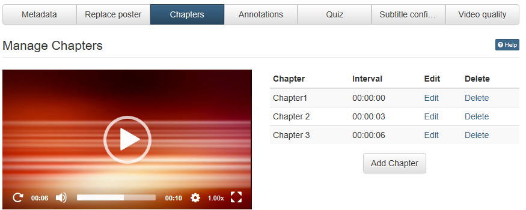
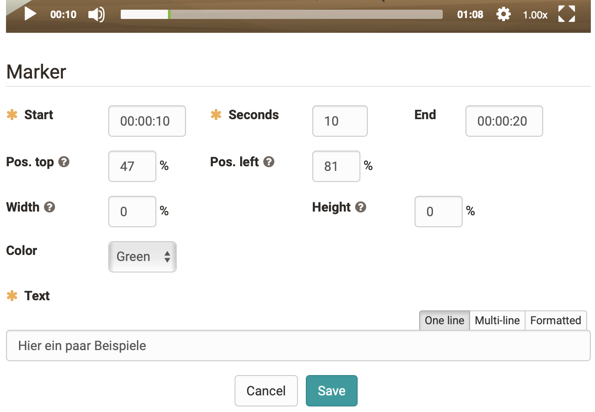

# Learning resource: Video

A video learning resource is created in authoring with the feature
"[Import](../authoring/Actions_in_the_Authoring_section.md)" or "Import URL".

Therefore you select the desired video-file in the upload window and click on
"Import". In the following step the form opens on info page.

Warning

To be recognized in OpenOlat as a video learning resource a [video file prepared for the import](Video_Upload.md) needs to be in the .mp4 form.

If a description is indicated on the info page after the import, it can be shown as course description when embedding into the course.

If YouTube videos are imported via "Import URL" YouTube, metadata of the YouTube file, such as the title or a start image, are also imported.

### Video settings

You can now further configure your video in the tabs of the "Settings" menu.
The "Info", "Share" and "Catalog" tabs are analogous to other learning
resources. For general information about the Settings menu, click
[here](../course_create/Course_Settings.md).

#### Metadata

In the tab "Metadata" you find general information like creation date and size
of video file. Furthermore, as in other learning resources, you have the
option to store information on authors, subject areas, main language, time
required and license.

### Replace poster

In the tab "Replace poster" you determine the picture which should indicate
the video in the course area, in the catalog, on the Video Collection page, in
the authoring as well as in the course. With the help of "Replace poster"
button you can chose between 8 freeze frames of the videos. If you prefer an
own picture, chose the button "Upload poster". If no poster is added, the
freeze frame from the beginning of the video appears.

!!! warning "Attention"

    Please consider that such a pictures needs the same pixel size than the original video. The corresponding data can be found in the tab "Metadata".

  

### Chapter {: #video_chapter}

To group a video, chapters can be added. This simplifies especially the
navigation in the video. A chapter is added with the button "Add chapter". The
name of the chapter can be inserted. Additionally the begin of the chapter
needs to be defined.

Alternatively the video can be stopped at the place, where the new chapter
should start. Click the button "Add chapter". The begin is taken over
automatically and only the name of the chapter needs to inserted.

Chapters can be edited and deleted.

### Annotations

In addition to the chapter markers, further annotations and comments can also
be stored at any point in the video, e.g. to highlight particularly important
points or to supplement certain aspects.

Select the place where the annotation should be added and define the further
settings, such as the duration, the position where the annotation should
appear and of course the text to be displayed.

### Quiz

Here you can add individual quiz questions to the video, which are either
created directly or imported from the question pool. There are currently 11
different question types to choose from. The question can then be further
configured. 

In the tab "**Configuration**" you can define the time at which the
question should appear, if there is a time limit or if it is allowed to skip
the question or if another attempt is allowed. 

In the tab "**Selection**" the
concrete question as well as the answers are deposited. 

The tab "**Score**"
defines the type of points to be awarded. 

In the tab "**Feedback**" feedbacks
based on different criteria can be added.

!!! note ""

    Further information on the general settings of quiz and tests can be found in the chapter "Configuring test questions". For more information on the different question types, see the "[Test Question Types](../tests/Test_question_types.md)" chapter.

  

###  Subtitle configuration {: #video_subtitles}

A video can be subtitled in any number of languages. 
In OpenOlat, subtitles are uploaded in the [WebVTT format](https://w3c.github.io/webvtt/)
([Wikipedia article](https://en.wikipedia.org/wiki/WebVTT)). 
The uploaded files need the ending .vtt.
You can create subtitles easily on your own.
The format presented below is supported by most video players. 

!!! note ""

    The first line of the VTT document must be the keyword WEBVTT,
    followed by an empty line.

Before every subtitle line, a time specification is needed in the following format:

!!! note ""

    hh\:mm\:ss.msec 

    Example: 00:00:20.396 (time specification 0 hours, 0 minutes, 20.396 seconds)

    Milliseconds must be specified to the 3rd digit after the decimal point.

!!! warning "Attention"

    The separators of the time specification must be colon and period 
    (as in the example above). Commas are not allowed.

The following example shows the beginning of a typical VTT file:  

!!! note ""

    WEBVTT

    00:00:00.000 --> 00:00:04.000 
    Where did he go?

    00:00:03.000 --> 00:00:06.500 
    I think he went down this lane.

    00:00:04.000 --> 00:00:06.500 
    What are you waiting for?

#### **Adding subtitles**

To add subtitles to a video

  1. Open "Administration &rarr; Settings",
  2. navigate to the tab "Subtitle configuration", 
  3. click the button "Add subtitle".
  4. In the new window chose the language in which you want upload the subtitles and 
  5. select the corresponding file.
  6. Click "Upload".

!!! info ""

    Already created subtitles are listed in the table and can be deleted there as well.

#### **Displaying subtitles**

By default the videos in OpenOlat are played without subtitles. 

As soon as
subtitles are available, the following icon will be shown in the video player:
{ class=size16 }.

CC stands for the american expression "[Closed
captions](https://en.wikipedia.org/wiki/Closed_captioning)" (Wikipedia), and
means that subtitles are invisible until they get activated by the user. In
OpenOlat it looks like the following:

As soon as you move the cursor over the icon the list with the existing
subtitles expands. The current selection is colored in.

###  Video quality {: #video_quality}

In the tab "Video quality" the resolution of the video is shown. As soon as a
video is uploaded, videos in different resolutions will be created. This
process can take a long time. The available resolutions are dependent on the
settings in the administration area. Pending videos can be transcoded and not
used resolutions can be deleted. In the video player the desired resolution
can be chosen by the "Source Chooser".

!!! info "Info"

    For videos uploaded to OpenOlat there is another tab "Video qualities" available. For videos added via "Import URL", the settings cannot be made.

### Download

In the Download tab you can set whether the users are allowed to download the
video or not.

## Embed videos in courses {: #video_courseelement}

The [course element "Video"](Course_Element_Video.md) allows the author to embed
videos directly into a course. The video is either chosen out of the list of
available videos in the authoring, or directly imported. Compared to videos
embedded as a [course element "Single page" - videos embedded](Single_Page_Add_edit_video.md) course element "Single page" - videos embedded like this allow:

  * playback with subtitles
  * playback in different resolutions (especially relevant for mobile, or without WiFi-access) 
  * comments
  * assessment
  * landing picture by desire
  * Combination with certain completion criteria in learning path courses

##  Video Collection

Use the "Video Collection" page to browse through all videos that are
available in your instance. In order for a video to be displayed in the "Video
Collection", the publication status "Published" must be set. In combination
with the access setting "Open" it will automatically be accessible for all
registered users. The description of the info page is automatically displayed
in the individual view of a video, as well as the rating and comment function.

!!! info "Info"

    If you miss a video, check the settings in the video settings under "**Access configuration**".

  

!!! info ""

    If you cannot find the "Video Collection" entry in the main navigation of your OpenOlat instance, either the administrator has hidden it or you do not have the required rights.

