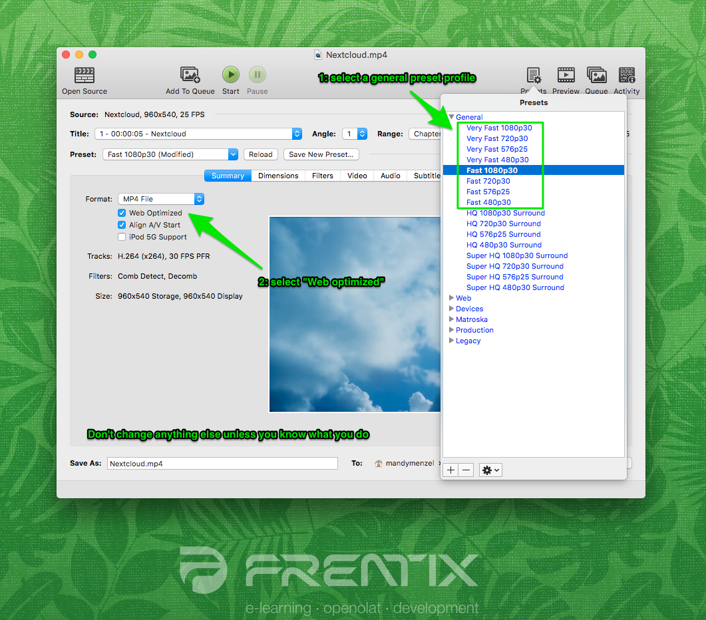
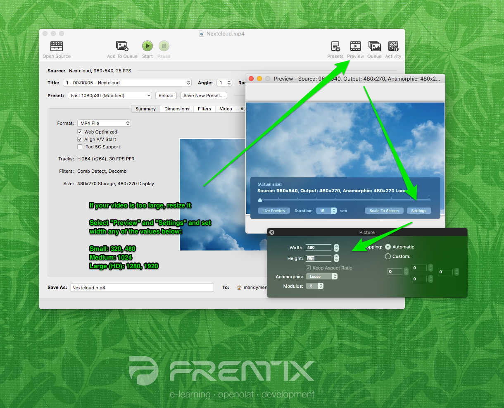

# Video hochladen

Das Thema Video ist aufgrund der vielen Formate, Codecs, Container und
Betriebssysteme / Browser sehr komplex.  

Empfohlenes Format

In der Praxis hat sich der **mp4** (oder MPEG-4) Container mit dem H.264
Video-Codec für Video und dem **mp3** Audio-Codec für Audio etabliert.
Aktuelle Versionen von Firefox, Chrome und Safari können solche Videos
abspielen.

Hinweis

Anamorphe Videos werden zurzeit nicht unterstützt. Bitte berücksichtigen Sie
dies bei der Video-Produktion.

### Hier noch ein paar technische Hinweise:

Soll ein Video in OpenOlat hochgeladen werden, sollte neben dem Format des
Weiteren noch die Dateigrösse (wegen Netzwerkverkehr vor allem beim Download)
beachtet werden, da der durch Video generierte Netzwerkverkehr sehr hoch ist.
Ein Anwendungsbeispiel finden Sie hier.

Videos werden in sogenannten **Containern** als Datei mit einer **Datei-
Endung** gespeichert. Der Container enthält eine oder mehrere **Video** \- und
**Tonspuren** , die mit jeweils einem **Codec** codiert sind. Ein Codec ist im
Wesentlichen ein Kompressionsalgorithmus und eine Beschreibung wie die Daten
abgelegt sind.  
Leider werden manche Datei-Endungen auch für Container- und auch
Codierungsnamen verwendet. Deshalb ist bei einer Video-Bezeichnung nie ganz
klar, ob es sich um die Codierung, die Datei-Endung oder den Container
handelt.  

### Dateigrösse

Die Dateigrösse eines Videos ist von vielen Parametern abhängig.

##### Auflösung  

 Anzahl Pixel in der x und der y...

Anzahl Pixel in der x und der y Achse. Bekannte Auflösungen wären z.B.
480x320, 800x600, 1024x567, 1280x720, 1920x1080. Ab einer Auflösung von
1280x720 spricht man von HD-Auflösung.  
He höher die Auflösung, desto mehr Speicher wird benötigt.

##### Bildfrequenz (frames per second)

 Ab ca. 16 Bildern pro Sekunde werden...

Ab ca. 16 Bildern pro Sekunde werden Bilder als Film wahrgenommen. Dies
variiert jedoch stark je nach der Intensität der Bewegung. Im Kino werden
traditionell 24 Bilder pro Sekunde Verwendet. Das Europäische PAL
Fernsehformat verwendet 25 Bilder pro Sekunde, das Amerikanische NTSC 30
Bilder pro Sekunde.

Die Framerate kann variabel oder konstant festgelegt werden. Z.B. bei einem
Film der aus PowerPoint Folien besteht kann es sein, dass ein einzelnes Frame
mehrere Sekunden lang ohne Veränderung gültig ist. In einem solchen Fall ist
eine variable Framerate zu empfehlen.

Je mehr Bilder pro Sekunde gezeigt werden, desto mehr Speicher wird benötigt.

##### Interlacing

 Mit einem Trick kann die Bildfrequenz verdoppelt...

Mit einem Trick kann die Bildfrequenz verdoppelt werden ohne mehr
Speicherplatz zu benötigen. Dabei wird alternierend nur jede zweite Zeile des
Bildes übertragen und auf dem Bildschirm ersetzt. Dies führt zu einem leicht
weniger scharfen Bild, da die Zeilen in den Bildern jedes zweite Mal nicht
ganz zueinander passen. Durch die Bewegung im Film ist das aber in den meisten
Fällen vernachlässigbar.

Verwendet man Interlacing bei gleichbleibender Framerate, so wird weniger
Speicher benötigt.

#####  Codec

 Der Codec ist ein Kompressionsalgorithmus...

Der Codec ist ein Kompressionsalgorithmus um die Videodaten möglichst klein
abzuspeichern. In der Regel ist diese Kompression verlustbehaftet, ansonsten
würden die Datenmengen viel zu gross sein. Codecs haben eine Vielzahl von
Optimierungsparametern. Je nach Einstellungen dauert der Kompressionsschritt
länger oder weniger lang. Es sind Optimierungen hinsichtlich
Darstellungsqualität, Dateigrösse und Kompressionsdauer möglich.

Je stärker komprimiert, desto weniger Speicher wird benötigt.

Verschiedene Geräte / Browser haben verschiedene Bildschirmauflösungen und
unterstützen unterschiedliche Codecs. Mit einem **Transcoding** werden von
einer ursprünglich möglichst hochwertigen Video- oder Audiodatei mit Hilfe
einer speziellen Software Kopien angefertigt, die mit verschiedenen
Auflösungen, Bitraten und Codecs komprimiert wurden.

Transkodierung ist das Umwandeln einer Audio- oder Video-Datei in ein anderes
Audioformat oder Videoformat.

 Folgende Versionen eines Films sind abhängig von der Nutzung sinnvoll:

  * mp4 / h264 hoch auflösend mit hoher Bitrate für Desktop 
  * mp4 / h264 mittel auflösend mit mittlerer Bitrate für Tablet oder Desktop mit schlechter Internetanbindung 
  * mp4 / h264 klein auflösend mit tiefer Bitrate für mobile Geräte 
  * WebM / VP9 mittel auflösend mit mittlerer Bitrate für Geräte welche mp4 / h264 nicht unterstützen
  * Ogg / Theora mittel auflösend mit mittlerer Bitrate für Geräte welche mp4 / h264 nicht unterstützen  

WebM und Ogg sind heute nicht mehr unbedingt notwendig da Google weiterhin und
Firefox neu ebenfalls mp4 unterstützen. WebM ist ein von Google und Ogg ein
von Firefox propagierter Container.

Für die Anwendung innerhalb von OpenOlat wählen Sie am besten eine kleine bis
mittlere Auflösung mit tiefer bis mittlere Bitrate.

##### Bitrate (kbps)

 Die Bitrate definiert wieviele....

Die Bitrate definiert wie viele Datenbits pro Sekunde Videomaterial anfallen.
Die Bitrate kann konstant definiert oder variabel sein. Im Variablen Fall wird
eine Höchstlimite definiert. Die Bitrate definiert direkt wie gross ein Film
ist und beeinflusst die Qualität des Bildes erheblich. Um dieselbe
Bildqualität zu erhalten bei grösserer Auflösung muss die Bitrate um denselben
Faktor erhöht werden.

Je grösser die Bitrate bei einer bestimmten Auflösung, desto besser die
Qualität des Filmes, aber umso mehr Speicher wird für den Film benötigt.

  

 _Weitere Aspekte wie Farbraum oder Anamorphic beeinflussen ebenfalls die
Grösse des Filmes._

  

In der folgenden Tabelle ist die durchschnittliche Bitrate und die allgemein
zu erwartenden Bitraten für andere Auflösungen mit üblichen Settings zu sehen.
Die Bitraten ändern sich je nach Art des Filmes, Auflösung, Codec und
Kompression stark. Dies sind lediglich Richtgrössen, und wurden berechnet für
MP4-Dateien mit dem H.264 Codec.

Bitrate /  Auflösung

|

320x240

| 480x270| 1024x576| 1280x720| 1920x1080  
---|---|---|---|---|---  
kbps| 400| 700| 1'500| 2'500| 4'000  
mbps| 0.4| 0.7| 1.5| 2.5| 4  
MB/S| 0.1| 0.1| 0.2| 0.3| 0.5  
MB/Min| 3| 5.3| 11.3| 18.8| 30  
  
Ein durchschnittlicher 10 Minuten dauernder Film in einer 480x270 Auflösung
braucht also ca. 53 MB Speicherplatz. Derselbe Film in einer 720p HD-Auflösung
braucht ca. 180 MB.

  

 **Anwendungsbeispiel: Netzwerkverkehr**

Wenn 50 Personen diesen 10 Minuten dauernde Film schauen führt dies zu einem
_Netzwerkverkehr_ _von 2.7 GB bei einer 480x270 Auflösung_. Wird der Film in
720p HD-Auflösung geschaut führt dies zu 9 GB Netzwerkverkehr.

Schauen die 50 Lernenden den Film gleichzeitig, so muss das _Netzwerk 35 Mb/s
(4.4 MB/s) an Daten übertragen können._ Wird der Film in 720p HD-Auflösung
geschaut führt dies zu einer Netzwerkbelastung von rund 125 Mb/s (15.6 MB/s).

Bei 100 gleichzeitigen Zugriffen verdoppeln sich die Zahlen entsprechend.

Als Vergleich: mit einem üblichen 802.11n Wireless Access-Point können real
ca. 40-50 Mb/s übertragen werden. Mit spezieller Hardware ist ein Durchsatz
bis 100 Mb/s realistisch, allerdings müssen das auch die Endgeräte
unterstützen. 50 Lernende die in einem Zimmer ein Lehrvideo anschauen kann
netzwerktechnisch also bereits kritisch sein.

#### HandBrake Einstellungen  

Wenn Sie Videos für OpenOlat selbst erstellen bzw. bereitstellen, können Sie
diese mit einer speziellen Transcoding-Software in das richtige Format bzw.
die benötigte Auflösung bringen. Wir empfehlen dazu
[HandBrake](https://handbrake.fr/), eine freie OpenSource Software. Mehr
Informationen zur Software finden Sie auf der Wikipedia-Seite
[HandBrake,](https://de.wikipedia.org/wiki/HandBrake) sowie der
Produktwebseite <https://handbrake.fr/>.
<https://en.wikipedia.org/wiki/HandBrake>

1. Öffnen Sie HandBrake, und wählen Sie die zu konvertierende Datei aus. Ausgangsformate sind z.B. M4V- oder MOV-Dateien. 

2\. Selektieren Sie unter "Presets" ein Profil (Empfehlung: "Very Fast" oder
"Fast") und aktivieren sie "Web optimized".

  

Am besten lassen Sie alle übrigen Einstellungen wie voreingestellt.  

3\. Über "Preview" und "Settings" stellen Sie die gewünschte Ausgabegrösse /
Auflösung ein.

  

  * Klein: 320 und 480
  * Mittel: 1024
  * Gross (HD): 1280 und 1920

