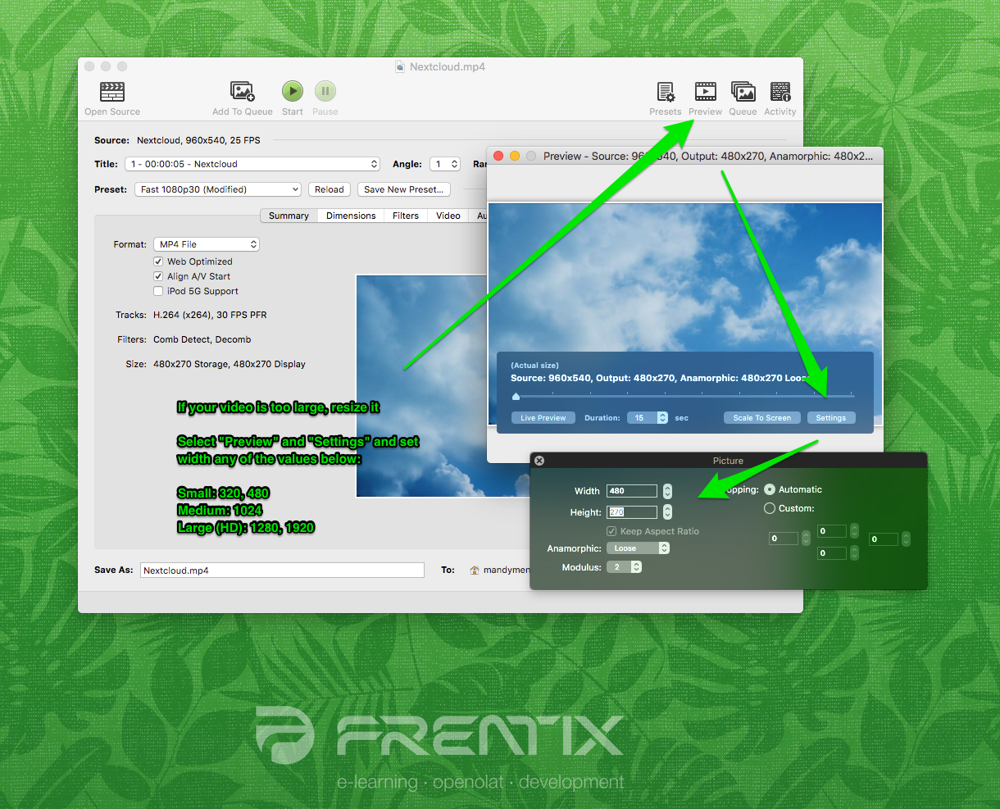

# Video Upload

The topic of video is very complex due to the many formats, codecs, containers
and operating systems / browsers.

Recommended format

In practice, the mp4 (or MPEG-4) container with the H.264 video codec for
video and the mp3 audio codec for audio has become established. Current
versions of Firefox, Chrome and Safari can play such videos.

Note

Anamorphic videos are currently not supported. Please take this into account
during video production.

### Here are a few more technical notes:

If a video is to be uploaded to OpenOlat, it is crucial to not only consider
video format, but also file size (due to network traffic upon download), as
network traffic generated by videos is generally quite high. A calculation
example can be found here.

Videos are stored in so-called **containers** as a file with a **file
extension**. The container contains one or more **video** and **audio tracks**
, each encoded with a **codec**. A codec is essentially a compression
algorithm and a description of how the data is stored.  
Unfortunately, some file extensions are also used for container names and also
encoding names. Therefore, when you look at a video name, it's never quite
clear whether it's the encoding, the file extension, or the container.

### File size

The file size of a video depends on a number of parameters.  

##### Resolution  

 Number of pixels on the x and y...

Number of pixels on the x and y axis. Common resolutions are e.g. 480x320,
800x600, 1024x567, 1280x720, 1920x1080. Starting with the resolution of
1280x720, these are considered HD resolutions.  
The higher the resolution, the more memory is required.  

##### Frame rate (frames per second)

 A frame rate of more than 16 pictures per...

A frame rate of more than 16 pictures per second is perceived as a movie,
depending greatly though on the intensity of movement. Cinema movies
traditionally use a 24 frames per second. The european PAL television format
uses 25 frames per second, while the american NTSC uses 30 frames per second.  

The framerate can be set either as variable or constant. For a movie made from
powerpoint slides for example, it is advisable to use a variable framerate, as
some frames may be visible for several seconds without any changes to it.  

The more frames (images) per second, the more memory needed.  

##### Interlacing

 Video frequency can be doubled with...

Video frequency can be doubled with a simple trick without doubling the memory
requirements. Only every second line of the image is alternately transferred
and replaced on the screen.

This results in a slightly less sharp image because the lines in the images do
not match every other frame. Due to movement in the movie this is negligible
in most cases though.

If used at a constant frame rate, Interlacing reduces the amount of memory
required.  

#####  Codec

 A codec is a compression algorithm...

A codec is a compression algorithm used to compress video data to the least
possible size. As a rule, this compression is lossy, otherwise the amount of
data would be much too large. Codecs contain a variety of optimization
parameters. Depending on the settings, the duration of the compression varies.
Improvements with regard to image quality, file size and compression time can
be made.

The more compressed, the less memory is required.

Various devices / browsers have different screen resolutions and support
different codecs. A **transcoding** uses special software to produce copies of
a high-quality video or audio source. These copies will be compressed with
different resolutions, bit rates and codecs.

Transcoding is the conversion of an audio or video file to a different audio
format or video format.

 The following versions of a video are sensible, depending on intended
utilisation:

  * mp4 / h264 high resolution and high bitrate: Desktop application   

  * mp4 / h264 medium resolution and medium bitrate: tablet or desktop with poor internet connection   

  * mp4 / h264 small resolution and low bitrate for mobile devices   

  * WebM / VP9 medium resolution and medium bitrate for devices not supporting mp4 / h264  

  * Ogg / Theora medium resolution and medium bitrate for devices not supporting mp4 / h264  

WebM and Ogg are no longer absolutely necessary as Google continues to support
mp4 and Firefox now does too. WebM is a container used by Google, and Ogg a
container used by Firefox.  

For using videos within OpenOlat, it would be best to choose a small to medium
resolution with a low to medium bitrate  

##### Bitrate (kbps)

 The bitrate defines the amount of...

The bitrate defines the amount of bits created per second of video material.
Bitrate can be set either as constant or variable. A maximum will be defined
in the case of a variable bitrate. The bitrate defines the file size of a
movie and affects picture quality significantly. In order to maintain a
consistent picture quality with an increased resolution, the bitrate needs to
be increased at the same rate.  

The higher the bitrate at a specific resolution, the better the movie quality,
but the file size of the movie increases accordingly.  

  

_Aspects such as colour space or anamorphic also affect the file size of a
movie.  
_

  

The following table shows the average bitrate as well as expected bitrates for
other resolutions with conventional settings. Bitrates vary heavily depending
on the type of video, resolution, codec and compression. These are merely
benchmarks, and were calculated based on a MP4 file encoded with H.264.  

Bitrate /  Resolution

|

320x240

| 480x270| 1024x576| 1280x720| 1920x1080  
---|---|---|---|---|---  
kbps| 400| 700| 1'500| 2'500| 4'000  
mbps| 0.4| 0.7| 1.5| 2.5| 4  
MB/S| 0.1| 0.1| 0.2| 0.3| 0.5  
MB/Min| 3| 5.3| 11.3| 18.8| 30  
  
A movie with an average duration of 10 minutes and a 480x270 resolution
therefore approximately requires about 53 MB memory. The same movie with a
resolution of 720p HD though requires about 180 MB.  

#####  

**Calculation example: Network traffic**

If 50 users watch this 10 minute movie, this will create _network traffic of
2.7 GB with a_ _480x270_ _resolution_. If the movie is watched with a 720p HD
resolution, expect 9 GB network traffic.

If those 50 users watch the movie at the same time, the network needs to be
able to handle a _bitrate_ _of_   _35 Mb/s (4.4 MB/s)_. If the movie is
watched simultaneously with the 720p HD resolution, expect a network load of
about 125 Mb/s (15.6 MB/s)  

100 concurrent views doubles the aforementioned numbers accordingly.  

For comparison: a common 802.11n wireless access point allows for an effective
transfer of about 40-50Mb/s. Special hardware makes a capacity of up to 100
Mb/s feasible, but user equipment also needs to be able to handle this kind of
output. 50 users watching an educational video in the same room can therefore
prove to be a problem for a network.

#### HandBrake Settings  

If you have to create or provide videos for OpenOlat yourself, a special
transcoding software can help you transform files into the correct file format
or the desired resolution. We recommend  [HandBrake](https://handbrake.fr/), a
free and open source software. More information on HandBrake can be found on
the wikipedia [HandBrake](https://en.wikipedia.org/wiki/HandBrake) page as
well as their commercial site <https://handbrake.fr/>.  

1\. Open HandBrake, and select the file to be converted. Starting formats are
e.g. M4V or MOV files.

2\. Under "Presets" select a general profile ("Very Fast" or "Fast" would be
recommended), and check the "Web optimized" checkbox.

It would be best to leave the preset parameters untouched.

3\. Select the desired size / resolution by opening the "Settings" under
"Preview".  

  

  * Small: 320 und 480
  * Medium: 1024
  * Large (HD): 1280 and 1920

