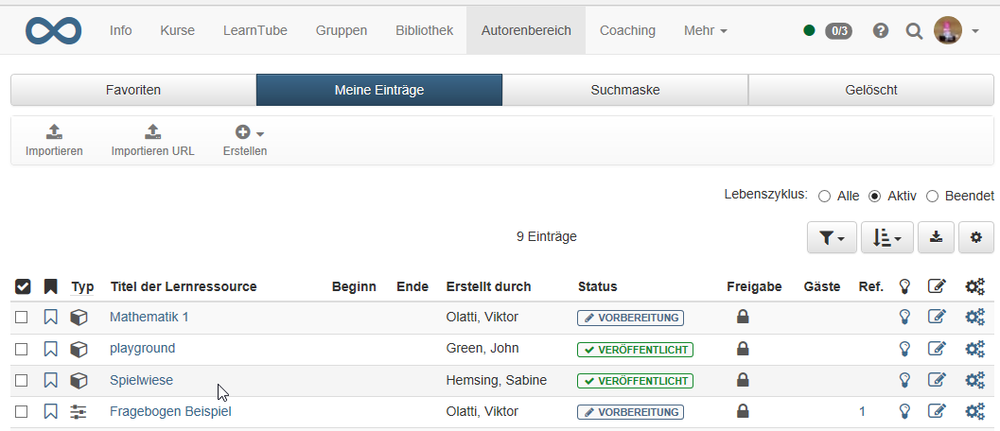
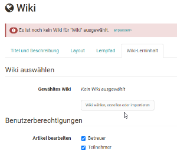
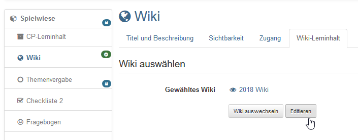
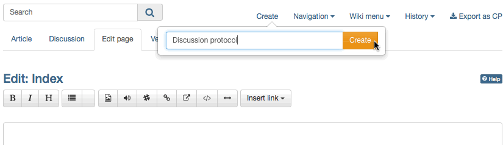
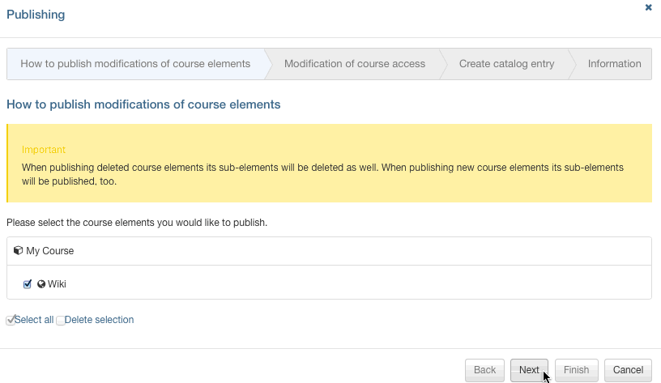

# Vier Schritte zu Ihrem Wiki

Mit dieser Anleitung haben Sie in kurzer Zeit in Ihrem Kurs ein Wiki erstellt
und es Ihren Wünschen entsprechend angepasst.

## Schritt 1: Kurseditor öffnen und Wiki-Kursbaustein einfügen  
---  
1. Im Autorenbereich unter „Meine Kurse“ Kurs suchen und den Kurseditor im
Menü "Administration" öffnen.

  
  
  
2. Kurselement, unter dem der Wiki-Kursbaustein eingefügt werden soll, durch
Klicken auswählen.  
3. Oben im Pop-Up „Kursbausteine einfügen“ „Wiki“ wählen.  
4. Im Tab „Titel und Beschreibung“ kurzen Titel des Kursbausteins eingeben und
speichern.  
  
## Schritt 2: Wiki erstellen  
---  
1. Im Tab „Wiki-Lerninhalt“ auf „Wiki wählen, erstellen oder importieren“
klicken.|

  

  
  
  
2. „Erstellen“ klicken.  
3. Titel des Wikis eingeben und auf "Erstellen" klicken.  
  
## Schritt 3: Wiki konfigurieren  
---  
1. Auf „Editieren“ klicken.|

  
  
  
2. Startseite anpassen: Für die Startseite („Index“) einen Text verfassen und
speichern. Erklärung zur Wiki-Syntax finden Sie unter dem Fragezeichen-Icon.

  
  
3. Wiki-Seite erstellen: Auf "Erstellen“ klicken und in der Box den Titel für
die neue Wiki-Seite eingeben. Auf „Erstellen“ klicken. Auf den roten Link mit
dem Seitentitel klicken, um die Seite zu erstellen und zu editieren.|

  
  
4. Wiki-Menu anpassen: Im Dropdown-Menü „Wiki-Menu“ auf „Ändern“ klicken, um
das Wiki-Menu mit den Wiki-Seiten Ihrer Wünsche anzupassen oder mit externen
Links zu ergänzen. Speichern.

  
  
5. Wiki-Tab schliessen und auf Kurs-Tab klicken.  
  
## Schritt 4: Kurs publizieren und freischalten  
---  
1. Oben in der Toolbar „Publizieren“ wählen.|

  
  
2. Kursbaustein überprüfen und „Weiter“ klicken.  
3. Unter „Änderung des Kurszugriffs“ „veröffentlicht“ auswählen und bei Bedarf
noch den "Zugang für Teilnehmer der Organisation" einrichten.  
4. „Fertigstellen“ klicken.  
  
Das Wiki ist nun eingebunden und Kursteilnehmende können Wiki-Inhalte lesen,
bestehende Seiten bearbeiten und neue Seiten erstellen.

  

!!! info "Info"

    Alternativ kann ein Wiki so wie alle anderen Lernressourcen im Autorenbereich erstellt und anschließend in den gewünschten Kurs eingebunden werden. Dieses Vorgehen empfiehlt sich um zu verstehen, dass Lernressourcen kursübergreifende Tools sind und die Einbindung in dem gewählten Kurs nur _eine_ Möglichkeit darstellt. Dasselbe Wiki kann in mehreren OpenOlat-Kursen eingebunden und auch kursunabhängig verwendet werden.

