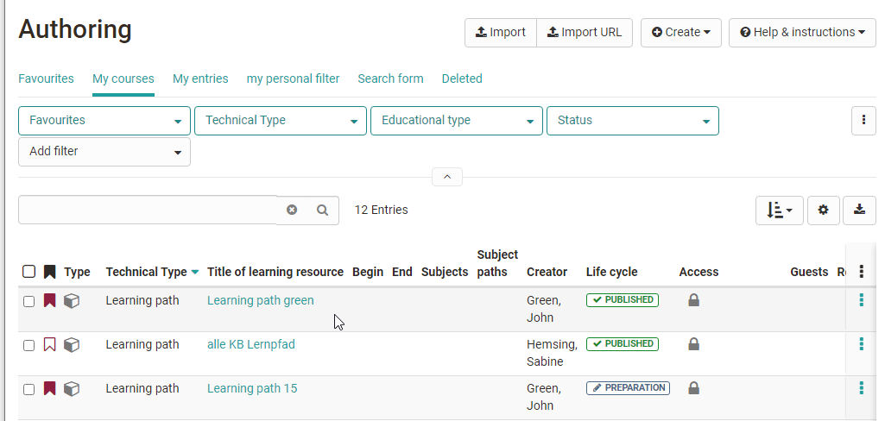
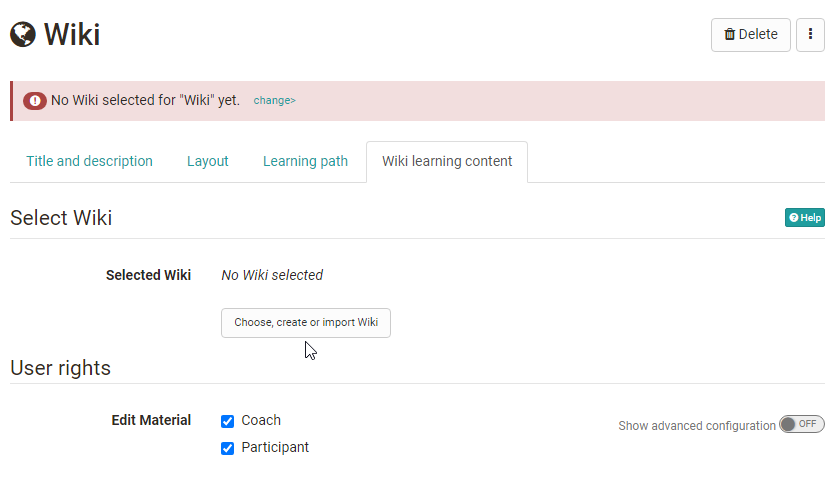
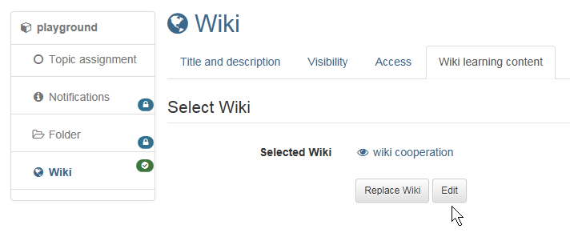
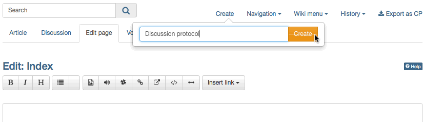
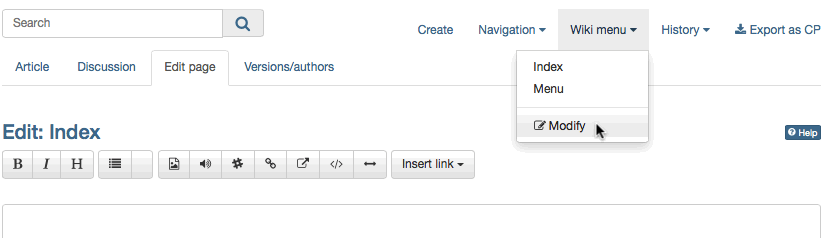
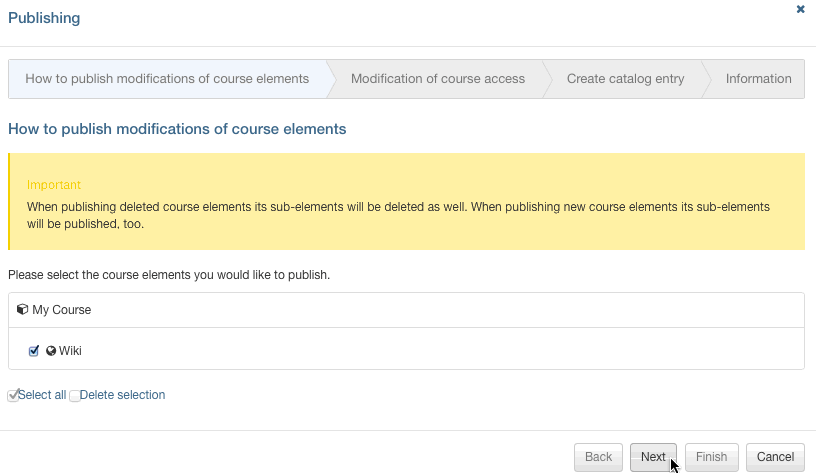

# Four Steps to Your Wiki

By means of this guide you will be able to create a Wiki for your course in no
time before adapting it according to your needs.

  

Step 1: Open course editor and insert Wiki course element  
---  
1| Search for your course in "Authoring", section "My courses," and open it.|

  
  
  
2|

Select position at which your Wiki course element should be inserted by
clicking on it.  
  
3|

Select "Wiki" in the pop-up "Insert course elements" in the toolbar.  
  
4| Indicate a short title for your course element in the tab "Title and
description" and save your settings.  
  
Step 2: Create Wiki  
---  
1| Click on "Choose, create or import Wiki" in the tab "Wiki learning
content."|

  
  
  
2| Click on "Create."  
3| Indicate the title of your Wiki and click on "Create".  
  
Step 3: Configure Wiki  
---  
1| Click on "Edit."|

  
  
  
2|

Adapt welcome page: Write a text ("Index") and save your settings.
Explanations regarding the Wiki syntax by clicking on the question-mark icon.
  
  
3|

Create Wiki page: Click on "Create" and enter the title for the new Wiki page
in the pop-up box. Click on "Create". Then click on the red link with the
page's title in order to generate and edit that page.

|

  
  
4| Adapt Wiki menu: Click on "Modify" in the drop-down menu "Wiki menu" in
order to adapt that menu according to your needs or add external links. Save
your settings.|

  
  
5| Close Wiki tab and click on course tab.  
  
Step 4: Publish and activate your course  
---  
1| Select "Publish" on your right in the toolbox "Editor tools."|

  
  
2| Check course element before clicking on "Next."  
3| In the pull-down menu select "All registered OpenOlat users" in the section
"Modify course access."  
4| Click on "Finish."  
  
Now your Wiki is embedded and course participants can read your Wiki contents,
edit pages already existing, and create new pages.

Alternatively, a Wiki can be created like all other learning resources in the
author area and then integrated into the desired course. This procedure is
recommended to understand that learning resources are cross-course tools and
that the integration into the selected course is only one possibility. The
same Wiki can be included in several OLAT courses and can also be used
independently of the course.

