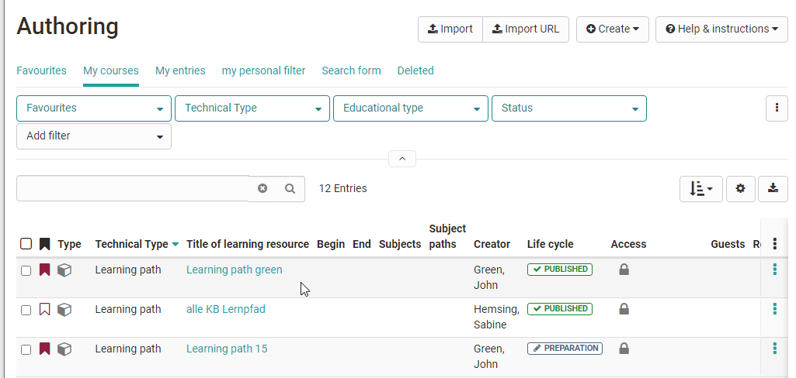
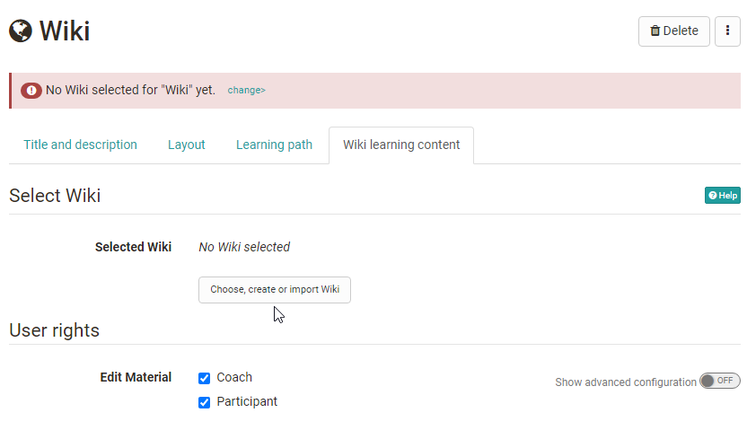
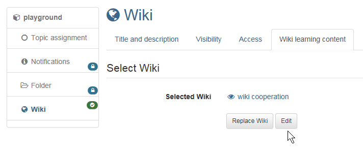
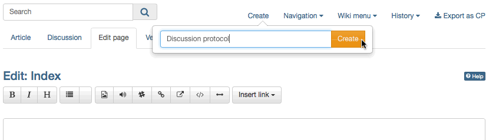
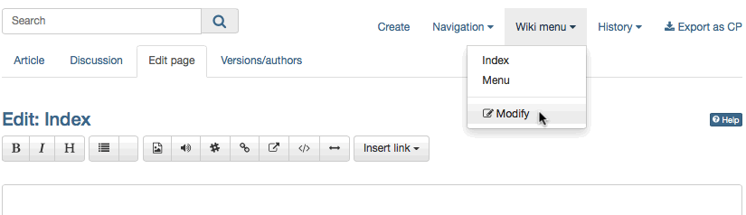
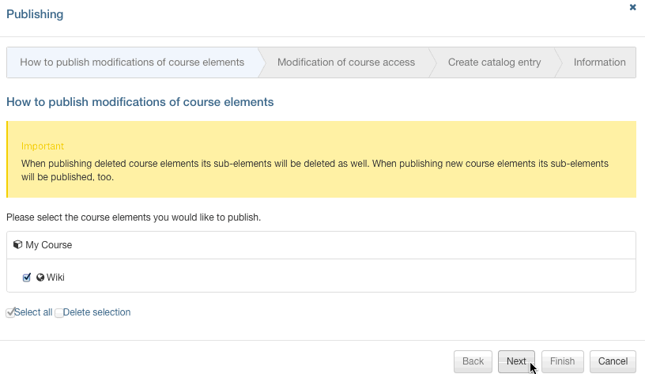

# Four Steps to Your Wiki

By means of this guide you will be able to create a Wiki for your course in no
time before adapting it according to your needs.

## Step 1: Open the course editor and insert the Wiki course element
---
1. In "Authoring", search for the course under "My courses" and open the
course editor in the "Administration" menu.

{ class="shadow lightbox" }

2. Select the course element under which the Wiki course element should be
inserted, by clicking on it.
3. In the pop-up "Insert course elements," select "Wiki" at the top.
4. In the tab "Title and description," enter a short title for the course
element and save.

## Step 2: Create Wiki
---
1. In the tab "Wiki learning content," click "Choose, create or import Wiki."

{ class="shadow lightbox" }

2. Click "Create."
3. Enter the title of the Wiki and click "Create."

## Step 3: Configure Wiki
---
1. Click "Edit."

{ class="shadow lightbox" }

2. Adapt the home page: write a text for the home page ("Index") and save.
You will find an explanation of the Wiki syntax under the question-mark icon.

3. Create a Wiki page: click "Create" and enter the title for the new Wiki
page in the box. Click "Create." Click the red link with the page title to
create and edit the page.

{ class="shadow lightbox" }

4. Adapt the Wiki menu: in the drop-down menu "Wiki menu," click "Modify" to
adapt the Wiki menu with the Wiki pages of your choice or add external links.
Save.

{ class="shadow lightbox" }

5. Close the Wiki tab and click the course tab.

## Step 4: Publish and activate the course
---
1. At the top of the toolbar, select "Publish."

{ class="shadow lightbox" }

2. Review the course element and click "Next."
3. Under "Modification of course access," select "Published" and, if
required, set up the "access for participants of the organisation."
4. Click "Finish."

Now the Wiki is embedded and participants can read the Wiki content, edit
existing pages and create new pages.

!!! tip "Tip"

    Alternatively, a Wiki can be created like any other learning resource in the author area and then integrated into the desired course. This approach helps you understand that learning resources are cross-course tools and that including the Wiki in the selected course is only _one_ option. The same Wiki can be included in several OpenOlat courses and can also be used independently of any course.
