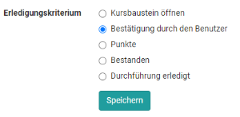
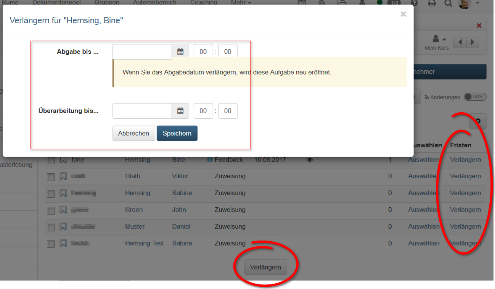

# Aufgabe - Weitere Konfigurationen

Gehen sie in Ihren Kurs, öffnen Sie den Kurseditor und fügen Sie einen
Kursbaustein Aufgabe hinzu oder gehen Sie zu einem bereits eingefügten
Aufgabenbaustein.

Die Tabs "Titel und Beschreibung" sowie "Layout" finden sich bei allen Kursbausteinen. Hier können Sie Informationen zum Baustein hinterlegen und die Darstellung konfigurieren. Im Folgenden werden die weiteren zentralen Tabs für den Kursbaustein Aufgabe erläutert.

## Tab "Lernpfad“

Hier definieren Sie ob die Bearbeitung der Aufgabe obligatorisch oder
freiwillig ist oder ob der Kursbaustein nicht angezeigt (Ausgenommen) werden soll. Obligatorische Aufgaben werden bei der Fortschrittsanzeige berücksichtigt, freiwillige nicht. 

Das Freigabedatum kann verwendet werden, wenn der Kursbaustein erst zu einem bestimmten Datum geöffnet und gestartet werden soll.

Die Zeitangabe unter "Zu bearbeiten bis" bezieht sich auf die Frist für das Abholen bzw. den Start des Kursbausteins Aufgabe, nicht auf den Abgabetermin für den Dateiupload (siehe Workflow).

Bei der Bearbeitungszeit kann die geschätzte Zeit, die ein User für die Bearbeitung des Kursbausteins benötigt, eingetragen werden. Ein Eintrag ist vor allem relevant, wenn sich der Fortschritt im Kurs auf die Bearbeitungszeit der Kursbausteine bezieht (siehe Administration -> [Einstellungen](../course_create/Course_Settings.de.md) -> Tab "Durchführung")

Im Tab "Lernpfad" wird auch definiert, welches Kriterium erfüllt sein muss,
damit die Aufgabe als "erledigt" gilt. Folgende Optionen stehen zur Wahl:

{ class="shadow" }

- **Kursbaustein öffnen**: User hat auf den Kursbaustein geklickt.
- **Bestätigung durch den Benutzer**: User hat auf die Lesebestätigung
geklickt
- **Punkte**: Der User hat bei der Bearbeitung der Aufgabe mindestens die
angegebene Punktzahl erreicht.
- **Bestanden**: Der User hat die im Tab "Bewertung" konfigurierten
Anforderungen an "Bestanden" erfüllt bzw. die Aufgabe wurde manuell vom
Betreuer auf bestanden gesetzt.
- **Durchführung erledigt**: Alle Schritte des Aufgabenflows wurden
durchlaufen.

!!! info "Herkömmliche Kurse"

    Herkömmliche Kurse verfügen nicht über den Tab "Lernpfad" und haben
    stattdessen die Tabs "Sichtbarkeit" und "Zugang", inklusive Expertenmodus.

## Tab "Workflow“

Der Tab Workflow ist der zentrale Tab zur Konfiguration des Kursbausteins Aufgabe. Hier
wird definiert welche einzelnen Elemente der Aufgabe überhaupt benötigt
werden. Soll eine konkrete Aufgabenstellung im Kursbaustein hinterlegt werden
oder findet der User die Aufgabe vielleicht woanders? Soll der User ein
Dokument abgeben? Soll es ein Feedback vom Lehrenden geben? Sollen die User,
wenn notwendig, die Möglichkeit zur Überarbeitung einer Einsendung erhalten
können? Soll eine Musterlösung bereitgestellt werden? Soll eine Bewertung mit
Punkten oder bestanden möglich sein?

Aktivieren Sie einfach, die Punkte, die Sie benötigen und konfigurieren Sie im
nächsten Schritt die dafür relevanten Tabs.

Die Abschnitte Aufgabenstellung, Abgabe und Musterlösung können mit einem
Datum versehen werden. Aufgabenstellung und Abgabe sind bis zum eingetragenen
Datum verfügbar. Eine Musterlösung kann für alle Teilnehmenden oder nur
diejenigen, die die Aufgabe bearbeitet haben, ab dem eingetragenen Datum
bereitgestellt werden.

{ class="shadow" }

Statt Kalenderdaten einzutragen können Sie auch mit relativen Daten arbeiten.
Dort legen Sie fest z.B. wie viele Tage nach dem ersten Kursbesuch die
Aufgabenstellung geöffnet bleibt. Alle eingestellten Zeitvorgaben können auch
individuell angepasst werden, z.B. wenn ein Lerner aufgrund bestimmter
Umstände eine Verlängerung benötigt. Dies gilt für alle Prozessschritte. Wenn
Sie das Abgabedatum verlängern, wird die Aufgabe neu eröffnet. Auch ein Datum für eine verspätete Abgabe ist möglich.

Sind Musterlösungen aktiviert, kann hier auch definiert werden, ob Betreuer
Dokumente hinzufügen und bearbeiten dürfen.

In der Gruppenaufgabe legen Sie zusätzlich im Abschnitt "Aufgabentyp" fest, für welche Gruppen oder Lernbereiche der Aufgabenbaustein zugänglich ist.

!!! warning "Achtung"

    Nachträgliche Änderungen am Workflow wirken sich auf alle Teilnehmenden bzw.
    Gruppen aus, auch wenn diese den Workflow bereits begonnen haben.

    Bei Änderungen am Workflow, z.B. dem Entfernen der Aufgabenstellung, wird bei allen Teilnehmenden bzw. Gruppen des Kurses dieser Bestandteil des Workflows entfernt. Die Information über bereits gewählte Aufgaben ist dann nicht mehr sichtbar. Wird der Bestandteil des Workflows wieder eingefügt, ist diese Information aber wieder zugänglich.

    Wird jedoch z.B. die Aufgabenstellung nachträglich hinzugefügt und ein
    Teilnehmer bzw. eine Gruppe ist in seinem persönlichen Workflow bereits weiter fortgeschritten, so muss er nachträglich keine Aufgabe mehr auswählen.  

## Tab "Aufgabenstellung“

Im Tab „Aufgabenstellung“ können Sie

a) außerhalb von OpenOlat erstellte Aufgaben als Datei hochladen (Aufgabe hinzufügen),

b) Dateien direkt in OpenOlat mit dem OpenOlat HTML-Editor oder eventuell weiteren zur Verfügung stehenden Editoren erstellen (Aufgabe erstellen) oder

c) direkt mit Ihrer Webcam Aufgabenstellungen als Video aufnehmen (Video-Aufgabe erstellen).

Sie können ihren Benutzern für eine Aufgabe auch mehrere Dateien zur Verfügung
stellen. Dafür müssen diese aber als ZIP-Paket hochgeladen werden. 

Wird eine Aufgabe direkt in OpenOlat mit dem internen Editor erstellt, können Sie
ebenfalls mehrere Dateien (z.B. Bilder oder PDFs) zur Verfügung stellen, in
dem Sie diese im HTML-Editor hochladen und dann in der HTML-Seite verlinken
bzw. direkt anzeigen. So erstellte Aufgaben werden von den Benutzern dann
ebenfalls im .zip Format heruntergeladen. Wird der HTML-Editor verwendet, wird
automatisch der hinterlegte Titel auch als Dateiname übernommen. Dies kann
aber jederzeit wieder geändert werden.

Im Feld „Art der Zuweisung“ bestimmen Sie, ob einem Kursteilnehmer alle zur
Verfügung stehenden Aufgaben zur Auswahl angeboten werden, oder ob ihm eine
Aufgabe automatisch per Zufallsauswahl zugewiesen wird.

!!! info "Mehrere Dateien"

    Bitte beachten: Werden mehrere Dateien im Tab Aufgabenstellung hinterlegt,
    werden diese als mehrere verschiedene Aufgabenstellungen betrachtet. Es
    handelt sich _nicht_ um eine Aufgabe mit mehreren ergänzenden Dateien.

Wählen Sie im Feld „Typ der Ziehung“, ob mehrere Kursteilnehmende die gleiche
Aufgabe lösen können, oder ob jeder Kursteilnehmer bzw. Kursteilnehmerin eine andere Aufgabe lösen soll. Wenn die Aufgabe manuell gewählt wird, können Sie im Feld „Vorschau“ weiter festlegen, ob die Kursteilnehmenden vor der Wahl einer Aufgabe diese einsehen dürfen. Wenn bei „Typ der Ziehung“ jeder Kursteilnehmer eine andere
Aufgabe lösen soll, müssen mindestens so viele Aufgaben hinterlegt werden, wie
es Kursteilnehmende gibt, die diese Aufgabe lösen sollen.

Im Feld „Mitteilung an Benutzer“ können Sie für alle Kursteilnehmenden
allgemeine Hinweise zur Bearbeitung der Aufgaben formulieren.

!!! info "Ergänzende Dokumenteneditoren"

    Sind in der Administration ergänzende Dokumenteneditoren aktiviert, können
    auch noch weitere Dateiformate erstellt werden. Beispielsweise können bei
    Verwendung von Only Office auch Word, Excel oder PowerPoint Dateien erstellt
    werden. Gleiches gilt für die Erstellung von sonstigen (Feedback-)Dateien.

Wählt ein Kursteilnehmer bei der manuellen Auswahl aus versehen die falsche
bzw. nicht gewollte Aufgabenstellung, kann die Wahl vom Kursbesitzer im
"Bewertungswerkzeug" zurückgesetzt werden.

{ class="shadow" }

Es folgt keine automatische Änderung. Der Teilnehmer erhält nun aber die
Möglichkeit seine bisherigen Schritte wieder rückgängig zu machen.
{ class="shadow" }

!!! warning "Gruppenaufgabe"

    Bei Gruppenaufgaben kann nur ein Thema pro Gruppe gewählt werden. Sobald ein Gruppenteilnehmer ein Thema gewählt hat, ist das Thema für die _gesamte Gruppe_ festgelegt.

## Tab "Abgabe“

Hier legen Sie fest wie und in welchem Umfang Kursteilnehmende Dokumente bzw. Bearbeitungen abgeben können.

Die "Abgabe mit OpenOlat Editor" gestattet die Erstellung von
Dokumenten direkt im Kursbaustein, die dann als HTML-Datei gespeichert werden.
Sind weitere Dokument Editoren in OpenOlat eingebunden, können auch weitere Formate erstellt werden. Ist nur "Dokumente hochladen" aktiviert, müssen Kursteilnehmende ihr Dokument bereits in einem gängigen Dateiformat vorliegen haben um dieses hochzuladen. Lassen Sie das Feld bei "Max. Anzahl von Dokumenten" frei, wenn Sie die Anzahl der Dokumente nicht einschränken
möchten.

Es ist nun auch möglich Videoaufnahmen per Webcam als Abgabe zuzulassen. Im Tab "Abgabe" können Sie die max. Länge der Aufzeichnung sowie die Videoqualitätsstufe bestimmen. Das ermöglicht es Lernenden statt eines schriftlichen Dokuments direkt ein Video-Statement einzureichen. 

Im Abschnitt "Abgabe Bestätigung" finden Sie den vorformulierten Text der
Kursteilnehmenden die Abgabe der eigenen Lösung bestätigt. Dieser Text kann bei Bedarf angepasst werden. Die Option „Text zusätzlich als E-Mail verschicken“ bewirkt, dass dieser Bestätigungstext dem jeweiligen OpenOlat-Benutzer auch als E-Mail zugestellt wird. 
Bei Gruppenaufgaben erhalten alle
Gruppenmitglieder eine E-Mail-Bestätigung.

## Tab "Rückgabe und Feedback"

Hier kann die minimale und maximale Anzahl von Rückgabedokumenten definiert
werden.

## Tab "Bewertung“

Hier definieren Sie wie die Lernenden bewertet werden sollen. 
Soll es Punkte geben? Soll es ein bestanden/nicht bestanden für den Kursbaustein geben? Soll die Punktebewertung mit einer Bewertungsskala verbunden werden? Sollen weitere individuelle Kommentare oder Dokumente bereitgestellt werden können? Entscheiden Sie jeweils was für Ihr Szenario passend ist. 

Standardmässig können Aufgaben von einem Betreuer mit bestanden/nicht
bestanden bewertet werden. Das Bestehen kann entweder manuell durch den Betreuer definiert werden oder, sofern auch Punkte für die Aufgabe vergeben werden, sich auf eine bestimmte Punktzahl beziehen. 

Wenn Punkte vergeben werden, müssen die minimale und die maximale Punktzahl angegeben werden. Zusätzlich können Sie dann auch die Option "Bewertung mit Einstufung/Noten" wählen. So können den jeweiligen Punkten bestimmte Beweruntsskalen wie Level, Noten, (Kompetenz-)Stufen oder Label zugeordnet werden. Die zur Verfügung stehenden Bewertungsskalen werden vom OpenOlat Administrator definiert und können über den Button "Bewertungsskala bearbeiten" ausgewählt sowie die Punkte im Detail angepasst werden. Ferner muss definiert werden ob die Zuordnung zur berechneten Einstufung manuell durch den Betreuer erfolgt oder automatisch bei Punktänderung angezeigt werden soll. 

Im Tab Bewertung kann auch definiert werden ob das Ergebnis des konkreten Aufgabenbausteins bei der Bewertung des gesamten Kurses inbegriffen ist oder ausgeschlossen werden soll. 

Optional können sie noch die Möglichkeit für individuelle Kommentare oder individuelle Bewertungsdokumente aktivieren, so dass Betreuer noch weitere flexible Rückmeldungsmöglichkeiten erhalten. 

Zudem können in den Feldern „Hinweis für alle Benutzer“ und „Hinweis für Betreuer“ weitere Informationen hinterlegt werden, z.B. ein allgemeiner Kommentar zum Vorgehen bei den Bewertungen für alle Betreuer.

## Tab "Musterlösung“

Um allen Kursteilnehmenden eine Musterlösung zu den gestellten Aufgaben
anzubieten, erstellen Sie entweder direkt die Musterlösung mit dem internen
Editor oder laden Dateien mit den Musterlösungen hoch. Die Musterlösung ist
erst sichtbar, wenn die vom Teilnehmer eingereichten Dokumente vom Betreuer
akzeptiert wurden.

!!! tip "Tipp"

    Sollen die Teilnehmenden vorab bereits Hilfestellungen zur Bearbeitung der Aufgabe erhalten,
    laden Sie diese zusammen mit der Aufgabenstellung als ZIP-Dokument hoch oder nutzen Sie die Kommentarfunktion (siehe Tab "Aufgabenstellung").

## Tab "HighScore"

Sofern für die Aufgabe auch die Vergabe von Punkten aktiviert wurde, kann auch
der Tab Highscore näher konfiguriert werden. So kann definiert werden welche Elemente angezeigt werde, ob die
Darstellung anonym sein soll und ab welchem Zeitpunkt die Highsore-Liste sichtbar sein soll. 

Weitere Informationen zu diesem Tab, der in mehreren Kursbausteinen zur Verfügung steht, finden Sie [hier](../course_elements/Assessment.de.md#highscore--highscore).

## Tab "Erinnerungen"
Erstellen Sie bei Bedarf Erinnerungen zur Bearbeitung des Kursbausteins für die Teilnehmenden. 

Weitere Informationen zu diesem Tab, der in mehreren Kursbausteinen zur Verfügung steht, finden Sie [hier](../course_operation/Course_Reminders.de.md).
