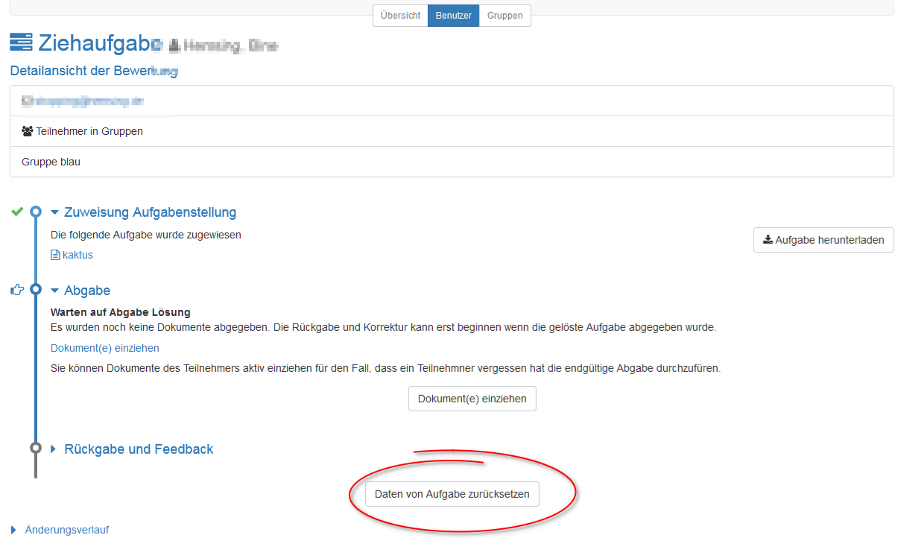
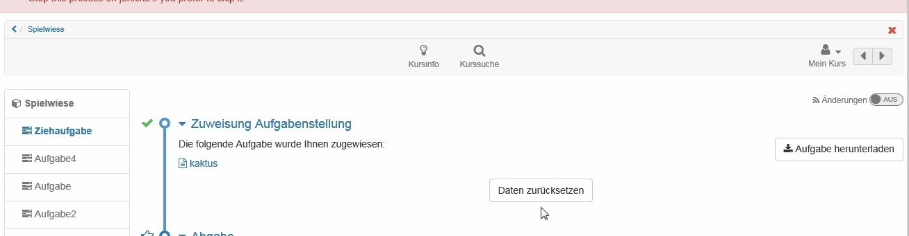

# Aufgabe - Weitere Konfigurationen

Gehen sie in Ihren Kurs, öffnen Sie den Kurseditor und fügen Sie einen
Kursbaustein Aufgabe hinzu oder gehen Sie zu einem bereits eingefügten
Aufgabenbaustein.

## Tab „Lernpfad“

Hier definieren Sie ob die Bearbeitung der Aufgabe obligatorisch oder
freiwillig ist. Obligatorische Aufgaben werden bei der Fortschrittsanzeige
berücksichtigt, freiwillige nicht. Ferner können Sie einen Zeitraum festlegen
in dem die Aufgabe bearbeitet werden kann. Außerhalb dieses Zeitraums wird die
Aufgabe zwar in der linken Navigation angezeigt, ist aber nicht zugänglich.

Im Tab "Lernpfad wird auch definiert, welches Kriterium erfüllt sein muss,
damit die Aufgabe als "erledigt" gilt. Folgende Optionen stehen zur Wahl:

Zu konfigurierende Tabs:

**Kursbaustein öffnen:** User hat auf den Kursbaustein geklickt.

 **Bestätigung durch den Benutzer:** User hat auf die "Lesebestätigung"
geklickt

 **Punkte** : Der User hat bei der Bearbeitung der Aufgabe mindestens die
angegebene Punktzahl erreicht.

 **Bestanden** : Der User hat die im Tab "Bewertung" konfigurierten
Anforderungen an "bestanden" erfüllt bzw. die Aufgabe wurde manuell vom
Betreuer auf bestanden gesetzt.

 **Durchführung erledigt** : Alle Schritte des Aufgabenflows wurden
durchlaufen.

Herkömmliche Kurse verfügen nicht über den Tab "Lernpfad" und haben
stattdessen die Tabs "Sichtbarkeit" und "Zugang", inklusive Expertenmodus.

## Tab „Workflow“

Das ist der zentrale Tab zur Konfiguration des Kursbausteins Aufgabe. Hier
wird definiert welche einzelnen Elemente der Aufgabe überhaupt benötigt
werden. Soll eine konkrete Aufgabenstellung im Kursbaustein hinterlegt werden
oder findet der User die Aufgabe vielleicht woanders? Soll der User ein
Dokument abgeben? Soll es ein Feedback vom Lehrenden geben? Sollen die User,
wenn notwendig, die Möglichkeit zur Überarbeitung einer Einsendung erhalten
können? Soll eine Musterlösung bereitgestellt werden? Soll eine Bewertung mit
Punkten oder bestanden möglich sein?

Aktivieren Sie einfach, die Punkte, die Sie benötigen und konfigurieren Sie im
nächsten Schritt die dafür relevanten Tabs.

Die Abschnitte Aufgabenstellung, Abgabe und Musterlösung können mit einem
Datum versehen werden. Aufgabenstellung und Abgabe sind bis zum eingetragenen
Datum verfügbar. Eine Musterlösung kann für alle Teilnehmenden oder nur
diejenigen, die die Aufgabe bearbeitet haben, ab dem eingetragenen Datum
bereitgestellt werden.

Statt Kalenderdaten einzutragen können Sie auch mit relativen Daten arbeiten.
Dort legen Sie fest z.B. wie viele Tage nach dem ersten Kursbesuch die
Aufgabenstellung geöffnet bleibt. Alle eingestellten Zeitvorgaben können auch
individuell angepasst werden, z.B. wenn ein Lerner aufgrund bestimmter
Umstände eine Verlängerung benötigt. Dies gilt für alle Prozessschritte. Wenn
Sie das Abgabedatum verlängern, wird die Aufgabe neu eröffnet.

Weitere relative Datenoptionen sind der Kursstart (nur verfügbar bei
konfigurierter [Durchführungsdauer](Kurseinstellungen.html#Kurseinstellungen-
detailansicht_einst_aendern)), Datum der Einschreibung bzw. der Buchung des
Kurses oder das Zuweisungsdatum der Aufgabe.

In der Gruppenaufgabe legen Sie zusätzlich im Abschnitt "Aufgabentyp" fest,
für welche Gruppen oder Lernbereiche der Aufgabenbaustein zugänglich ist.

Sind Musterlösungen aktiviert, kann hier auch definiert werden, ob Betreuer
Dokumente hinzufügen und bearbeiten dürfen.

Nachträgliche Änderungen am Workflow wirken sich auf alle Teilnehmer bzw.
Gruppen aus, auch wenn diese den Workflow bereits begonnen haben.

Bei Änderungen am Workflow, z.B. dem Entfernen der Aufgabenstellung, wird bei
allen Teilnehmenden bzw. Gruppen des Kurses dieser Bestandteil des Workflows
entfernt. Die Information über bereits gewählte Aufgaben ist dann nicht mehr
sichtbar. Wird der Bestandteil des Workflows wieder eingefügt, ist diese
Information aber wieder zugänglich.

Wird jedoch z.B. die Aufgabenstellung nachträglich hinzugefügt und ein
Teilnehmer bzw. eine Gruppe ist in seinem persönlichen Workflow bereits weiter
fortgeschritten, so muss er nachträglich keine Aufgabe mehr auswählen.  

  

## Tab „Aufgabenstellung“

Im Tab „Aufgabenstellung“ erstellen Sie entweder direkt Aufgaben mit dem
internen Editor oder laden Dateien mit den Aufgabenstellungen hoch.

Sie können ihren Benutzern für eine Aufgabe auch mehrere Dateien zur Verfügung
stellen. Dafür müssen diese aber als ZIP-Paket hochgeladen werden. Wird eine
Aufgabe direkt in OpenOlat mit dem internen Editor erstellt, können Sie
ebenfalls mehrere Dateien (z.B. Bilder oder PDFs) zur Verfügung stellen, in
dem Sie diese im HTML-Editor hochladen und dann in der HTML-Seite verlinken
bzw. direkt anzeigen. So erstellte Aufgaben werden von den Benutzern dann
ebenfalls im .zip Format heruntergeladen. Wird der HTML-Editor verwendet, wird
automatisch der hinterlegte Titel auch als Dateiname übernommen. Dies kann
aber jederzeit wieder geändert werden.

Im Feld „Art der Zuweisung“ bestimmen Sie, ob einem Kursteilnehmer alle zur
Verfügung stehenden Aufgaben zur Auswahl angeboten werden, oder ob ihm eine
Aufgabe automatisch per Zufallsauswahl zugewiesen wird.

Bitte beachten: Werden mehrere Dateien im Tab Aufgabenstellung hinterlegt,
werden diese als mehrere verschiedene Aufgabenstellungen betrachtet. Es
handelt sich _nicht_ um eine Aufgabe mit mehreren ergänzenden Dateien.

Wählen Sie im Feld „Typ der Ziehung“, ob mehrere Kursteilnehmer die gleiche
Aufgabe lösen können, oder ob jeder Kursteilnehmer eine andere Aufgabe lösen
soll. Wenn die Aufgabe manuell gewählt wird, können Sie im Feld „Vorschau“
weiter festlegen, ob die Kursteilnehmenden vor der Wahl einer Aufgabe diese
einsehen dürfen. Wenn bei „Typ der Ziehung“ jeder Kursteilnehmer eine andere
Aufgabe lösen muss, müssen mindestens so viele Aufgaben angeboten werden, wie
es Kursteilnehmer gibt, die diese lösen sollen.

Im Feld „Mitteilung an Benutzer“ können Sie für alle Kursteilnehmenden
allgemeine Hinweise zur Bearbeitung der Aufgaben formulieren.

Sind in der Administration ergänzende Dokumenteneditoren aktiviert, können
auch noch weitere Dateiformate erstellt werden. Beispielsweise können bei
Verwendung von Only Office auch Word, Excel oder PowerPoint Dateien erstellt
werden. Gleiches gilt für die Erstellung von sonstigen (Feedback-)Dateien.

  

Wählt ein Kursteilnehmer bei der manuellen Auswahl aus versehen die falsche
bzw. nicht gewollte Aufgabenstellung, kann die Wahl vom Kursbesitzer im
"Bewertungswerkzeug" zurückgesetzt werden.

Es folgt keine automatische Änderung. Der Teilnehmer erhält nun aber die
Möglichkeit seine bisherigen Schritte wieder rückgängig zu machen.

Bei Gruppenaufgaben kann nur ein Thema pro Gruppe gewählt werden. Sobald ein
Gruppenteilnehmer ein Thema gewählt hat, ist das Thema für die gesamte Gruppe
festgelegt.

  

## Tab „Abgabe“

Hier legen Sie fest wie Kursteilnehmende Dokumente abgeben können, und wie
viele. Die "Abgabe mit OpenOlat Editor" gestattet die Erstellung von
Dokumenten direkt im Kursbaustein, die dann als HTML-Datei gespeichert werden.
Sind weitere Dokument Editoren in OpenOlat eingebunden, können auch weitere
Formate erstellt werden. Ist nur "Dokumente hochladen" aktiviert, müssen
Kursteilnehmende ihr Dokument bereits in einem gängigen Dateiformat vorliegen
haben um dieses hochzuladen. Lassen Sie das Feld bei "Max. Anzahl von
Dokumenten" frei, wenn Sie die Anzahl der Dokumente nicht einschränken
möchten.

Im Abschnitt "Abgabe Bestätigung" finden Sie den vorformulierten Text der
einem Kursteilnehmer die Abgabe seiner Lösung bestätigt. Dieser Text kann bei
Bedarf angepasst werden. Die Option „Text zusätzlich als E-Mail verschicken“
bewirkt, dass dieser Bestätigungstext dem jeweiligen OpenOlat-Benutzer auch
als E-Mail zugestellt wird. Bei Gruppenaufgaben erhalten alle
Gruppenmitglieder eine E-Mail-Bestätigung.

## Tab "Rückgabe und Feedback"

Hier kann die minimale und maximale Anzahl von Rückgabedokumenten definiert
werden.

## Tab „Bewertung“

Hier geben Sie die Art der Bewertung für jeden Kursteilnehmer vor.
Standardmässig können Aufgaben von einem Betreuer mit „Bestanden/Nicht
bestanden“ bewertet werden. Wenn Sie stattdessen oder zusätzlich Punkte
vergeben möchten, ändern Sie die Konfiguration, geben Minimal- und
Maximalpunktzahl an und wählen, ob „Bestanden/Nicht bestanden“ automatisch
durch die Punkteschwelle ausgegeben werden soll. Optional können Sie Platz für
individuelle Kommentare an jeden Kursteilnehmer einrichten. Zudem können Sie
in den Feldern „Hinweis für alle Benutzer“ und „Hinweis für Betreuer“ weitere
Informationen hinzufügen, beispielsweise einen allgemeinen Kommentar zum
Bewertungsschema für alle Betreuer.

## Tab „Musterlösung“

Um allen Kursteilnehmern eine Musterlösung zu den gestellten Aufgaben
anzubieten, erstellen Sie entweder direkt die Musterlösung mit dem internen
Editor oder laden Dateien mit den Musterlösungen hoch. Die Musterlösung ist
erst sichtbar, wenn die vom Teilnehmer eingereichten Dokumente vom Betreuer
akzeptiert wurden.

Sollen Teilnehmer Hilfestellungen vorab zur Bearbeitung der Aufgabe erhalten,
laden Sie diese zusammen mit der Aufgabenstellung als ZIP-Dokument hoch.

## Tab HighScore

Sofern für die Aufgabe auch die Vergabe von Punkten aktiviert wurde, kann auch
der Tab Highscore näher konfiguriert werden. Es kann das Anfangsdatum
angegeben und definiert werden welche Elemente angezeigt werden und ob die
Darstellung anonym sein soll.

  

