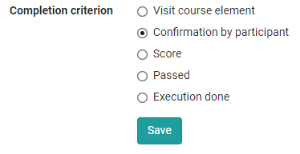
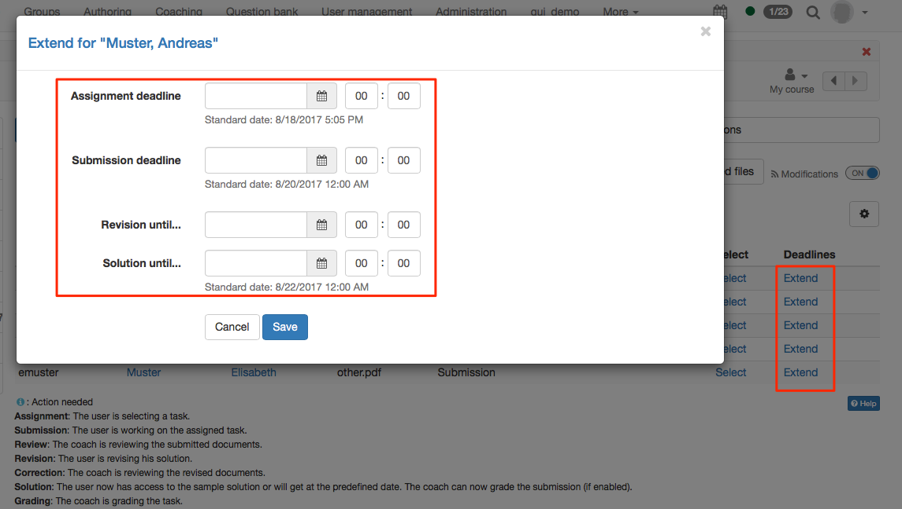
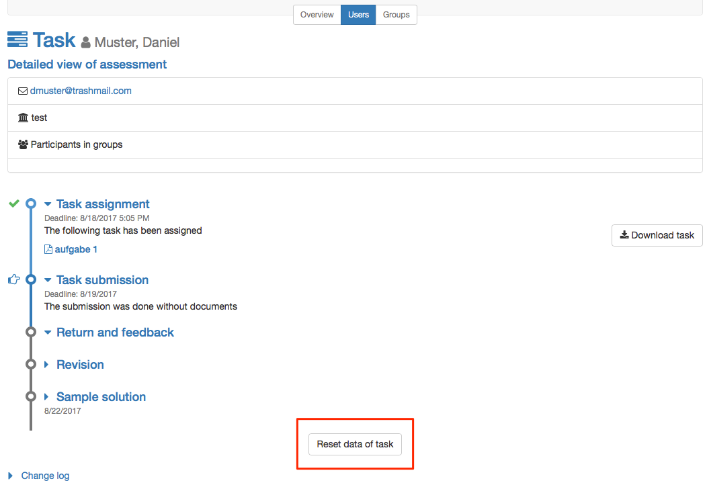

# Task - Further Configurations

Go to your course, open the course editor and add a course element Task or go
to an already inserted task element.

Die Tabs "Titel und Beschreibung" sowie "Layout" finden sich bei allen Kursbausteinen. Hier können Sie Informationen zum Baustein hinterlegen und die Darstellung konfigurieren. Im Folgenden werden die weiteren zentralen Tabs für den Kursbaustein Aufgabe erläutert.

##  Tab: "Learning path"

Here you define whether the execution of the task is obligatory or voluntary.
Obligatory tasks are taken into account in the progress display, voluntary
ones are not. 

Furthermore, you can define a time period in which the task can be processed. Outside this period, the task will be displayed in the left
navigation, but it will not be accessible.

Das Freigabedatum kann verwendet werden, wenn der Kursbaustein erst zu einem bestimmten Datum geöffnet und gestartet werden soll.

Die Zeitangabe unter "Zu bearbeiten bis" bezieht sich auf die Frist für das Abholen bzw. den Start des Kursbausteins Aufgabe, nicht auf den Abgabetermin für den Dateiupload (siehe Workflow).

Bei der Bearbeitungszeit kann die geschätzte Zeit, die ein User für die Bearbeitung des Kursbausteins benötigt, eingetragen werden. Ein Eintrag ist vor allem relevant, wenn sich der Fortschritt im Kurs auf die Bearbeitungszeit der Kursbausteine bezieht (siehe Administration -> [Einstellungen](../course_create/Course_Settings.md) -> Tab "Durchführung")

The Learning Path tab also defines which criterion must be met for the task to
be considered "completed". The following options are available:

{ class="shadow" }

- **Visit course element:**  User has clicked on the course element.
- **Confirmation by participant:** User hat auf die "Lesebestätigung" geklickt
- **Score**: The user has achieved at least the specified score while
completing the task.
- **Passed**: The user has fulfilled the "passed" requirements configured in
the " Grading" tab or the task has been manually set to passed by the coach.
- **Execution done**:  All steps of the task flow were run through.

!!! info "Traditional courses"
     Traditional courses do not have the "Learning Path" tab and instead have the
     "Visibility" and "Access" tabs, including expert mode.

## Tab: "Workflow"

This is the central tab for configuring the course element Task. Here you can
define which individual elements of the task are required in general. Should a
concrete task be stored in the course element or will the user find the task
somewhere else? Should the user hand in a document? Should there be feedback
from the teacher? Should the user be able to revise a submission if necessary?
Should a sample solution be provided? Should a score or passing be possible?

Simply activate the points you need and configure the relevant tabs in the
next step.

The assignment, submission and sample solution steps can be configured with a
deadline, with the assignment and submission open until that specific date,
whereas the sample solution won't be available before the respective date.
Starting from the date entered, the sample solution can be provided for all
participants or only those who have worked on the task.

{ class="shadow" }

Instead of using a fixed calendar date, relative dates are available too,
resulting in deadlines dependent on participant activities, such as a first
course launch. All defined dates can be adapted individually, e.g. if a
participant needs more time according to special circumstances. This is
possible for all workflow steps. If the submission deadline is extended, the
task will be opened again automatically.

Further relative date options are the course starting date (only available
with a configured [execution period](../course_create/Course_Settings.md#Execution), enrolment respectively booking date or the date of the task assignment.

If sample solutions are activated, you can also define here whether
supervisors are allowed to add and edit documents.

In the group task, you additionally define in the "Task type" section for
which groups or learning areas the task module is accessible.

Changing the workflow later will influence all individual participants and
groups even if they already have started the assignment.

!!! warning
 
    Changing the workflow, for example deleting the assignment step, will delete
    the corresponding elements from the workflow for all members or groups.
    Information about the chosen task will not be visible anymore. If you
    reactivate the element of the workflow the information will be accessable
    again.

    However, if you add the assignment step later and a member or group is already
    further into the task, then they don't have to choose an assignment anymore.

## Tab: "Assignment"

Im Tab „Aufgabenstellung“ können Sie

a) außerhalb von OpenOlat erstellte Aufgaben als Datei hochladen (Aufgabe hinzufügen),

b) Dateien direkt in OpenOlat mit dem OpenOlat HTML-Editor oder eventuell weiteren zur Verfügung stehenden Editoren erstellen (Aufgabe erstellen) oder

c) direkt mit Ihrer Webcam Aufgabenstellungen als Video aufnehmen (Video-Aufgabe erstellen).

Sie können ihren Benutzern für eine Aufgabe auch mehrere Dateien zur Verfügung
stellen. Dafür müssen diese aber als ZIP-Paket hochgeladen werden. 

If a task is created with the internal
OpenOlat editor, multiple files such as images or PDF files can be provided by
first uploading them in the WYSIWYG editor and then linking them in the
corresponding html page. Such a task will then be downloaded in .zip file
format as well. If the HTML editor is used, the stored title is automatically
used as the file name. However, this can be changed at any time.

In the section "Type of assignment" you determine whether a course participant
is offered all available tasks for selection or whether a task is
automatically assigned to him/her by random selection.

!!! info "Multiple files"
    If multiple files are stored in the Task tab, they will be
    considered as multiple different tasks. It is _not_ a task with several
    complementary files.

Wählen Sie im Feld „Typ der Ziehung“, ob mehrere Kursteilnehmende die gleiche
Aufgabe lösen können, oder ob jeder Kursteilnehmer bzw. Kursteilnehmerin eine andere Aufgabe lösen soll. Wenn die Aufgabe manuell gewählt wird, können Sie im Feld „Vorschau“ weiter festlegen, ob die Kursteilnehmenden vor der Wahl einer Aufgabe diese einsehen dürfen. 
In case course participants must all work on different tasks, you have to offer at least the same number of tasks as there are course participants.

In the field "Message for user" you can provide general information for all
course participants regarding your tasks.

!!! info "Additional document editors"
    If additional document editors are activated in the administration, additional
    file formats can also be created. For example, if Only Office is used, Word,
    Excel or PowerPoint files can also be created. The same applies to the
    creation of other (feedback) files.

In the setting manual choice, if a course participant choses by incident a
wrong or not-wanted assignment, it can be reset in the assessment tool by the
course owner.

{ class="shadow" }

The assignment is not reset automatically. The participant gets the
opportunity to undo all pervious steps.

{ class="shadow" }

!!! warning "group task"
    In group tasks only one task can be chosen by the group. As soon as one member
    picks a task, this choice counts for all group members.  

## Tab: "Submission"

Determine how participants are allowed to hand in documents and how many in
the segment "Submission configuration". Submitting with the embedded text
editor allows the creation of HTML documents directly in the course element.
If only the option "Submit files created with external editor" is enabled,
course participants will have to have their documents ready for upload in an
established file format. Enter a number in the field "Max. number of
documents" in order to restrict the number of documents uploaded.

Es ist nun auch möglich Videoaufnahmen per Webcam als Abgabe zuzulassen. Im Tab "Abgabe" können Sie die max. Länge der Aufzeichnung sowie die Videoqualitätsstufe bestimmen. Das ermöglicht es Lernenden statt eines schriftlichen Dokuments direkt ein Video-Statement einzureichen. 

In the "Submission confirmation" segment you will find the standard phrase to
confirm that course participants have submitted their solutions successfully.
This text can be adapted if necessary. The option "Send text additionally as
e-mail" means that your text will be sent by e-mail as well. In group tasks
all members get an e-mail confirmation.

## Tab: "Return and feedback"

Here you can define the minimum and maximum number of return documents.

## Tab: "Assessment"

Here you define how each course participant shall be assessed. 
Soll es Punkte geben? Soll es ein bestanden/nicht bestanden für den Kursbaustein geben? Soll die Punktebewertung mit einer Bewertungsskala verbunden werden? Sollen weitere individuelle Kommentare oder Dokumente bereitgestellt werden können? Entscheiden Sie jeweils was für Ihr Szenario passend ist. 

By default a tutor can assess tasks by means of "Passed/failed." Das Bestehen kann entweder manuell durch den Betreuer definiert werden oder, sofern auch Punkte für die Aufgabe vergeben werden, sich auf eine bestimmte Punktzahl beziehen. 

Wenn Punkte vergeben werden, müssen die minimale und die maximale Punktzahl angegeben werden. Zusätzlich können Sie dann auch die Option "Bewertung mit Einstufung/Noten" wählen. So können den jeweiligen Punkten bestimmte Beweruntsskalen wie Level, Noten, (Kompetenz-)Stufen oder Label zugeordnet werden. Die zur Verfügung stehenden Bewertungsskalen werden vom OpenOlat Administrator definiert und können über den Button "Bewertungsskala bearbeiten" ausgewählt sowie die Punkte im Detail angepasst werden. Ferner muss definiert werden ob die Zuordnung zur berechneten Einstufung manuell durch den Betreuer erfolgt oder automatisch bei Punktänderung angezeigt werden soll. 

Im Tab Bewertung kann auch definiert werden ob das Ergebnis des konkreten Aufgabenbausteins bei der Bewertung des gesamten Kurses inbegriffen ist oder ausgeschlossen werden soll. 

Optional können sie noch die Möglichkeit für individuelle Kommentare oder individuelle Bewertungsdokumente aktivieren, so dass Betreuer noch weitere flexible Rückmeldungsmöglichkeiten erhalten. 

In addition you can provide further
information in the fields "Notice for all users" and "Notice for tutors," e.g.
some general comment on how to assess course participants.

## Tab: "Sample Solution"

In order to provide all course participants with a sample solution regarding
your tasks just either upload appropriate documents or directly create them
via the embedded text editor. The sample solution is visible after the coach
accepted solution documents for submission.

!!! tip 
    If you wish to provide assistance in solving the task, you can add additional
    documents to the task by packing all documents and upload as .zip file in the
    assignment tab.

## Tab: "HighScore"

If the assignment of scores has also been activated for the task, the
Highscore tab can also be configured in more detail. You can specify the start
date and define which elements are displayed and whether the display should be
anonymous.

Weitere Informationen zu diesem Tab, der in mehreren Kursbausteinen zur Verfügung steht, finden Sie [hier](../course_elements/Assessment.de.md#highscore--highscore).

## Tab "Erinnerungen"
Erstellen Sie bei Bedarf Erinnerungen zur Bearbeitung des Kursbausteins für die Teilnehmenden. 

Weitere Informationen zu diesem Tab, der in mehreren Kursbausteinen zur Verfügung steht, finden Sie [hier](../course_operation/Course_Reminders.de.md).  

  

  

