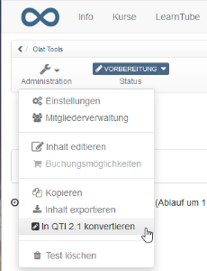
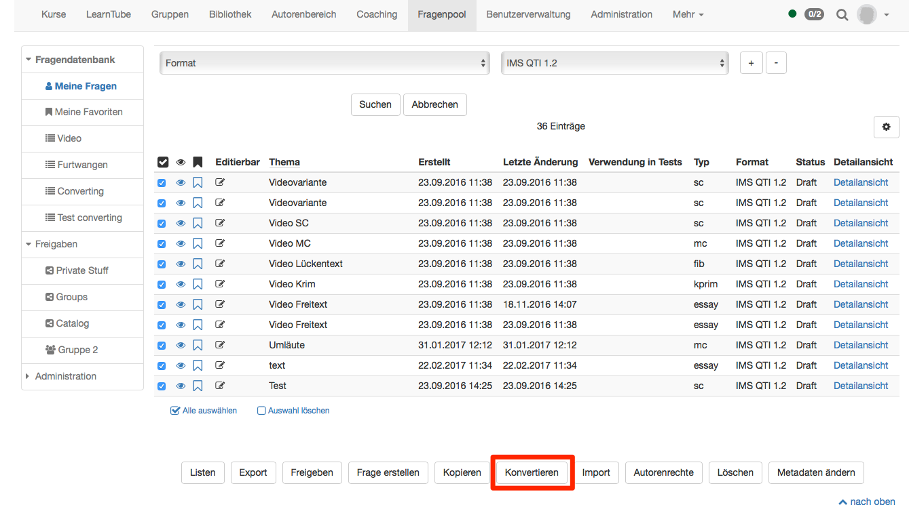

#  Von QTI 1.2 zu QTI 2.1

Seit der OpenOlat Version 15.0 wird das alte QTI 1.2 Format **nicht mehr
unterstützt**.

Ab OpenOlat 16.1 ist  **keine Konvertierung** von QTI 1.2 Tests mehr möglich!

## Konvertierung von QTI 1.2 Tests

Diese Schritte sind ab OpenOlat 16 nicht mehr möglich!

  * Exportieren Sie den QTI 1.2 Test von OpenOlat Version 16
  * Importieren Sie den exportierten QTI 1.2 Test in ein OpenOlat Version 15.x
  * Konvertieren Sie den Test wie folgt:

Um einen QTI 1.2 Test zu konvertieren, öffnen Sie die Lernressource Test im
Autorenbereich und wählen im Menü "Administration" →  "In QTI 2.1
konvertieren".

Hierbei wird eine Kopie des alten Tests im neuen Format gespeichert. Ihnen
liegen somit beide Test-Versionen vor unter "Meine Einträge" vor.

  * Exportieren Sie den neu erstellten QTI 2.1 Test von OpenOlat 15.x
  * Importieren Sie den QTI 2.1 Test wieder in OpenOlat 16

  

## Konvertieren von einzelnen Fragen

Neben Tests können auch einzelne Fragen konvertiert werden. Fragen werden im

sites/manual_user/docs/tests/Changing_from_QTI_1.2_to_QTI_2.1.de.md §Question_Bank.de.md§ 481
Fragenpool konvertiert. Öffnen Sie dazu den [Fragenpool](Fragenpool.html),
markieren Sie die Fragen, welche Sie konvertieren möchten (solche im Format
IMS QTI 1.2) und betätigen Sie die Schaltfläche Konvertieren.

Konvertierte Fragen werden unter Meine Fragen gespeichert.

Falls Sie Fragen zusätzlich in Listen oder Freigaben abgelegt haben, sind
diese dort immer noch im Format QTI 1.2 zu finden. Um auch dort die Frage mit
dem neuen Format QTI 2.1 zu haben, muss die Frage erneut manuell der Liste
oder der Freigabe hinzugefügt werden. Die alte Frage kann dann entfernt
werden, damit die Frage nicht doppelt erscheint.

## Weiteres

Folgende Punkte sind zu beachten, wenn Fragen oder Tests von QTI 1.2 zu QTI
2.1 konvertiert werden:

  * Wenn der Lösungshinweis eingetragen ist, wird er in QTI 2.1 angezeigt. Er kann nicht verborgen werden. (Anzeige als Kästchen, welches durch den Testteilnehmer geöffnet werden kann.)
  * Wenn Feedback ausgefüllt ist, wird es in QTI 2.1 angezeigt. Es kann nicht verborgen werden.
  * Die Beschreibung auf der Testebene wird nicht konvertiert. Im QTI 2.1 kann der Testebene keine Beschreibung mehr hinzugefügt werden.
  * Die Sektionsbeschreibung wird konvertiert. Sie wird im QTI 2.1 anschließend oberhalb jeder Frage angezeigt.
  * Die Fragebeschreibung wird nicht konvertiert. Beschreibungen einer Frage werden in QTI 2.1 Fragen nirgends angezeigt, da QTI 2.1 Frage keine Beschreibung besitzen.
  * Zeiteinschränkungen stehen im QTI 2.1 nur für den gesamten Test zur Verfügung. Zeitbeschränkungen auf Fragen- und Sektionsebene werden deshalb nicht konvertiert.
  * Bei Lückentext-Fragen können Alternativen hinzugefügt werden. Die Trennung dieser Alternativen ist im QTI 1.2 mit Semikolon und im QTI 2.1 mit Komma. Bei der Konvertierung wird das Trennzeichen geändert.

Tipp

Überprüfen Sie nach dem Konvertieren die Testkonfiguration, damit der Test
sicher so dargestellt wird, wie Sie sich das vorstellen.

