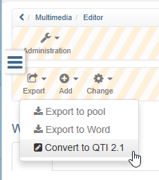
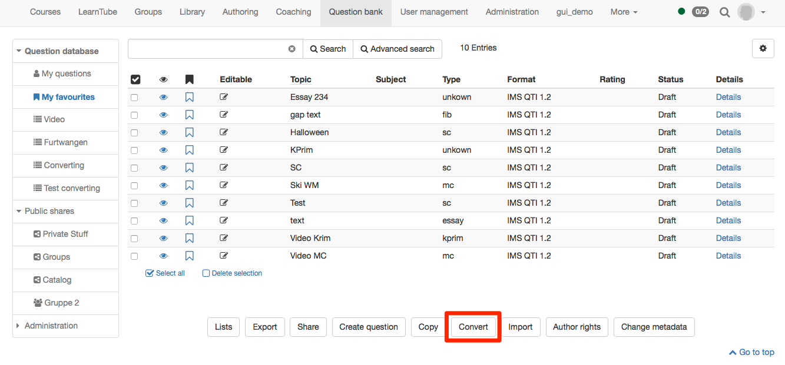

#  Changing from QTI 1.2 to QTI 2.1

Since OpenOlat version 15.0 the old QTI 1.2 format is no longer supported and
the old tests can no longer be used in this format.

As of OpenOlat 16.1, **conversion** of QTI 1.2 tests is **no longer
possible**!

## Convert whole tests

 **These steps are no longer possible after OpenOlat 16!**

To convert a QTI 1.2 test, open the learning resource test (not the course
element) and choose under Test → "Convert to QTI 2.1".

A copy of the old test is saved in the new format. Both test versions are
available under "My entries".

If the learning resource has been embedded in the course as test, it will not
be exchanged automatically.

If you want to run the test in the new format QTI 2.1 you can either create a
new course element test where you embed the briefly converted learning
resource or you exchange the learning resource in the existing test.

Hint

If you exchange the existing test all results will be lost. It is thus
recommended to create a new course element test and limit the
visibility/access to the old test.

## Convert single questions

Beside tests also single questions can be converted. Questions are converted
in the question bank. Therefore open the [question bank](Question+Bank.html),
mark the questions (in the format IMS QTI 1.2) you want to convert and confirm
with the button Convert.

Converted questions will be saved under My questions.

If you have put some questions to lists or shares as well, the will be found
there still in the format QTI 1.2 If you want to have the questions also there
in the new format QTI 2.1 you need to add the questions again to the list or
share manually. The old questions can be removed to avoid a doubled
appearance.

## Further

The following points need to be considered when converting questions or tests
from QTI 1.2 to QTI 2.1:

  * If a hint is added, it will be shown in QTI 2.1 anyway. It cannot be hidden. (Shown as button, which can be opened by test participants)
  * If a feedback is filled in, it will be shown in QTI 2.1 anyway. It cannot be hidden.
  * The description on test level will not be converted. In QTI 2.1 no description can be added to the test level.
  * The section description is converted. In QTI 2.1 it will be shown above each question.
  * The question description is not converted and will not be shown anywhere in the QTI 2.1 questions, as QTI 2.1 question items do not have a description. 
  * Time limits are available in QTI 2.1 only for the whole test. Time limit on the level of questions or sections are therefore not converted. 
  * For gap text questions alternatives can be added. The separation of these alternatives has been done by semicolon in QTI 1.2 and will be done be comma in QTI 2.1. During the conversion, the separation sign is changed.

Tip

After converting please check the test configuration to make sure, that the
test is shown as you desired.

