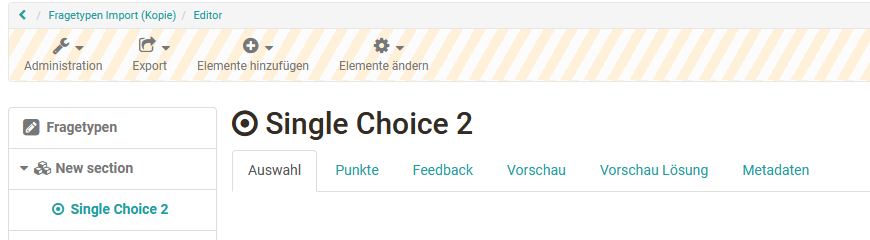
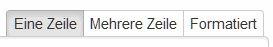
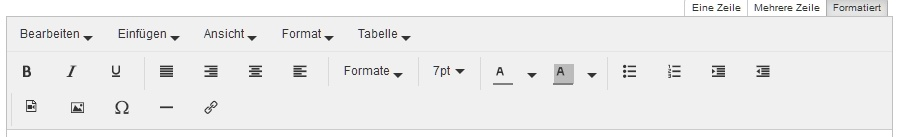
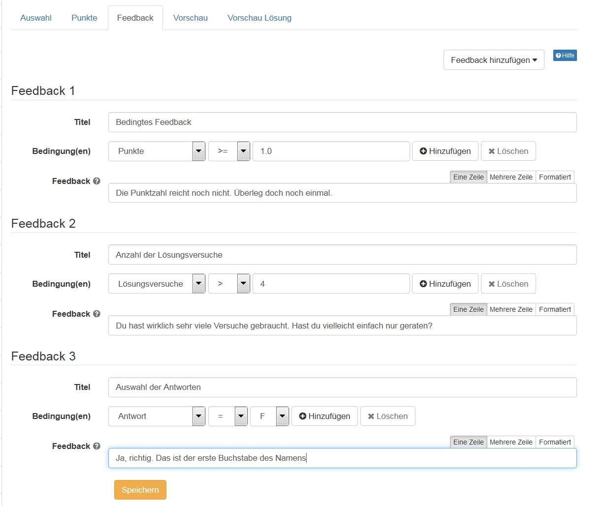

# Test Fragen konfigurieren

Zu jedem [Fragetyp](Test_question_types.de.md) können die Tabs Auswahl/[Name des Fragetyps], Punkte, Feedback, Vorschau, Vorschau Lösung und Metadaten bearbeitet werden. Im Folgenden werden die einzelnen Tabs für die Einrichtung einer Testfrage näher erläutert.

{ class="shadow" }

## Tab Auswahl

Im ersten Tab mit der Bezeichnung Auswahl bzw. dem jeweiligen Fragetypnamen werden die eigentliche Fragestellung sowie die Antwortalternativen eingegeben Ferner stehen je nach Fragetyp noch weitere Einstellungen zur Verfügung. So kann beispielsweise definiert werden ob die Antworten zufällig erscheinen sollen. Auch weitere Einstellungen zur Formatierung bzw. Ausrichtung können hier vorgenommen werden. Für die Antworten des Fragetyps Single- und Multiple-Choice sowie KPrim stehen in den Tabs Auswahl und Feedback drei Formatierungsvarianten zur Auswahl:

{ class="shadow" }

Verwenden Sie die Option "Eine Zeile" (Standardeinstellung), wenn die Antwort nur eine Zeile umfasst und keinerlei spezifische Formatierungen erforderlich sind. Verwenden Sie die Option "Mehrere Zeilen", wenn die Antwort aus zwei oder mehr Zeilen besteht und keine spezifischen Formatierungen erforderlich sind. Wählen Sie "Formatiert", wenn die Antwort Bilder, Audios, Videos, Links, mathematische Formel oder sonstige Formatierungen enthalten soll, die mit dem OpenOlat HTML Editor erstellt werden können.  

{ class="shadow lightbox" }

## Tab Punkte {: #score}

Im Tab „Punkte“ können die Anzahl der Lösungsversuche für die einzelne Frage eingeschränkt werden, die minimale und maximale Punktzahl definiert sowie die Art der Bewertung eingestellt und weiter definiert werden.

Folgende Konfigurationen stehen zur Verfügung:

* **Lösungsversuche einschränken:**

    * Ja: Geben sie hier an, wie häufig der User diese Frage bearbeiten und speichern darf. Die entsprechende maximale Anzahl wird dann auch während der Testbearbeitung angezeigt. Wird beispielsweise die Zahl 1 eingetragen, kann der User die Frage nur einmal bearbeiten und speichern. Änderungen sind dann nicht mehr möglich. Das ist besonders wichtig, wenn Sie mit antwortspezifischem Feedback arbeiten aber nicht möchten, dass der User während der Testbearbeitung seine Antwort basierend auf dieser Rückmeldung überarbeiten kann.
    * Nein: Die Lösungsversuche sind für die Frage sind unbeschränkt. In diesem Fall kann der User beliebig oft seine Antworten speichern und korrigieren. Unabhängig davon kann allerdings die Anzahl der Bearbeitungen einer Sektion bzw. des gesamten Tests durchaus eingeschränkt sein.
    * Vererbt: Die Anzahl Lösungsversuche wird von der oberen Ebene (Sektion) übernommen.

* **Minimal erreichbare Punktzahl:** Für Fragetypen bei denen die Werte ins Negative gehen können, also Hotspot, Single Choice, Multiple Choice, Drag and Drop, Matrix ist es möglich, die minimal erreichbaren Punktzahl selbst zu definieren. So kann auch bei einer negativen Gesamtpunktzahl das Ergebnis auf 0 gesetzt und ein negativer Wert vermieden werden. Bei anderen Fragetypen wird der Wert automatisch auf 0 gesetzt.

* **Maximal erreichbare Punktzahl:** Erreichbare Höchstpunktzahl

* **Bewertungsmethode:** Für die meisten Fragetypen kann auch die Art der Punktevergabe definiert werden.

    * Wenn Sie "Alle korrekten Antworten" wählen, werden nur Punkte verteilt, wenn alle Antworten richtig sind.
    * Wenn Sie "Punkte pro Antwort" wählen, können Sie in der Spalte _Punkte_ für jede Antwort die gewünschte Punktzahl vergeben. Auch negative Punkte sind hier möglich. Aber egal, was hier eingetragen wird, die maximal erreichbare Punktzahl kann beim Zusammenzählen nicht überschritten werden.
    * Für Lückentext-Fragen können zudem unterschiedliche "Punkte pro Antwort und Varianten" vergeben und somit z.B. auch Teilpunkte für "halb richtige" Antworten hinterlegt werden.
    * Die Bewertungsmethode steht bei KPrim, Datei hochladen, Zeichnen und Freitext nicht zur Verfügung.

## Tab Feedback {: #feedback}

Pro Frage können unterschiedliche Arten von Feedbacks hinzugefügt werden. Angefangen von Lösungshinweisen bis hinzu korrekten Lösungen unter bestimmten Bedingungen. Auf diesem Weg ist eine differenzierte Lernunterstützung sehr gut möglich besonders wenn ein Test als formatives Assessment oder Selbsttest eingesetzt wird. Meistens werden Feedback und Lösungshinweise/korrekte Lösung beim Selbsttest verwendet, um Testpersonen bei falschen Antworten Tipps zu geben, wie sie auf die richtige Antwort kommen. Auch bei Selbstlerntutorials sind derartige Feedbacks hilfreich.

Es können folgende Varianten von Feedbacks hinzugefügt und auch verschiedene Varianten miteinander kombiniert werden:

* **Lösungshinweis:** Der Lösungshinweis erscheint in Form eines Fragezeichens unter der Fragestellung. Der User kann das Fragezeichen anklicken und erhält dann den hinterlegten Lösungshinweis. Diese Variante eignet sich z.B. um weitere Hinweislinks oder Texte bereitzustellen aber nicht unbedingt um die richtige Lösung vorzugeben.
* **Korrekte Lösung:** Diese Lösung wird automatisch dann angezeigt, wenn der User eine falsche Antwort abgegeben hat. _Spezialfall Fragetypen Freitext, Datei-Upload und Zeichnen: Bei diesen Fragetypen erfolgt keine Anzeige des Feedbacks während des Tests! Hier kann das Feld genutzt werden, um die Musterlösung zu hinterlegen, welche anschliessend im Korrekturworkflow (Bewertungswerkzeug) und im Ergebnis-Report angezeigt wird._
* **Feedback bei Wahl aller korrekten Antworten:** Dieses Feedback erscheint nur dann, wenn alle Antworten des Users korrekt sind. Hier könnte also z.B. ein besonderes Lob erfolgen oder eine besondere Grafik angezeigt werden.
* **Feedback bei Wahl einer falschen Antwort:**  Dieses Feedback erscheint, wenn wenigstens 1 Antwort falsch ist. Beispiel: Bei einer Multiple Choice oder KPRIM Frage bzw. einem umfangreichen Lückentext von 50 Lücken wird das Feedback angezeigt, sobald mindestens 1 Antwort falsch ist. Diese Feedbackvariante bietet sich an um dem Lernenden zu signalisieren, dass er auf dem richtigen Weg ist, auch wenn noch nicht alles komplett korrekt ist.
* **Bedingtes Feedback:** Diese Feedback Variante bietet viel Potenzial für ein individualisierteres Feedback. Je nach Fragetyp kann das Feedback abhängig von der erreichten _Punktzahl_ , der Anzahl der _Lösungsversuche_ oder der vom Lerner gewählten _Antwort_ erstellt werden. So kann beispielsweise eine gezielte Rückmeldung bei einer bestimmten Antwort gegeben werden und so auf typische Fehler eingegangen werden. Je nach Kriterium stehen unterschiedliche Vergleichsoperatoren wie gleich (=), ungleich (!=) oder größer/kleiner (><) als usw. zur Verfügung. Es können auch wieder mehrere Kriterien des bedingten Feedbacks miteinander kombiniert werden.  

  { class="shadow lightbox" }

Grundsätzlich können für die Feedbacks ein Titel und der jeweilige Feedbacktext eingegeben werden. Dabei ist der Titel optional, während der Feedbacktext verbindlich ist, wenn das Feedback angezeigt werden soll. Fehlt der Textinhalt, wird das entsprechende Feedback nicht angezeigt bzw. der Eintrag gelöscht. Wenn kein Feedback hinterlegt ist, springt der Testteilnehmer mit "Antwort senden" direkt zur nächsten Frage.

Bei bereits verwendeten Tests kann das hinterlegte Feedback an den Fragen auch weiterhin bearbeitet werden, das Hinzufügen von neuen Feedbacks ist allerdings nicht möglich.

Die Option „Feedback bei Wahl einer falschen Antwort“ wird nicht wirksam, wenn in einer Multiple-Choice-Frage zwar keine falschen, aber nicht alle richtigen Antworten angekreuzt werden.

Auf [Test Ebene](Configure_tests.de.md) können Sie im Testeditor im Tab "Feedback" das Gesamtfeedback eines Tests einrichten. Unter `Administration > Einstellungen > Optionen` können die Feedbacks für einen Test generell ein- oder ausgeschaltet werden.

## Tab Vorschau

In der Vorschau wird die Frage angezeigt, wie sie auch für die Lernenden erscheint. Hier kann geprüft werden, ob alle Konfigurationen korrekt eingestellt worden sind (z.B. Feedbacks) und die Darstellung wie gewünscht ist.

## Tab Vorschau Lösung

In diesem Tab wird die Frage inklusive (Muster-)Lösung dargestellt. Diese Lösung kann auch später im Test als korrekte Lösung angezeigt werden. Vor allem bei Lückentext-Fragen kann diese Vorschau hilfreich sein z.B. um eine passende Lückenlänge zu prüfen. In der Vorschau der Lösung wird nur die Lösung eingetragen, nicht aber die Alternativen Lösungen.

## Tab Metadaten

Hier können für jede Frage weitere Metadaten hinterlegt werden. Hierzu zählen im Bereich "Allgemein" Angaben zum Thema, zum Fachbereich, zur Sprache, zur Testart u.ä.

Im Bereich "Itemanalye" kann die durchschnittliche Bearbeitungszeit der Frage, die Schwierigkeit, die Trennschärfe, die benötige Korrekturzeit u.ä. angegeben werden.

Im Bereich "Technik" werden weitere Informationen angezeigt. Diese Einstellungen sowie weitere Informationen zu den [Metadaten](../question_bank/Item_Detailed_View.de.md) finden Sie ebenfalls im
[Fragenpool](../question_bank/index.de.md).
