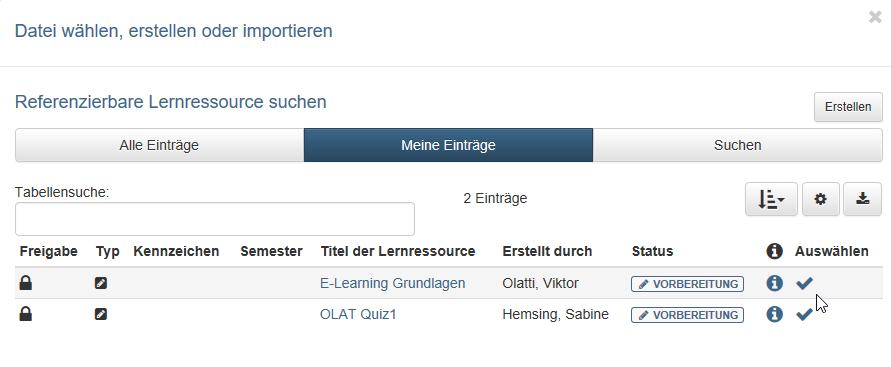

# Four Steps to Your Test or Self-test

With this guide you can quickly integrate a simple test or self-test into your course and activate the course for your learners.

## Schritt 1: Create learning resource "Test"

1. In the authoring area select the link "Create" and the learning resource "Test (QTI 2.1)".

    { class="shadow" }
  
2. Enter the title of the test
    { class="shadow lightbox" }

3. A menu appears. Here you can make further settings in the different tabs if required.

    The menu corresponds to the "Settings" in the `Administration` area and can also be edited later.

    { class="shadow" }
  
## Schritt 2: Creating test questions using Multiple Choice as an example

1. In the "Administration" of the learning resource Test select `Edit content` and you will be taken to the test editor.

    { class="shadow lightbox" }

2. Select "Add items" and select the appropriate question type, e.g. Multiple Choice.
3. In the tab "Choice" enter the title of the question, the question and the possible answers. Further answer options are supplemented by the plus sign.
4. In the tab "Score" define the type and the sum of the points.
5. If necessary, define a feedback for the question and look at the question using the preview.  

You add further questions according to the same principle. The details of the settings can vary depending on the question type. You can also use [sections or test parts](../learningresources/Configure_tests.md) to further structure your test.

!!! info "Note"

    Please note that a single choice question has already been created by default and you should use it and edit or delete it.

!!! warning "Attention"

    Be sure to consider in advance which question type is most appropriate for your particular purposes, as the question type cannot be changed after the fact.

!!! tip "Tip"

    Copying questions is recommended if you have several questions with the same possible answers, for example, if you have to answer several questions with a value from a scale of 1-5.

## Schritt 3: Configure test

1. Select the top element of the test and edit the corresponding tabs as required.

      

2. **Test configuration:** Define how many points the test is passed and if there is a time limit.

    **Feedback:** If desired, define a general feedback for the test.

3. **Expert:** Configure further details of the test procedure, e.g. type of navigation or display of solutions.
4. Finally close the test editor by clicking on the title of the test in the breadcrumb navigation. The course editor can also be opened directly via the editing icon in the list of learning resources under "My entries". This is faster.

!!! info "Note"

    You can create feedback for individual questions as well as for the entire test.

## Schritt 4: Include test in course and finalize

1. Go to the authors area. In the section "My entries" you will find your courses. Open the course in which the test is to be integrated.

    { class="shadow lightbox" }

    { class="shadow lightbox" }

2. Open the "Course Editor" via the "Administration" menu. Select "Insert course elements" and click on the desired course element Test
or Self-test.
1. Go to the tab "Test configuration" → "Select, create or import file".
2. A list of your test learning resources appears. Select the prepared test by clicking on the checkbox.
3. If required, you can preview the integrated test in the tab "Test
configuration" under "Selected file" and edit it as long as it has not been executed.
1. If required, the other tabs of the course element can also be configured. Now the test is included in your course.
2. In order for the test to be processed by the learner, the course must still be published. Just close the course editor by clicking on the name of the course in the crumb bar and allow publishing by selecting "Yes" manually or automatically.

    Alternatively you can use the "Publish" button in the editor on the right side of the toolbar.  

The test or self-test is now integrated in the course and visible and editable for the user. Tests (not self-tests) worked on by learners can be subsequently assessed by the teacher in the course run or in the assessment tool. For more info, see the chapter "[Assessing tests](../learningresources/Assessing_tests.md)".

!!! note "Prerequisite"
        
    The prerequisite for the learner to be able to take the test is that the course has been published and the respective persons have access to the course.
