# Test question types

The following question types can be used in OpenOlat tests:

The question types marked with an * must be evaluated manually.

## Single Choice

{ class=size24 }

A single-choice question comprises a question and at least two answers; only one of them can be selected. In a test only one of those two answers is correct.

First a short title and a question are inserted.

Afterward it need to be selected, if the questions should be shuffled, if the alignment of the questions is vertically or horizontally and if the checkboxes are aligned left or right.

Then the answer texts can be added. Additional answers can be added with the button { class=size16 }. Questions can be deleted with the button { class=size16 }. The correct answer can be selected in column _Correct Answer_. The order of the questions can be changed with the arrows.

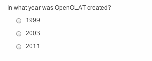{ class="shadow" }

## Multiple Choice

{ class=size24 }

A multiple-choice question comprises one question and at least two answers; several answers can be selected. In a test several answers can be correct.

First a short title and a question are inserted.

Afterward it need to be selected, if the questions should be shuffled, if the alignment of the questions is vertically or horizontally and if the check-boxes are aligned left or right.

Then the answer texts can be added. Additional answers can be added with the button { class=size16 }. Questions can be deleted with the button { class=size16 }. The correct answers can be selected in column _Correct Answer_. The order of the questions can be changed with the arrows.

In the tab "Score" obviously the score can be defined as well ad the method of assessment. Additionally the "Max. number of possible answers" and the "Min. number of possible answers" can be defined.

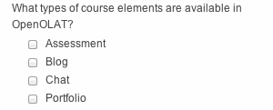{ class="shadow" }

## Kprim

{ class=size24 }

A Kprim question can only be used in a test. It comprises one answer and
exactly four answers. The one taking that test has to decide for every single answer if it is correct or not. 0 to 4 answers can be correct.

First a short title and a question are inserted.

Afterward it need to be selected, if the questions should be shuffled and if the check-boxes are aligned left or right.

Then answer texts can be inserted. The order of the questions can be changed with the arrows. No more answers can be added and no answers can be deleted. For every answer it must be chosen, if it is true or false.

For the assessment, the following score can be reached:

All correct answers = 100% score  
3 correct answers = 50% score  
2, 1 or 0 correct answers = 0% score

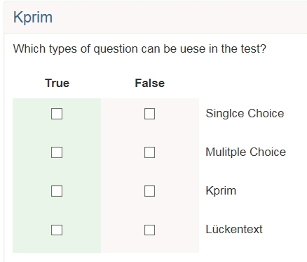{ class="shadow" }

## Matrix

{ class=size24 }

A matrix question consists of several rows and columns, where the answer can be filled in for every row, either as single choice or as multiple choice.

Again first a title and the question are inserted.

Afterward it need to be selected, if the questions should be shuffled and if the answers are single or multiple choice.

Then values can be added in the columns as well as in the rows. If more
columns or rows are needed, they can be added with the corresponding button. Finally, the correct answer need to be selected per row. For single choice it is one answer per row, for multiple choice several answers per row are possible.

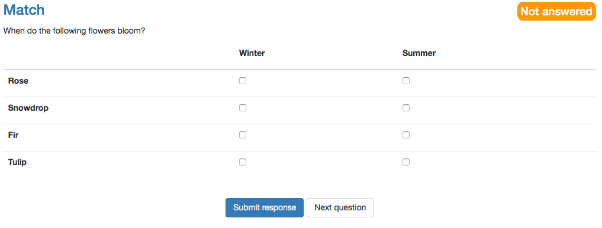{ class="shadow" }

## Drag&Drop

{ class=size24 }

In general the Drag&Drop questions has the same behavior as the matrix
question. However, the test participants do not select the checkboxes, but move the items in the corresponding category.

First a title and the question are inserted.

Afterward it need to be selected, if the questions should be shuffled.

If the type single choice is selected, every item can be dropped only once. For multiple choice every item can be dropped in every category once, but not twice in the same category.

The alignment of the answers defines where the items in relation to the
categories are set.

In the columns categories will be defined. Categories are the fix elements where the items will be dropped into. In the rows the items are added. With drag&drop the items can be moved into the categories afterward.

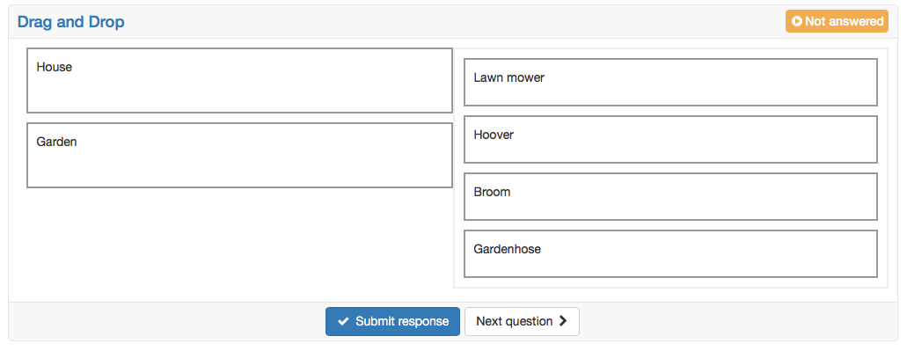{ class="shadow" }
  
## True/false

{ class=size24 }

The question type True/False is similar to Kprim. In each line the
corresponding statement has to be assessed.

User can choose from three options: "Unanswered", "Right", "Wrong".
"Unanswered" is selected by default.

There is no option to add more columns. However, you can add as many lines as required by clicking on "Add row".

The scores can be defined as needed. You may even give points for the option "Unanswered".

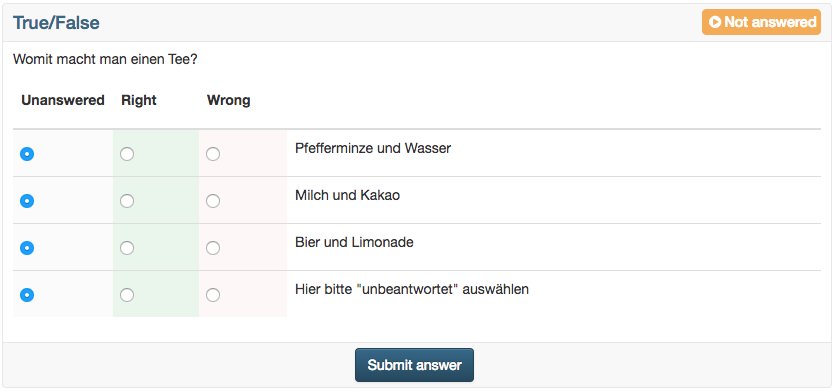{ class="shadow" }

## Gap text

{ class=size24 }

In a gap text question the sought terms are replaced by empty fields, which need to be filled in by the participants.

Gaps are added with the icon { class=size16 } in the editor and with a click on the gap it can be edited.

For every gap the following attributes can be filled in:

* Solution: Fill in the correct and desired solution.
* Placeholder: If desired, a placeholder can be added. It appears in the text in the gap and is visible for the participant.
* Alternative: Alternative solutions can be added with the { class=size16 } if more than one solution is added, separated by semicolon every solutions gets an own field after saving.
* Gap size: Here you can enter a maximum length for the gap field, e.g. for formatting. It has no effect on the actual length of the entry.
* Case sensitive: If this checkbox is selected, there is a case sensitivity. Otherwise it doesn't matter if a solution is written in upper or lower cases.

The points can be chosen freely. Points can also be awarded for alternative answers.

The entry of the same answer in several gaps can be allowed or disallowed.

{ class="shadow" }

{ class="shadow" }

{ class="shadow" }

## Lückentext mit Dropdown
{ class=size24 }

Beim Lückentext mit Dropdown handelt es sich im Prinzip um eine Kombination aus Lückentext und Single-Choice-Auswahl. Ähnlich wie beim Lückentext werden in einen Fließtext Lückenelemente eingebaut. Diesen Lücken können dann mehrere Antwortalternativen zugeordnet und die korrekte Antwort gekennzeichnet werden. 

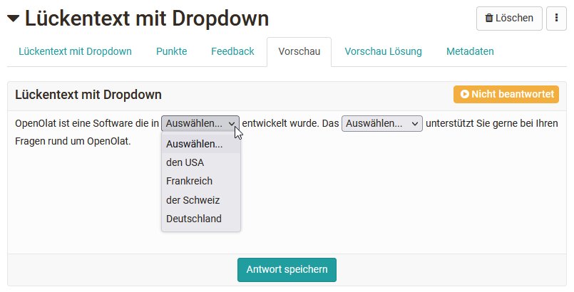{ class="shadow" }

Ferner können auch globale Antworten für die Lücken verwendet werden. Diese werden dann in jeder Lücke der jeweiligen Frage angezeigt und der User muss die für diese Lücke passende Antwort auswählen. 

Die Punktevergabe kann sowohl pauschal über alle Lücken erfolgen als auch für jede Antwort einer Lücke separat konfiguriert werden. 

## Numercial input {: #ni}

{ class=size24 }

In general the numerical input is the same as the gap text. But as solution there are numbers and no texts required.

First a short title is inserted. Afterward the next is written with fields for the gaps. For every gap the following attributes can be filled in:

* Solution: Fill in the correct and desired solution.
* Placeholder: If desired, a placeholder can be added. It appears in the text in the gap and is visible for the participant.
* Gap size: Here you can enter a maximum length for the gap field, e.g. for formatting. It has no effect on the actual length of the entry.

* Tolerance: it can be chosen between three possibilities
    * Exact: The solution correlates exactly with the inserted solution in "Solution"
    * Absolute: A lower or upper bound can be defined for the solution, whereby the lower bound must be less than or equal to the solution and the upper bound must be greater than or equal to the solution. The solution is accepted up to the lower and upper bound. The bound represents an absolute number.

		_Example:_ Solution 20, lower bound 18, upper bound 20.8 → all solutions between 18 and 20.8 are correct.

    * Relative: The solution is accepted until a lower and an upper bound. The bound is a relative number in percent.

		_Example:_ Solution 20, lower bound 10, upper bound 10 → all solutions between 18 and 22 are correct, as the lower bound means minus 10% (20-2) and the upper bound plus 10% (20+2).

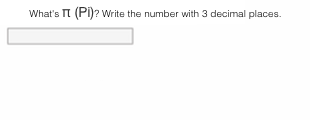{ class="shadow" }

## Hottext

{ class=size24 }

The hottext questions is similar to the gap text. In a running text different terms are marked, and can then be selected by the test participants.

First a short title is inserted.

Afterward a text is written and the selectable terms are marked as hottext. Finally the correct answers need to be marked by selecting the check boxes.

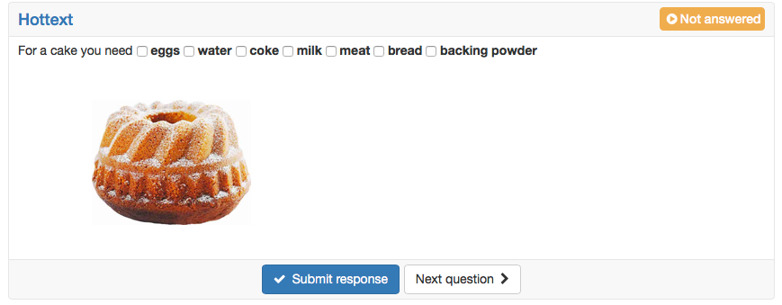{ class="shadow" }

## Hotspot

{ class=size24 }

In a hotspot questions hotspots/areas are graphically presented on an image and need to be selected by the participant correctly. Thereby the question can be created either as single or as multiple choice. Various fine adjustments as the hot spot form or color, the adjustment of the size as well as the advanced edit  allow an optimal visualization. The spots are visible for the participant.  

### Approach

* First a short title and a question are inserted.
* Afterward the desired picture is uploaded.
* Than spots in form of circles or rectangles can be placed on the image. In advanced editing, spots can also be easily duplicated.
* Finally, the correct answer need to be selected.

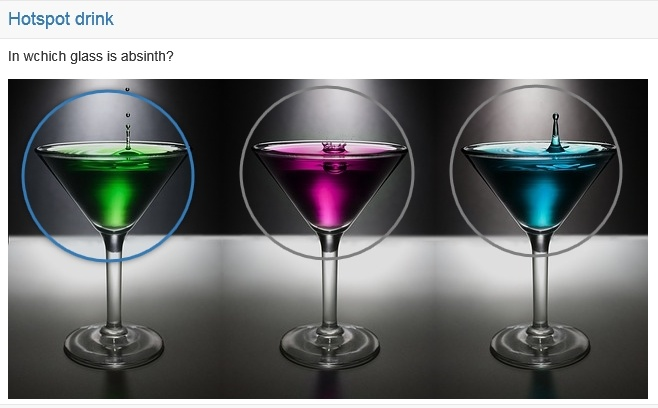{ class="shadow" }

## Order

{ class=size24 }

This type of question requires learners to put elements (text or images) in acorrect order. This question type behaves similar to a drag and drop question.

First the title and the question are entered.

Then the answers can be entered in the correct order and the alignment of the display can be set vertically or horizontally.

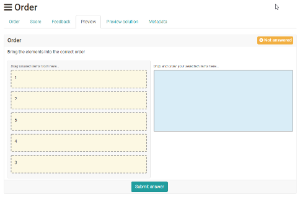{ class="shadow" }

## Essay* {: #fib}

{ class=size24 }

The answer to a free-text question is inserted into a field of variable size. In a test environment, the free-text question must be evaluated separately and manually.

First a short title and a question are inserted.

Afterward the following attributes can be chosen:

* Placeholder: If desired, a placeholder can be added. It appears in the text in the gap and is visible for the participant.
* Height (number of lines): Here can be defined, which height the textfield should have. This height is not restrictive. A participant can also write more lines than indicated here.
* Min. words: This number of words must at least be written, to be able to send the task.
* Max. words: This number of words can at most be written, to be able to send the task.
* Allow copy/paste: Here you define if the learners are allowed to copy+paste content.

Free-text questions come with a pre-defined width and a tab function. Hence, answers can be formatted more easily, e.g. by displaying columns.

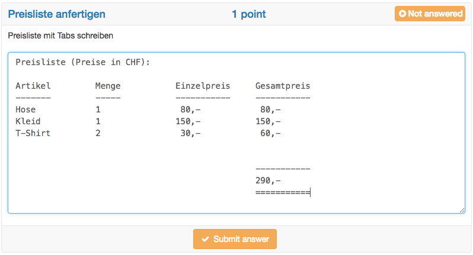{ class="shadow" }
  
!!! info "Autosave"

	As the name already says it, with this question type essays are written often. Thus this question type has got an autosave feature, which saves written text every minute. Further information about the configuration of essays can be found in the excursion below this table.

## File upload*

{ class=size24 }

For this question type participants need to upload a file.

A short title and the question are entered as well as the number of available upload fields. With the upload fields the maximum number of files to be uploaded can be defined. The maximum number of upload fields is 10.

No correct answer can be marked, as the assessment of this question type is only possible manually.

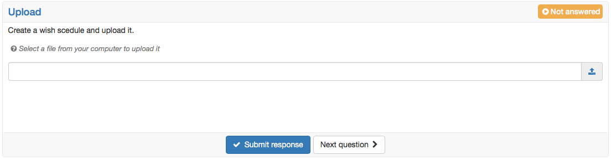{ class="shadow" }

## Drawing*

{ class=size24 }

For the questions type drawing the participant get the task to edit a given picture with the available drawing tools.

First a short title and a question, or more an edit instruction are inserted.

Afterward a picture for the background is uploaded. This picture need to be edited by the test participants. No answer needs to be added, as the
assessment of this question type is done manually.

It is also possible for the participants to add text via the text tool. The text size can be customized using the brush size.

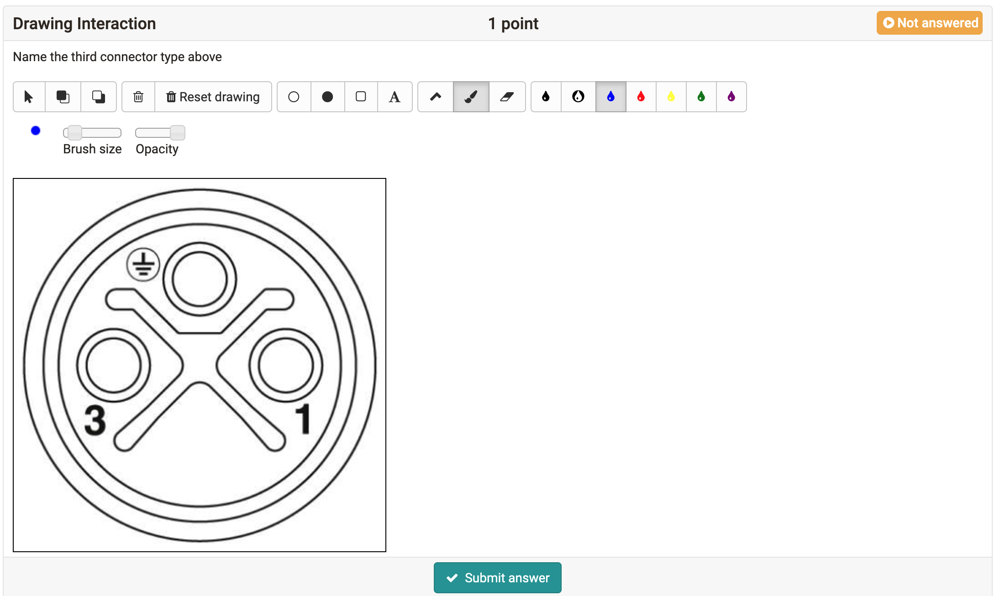{ class="shadow" }
  
!!! info "Import questions"

	Beside the direct creation, questions can also be imported out of the pool ([question bank](../question_bank/index.md)) or by [excel](../question_bank/Data_Management.md).

??? abstract "Digression – Writing essays"

	With the learning resource test and the question type essay, essays can be written in OpenOlat. The following points need to be considered:

    * The autosave feature for the question type essay saves the written text every minute. The time of the last storage is visible on the bottom right. The autosave prevents the test participants of loosing written text, for e.g. if the internet connection is broken or a session time out is reached. If a participant has not actively submitted the answer to the question via the "Submit answer" button, the content already saved via autosave is displayed in the correction workflow with a note to this effect.
    * It it comes to an interruption, the test participants should be able to start the test again. So the following settings need to be met:
        * The number of attempts for the whole test should not be limited. To make sure, that the test is not started again at a later point (after the actual test time), it can be done with the Save Exam Browser or in the assessment mode.
        * Suspend the test is allowed. So after an interruption the test participant comes back to where he left. The text is saved until the last storage. There can be some small text losses.
        * The number of attempts for the essay question is not limited. This allows test participants to submit the written text over and over again and continue writing. The regular submitting of the written text gives security to the test participants.
    * If a test has a time limit, the text is saved in the very end only if it is submitted right before the time is running out. Please remind your test participants shortly before test end to submit the question one more time and not writing anything anymore afterward.

	If considering these recommendations an essay can be written in OpenOlat.
