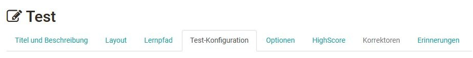
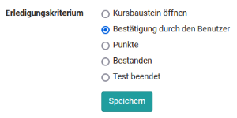
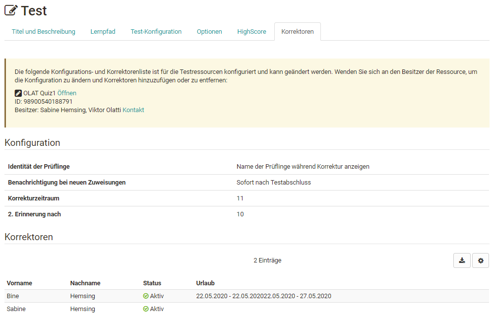
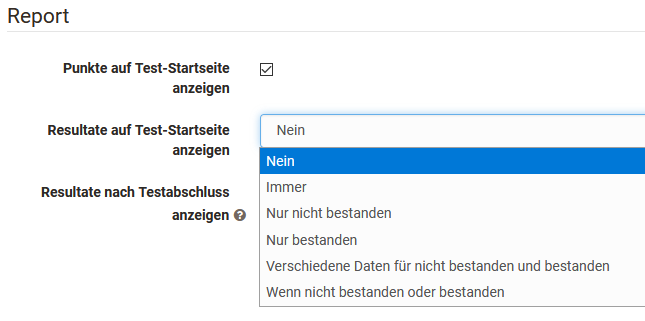
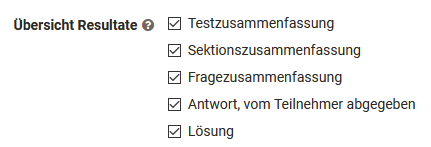
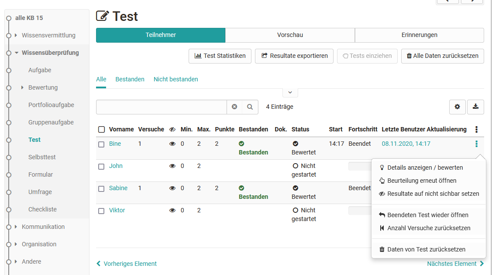

# Tests auf Kursebene

Hier erhalten Sie einen Überblick wie Sie einen Test in einem Kurs weiter
konfigurieren, manuelle Bewertungen vornehmen und die Ergebnisse speichern
können.

## Testkonfiguration auf Kursebene

Öffnen Sie dafür den Kurs, gehen Sie in den Kurseditor und fügen Sie einen
Kursbaustein "Test" hinzu bzw. wählen Sie einen bereits hinzugefügten
Kursbaustein Test. Sie sehen nun die folgenden Tabs:

### Tab Lernpfad

Wie bei allen Lernpfad Kursen kann hier definiert werden, ob der Kursbaustein
obligatorisch für den Lernpfad Kurs ist oder ob er nicht für die Lernpfad
Anzeige verwendet werden soll (Einstellung "freiwillig"), ab wann der Test
sichtbar wird, bis wann eine Bearbeitung möglich ist und mit welcher
Bearbeitungszeit bei diesem Baustein zu rechnen ist. Darüber hinaus stehen
folgende Erledigungskriterien zur Verfügung:

  

### Tab "Test-Konfiguration"

Hier wählen oder erstellen Sie den Test, den Sie einsetzen und dem
Kursbaustein Test zuordnen möchten. Anschließend können weitere Einstellungen
vorgenommen werden, z.B die Art der Korrektur definiert oder die Art der
Darstellung der Testresultate definiert werden.

Im Einzelnen sind folgende Einstellungen möglich nachdem Sie eine
Lernressource Test erstellt oder zugeordnet haben:

### Test

|  
  
---|---  
Bei Kursbewertung ausschliessen| Wird hier der Haken gesetzt, bleibt der Test
bei der Fortschrittsberechnung in einem [Lernpfad Kurs -
Überblick](../course_create/Learning_path_course.de.md)
unberücksichtigt. Bei einem herkömmlichen Kurs ist diese Einstellung nicht
vorhanden.  
Testzeitraum festlegen| Während des Testzeitraum kann der Test gestartet
werden. Sobald die "bis-Zeit" erreicht ist, wird der Test automatisch beendet.
Auch dann, wenn die definierte Bearbeitungszeitdauer noch nicht aufgebraucht
ist.  
  
### Korrektur

|

 **automatisch oder manuell?**

Die Korrektur wird entweder automatisch oder manuell durchgeführt. Sobald ein
manuell auszuwertender [Fragetyp ](Test+Fragetypen.html)z.B. Freitext
vorhanden ist, muss zwingend eine manuelle Variante gewählt werden. Bei der
automatischen Korrektur werden alle Fragen automatisch, direkt korrigiert und
das Resultat ist sofort sichtbar.

Bei einer manuellen Korrektur ist die Sichtbarkeit des Ergebnisses
eingeschränkt und der Betreuer bzw. Korrektor muss die Korrektur manuell
ergänzen. Zu den manuell zu bearbeitenden Fragen gehören Freitext, Datei
hochladen und Zeichnen. Eine manuelle Korrektur kann bei Bedarf aber auch
eingestellt werden, wenn der Test nur aus automatisch auswertbaren Fragetypen
besteht.

Aktiviert man die Option " **Manuell durch externe Korrektoren"** können auch
OpenOlat Benutzer einen Test korrigieren ohne, dass sie Mitglied oder gar
Betreuer des Kurses sind. Durch diese Wahl wird auch der Tab "Korrektoren"
aktiviert und man erkennt, wer als Korrektor dem Test zugeordnet ist.

Steht die Option "Manuell durch externe Korrektoren" nicht zur Verfügung,
wurden in der Lernressource Test keine [externen Korrektoren
](Test+Einstellungen.html)konfiguriert.

 **Freigeben oder nicht freigeben**

Nicht freigeben: Die Bewertung des Tests wird standardmässig nicht freigegeben
und kann vom Teilnehmer nicht eingesehen werden.

Freigegeben: Die Bewertung wird standardmässig freigegeben und kann vom
Teilnehmer eingesehen werden.

  
  
### Report

|  
  
Punkte auf Test-Startseite anzeigen| Wenn diese Option angewählt ist, werden
die Punkte auf der Startseite des Tests für den Benutzer angezeigt.  
Bewertung auf Test-Startseite anzeigen|

Hiermit kann definiert werden, ob bzw. unter welchen Bedingungen die Bewertung
auf der Test-Startseite angezeigt werden sollen.

Wenn das Feld "immer" gewählt wird, stehen die Resultate direkt nach Beenden
des Tests zur Verfügung. Bei der Auswahl "Nein" werden die Ergebnisse gar
nicht angezeigt. Und bei den anderen Optionen können datumsabhängige Anzeigen
definiert werden.

In welchem Detailierungsgrad die Resultate angezeigt werden, kann bei
"Übersicht Resultate" ausgewählt werden. Die Auswahl kann einmal vorgenommen
werden und ist dieselbe für "Resultate auf Test-Startseite anzeigen" und
"Resultate nach Testabschluss anzeigen".  
  
Bewertung nach Testabschluss anzeigen|

Hier wird konfiguriert, welche Informationen die Lernenden erhalten:

Bei der Testzusammenfassung wird u.a. die erreichte Prozentzahl, die
Bearbeitungsdauer, die Anzahl der bearbeiteten Fragen und die erreichte
Punktzahl sowie der Status angezeigt.  
Die Sektionszusammenfassung ist nur relevant, wenn ein Test auch [Sektionen
](Test+konfigurieren.html)enthält.  
Bei der Fragenzusammenfassung wird der Titel der Frage, die jeweils erreichte
Punkte bzw. der passende Prozentwert angezeigt aber nicht die Fragestellung
selbst.  
Bei der Antwort der Teilnehmer wird die Frage, alle Antwortoptionen sowie die
Wahl des Users angezeigt, allerdings keine Bewertung ob die Frage richtig oder
falsch beantwortet wurde. Ist dies gewünscht muss die Option mit weiteren
Feedback-Optionen kombiniert werden.  
Die Lösung beinhaltet die korrekten Antworten.

Je nach Kombination der Anzeige Optionen können dem User somit
unterschiedliche Arten von Feedback hinterlassen werden.  
  
  

### Tab "Optionen"

Bindet man einen Test in einen Kurs ein, werden die Einstellungen aus der
Konfiguration der Lernressource Test (siehe  "[Test
Einstellungen](Test+Einstellungen.html)" und "[Test
konfigurieren](Test+konfigurieren.html)")  standardmässig übernommen. Im Tab
"Optionen" ist deshalb "Konfiguration von Lernressource übernehmen" ausgewählt
und die entsprechenden Einstellungen, die in der Lernressource Test
vorgenommen wurden, werden hier angezeigt.

Wenn die Einstellungen für einen im Kurs eingebundenen Test geändert werden
sollen, kann "Konfiguration anpassen" ausgewählt und die gewünschten
Änderungen vorgenommen werden. Diese Anpassungen im Test haben keine
Auswirkungen auf die Konfiguration der Lernressource Test selbst.

### Tab HighScore

Hier kann für einen Test auch eine Highscore Übersicht aktiviert und weiter
konfiguriert werden.

## Test und Selbsttest im Vergleich

  
|

Test

|

Selbsttest
  
  
---|---|---  
Einsatzzweck:| Prüfungstest, Test mit Prüfungsmöglichkeit durch den Lehrenden|
Übung, Selbstevaluation  
Herstellung mit:| [Testeditor](Testeditor.html)| [Testeditor](Testeditor.html)  
Fragetypen QTI 2.1:|

Alle [Fragetypen ](Test+Fragetypen.html)möglich

|

Alle [Fragetypen ](Test+Fragetypen.html)möglich aber nur automatisch
auswertbare Fragetypten können auch für Punkte verwendet werden.  
  
Einbindung mit Kursbaustein:| Test| Selbsttest  
Anzahl Aufrufe durch Kursteilnehmer:| konfigurierbar| unlimitiert  
Ergebnisse erscheinen ...| im [Bewertungswerkzeug
](../../pages/viewpage.action%EF%B9%96pageId=108593653.html)und in den [Test
Statistiken](Einsatz+der+Kurswerkzeuge.html#EinsatzderKurswerkzeuge-
test_statistikenTestStatistiken) und sind für Betreuer einsehbar|  _nicht_ im
[Bewertungswerkzeug
](../../pages/viewpage.action%EF%B9%96pageId=108593653.html)und in den [Test
Statistiken](Einsatz+der+Kurswerkzeuge.html#EinsatzderKurswerkzeuge-
test_statistikenTestStatistiken) und sind so nicht personalisiert für Betreuer
und Besitzer einsehbar.  
Datenarchivierung:| ja, personalisiert| ja, anonymisiert. Eine
personenbezogene Zuordnung oder Feedbacks sind aber nicht möglich  
  
Manchmal ist es sinnvoll den Typ "Test" zu verwenden auch wenn man den
Lernenden eigentlich einen Selbsttest zur Verfügung stellen möchte, da man bei
Tests die Möglichkeit hat die Lernenden bei Bedarf individuell zu unterstützen
und auch Feedback zu manuell bewertbaren Fragetypen bereitstellen kann.

  

## Änderungen an Tests und Selbsttests

Sobald ein Test oder Selbsttest in einen Kurs eingebunden wird, können nur
noch sehr eingeschränkt Änderungen unter "Inhalt editieren" vorgenommen
werden. Deshalb sollten Test erst in einen Kurs eingebunden werden, wenn sie
vollkommen fertiggestellt sind.

Warum ist das so? Angenommen Sie könnten in einem eingebundenen Test noch
Fragen hinzufügen oder andere Antworten als korrekt markieren, würden
einerseits nicht alle Testpersonen die gleichen Voraussetzungen antreffen.
Andererseits könnten bereits Resultate gespeichert worden sein, die nach der
Änderung nicht eindeutig einer Version der Testdatei zugewiesen werden können.
Deshalb ist das Editieren bereits eingebundener Tests und Selbsttests stark
eingeschränkt.

Wenn Sie einem Test beispielsweise eine neue Frage hinzufügen möchten oder
fälschlicherweise eine Antwort als korrekt markiert wurde, kopieren Sie die
Lernressource Test im Autorenbereich und speichern den Test so neu. Bearbeiten
und korrigieren Sie den Test und binden Sie den Test anschließend in dem
gewünschten Kurs ein. Wechseln Sie dafür in den Kurseditor und tauschen Sie im
Kursbaustein des gewünschten Tests die Datei aus. Wenn bereits Resultate
eingegangen sind, werden diese in Ihrem persönlichen Ordner (private)
archiviert und Sie können entscheiden, ob OpenOlat diejenigen Kursteilnehmer,
die den Test bereits absolviert haben, über die Änderung informieren soll.

## Tests einsehen und bewerten

Zugriff auf von Kursteilnehmern ausgefüllte Tests erhalten Sie im
"[Bewertungswerkzeug](../../pages/viewpage.action%EF%B9%96pageId=108593653.html)".
Das Bewertungswerkzeug finden Sie in der "Administration" des Kurses. Unter
"Benutzer" werden sämtliche Tests und weitere bewertbare Kursbausteine eines
Kurses angezeigt und können personenbezogen aufgerufen, eingesehen, geändert
und kommentiert werden. Alternativ können die Ergebnisse auch im Kursrun bei
geschlossenem Editor eingesehen und verwaltet werden. Im Kursrun besteht auch
die Möglichkeit, Erinnerungen zu dem jeweiligen Test zu konfigurieren und so
einen bedingungsabhängigen Mailversand auszulösen.

Sofern für einen Test auch externe Korrektoren aktiviert wurden, können diese
die Bewertungen über das[ Coaching Tool](Coaching.html) vornehmen.

## Testergebnisse und Archivierung

Wählen Sie in der Kursansicht aus der „Administration“ den Link
„[Datenarchivierung](Einsatz+der+Kurswerkzeuge.html#EinsatzderKurswerkzeuge-
_datenarchivierung)“. Gehen Sie links zu „Tests" oder auch komplett zu
"Kursresultate" und speichern Sie die angezeigte Datei. Die Resultate von
Selbsttests werden anonymisiert gespeichert.

Nach der Archivierung finden Sie alle Angaben dazu, welche Person (bei
Selbsttest anonymisiert durch eine Laufnummer) welche Fragen beantwortet hat,
welche Antworten sie gegeben hat und beim Selbsttest wie viele Punkte erreicht
wurden.

Über "Administration" ->[„Test
Statistiken"](Einsatz+der+Kurswerkzeuge.html#EinsatzderKurswerkzeuge-
test_statistikenTestStatistiken) können Sie auch schnell auf die grafische
Auswertung Ihrer Testdaten zugreifen.

  

  

