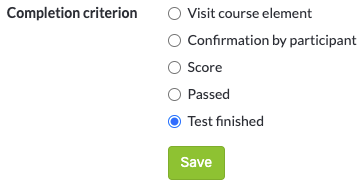
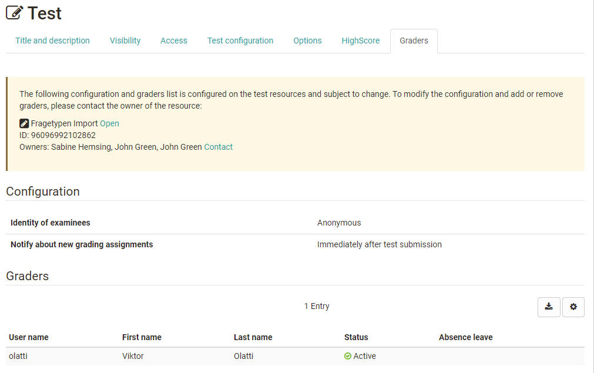
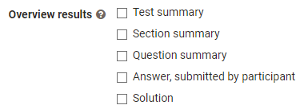
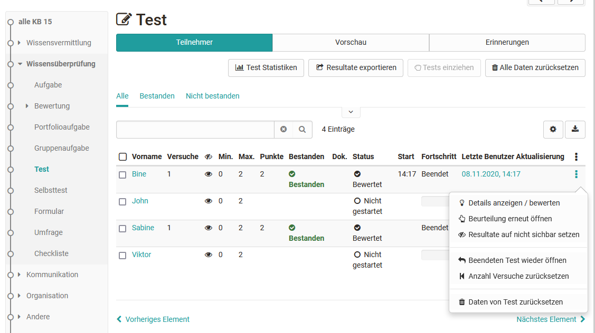

# Tests at course level

Here you get an overview of how to further configure a test in a course, how
to make manual evaluations and how to save the results.

## Test Configuration at Course Level

Open the course, go to the course editor and add a course element "Test" or
select an already added course element Test. You will now see the following
tabs:

### Tab Learning path

As with all learning path courses, you can define here whether the course
element is mandatory for the learning path course or whether it should not be
used for the learning path display (setting "voluntary"), from when the test
will be visible, until when processing is possible and what processing time
can be expected for this element. In addition, the following completion
criteria are available:

### Tab Test configuration

Here you select or create the test you want to use. Subsequently, further
settings can be made, e.g. the type of correction or the type of display of
the test results can be defined. In detail, the following settings are
possible:

 **Test**|  
  
---|---  
Ignore in course assessment|

If the check mark is set here, the test is not taken into account when
calculating progress in a [learning path course](Learning+path+course.html).
This setting is not available for a conventional course.  
  
Set assessment period| The test can be started during the test period. As soon
as the "to" time is reached, the test is automatically terminated. This is
also the case if the defined test time has not yet been used up.  
 **Correction**|

 **automatically or manually**

The correction can be made automatically or manually. As soon as a [question
type](https://confluence.openolat.org/display/OO152EN/Test+question+types) to
be evaluated manually, e.g. free text, is available, it is mandatory to select
a manual variant. For the auto correction the result is visible right away and
all questions are revised automatically.

For the manual correction the [visibility of the result
](https://confluence.openolat.org/display/OO161EN/Assessment+Tool#AssessmentTool-
result_visibility)is limited and the the coach needs to add manual correction,
as for some question types no auto correction is possible. These include
essay, file upload and drawing. A manual correction is also possible, if the
just named question types are not included in the test. Like this it becomes
possible to limit the visibility, even though the test consists only of
multiple choice questions.

By selecting the option " **Manual by external graders** ", OpenOlat users can
also correct a test without being a member or even coach of the course. This
option also activates the tab "Graders" and you can see who is assigned to the
test as corrector.

If the option "Manual by external graders" is not available, no external
correctors were configured in the learning resource Test.  
  
 **Report**|  
  
Show score on test homepage|

If this option is selected, the score will be shown to the user on the test
homepage.  
  
Show results on test homepage|

Here it can be defined, if the result should be shown on the test homepage.

If the checkbox Depending on date is not selected, the results are available
directly after finishing the test. If only the from date is inserted, the
result is shown from this time on. If both dates are inserted, the result is
available during this time period.

In wich level of detail the results are shown, can be defined under "Overview
results". The selection can be done once and is the same for "Show results on
test homepage" and "Show results after test has been submitted".  
  
Show results after test has been submitted

|

Here you configure which information the learners receive:

  

The test summary shows, among other things, the percentage achieved, the time
taken to complete the test, the number of questions worked on and the score
achieved, as well as the status. The section summary is only relevant if a
test also contains
[sections](https://confluence.openolat.org/display/OO152EN/Configure+tests).
In the question summary, the title of the question, the points achieved in
each case or the matching percentage value are displayed but not the question
itself. In the answer of the participants the question, all answer options as
well as the choice of the user is shown, but no evaluation whether the
question was answered correctly or incorrectly. If this is desired, the option
must be combined with other feedback options.

Depending on the combination of the display options, different types of
feedback can be left for the user.  
  
### Tab Options

If you include a test in a course, the settings from the configuration of the
learning resource Test (see "[Test
settings](https://confluence.openolat.org/display/OO152EN/Test+settings)" and
"[Configure
test](https://confluence.openolat.org/display/OO152EN/Configure+tests)") will
be adopted by default. Therefore, "Use configuration of the learning resource"
is selected in the "Options" tab and the corresponding settings made in the
learning resource Test are displayed here.

If the configuration needs to be adapted, "Adjust configuration" needs to be
selected. These adaptions do not have any impact on the configuration of the
learning resource itself. In the tab Test configuration some additional
configuration can be made.

### Tab HighScore

A highscore overview for the test can also be activated and further configured
here.

## Comparison: Test and Self-test

  
|

Test

|

Self-test
  
  
---|---|---  
Intended use:| Examination test, test with the possibility of examination by
the teacher| Exercise, self-evaluation  
Created with:| Test editor QTI 2.1| Test editor QTI 2.1  
Question types QTI 2.1|

all question types possible  

|

All [question types](Test+question+types.html) possible, but only
automatically scorable question types can also be used for points.  
  
Embedding with course element:| Test| Self-test  
Results appear...|

in the [assessment tool](Assessing+tests.html) and in the [test
statistics](Using+Course+Tools.html#UsingCourseTools-
_datenarchivierungDataArchivingDataArchiving) and are visible for coaches

|  _not_  in the [assessment tool](Assessing+tests.html) and in the [test
statistics](Using+Course+Tools.html#UsingCourseTools-
_datenarchivierungDataArchivingDataArchiving) and are thus not visible for
coaches and owners  
Archiving of results:| yes, personalized| yes, anonymized - however, a
personal correlation or feedbacks are not possible  
  
Sometimes it makes sense to use the type "test" even if you actually want to
provide the learners with a self-test, because with tests you have the
possibility to support the learners individually if necessary and also to
provide feedback on manually assessable question types.

## Changes to tests and self-tests

As soon as a test or self-test is included in a course, only very limited
changes can be made under "Edit content". Therefore, tests should not be
included in a course until they are completely finished.  

Why is that? Assuming you could add questions to an integrated test or mark
other answers as correct, not all test subjects would meet the same
requirements. On the other hand, results may already have been saved that
cannot be unambiguously assigned to a version of the test file after the
change. Therefore the editing of already integrated tests and self-tests is
strongly restricted.

For example, if you want to add a new question to a test or if an answer was
incorrectly marked as correct, copy the learning resource Test in the Author
Area and save the test again. Edit and correct the test and then include the
test in the course. To do this, switch to the course editor and exchange the
file in the course element of the desired test. If results have already been
received, they will be archived in your personal folder (private) and you can
decide whether OpenOlat should inform the course participants who have already
taken the test about the change.

## View and grade tests

Access to tests completed by course participants is available in the
"[Assessment tool](Assessing+tests.html)". The assessment tool can be found in
the "Administration" of the course. All tests and other assessable course
elements of a course are displayed under "User" and can be called up, viewed,
changed and commented on in relation to a person. Alternatively, the results
can also be viewed and managed in the course run with the editor closed. In
the course run it is also possible to configure reminders for the respective
test and thus trigger a condition-dependent mail dispatch.

If external graders have also been activated for a test, they can use the
[Coaching Tool](Coaching.html) to make the assessments.

## Test results and archiving

Select the link "[Data archiving](Using+Course+Tools.html#UsingCourseTools-
_datenarchivierungDataArchivingDataArchiving)" from the "Administration" in
the course view. Go to "Tests" or "Course results" on the left and save the
displayed file. The results of self-tests are saved anonymously.

After archiving, you will find all information about who answered which
questions, which answers were given and how many points were achieved during
the self-test.

Via "Administration" ->"[Test
Statistics](Using+Course+Tools.html#UsingCourseTools-
_qti_statisticsSurveyStatisticsTestStatisticsTest/Surveystatistics)" you can
also quickly access the graphical evaluation of your test data.

  

