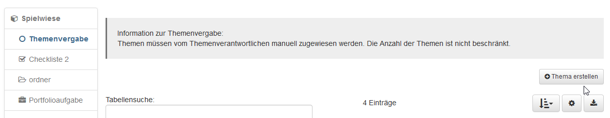
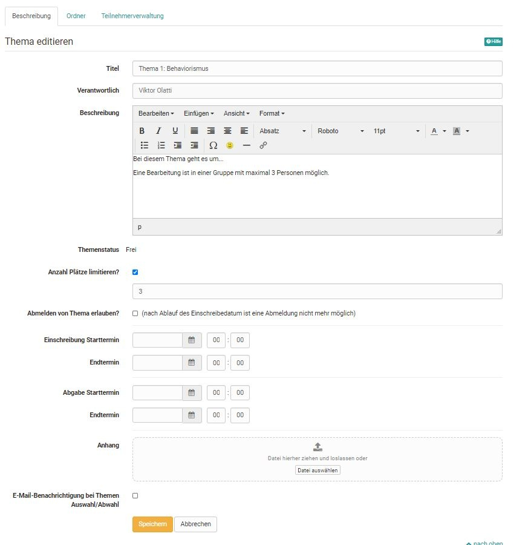
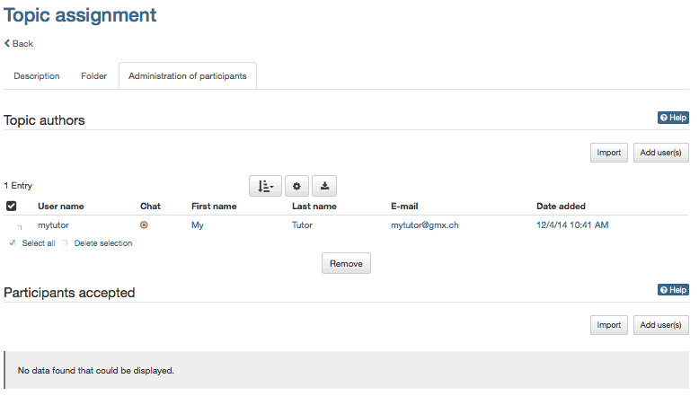
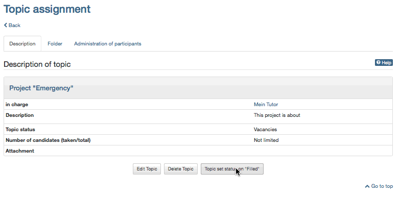
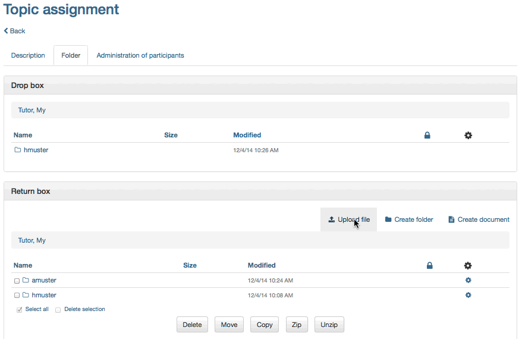

#  Drei Schritte zur Erstellung und Verwaltung von Themen

Mit der folgenden Anleitung haben Sie in kurzer Zeit gelernt, wie Sie mit dem
Kursbaustein „Themenvergabe“ ein Thema anbieten und Kursteilnehmer verwalten
können.

Im folgenden Beispiel hat der Besitzer die Themenvergabe so konfiguriert, dass
die Themenwahl des Kursteilnehmers nicht gleich gilt, sondern zuerst vom
Themenverantwortlichen bestätigt werden muss. Das bedeutet, dass sich
Kursteilnehmer für das Thema bewerben und Sie als Themenverantwortlicher
Kandidaten akzeptieren oder ablehnen können.

##  Voraussetzungen

Der Besitzer hat einen Kursbaustein „Themenvergabe“ in den Kurs eingebunden
und Sie zum Themenverantwortlichen ernannt.

##  Thema erstellen

### Schritt 1: Kurs öffnen und Thema erstellen  

a) Im Autorenbereich unter „Meine Einträge“ Kurs suchen und öffnen.

  
  
  
b) Im Kursmenü links zur Themenvergabe navigieren.

c) Oben im Inhaltsbereich auf „Thema erstellen“ klicken.  

d) Im Tab „Beschreibung“ Informationen zum Thema eingeben. Neben Titel und
Beschreibung können Sie auch die Anzahl Bewerber limitieren, Abmeldungen
gestatten oder verbieten, Dateien anhängen und eine E-Mail-Benachrichtigung
einrichten. Sie können auch einen Einschreibetermin und einen Abgabetermin
definieren.

  
  
e) Optional: Wenn Sie weitere Betreuer für Ihr Thema bestimmen möchten,
klicken Sie im Tab „Teilnehmerverwaltung“ unter „Verantwortliche des Themas“
auf „Benutzer hinzufügen“ und wählen die gewünschte Person aus.

  
  
Ihr Thema erscheint nun in der Themenübersicht und Kursteilnehmer können sich dafür bewerben.

Wenn Sie die Checkbox „E-Mail-Benachrichtigung bei Themen Auswahl/Abwahl“ in der Beschreibung des Themas markiert haben, erhalten Sie eine E-Mail, sobald sich Kursteilnehmer für Ihr Thema bewerben.

### Schritt 2: Teilnehmer verwalten  

a) In der Themenübersicht auf den Titel Ihres Themas klicken und in den Tab
„Teilnehmerverwaltung“ wechseln|

  
  
b) In der Kandidatenliste diejenigen Personen auswählen, denen das Thema
zugeteilt werden soll. Auf „Als Teilnehmer übernehmen“ klicken. Bei Bedarf die
E-Mail-Benachrichtigung für die akzeptierten Kursteilnehmer anpassen und
versenden.  

c) In der Kandidatenliste diejenigen Personen auswählen, denen das Thema nicht
zugeteilt werden soll. Auf „Entfernen“ klicken. Bei Bedarf die E-Mail-
Benachrichtigung für die nicht akzeptierten Kandidaten anpassen und versenden.  

d) Wenn sich keine weiteren Kandidaten bewerben können sollen, im Tab
„Beschreibung“ auf „Themenstatus auf "Belegt" setzen“.

  
  
Akzeptierte Teilnehmer können nun beim gewählten Thema im Tab „Ordner“ über
den Abgabeordner Dateien einreichen.

### Schritt 3: Dateien verwalten (optional)  

a) Wenn Dateien eingereicht wurden, auf den Tab „Ordner“ in Ihrem Thema klicken
und den Ordner des Teilnehmers öffnen.

Abonnieren Sie den Abgabeordner ihres Themas, um bei neu eingereichten Dateien
benachrichtigt zu werden.

  
  
b) Sie können dem Teilnehmer Dateien über den Rückgabeordner zurückgeben. Im
Tab „Ordner“ den Ordner des akzeptierten Teilnehmers wählen und auf „Datei
hochladen“ klicken.  

c) Abschließend können sie definieren ob der jeweilige Teilnehmer alle
genannten Aufgaben erfüllt hat. Zur Auswahl steht: Ok, nicht OK oder noch in
Bearbeitung.

