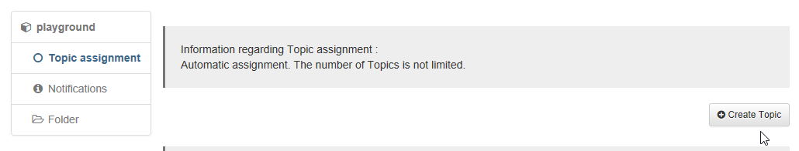
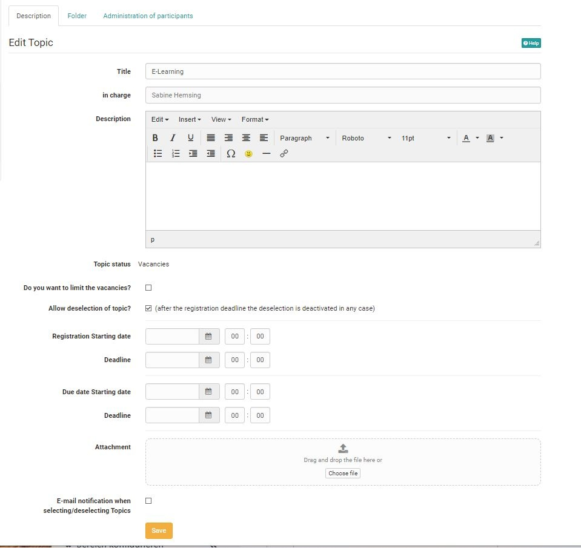
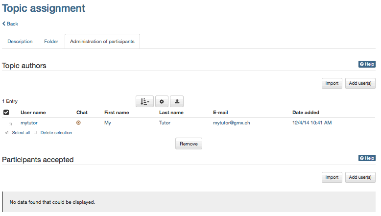
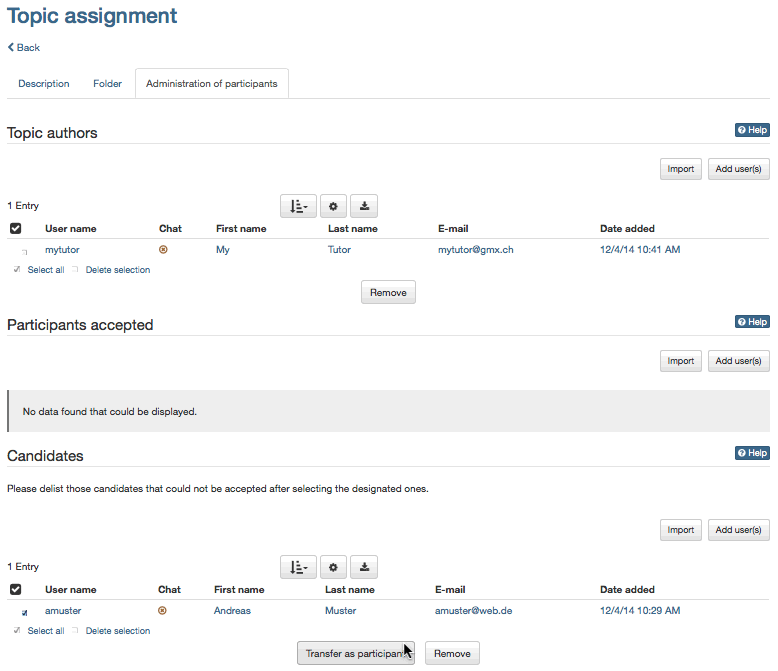
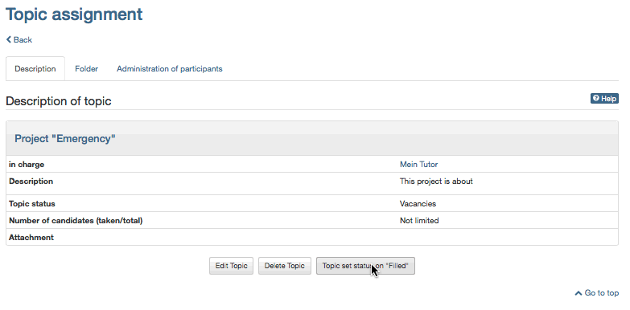
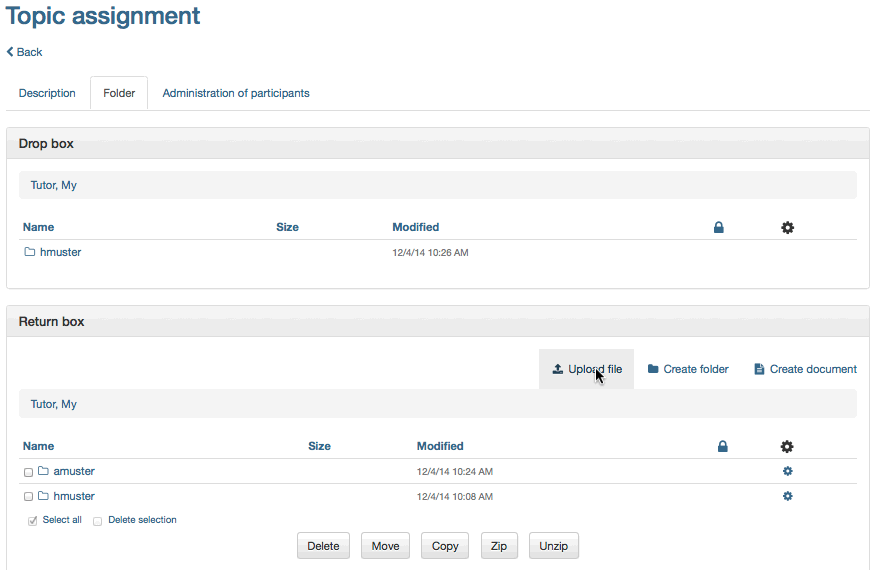

#  Three Steps to Create and Manage Topics

The following guidelines will teach you in no time how to offer topics via the
course element "Topic assignment" before managing your course participants.

The following example will show that the course author has configured the
topic assignment to not immediately accept a participant's topic choice. This
choice has to be confirmed first by the person responsible for that topic.
This means that course participants have to apply for a topic before being
accepted or rejected by persons responsible for topics.

##  Requirements

A course author has already embedded the course element "Topic assignment" in
a course and appointed you as person responsible for a topic.

##  Create Topic
 
### Step 1: Open course and create topic  
 
a) Search for your course in "Authoring", section "My entries," and open it.

  
  
  
b) Navigate to the topic assignment in the course menu on your left.  

c) Click on "Create topic" at the top of the content area.  

d) Provide information on your topic (title, description) in the tab
"Description." Additionally you can limit the number of candidates, allow for
de-/selection, attach files, and establish notifications via email. You can
also define an enrollment date and a deadline.

  
  
  
Optional: If you want to appoint additional tutors for your topic just
click on "Add user(s)" in the tab "Administration of participants," section
"Topic authors" before selecting the person required.

  
  
Your topic will now appear in your topic assignment and course participants
will be able to apply.

If the check box "E-mail notification when selecting/deselecting Topics" is
activated in your topic description, you will receive an email as soon as a
course participant applies for your topic.

### Step 2: Manage participants  

a) Click on the title of your topic in the topic overview before going to the
tab "Administration of participants."

  
  
b) Select those people from the candidate list to whom your topic should be
assigned. Click on "Transfer as participant." Adapt and send email
notification to all accepted course participants if needed.  

c) Select those people from the candidate list to whom your topic should not
be appointed. Click on "Remove." Adapt and send email notification to all
candidates not accepted if needed.  

d) If you do not wish other candidates to apply just click on "Topic set
status to 'Filled'" in the tab "Description."

  
  
Participants accepted can now submit files via drop box regarding their chosen
topic in the tab "Folder."

### Step 3: Manage files (optional)  

a) If there are files already submitted just click on the tab "Folder" within
your topic before opening a participant's folder.

Subscribe to the drop box of your topic in order to get a notification for
newly submitted documents.

  
  
b) It is possible to return files via return boxes. Just select the folder of
a participant already accepted in the tab "Folder" and click on "Upload file."  
  
