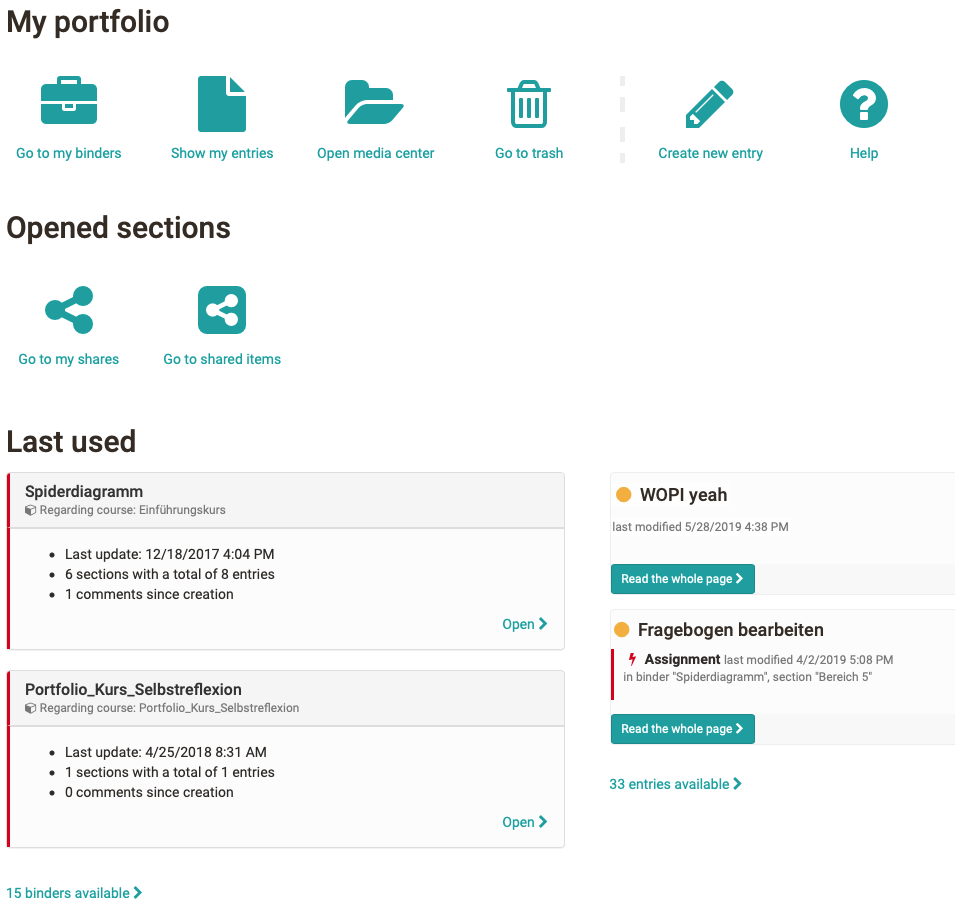

# Components of the portfolio

Every OpenOlat user has access to his individual portfolio area by the
personal menu. The following chart shows the overview page of the Portfolio
2.0.

  

The links on the overview page lead to further portfolio areas.

Links | Use
---|---
[Show my binders](My_portfolio_binders.md)|Here all personal folders are displayed and the user can create new folders.
[Show my entries](My_entries.md)|All entries are displayed here and new entries can be created.
[Open media center](Media_center.md)|Here you can find your artifacts and create or import new artifacts. An artifact can be, for example, a document, a media file, or a text.
[To my shares](Shared_by_me.md)|Here the own folders are shown, which were released for further persons.
[Show items shared with me](Shared_with_me.md)|Here all folders are indicated, which were provided by other persons and released for the respective user. For example, teachers can see the folders that students have released for them.

  

In addition, there is access to the portfolio trash, access to help, the
possibility to directly create new entries and to display the portfolio items
that were last used.

  

