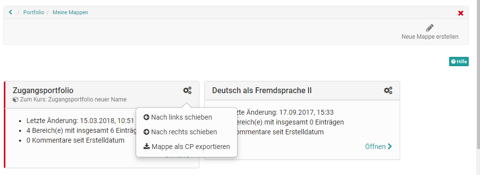

# My portfolio binders

In the personal menu every user gets access to his portfolio via the link "To
my binders" to his portfolio folders.

Furthermore, new portfolio folders can be created here under "Create new
folders". Via the gear icon the existing folders can be moved or exported as
CP. In a folder directly there are also further export options like PDF export
and export to a page.

!!! warning "Attention"

    There are two places under "My Folders" where new folders can be created. Once on the top right (see previous screenshot and integrated into the page. This second option offers more creation possibilities for the portfolio folders.

# The 2 types of folders

There are basically two types of folders:

1. Collected binders
2. Self created binders 

## Collected binders

You can recognize the retrieved folders by the red border and the reference to
the corresponding course. These folders are based on a "[Portfolio 2.0
template](Portfolio_template_Creation.md)" and are usually created
by another person, usually the teacher. The collection takes place in the
course via the "[Portfolio
Task](Portfolio_task_and_assignment_Collecting_and_editing.md)".
Alternatively, it is also possible to book and collect portfolio templates
independently of the price.

As soon as a portfolio folder has been collected by the learner, it appears in
the "My binders" area of the respective collector.

When a user opens this folder, he/she can select the tasks stored there (free
text or form type) and edit the portfolio activities provided by storing
various artefacts (texts, files, etc.) or filling in a form.

!!! tip "Hint"

    By default it is not possible to create own entries in a collected binder. But all contents of the [media center](Media_center.md) can be inserted into an entry.

The "Add content" button takes you to the Portfolio Editor. Here various
elements can be added and also grouped with the container element. By clicking
on the plus sign, further blocks can be added and moved via drag and drop.

As an alternative to adding content, already created portfolio entries can
also be linked via the "Reference content" button. Changes to the entries are
then possible at all referenced points.

## Self created binders

In general, all OpenOlat users are allowed to create their [own portfolio
binders](Three_steps_to_your_portfolio_binder.md) with sections and entries.  

!!! info "Info"

    The possibility to create own binders can be restricted by your administrator.

    You can find out how to add content to the portfolios in the chapter "[Three steps to your portfolio binder (Three_steps_to_your_portfolio_binder.md)" and "The Portfolio Editor".