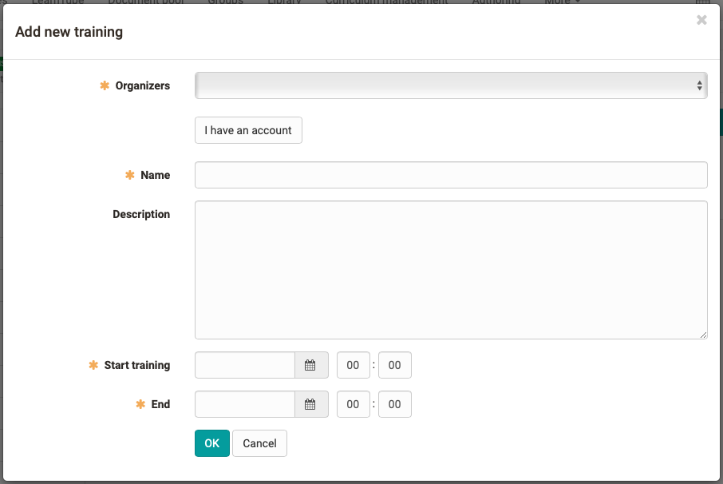

# Course element GoToMeeting

## (GoTo Training)

 **Type of software**|  Commercial, license and server hosting required  
---|---  

## Tool-specific
  
!!! note "Link to further information" 

    Tool Website: [https://www.gotomeeting.com](https://www.gotomeeting.com/)  

## Configuration in the course editor
no specific tab  

## Configuration in the course run (closed editor)

A new meeting can be created in the "Configuration" area.

!!! info "In the *Training* area you get access to the meeting room."  

