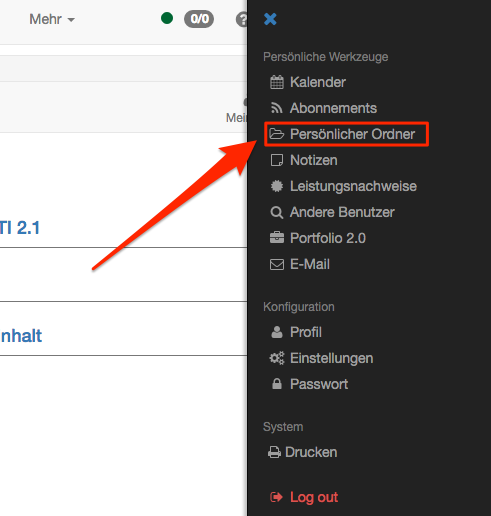

# Persönliche Ordner

## Ordner im persönlichen Menu

Unter „Persönliche Werkzeuge“ haben alle OpenOlat Nutzer Zugriff auf ihre
persönlichen Ordner. Diese unterteilen sich in „private“ und „public“ Ordner.

 _Private_

Hier kann jeder User jegliche unterstützten Dateien hochladen. Dieser Ordner
dient als Zwischenspeicher und ermöglich das Zugreifen auf Dokumente von
verschiedenen Rechnern. OpenOlat funktioniert hier wie eine Cloud.

Zudem werden im privaten Ordner Dateien abgelegt, welche über die
Datenarchivierung gespeichert wurden.

 _Public_

In diesem Ordner können Dateien abgelegt werden, welche für andere OpenOlat
Nutzer zur Verfügung stehen sollen. Der public Ordner ist in der Visitenkarte
des Users sichtbar. In den persönlichen Werkzeugen kann unter "Andere
Benutzer" nach dem Benutzer gesucht werden, der ein Dokument dort hochgeladen
hat. Dies vereinfacht den Datenaustausch zwischen OpenOlat Nutzern.

## Allgemeines zum Ordner

In Ordnern werden Dokumente abgelegt, zum Download bereitgestellt oder sie
dienen als Austauschplattform zwischen verschiedenen Benutzern. Wenn Sie über
Lese-  **und**  Schreibrechte verfügen, die Ihnen in Kursen oder Gruppen vom
entsprechenden Betreuer erst zugewiesen werden müssen, können Sie in diesen
Ordnern Dateien hochladen, erstellen, kopieren, verschieben und löschen.

Dateien die Sie in OpenOlat hochladen wollen sollten nur folgende Bestandteile
im Dateinamen enthalten:

a-z, A-Z, 0-9, sowie "-", ".", "_" oder Leerschläge

Zudem können Sie Dateien zippen und entzippen. Alle Aktionen lassen sich auf
einzelne oder mehrere ausgewählte Dateien und Ordner anwenden. Wenn Sie viele
Dateien auf einmal hochladen wollen, gibt es zwei Wege. Zum einen können Sie
Ihre Dateien auf Ihrem Rechner zippen, die ZIP-Datei hochladen und im
OpenOlat-Ordner entzippen. Zum anderen können Sie mehrere Dateien per WebDAV
übertragen und organisieren. Alle Ordner sind WebDAV-fähig, d.h. Ordner in
OpenOlat stehen Ihnen als gewöhnliches Netzlaufwerk zur Verfügung, über
welches Sie sehr einfach Dateien kopieren, verschieben und löschen können.
Weitere Infos finden Sie im Kapitel „[Einsatz von
WebDAV](../supported_tech/Using_WebDAV.de.md)“.

Damit der Zugriff via WebDAV auf OpenOlat funktioniert muss WebDAV von Ihrem
OpenOlat Administrator [aktiviert ](../../manual_admin/administration/WebDAV.de.md)werden.

## Quota

Der Speicherplatz pro Ordner ist begrenzt. Der Administrator legt den zur
Verfügung stehenden Speicherplatz fest. Die Grundeinstellung für den privaten
und öffentlichen Ordner liegt bei 100 MB. Für die Erhöhung dieser Quota ist
Ihre jeweilige OpenOlat-Supportstelle zuständig. Wenden Sie sich
gegebenenfalls an die zuständigen Ansprechpartner.

## Weitere Arten von Ordnern

In OpenOlat gibt es mehrere unterschiedliche Varianten von Ordnern. Neben den
beiden Ordnern im persönlichen Menü existieren in OpenOlat noch folgende
Ordner Varianten:

  * [Ablageordner](../course_operation/Using_Course_Tools.de.md) (in Kursen)   
  * [Kursbaustein Ordner](../course_elements/Knowledge_Transfer.de.md#Wissensvermittlung-_ordner) (in Kursen) 
  * Ordner der Themenwahl (in Kursen)
  * [Teilnehmer Ordner](../course_elements/Communication_and_Collaboration.de.md#KommunikationundKollaboration-_participantfolder) (in Kursen)
  * [Ressourcenordner ](../course_create/Course_Settings.de.md#Kurseinstellungen-_detail_ressourcen)(Lernressource) 

