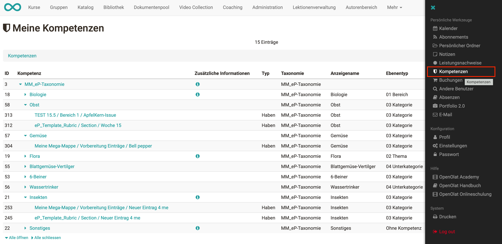

# Kompetenzen verschlagworten

Mithilfe von Taxonomien können
Kompetenzstrukturen aufgebaut werden, die zur Verschlagwortung von
ePortfolio-Einträgen genutzt werden können. Lernende können selbstständig
verschiedene Kompetenzen aus diesen vorgegebenen Taxonomiestrukturen zu ihren
Portfolio-Seiten zuordnen und dadurch ihre erreichten Kompetenzen während der
Ausbildung aufzeigen.

!!! info "Info"

    Damit die Taxonomie(n) im ePortfolio verfügbar sind, müssen diese vom OpenOlat Administrator aktiviert werden.

  

  

In einem Portfolio-Eintrag stehen den Lernenden die aktivierten Taxonomien als
Kompetenzen zur Verfügung und können über eine Vorschlagsliste ausgewählt
werden.

  

  

Eine Übersicht über alle vergebenen Kompetenzen erhalten Lernende über
"Persönliche Werkzeuge" → "Kompetenzen".

  

