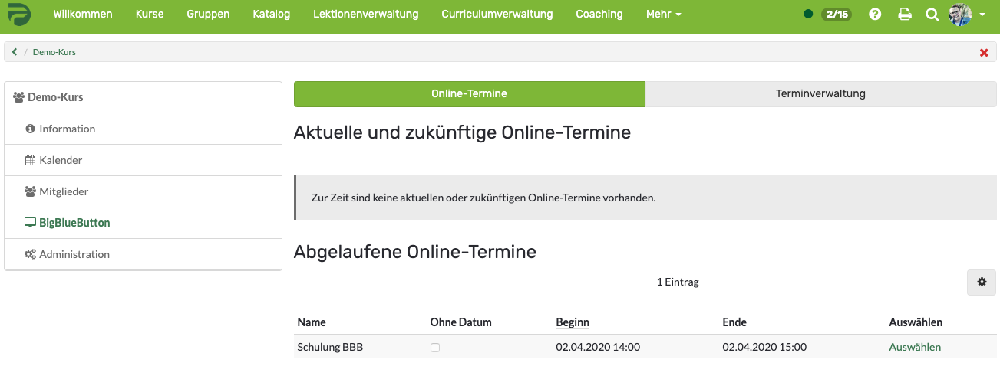
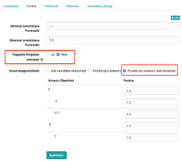
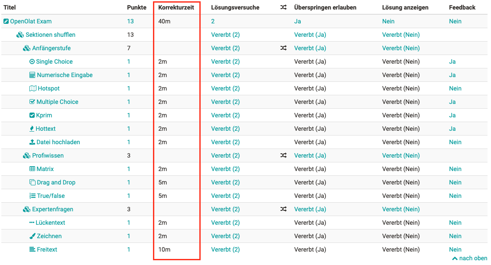
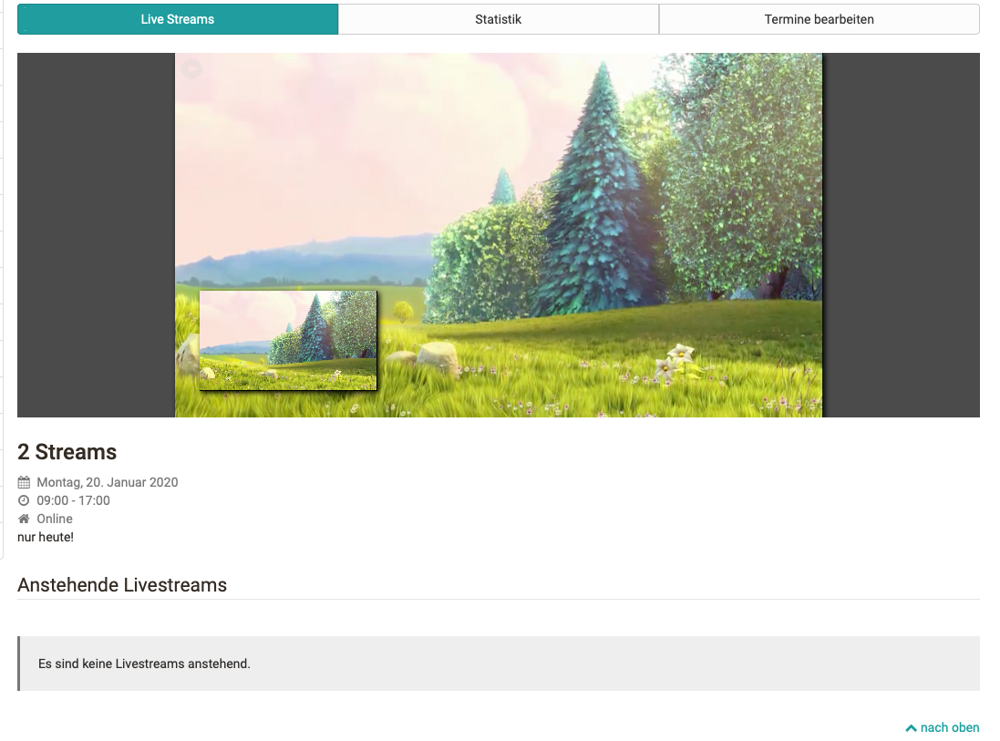

#  [Release Notes 14.2](Release+Notes+14.2.html)

**Keywords:**  BigBlueButton -- Korrekturzeit -- zufällige Sektions-
Reihenfolge -- Verbesserung der Lückentextfrage -- Multi-Livestream --
Verbesserung Aufgaben-Kursbaustein -- Datei- und Versionsverwaltungstool

  

Mit OpenOlat 14.2 geben wir unseren nächsten Major Release frei. Mit der
Integration der OpenSource Software BigBlueButton steht nun ein weiterer
virtueller Klassenraum zur Verfügung, um die (aktuellen) Herausforderungen von
Online-Lehren und Lernen zu meistern. Im Bereich eTesting wurden neue Optionen
zum Lückentext-Fragetyp hinzugefügt und Test-Sektionen können nun zufällig
angeordnet werden. Außerdem kann eine Korrekturzeit für jede Frage angegeben
werden. Auch im Kurs gibt es zahlreiche neue Funktionen. Zum Beispiel ist das
Livestream-Modul ab sofort Multistream-fähig und am Aufgaben-Baustein wurde
ein Textfeld für direktes Feedback ergänzt. Systemadministratoren werden durch
ein neues Werkzeug zur Datei- und Versionsverwaltung unterstützt.

Seit Release 14.1 wurden über 65 neue Funktionen und Verbesserungen zu
OpenOlat hinzugefügt. Hier finden Sie die wichtigsten neuen Funktionen und
Änderungen. Zusätzlich zu wurden mehr als 125 Bugs behoben. Die komplette
Liste der Änderungen in 14.1 – 14.1.7 finden Sie
[hier](https://www.openolat.com/funktionen/releasenotes_e/neue-
funktionen-14-1/#jira).

  * 1 Release Notes 14.2 
  * 2BigBlueButton Integration
  * 3QTI und eTesting
  * 4Neue Funktionen im Kurs
  * 5Datei- und Versionsverwaltung
  * 6Weiteres, kurz notiert
  * 7Support-Ende
  * 8Technisches
  * 9Release Notes - Versionen

  

* * *

  

## BigBlueButton Integration

Ein weiterer virtueller Klassenraum wurde in OpenOlat integriert:
BigBlueButton. Die Aktivierung des Tools und die Konfiguration der
Zugangsparameter erfolgt in der Administration. Verschiedene Raumvorlagen für
unterschiedliche Einsatz-Szenarien wie Meeting, Interview oder Klassenraum
werden initial definiert. Für jede Raumvorlage sind die maximale
Teilnehmeranzahl, Meetingdauer und Anzahl paralleler Räume sowie Einstellungen
wie beispielsweise Mikrofon- und Webcam-Verfügbarkeit für Teilnehmer und die
Möglichkeit für Breakout-Rooms im Online-Raum bereits konfiguriert.

#### Kursbaustein BigBlueButton

Mit dem neuen Kursbaustein kann der Betreuer Meetingräume direkt im Kurs
anlegen. Dabei kann aus den konfigurierten Raumvorlagen das zum Szenario
passende ausgewählt werden. Eine Kalender-Übersicht zeigt, wann bereits
Meetings geplant und wo noch freie Slots verfügbar sind. Werden
Veranstaltungen in BigBlueButton aufgezeichnet, werden diese im Anschluss an
das Meeting im Kursbaustein verlinkt und stehen den Kursmitgliedern zur
Verfügung.

  

#### Gruppenwerkzeug BigBlueButton

Als kollaboratives Werkzeug kann BigBlueButton auch als Gruppenwerkzeug
genutzt werden. Bei entsprechender Freigabe der Raumvorlagen können sowohl
Gruppenbetreuer als auch Gruppenmitglieder neue Meetings für gemeinsame
Online-Session anlegen. Auch im Gruppenwerkzeug stehen die Aufzeichnungen nach
Meeting-Ende für einen weiteren Zugriff bereit.

  

* * *

  

## QTI und eTesting

#### Test-Sektionen nach dem Zufallsprinzip anordnen

Die zufällige Reihenfolge der Fragen in Online-Tests ist in OpenOlat schon
lange verfügbar. Zusätzlich ist nun auch die zufällige Anordnung von Test-
Sektionen während der Testdurchführung möglich. So können z.B. ähnliche Fragen
in Sektionen gruppiert werden und für die Teilnehmer am laufenden Test in
unterschiedlicher Reihenfolge aufscheinen.

#### Erweiterung des Fragentyps Lückentext

Zwei neue Optionen ermöglichen einen noch flexibleren Einsatz des Fragentyps
[Lückentext](Test+Fragetypen.html#TestFragetypen-
details_testeditor_fragetypen_fib):

###### Erlauben Sie doppelte Antworten

Insbesondere bei mathematischen Aufgaben kann es vorkommen, dass mehrere
Lücken die gleichen Antwortalternativen enthalten. Die Eingabe der gleichen
Antwort in jeder Lücke könnte für all diese Lücken als korrekt angesehen
werden. Um dies zu vermeiden, kann in solchen Fällen die Eingabe von doppelten
Werten explizit verhindert werden. Standardmässig sind doppelte Antworten
erlaubt.

###### Punkte für Antwortvarianten

Wenn Antwortvarianten am Lückentext gespeichert werden, können von nun an für
jede dieser Varianten separate
[Punkte](Test+Fragen+konfigurieren.html#TestFragenkonfigurieren-_tab_score)
hinterlegt werden. So können z.B. "halb richtige" Antworten auch mit
Teilpunkten bewertet werden. Es ist auch möglich, für bestimmte
Lösungsvarianten Punkte abzuziehen.

  

  

#### Korrekturzeit für QTI-Fragen

Zur Korrektur von Online-Tests werden häufig externe Korrektoren eingesetzt.
Zukünftig sollte die Zuordnung von externen Korrektoren im Korrekturprozess in
OpenOlat berücksichtigt werden. In einem ersten Schritt kann in den Metadaten
eine Korrekturzeit für die Frage-Items hinterlegt werden, die für die
Abrechnung der Korrektoren herangezogen werden kann. Zusätzlich werden in der
Konfigurationsübersicht eines Tests die Korrekturzeiten der einzelnen Fragen
sowie die Gesamtkorrekturzeit für den Test angezeigt.

  

  

  

* * *

  

## Neue Funktionen im Kurs

#### Livestream

Durch die Integration des Paella-Players ist der Livestream-Kursbaustein nun
Multistream-fähig. Es können entweder zwei parallele Streams, oder nur Stream
1 oder Stream 2 angezeigt werden. Die neue Statistik zeigt für vergangene
Livestreams an, wie viele Benutzer den jeweiligen Livestream verfolgt haben.

#### Aufgaben-Kursbaustein

Der Aufgabenbaustein wurde weiter ausgebaut. Beispielsweise kann zusätzlich
zur bisherigen Maximalzahl auch eine Mindestanzahl von Dokumenten definiert
werden, die durch die Teilnehmer abgeben werden müssen. Das Betreuer-Feedback
für eingereichte Aufgaben kann nun direkt in ein Textfeld im Browser
eingegeben werden. Für Übersichts- und Auswertungszwecke steht zusätzlich ein
Tabellenexport zur Verfügung.

#### Weitere Neuerungen

  * Am Video-Kursbaustein steht eine Abonnementfunktion zur Verfügung. Die Abonnenten werden automatisch über neue Kommentare informiert.
  * Termine in Gruppenkalendern können im Kurskalender für alle Kursteilnehmer sichtbar gemacht werden, wenn sie auf "öffentlich" gesetzt sind.

  

* * *

  

## Datei- und Versionsverwaltung

Zur Unterstützung der Systemadministratoren wurde in der Verwaltung ein neues
Werkzeug für die Datei- und Versionsverwaltung geschaffen. Bestehende
Konfigurationen für Versionierung, Ordner, Quota und gelöschte Dateien wurden
zusammengefasst. Eine neue Übersicht dient der Anzeige, Suche und Filterung
großer Dateien. Diese Dateien werden in einer Liste mit zusätzlichen
Informationen über den Dateikontext (z.B. Link, Größe, Alter, Autor)
angezeigt. Über ein Mailformular kann bei Bedarf Kontakt zum Autor der Datei
aufgenommen werden.

  

* * *

  

## Weiteres, kurz notiert

  * Qualitätsmanagement: Der Zugriff auf Datensammlungen im Qualitätsmanagement über die Organisationszugehörigkeit wurde verbessert. Für E-Mails aus dem Qualitätsmanagement heraus kann eine eigene Absender-E-Mail-Adresse konfiguriert werden.
  * Die Konfiguration der Schriftgröße in den Benutzereinstellungen wurde entfernt.

  

* * *

  

## Support-Ende

  * Die Unterstützung für QTI 1.2 endet mit dem Release 15.0

  * Die Unterstützung für ePortfolio V1 endet mit dem Release 15.0

  

* * *

  

## Technisches

  * Library-Updates
  * Flexi UI Erweiterungen
  * Optimierung der Ladezeiten in verschiedenen Bereichen

  

* * *

  

## Release Notes - Versionen

  * [14.2.18](https://jira.openolat.org/secure/ReleaseNote.jspa?projectId=10000&version=16934)
  * [14.2.17](https://jira.openolat.org/secure/ReleaseNote.jspa?projectId=10000&version=16931)
  * [14.2.16](https://jira.openolat.org/secure/ReleaseNote.jspa?projectId=10000&version=16930)
  * [14.2.15](https://jira.openolat.org/secure/ReleaseNote.jspa?projectId=10000&version=16928)
  * [14.2.14](https://jira.openolat.org/secure/ReleaseNote.jspa?projectId=10000&version=16926)
  * [14.2.13](https://jira.openolat.org/secure/ReleaseNote.jspa?projectId=10000&version=16924)
  * [14.2.12](https://jira.openolat.org/secure/ReleaseNote.jspa?projectId=10000&version=16920)
  * [14.2.11](https://jira.openolat.org/secure/ReleaseNote.jspa?projectId=10000&version=16918)
  * [14.2.10](https://jira.openolat.org/secure/ReleaseNote.jspa?projectId=10000&version=16917)
  * [14.2.9](https://jira.openolat.org/secure/ReleaseNote.jspa?projectId=10000&version=16915)
  * [14.2.8](https://jira.openolat.org/secure/ReleaseNote.jspa?projectId=10000&version=16912)
  * [14.2.7](https://jira.openolat.org/secure/ReleaseNote.jspa?projectId=10000&version=16911)
  * [14.2.6](https://jira.openolat.org/secure/ReleaseNote.jspa?projectId=10000&version=16910)
  * [14.2.5](https://jira.openolat.org/secure/ReleaseNote.jspa?projectId=10000&version=16909)
  * [14.2.4](https://jira.openolat.org/secure/ReleaseNote.jspa?projectId=10000&version=16908)
  * [14.2.3](https://jira.openolat.org/secure/ReleaseNote.jspa?projectId=10000&version=16907)
  * [14.2.2](https://jira.openolat.org/secure/ReleaseNote.jspa?projectId=10000&version=16906)
  * [14.2.1](https://jira.openolat.org/secure/ReleaseNote.jspa?projectId=10000&version=16905)
  * [14.2](https://jira.openolat.org/secure/ReleaseNote.jspa?projectId=10000&version=16701)

  

