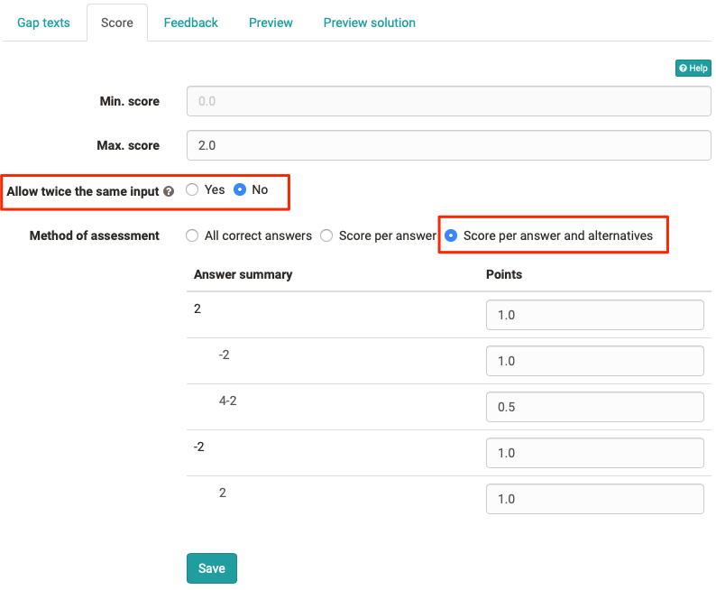
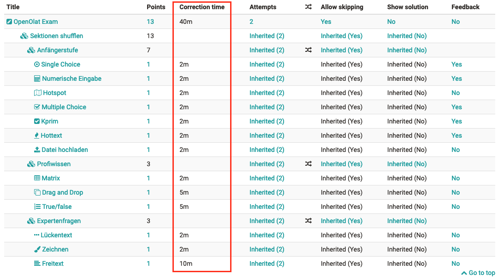
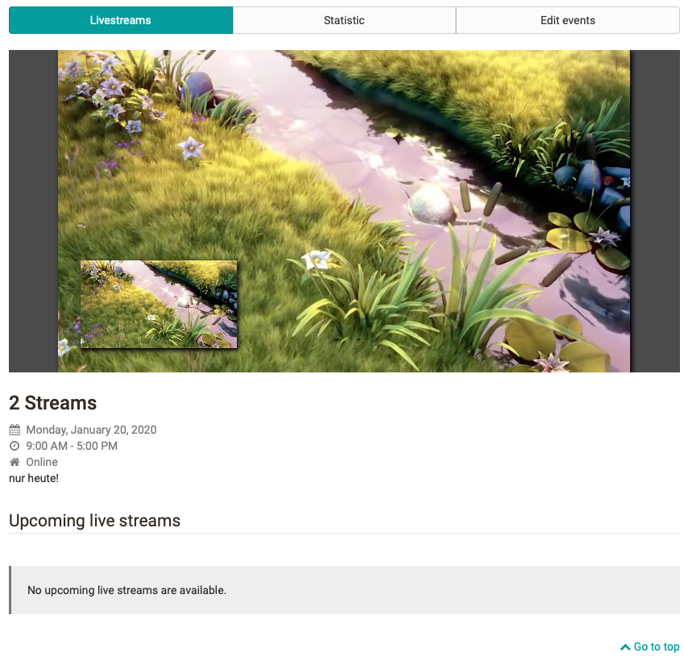

# Release notes 14.2

**Keywords:  **BigBlueButton -- Correction time -- Shuffle sections -- Gap
question enhancement -- Multi-Livestream -- Task element enhancement -- File
and version management tool

  

With OpenOlat 14.2 we release our latest major release. With the integration
of the OpenSource software BigBlueButton another virtual classroom is now
available to master the (current) challenges of online teaching and learning.
In eTesting, new options have been added to the gap question type and test
sections can now be randomly arranged. Furthermore, a correction time can be
stored for questions. There are also numerous new features in the course. For
example, the livestream module is now multistream-capable and a text field for
feedback has been added to the task element. System administrators are
supported by a new tool for file and version management.

Overall more than 65 new features and improvements have been added to OpenOlat
since release 14.1 and many processes have been improved. Here, you can find
the most important new features and changes. In addition to these
improvements, more than 125 bugs have been fixed. The complete list of changes
for 14.1 – 14.1.7 can be found
[here](https://www.openolat.com/features/releasenotes/new-
features-14-0/?lang=en#jira).

  

  

* * *

  

## BigBlueButton Integration

Another virtual classroom was integrated into OpenOlat: BigBlueButton. The
activation of the tool and the configuration of the access parameters is done
in the administration. Different room templates for different usage scenarios
like meeting, interview or classroom are defined initially. For each room
template the maximum number of participants, meeting duration and number of
parallel rooms as well as settings such as microphone and webcam availability
for participants and the possibility for breakout rooms in the online room are
already configured.

#### Course element BigBlueButton

With the new course element the coach can create meeting rooms directly in the
course. From the room templates configured you can select the one that fits
your scenario. A calendar overview shows when meetings have already been
scheduled and where slots are still available. If events are recorded in
BigBlueButton they will be linked in the course element after the meeting and
will be available to course members.

  

#### Group tool BigBlueButton

As a collaborative tool, BigBlueButton can also be used as a group tool. If
the room templates are released accordingly, both group coaches and group
members can create new meetings for a shared online session. In the group
tool, the recordings are also available for further access at the end of the
meeting.

  

* * *

  

## QTI and eTesting

#### Arrange test sections randomly

The random order of questions in online tests has been available in OpenOlat
for a long time. Additionally, the random arrangement of test sections during
test execution is now possible. Thus, for example, similar questions can be
grouped by sections and appear differently sorted for the participants in the
running test.

#### Expansion of gap text question type

Two new options allow even more flexible use of the [gap question
type](Test+question+types.html#Testquestiontypes-
details_testeditor_fragetypen_fib):

###### Allow double answers

Especially with mathematical tasks it can happen that several gaps contain the
same answer alternatives. Entering the same answer in each gap could be
considered correct for all these gaps. To avoid this, the entry of duplicate
values can be explicitly prevented in such cases. Double answers are allowed
by default.

###### Points for answer variants

If answer variants are stored with the gap text, separate
[points](Configure+test+questions.html#Configuretestquestions-_tab_score) can
be stored for each of these from now on. Thus, for example, "half correct"
answers can also be evaluated with partial points. It is also possible to
deduct points for certain solution variants.

  

  

#### Correction time for question items

External graders are often used to correct online tests. In the future, the
assignment of external graders in the correction process in OpenOlat should be
taken into account. In the first step, a correction time can be stored for
question items in the metadata, which can be used for the billing of graders.
In addition, in the configuration overview of tests the correction times of
the individual questions as well as the total correction time for the test are
displayed.

  

  

  

* * *

  

## New features in the course

#### Livestream

Due to the integration of the Paella Player the livestream course module is
now multistream capable. Either two parallel streams can be displayed, or only
stream 1 or stream 2. The new statistics show for past livestreams how many
users have followed the livestream.

#### Task module

The task module was further expanded. For example, a minimum number of
documents can now be defined for document submission by participants in
addition to the previous maximum number. The coach feedback for submitted
tasks can now also be entered directly in a text field in the browser. An
additional table export is also available for overview and evaluation
purposes.

#### Miscellaneous

  * A subscription function for the video course element is available. Subscribers are automatically informed of new comments.
  * Group calendar dates can be made visible in the course calendar for all course participants if they are set to "public.

  

* * *

  

## File and version management

To support system administrators, a new tool for file and version management
has been created in Administration. Existing configurations for versioning,
folders, quota and deleted files have been combined. A new overview serves to
display, search and filter large files. These files are displayed in a list
with additional information about the file context (e.g. link, size, age,
author). A mail form can be used to contact the author of the file if
necessary.

  

* * *

  

## Additional notes

  * Quality management: The access control to data collections in quality management by means of organizational affiliation has been improved. A separate sender e-mail address can be configured for e-mails from Quality Management.
  * The configuration of the font size in the user settings has been removed.

  

* * *

  

## End of support

  * The QTI 1.2 support ends with release 15.0
  * Support for ePortfolio V1 ends with Release 15.0

  

* * *

  

## Technical details

  * Library updates

  * Flexi UI enhancements
  * Optimization of loading times in various areas

  

* * *

  

## Release notes - versions

  * [14.2.18](https://jira.openolat.org/secure/ReleaseNote.jspa?projectId=10000&version=16934)
  * [14.2.17](https://jira.openolat.org/secure/ReleaseNote.jspa?projectId=10000&version=16931)
  * [14.2.16](https://jira.openolat.org/secure/ReleaseNote.jspa?projectId=10000&version=16930)
  * [14.2.15](https://jira.openolat.org/secure/ReleaseNote.jspa?projectId=10000&version=16928)
  * [14.2.14](https://jira.openolat.org/secure/ReleaseNote.jspa?projectId=10000&version=16926)
  * [14.2.13](https://jira.openolat.org/secure/ReleaseNote.jspa?projectId=10000&version=16924)
  * [14.2.12](https://jira.openolat.org/secure/ReleaseNote.jspa?projectId=10000&version=16920)
  * [14.2.11](https://jira.openolat.org/secure/ReleaseNote.jspa?projectId=10000&version=16918)
  * [14.2.10](https://jira.openolat.org/secure/ReleaseNote.jspa?projectId=10000&version=16917)
  * [14.2.9](https://jira.openolat.org/secure/ReleaseNote.jspa?projectId=10000&version=16915)
  * [14.2.8](https://jira.openolat.org/secure/ReleaseNote.jspa?projectId=10000&version=16912)
  * [14.2.7](https://jira.openolat.org/secure/ReleaseNote.jspa?projectId=10000&version=16911)
  * [14.2.6](https://jira.openolat.org/secure/ReleaseNote.jspa?projectId=10000&version=16910)
  * [14.2.5](https://jira.openolat.org/secure/ReleaseNote.jspa?projectId=10000&version=16909)
  * [14.2.4](https://jira.openolat.org/secure/ReleaseNote.jspa?projectId=10000&version=16908)
  * [14.2.3](https://jira.openolat.org/secure/ReleaseNote.jspa?projectId=10000&version=16907)
  * [14.2.2](https://jira.openolat.org/secure/ReleaseNote.jspa?projectId=10000&version=16906)
  * [14.2.1](https://jira.openolat.org/secure/ReleaseNote.jspa?projectId=10000&version=16905)
  * [14.2](https://jira.openolat.org/secure/ReleaseNote.jspa?projectId=10000&version=16701)

  

