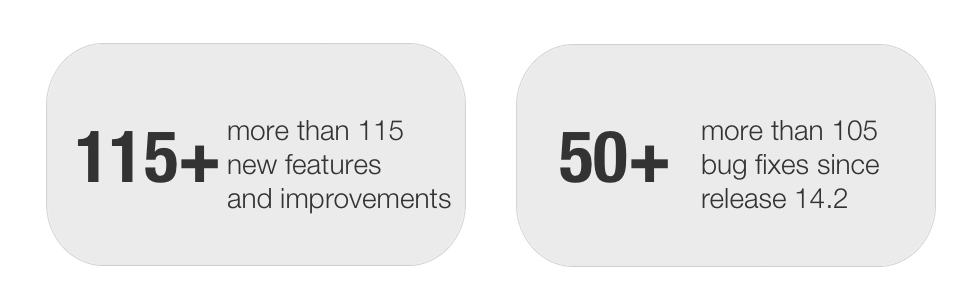
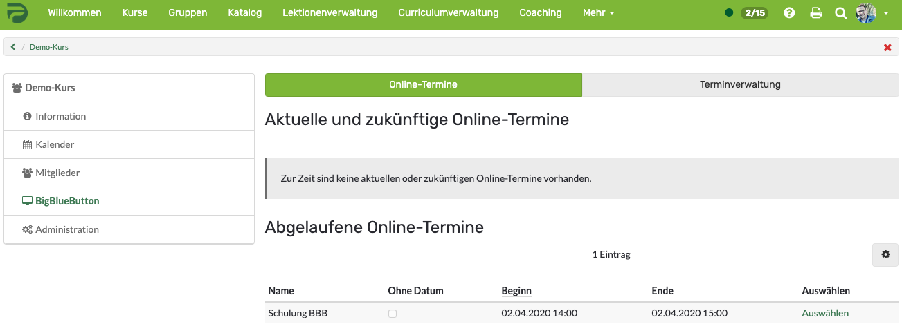
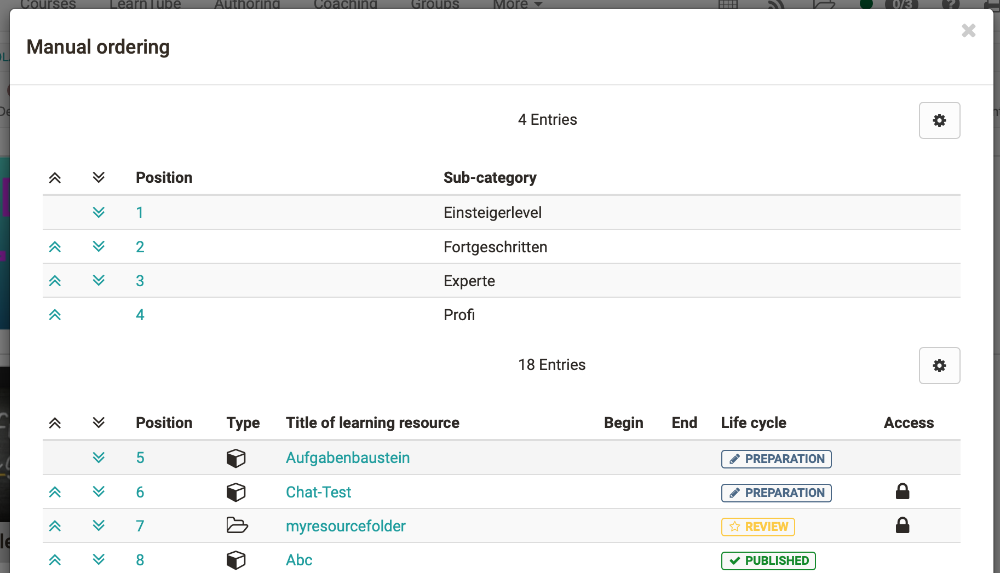

# Release notes 15.0

**Keywords:** Learning path -- Course configuration overview -- Course tools
-- In course role change -- Course-related terms of use -- BigBlueButton --
Question type Order -- Catalogue sorting -- Grading tool

  

With OpenOlat 15.0 we release our next major release. The core of the release
is the learning path - the new standard course in OpenOlat, which makes
learning scenarios easier to design and participant activities more
transparent. The extended course toolbar provides central access to the
information and communication tools. Authors can quickly switch between their
and the participant view with the integrated role change in the course. With
the integration of the OpenSource software BigBlueButton another virtual
classroom is available to master the challenges of online teaching and
learning. The new QTI 2.1 question type Order offers an additional option for
mapping test questions. For protected course content the course-related terms
of use and privacy policy can be activated. A new correction infrastructure
outside of courses allows correctors to directly access online tests for
assessment via the coaching tool. The new page editor has been integrated into
the ePortfolio and questionnaire. For a future support of several simultaneous
OpenOlat windows, the first step to the browser message "stand-by" is "bye-
bye".

Overall more than 115 new features and improvements have been added to
OpenOlat since release 14.2 and many processes have been improved. Here, you
can find the most important new features and changes. In addition to these
improvements, more than 105 bugs have been fixed. The complete list of changes
for 14.2 – 14.2.9 can be found
[here](Release+notes+14.2.html#Releasenotes14.2-Releasenotes-versions).

  * 1 Release notes 15.0 
  * 2Learning path - the new OpenOlat standard course
  * 3Course configuration overview
  * 4Extended range of course tools
  * 5In-Course role change
  * 6Course-related terms of use and data policy
  * 7BigBlueButton Integration
  * 8New QTI 2.1 question type: Order
  * 9Manual sorting of catalog entries
  * 10Grading assignments in the coaching tool
  * 11Additional notes
  * 12End of support
  * 13Technical details
  * 14Release notes - versions

  

* * *

  

## Learning path - the new OpenOlat standard course

The new course type Learning Path is more simple and the visualization helps
learners to keep track of their activities. This is a particular advantage in
self-learning or blended learning setups. But authors and coaches also benefit
from the new course type.

#### Participants

For participants, the learning path offers a fundamentally improved navigation
and orientation guidance within the course. The visualisation of the learning
path shows at a glance what they have already completed, where they are in the
course at the moment and which modules they are still allowed or have to work
on.

#### Coach

The learning path report provides coaches with improved participant tracking.
This allows to react to the individual learning progress of the participants
and to offer individual support.

#### Authors

For educational designers, the design of different learning scenarios can be
made more filigree and flexible. Course elements can be marked as obligatory
or optional and a processing time can be set for each course element. Within a
course you can configure learning sequences in linear form or without sequence
by means of structural elements. Conventional courses can be converted into
learning path courses.

  

#### Processing and assessment of the learning path course

For each course element there are different completion criteria available such
as "Confirmation by participant," "Passed," "Score," or "Execution done". If
that criterion is met, the participant will advance in his learning path.

In addition you can define when a course is considered "passed" by several
options such as "Learning progress 100%," "All course elements passed," or
"Score reached".

  

* * *

  

## Course configuration overview

In the course editor of both course types you can now call up a configuration
overview that provides an overview of all course elements and their settings.
This helps authors to check configurations. If there are any incorrect
settings, they can jump directly to the respective course element. It is also
possible to adjust settings for several course elements at once. For example,
you can change several previously mandatory course elements to the setting
optional in one step.

  

* * *

  

## Extended range of course tools

Many course components such as the participant list, notifications or even a
course forum are unique to the course and serve primarily for information and
communication. In order to distinguish them from the actual teaching and
learning contents in the course and to ensure central access, these components
have been additionally supplemented as tools for the course toolbar. The
individual tools can be activated individually in the course settings.

## In-Course role change

In order to view the course presentation from the learner's or coach's
perspective, authors can now quickly and easily switch between their roles in
the course by additionally registering as participant or coach in the member
administration. This is especially helpful in learning path courses to check
the dependencies of individual course elements in the participant view.

No runtime data is stored in the roles course owner or coach, i.e. when an
author takes a test in the course owner view no data is transferred to the
assessment tool, and when editing course elements in a learning path course no
learning progress is recorded.

## Course-related terms of use and data policy

Courses often contain protected material or sensitive data and confirmation is
required to ensure that the material is kept confidential and not used or
shared outside the course context. By activating the course-related terms of
use or privacy policy, such confirmation can be obtained per course before
accessing the actual course content.

  

* * *

  

## BigBlueButton Integration

Another virtual classroom was integrated into OpenOlat: BigBlueButton. The
activation of the tool and the configuration of the access parameters is done
in the administration. Different room templates for different usage scenarios
like meeting, interview or classroom are defined initially. For each room
template the maximum number of participants, meeting duration and number of
parallel rooms as well as settings such as microphone and webcam availability
for participants and the possibility for breakout rooms in the online room are
already configured.

#### Course element BigBlueButton

With the new course element the coach can create meeting rooms directly in the
course. From the room templates configured you can select the one that fits
your scenario. A calendar overview shows when meetings have already been
scheduled and where slots are still available. If events are recorded in
BigBlueButton they will be linked in the course element after the meeting and
will be available to course members.

  

#### Group tool BigBlueButton

As a collaborative tool, BigBlueButton can also be used as a group tool. If
the room templates are released accordingly, both group coaches and group
members can create new meetings for a shared online session. In the group
tool, the recordings are also available for further access at the end of the
meeting.

  

* * *

  

## New QTI 2.1 question type: Order

A new question type Order is available and offers the possibility to arrange
both text and image elements in a certain sequence. Learners must use drag &
drop to put the elements in the correct order.

## Manual sorting of catalog entries

Catalogue administrators have a free (manual) sorting of catalogue entries at
their disposal, for example to reflect the existing structure of the
educational institution or a specific thematic course sequence.

  

* * *

  

## Grading assignments in the coaching tool

Until now, the assessment and correction of online tests in OpenOlat was only
possible within the course via the assessment tool. You needed access to the
exam course and the assessment tool. With the new correction infrastructure
outside of courses, assigned correctors can access and correct the online
tests via the coaching tool even without course membership.

The tool offers the following functions:

  * It is possible to use multiple and external reviewers to correct an online test. The graders are stored on the test for this purpose. In addition, the deadlines for the correction and any reminder notifications to the grader can be set on the test.
  * After completion of a test by a participant, the grading assignment is automatically assigned to a stored grader. The grader is also automatically notified that a test is available for assessment. If the correction does not take place within the defined time, the grader receives a reminder e-mail.
  * In the coaching tool, graders will find a list of all their own grading assignmeints including deadlines.
  * Learning resource managers or course owners receive an overview of all graders and their correction requests including a display of how many requests are still open or overdue.
  * Via a correction link the grader is directly led to the correction workflow of the test.
  * The average correction time can be stored for the individual test questions and can be used, for example, for the accounting of the graders.

**Graders: overview own grading assignments**

 **Learning resource manager / course owner: overview of all graders**

  

* * *

  

## Additional notes

  * Manual sorting of groups in the enrolment course module possible
  * Automatic creation of test sections during test creation based on the assigned subjects of the questions
  * New certificate variables in the learning path course: "progress" for the learning progress (in percent), "maxScore" for the maximum possible score a user can achieve in the course
  * System option allows coaches to reset the password for their users
  * Integration of a new page editor in ePortfolio and questionnaire for better usability
  * Imprint has been supplemented with separate privacy policy and e-mail contact form
  * License management and improved monitoring for the document editor OnlyOffice

  

* * *

  

## End of support

Import and execution of QTI 1.2 questions, tests and questionnaires is no
longer supported as of Release 15.0. Conversion to QTI 2.1 is still possible.

Support for ePortfolio V1 ends with Release 15.0, existing entries are
deleted.

  

* * *

  

## Technical details

  * Library updates

  * Preparatory framework refactoring to support open-in-new-window behavior in browsers in the future
  * Drag and Drop framework improved in various areas
  * UI framework enhancements for better accessibility and usability
  * Implementation of CSRF protection

  

* * *

  

## Release notes - versions

  * [15.0.6](https://jira.openolat.org/secure/ReleaseNote.jspa?projectId=10000&version=16927)
  * [15.0.5](https://jira.openolat.org/secure/ReleaseNote.jspa?projectId=10000&version=16925)
  * [15.0.4](https://jira.openolat.org/secure/ReleaseNote.jspa?projectId=10000&version=16922)
  * [15.0.3](https://jira.openolat.org/secure/ReleaseNote.jspa?projectId=10000&version=16921)
  * [15.0.2](https://jira.openolat.org/secure/ReleaseNote.jspa?projectId=10000&version=16919)
  * [15.0.1](https://jira.openolat.org/secure/ReleaseNote.jspa?projectId=10000&version=16916)
  * [15.0](https://jira.openolat.org/secure/ReleaseNote.jspa?projectId=10000&version=16800)

  

