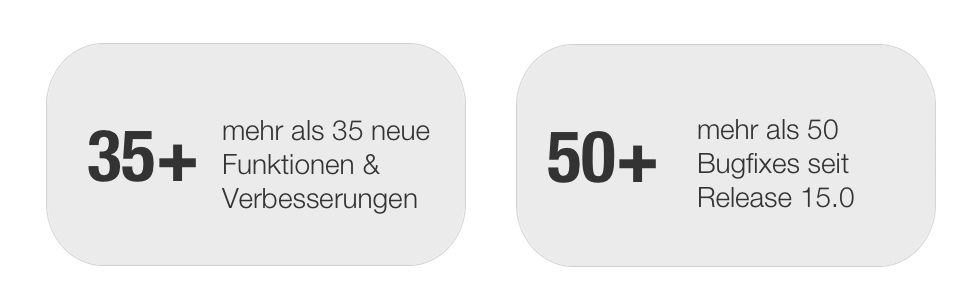
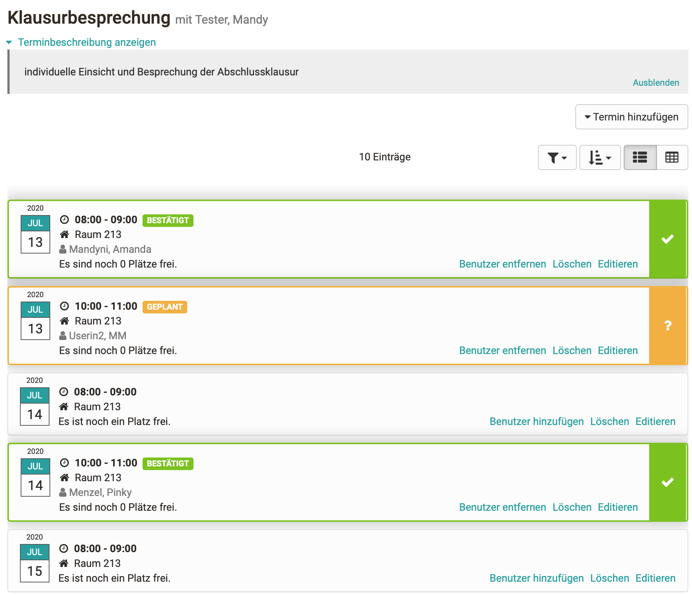
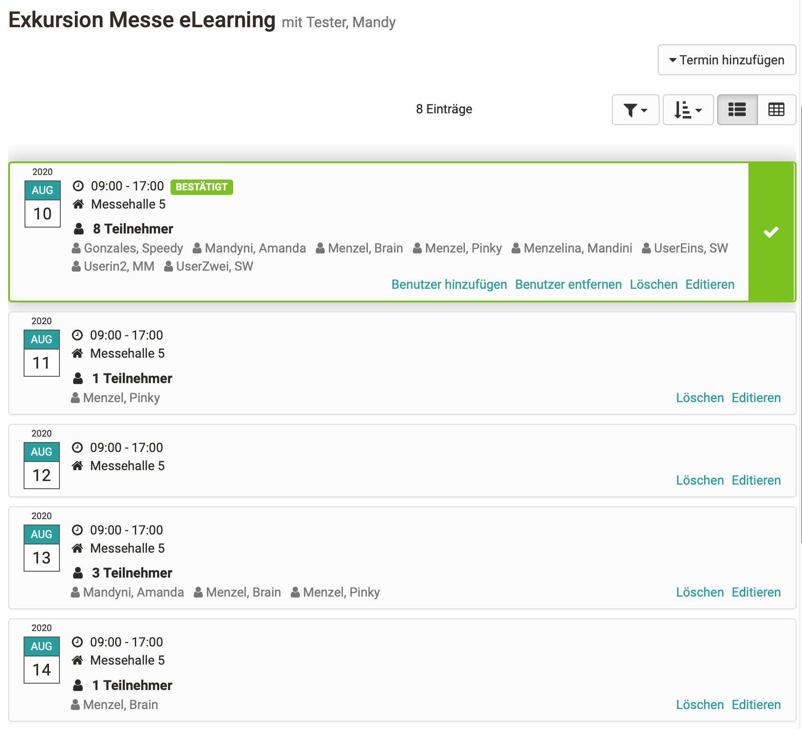
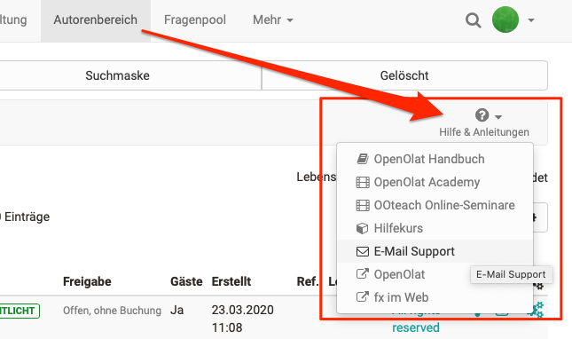

# Release Notes 15.1

**Keywords:**  Kursbaustein Terminplanung -- Neue BigBlueButton Funktionen --
Optionen zur Anzeige von Testresultaten -- Benutzer-Lebenszyklus -- Hilfe-
Modul

  

Mit OpenOlat 15.1 geben wir unseren nächsten Major Release frei. Der
Kursbaustein Terminplanung wurde komplett neu implementiert und kann sowohl
zur Einschreibung in einzelne Termine als auch zur Terminfindung für einen
gemeinsamen Anlass genutzt werden. Die BigBlueButton-Integration wurde weiter
ausgebaut und ermöglicht nun unter anderem auch den Zugang für OpenOlat-Gäste
und das Versenden eines Meeting-Links für externe Teilnehmer. Im Bereich
eTesting kann die Sichtbarkeit der Testresultate für Teilnehmer
datumsgesteuert anhand des Bestanden / Nicht bestanden-Status ausgegeben
werden. Über den automatisierten Benutzer-Lebenszyklus können Benutzer in den
Status "inaktiv" gesetzt und auch gelöscht werden. Das neue Hilfe-Modul
ermöglicht in bestimmten OpenOlat-Bereichen die Anzeige verschiedener
Hilfsangebote wie Handbuch, Hilfekurs oder E-Mail-Kontaktformular.

Seit Release 15.0 wurden über 35 neue Funktionen und Verbesserungen zu
OpenOlat hinzugefügt. Hier finden Sie die wichtigsten neuen Funktionen und
Änderungen. Zusätzlich zu wurden mehr als 50 Bugs behoben. Die komplette Liste
der Änderungen in 15.0 – 15.0.6 finden Sie
[hier](https://confluence.openolat.org/display/OO150DE/Release+Notes+15.0#ReleaseNotes15.0-ReleaseNotes-
Versionen).

  * 1 Release Notes 15.1 
  * 2Kursbaustein Terminplanung
  * 3BigBlueButton - neue Funktionen
  * 4Tests: Optionen zur Anzeige der Resultate
  * 5Automatisierter Benutzer-Lebenszyklus
  * 6Erweitertes Hilfe-Modul in OpenOlat
  * 7Weiteres, kurz notiert
  * 8Technisches
  * 9Release Notes - Versionen

  

* * *

  

## Kursbaustein Terminplanung

Der Kursbaustein unterstützt zwei Szenarien: Einschreibung und Terminfindung.
Für beides können sowohl Einzeltermine als auch wiederkehrende Serientermine
vom Betreuer definiert werden. Ebenso kann definiert werden, für welchen
Teilnehmerkreis die Termine sichtbar sind. So lässt sich innerhalb des
Bausteins die Terminplanung für verschiedene Gruppen-, Kurs- und
Curriculumteilnehmer abbilden.

#### Einschreibung

Teilnehmer wählen einen oder mehrere Termine aus einer Reihe verfügbarer
Termine aus. Sind alle freien Plätze eines Termins belegt, ist er für andere
Teilnehmer nicht mehr verfügbar.

 **Betreuer-Ansicht zur Terminbearbeitung und -bestätigung**

Die Termine sind entweder automatisch nach der Auswahl gesetzt oder müssen vom
Betreuer bestätigt werden.

  

#### Terminfindung

Teilnehmer wählen aus einer Reihe von Terminen einen oder mehrere aus, um den
bestmöglichen Termin für einen gemeinsamen Anlass zu finden.

 **Betreuer-Ansicht zur  Terminbearbeitung und -bestätigung**

Der Betreuer sieht, wie viele Teilnehmer sich zu den einzelnen Terminen
eingetragen haben und kann abschliessend den besten Termin fixieren.

  

Der Betreuer kann Teilnehmer auch manuell zu Terminen hinzufügen, löschen oder
auch umbuchen, wenn beispielsweise der zur Auswahl gestellte Termin entfällt.

  

 **Teilnehmer-Übersicht**

Die Teilnehmer sehen auf einen Blick die wichtigsten Informationen zu bereits
bestätigten Terminen, Angaben zu geplanten (noch nicht bestätigten) Terminen,
und auch zu welchem Thema sie noch keinen Termin gewählt haben.

  

Gewählte und bestätigte Termine werden automatisch im persönlichen Kalender
des Teilnehmers eingetragen.

  

* * *

  

## BigBlueButton - neue Funktionen

Der BigBlueButton-Baustein wurde um zahlreiche Funktionalitäten erweitert:

  * Link für externe nicht-registrierte Meeting-Teilnehmer generieren
  * Zugang für OpenOlat-Gäste erlauben
  * Löschen von Recordings direkt im Kursbaustein
  * Auswahl von optimierten Layouts für "Webcam-Meeting" (ohne Präsentationsfolien, Whiteboard und Chat) und "Standard"
  * Kalendereintrag enthält den Link zum Meeting
  * Erstellen von Online-Meetings durch Gruppenteilnehmer erlauben
  * Vorlaufzeit gilt nur für Betreuer

  

  

* * *

  

## Tests: Optionen zur Anzeige der Resultate

Die Anzeige von Testresultaten am Testbaustein kann nun anhand des Bestanden /
Nicht bestanden-Status des Teilnehmenden und auch in Kombination mit einem
Datum gesteuert werden. Dadurch können die Testresultate zielgerichteter und
flexibler freigeschalten werden, was z.B. gezielte Feedback-Gespräche oder
Prüfungseinsichten zu bestimmten Zeiten ermöglicht.

Folgende Optionen sind möglich: Nie, Immer, Nur wenn nicht bestanden (Datum
von bis), Unterschiedliches Freischaltungsdatum für Bestanden / Nicht
bestanden, Wenn Bestanden oder Nicht bestanden (Datum von bis)

  

* * *

  

## Automatisierter Benutzer-Lebenszyklus

Ähnlich dem automatisch gesteuerten Kurs-Lifecycle kann nun auch der
Lebenszyklus von OpenOlat-Benutzern automatisiert werden. In einem ersten
Schritt können somit die Konten von Benutzern, die über einen längeren
Zeitraum nicht aktiv waren, zunächst deaktiviert und der Benutzerstatus auf
"inaktiv" gesetzt werden. Erfolgt im festgelegten Zeitraum kein erneuter
Login, so wird das Benutzerkonto gelöscht. Je nach Konfiguration können die
Benutzer vor bzw. nach der Deaktivierung oder Löschung des Kontos eine E-Mail
mit einem entsprechenden Hinweis erhalten.

  

* * *

  

## Erweitertes Hilfe-Modul in OpenOlat

In der Administration können verschiedene Hilfsangebote in OpenOlat für die
Bereiche Loginseite, Autorenbereich und Benutzerwerkzeuge freigeschaltet
werden. Diese stehen an der definierten Stelle den Benutzern oder Autoren mit
einem Klick auf das entsprechende Angebot direkt zur Verfügung.

Neben den gängigen OpenOlat-Angeboten wie OpenOlat Handbuch, OO-Academy mit
Video-Tutorials und die OOteach-Seminare können auch ein eigener OpenOlat
Hilfekurs, ein E-Mail-Kontaktformular mit festgelegter Empfängeradresse oder
drei frei verfügbare URLs für institutionsspezifische Supportangebote,
Webseiten oder ähnliches definiert werden.

  

  

  

* * *

  

## Weiteres, kurz notiert

  * Kursbaustein edu-sharing zum Einbinden von edu-sharing-Inhalten analog zur Einzelseite
  * Unterstützung von Bildern innerhalb von Forum-Beiträgen
  * Fortschrittsbalken beim Upload von grossen Dateien
  * Neue Report-Sektion im Administrationsbereich mit Report-Möglichkeit "Alle Fragen aus gewählten Tests" und "Zertifikatsreport"
  * Kopie von Prüfungsmodus-Konfiguration erstellen
  * Verbesserung der Open in new Window Funktion
  * Neuer Status “Bestätigt” in der Checkbox-Liste
  * Verbesserte Sichtbarkeit des Video-Play-Buttons bei hellem Hintergrund
  * Qualitätsmanagement: Blacklist für Datengenerator

  

* * *

  

## Technisches

  * Performance Verbesserungen
  * Library Updates

  

* * *

  

## Release Notes - Versionen

  * [15.1.4](https://jira.openolat.org/secure/ReleaseNote.jspa?projectId=10000&version=16938)
  * [15.1.3](https://jira.openolat.org/secure/ReleaseNote.jspa?projectId=10000&version=16935)
  * [15.1.2](https://jira.openolat.org/secure/ReleaseNote.jspa?projectId=10000&version=16932)
  * [15.1.1](https://jira.openolat.org/secure/ReleaseNote.jspa?projectId=10000&version=16929)
  * [15.1](https://jira.openolat.org/secure/ReleaseNote.jspa?projectId=10000&version=16913)

  

