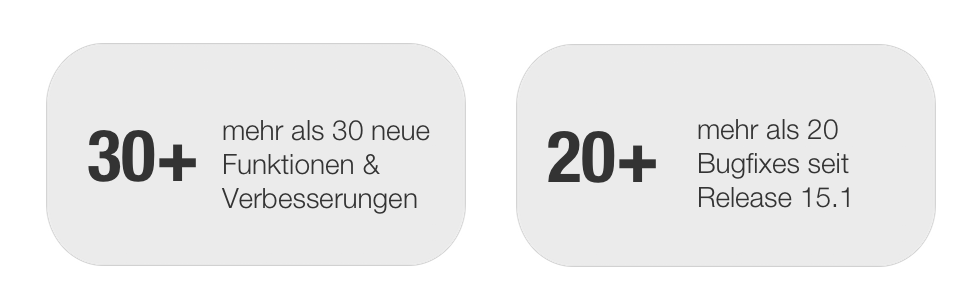

#  [Release Notes 15.2](Release+Notes+15.2.html)

**Keywords:**  BigBlueButton Recordings: Freigabe -- Opencast Recording
Handler -- OpenCast Kursbaustein

  

Mit OpenOlat 15.2 geben wir unseren nächsten Major Release frei. Dieser bringt
Erweiterungen im BigBlueButton-Baustein mit sich, so können zum Beispiel
Recordings gezielt für bestimmte Benutzergruppen freigegeben werden. Für die
Verarbeitung der BBB-Recordings wurde ein weitere Handler integriert, der die
Recordings auf einen OpencastServer ablegt. Über einen eigenen Opencast-
Kursbaustein können Aufzeichnungen vom Opencast-Server in OpenOlat eingebunden
werden. Neben kleineren Anpassungen wurde ausserdem der Mehrfenster-Modus
weiter verbessert und bei Bedarf kann der Benutzername in OpenOlat geändert
werden.

Seit Release 15.1 wurden über 30 neue Funktionen und Verbesserungen zu
OpenOlat hinzugefügt. Hier finden Sie die wichtigsten neuen Funktionen und
Änderungen. Zusätzlich zu wurden mehr als 20 Bugs behoben. Die komplette Liste
der Änderungen in 15.1 – 15.1.4 finden Sie
[hier](https://confluence.openolat.org/display/OO151DE/Release+Notes+15.1#ReleaseNotes15.1-ReleaseNotes-
Versionen).

  * 1 Release Notes 15.2 
  * 2BigBlueButton - Erweiterungen
  * 3Kursbaustein Opencast
  * 4Weiteres, kurz notiert
  * 5Wichtiger Hinweis für Administratoren
  * 6Technisches
  * 7Release Notes - Versionen

  

* * *

  

## BigBlueButton - Erweiterungen

Werden BigBlueButton-Meetings aufgezeichnet, kann nun die Veröffentlichung der
Recordings gezielt gesteuert werden. Dafür wird eine Teilnehmerliste pro
Recording geführt, die es ermöglicht, die Aufzeichnung für verschiedene
Teilnehmerkreise freizugeben:

  * Besitzer und Betreuer
  * Kurs- und Gruppen-Teilnehmer
  * Alle Teilnehmer des Meetings (ausser Gäste)
  * Gäste

  

Zudem wurde eine Infrastruktur geschaffen, die es erlaubt, BBB-Recordings auf
einem Opencast-Server abzulegen. Eine erneute Einbindung dieser Aufzeichnungen
an anderer OpenOlat-Stelle ist über den Opencast-Baustein möglich.

  

* * *

  

## Kursbaustein Opencast

Mit dem Kursbaustein Opencast können Aufzeichnungen von Meetings und
Lehrveranstaltungen, die auf einem Opencast-Server abgelegt sind, in OpenOlat-
Kurse eingebunden werden. Die Konfiguration und Anbindung des Opencast-Servers
erfolgt in der Administration. Im Kursbaustein können entweder einzelne Videos
oder ganze Serien eingebunden werden.

  

  

  

* * *

  

## Weiteres, kurz notiert

  * Benutzername ändern ist möglich, frentix-Kunden melden sich hierfür bitte beim frentix-Support
  * Kurswerkzeuge lassen sich in Einzelseiten einbinden und via Link direkt öffnen (s. Screenshot)
  * Anzahl der Benutzer, die im Prüfungsmodus auf den Prüfungsstart warten, wird für den Betreuer im Bewertungswerkzeug angezeigt
  * Benutzer können mittels Vor- und Nachnamen zu Kursen, Gruppen usw. hinzugefügt werden
  * Kurswerkzeug "Kalender" kann auch in einem neuen Fenster geöffnet werden

  

* * *

  

## Wichtiger Hinweis für Administratoren

Der JDBC-Treiber für MySQL wurde aktualisiert. Bitte unbedingt überprüfen, ob
die Zeitzone in der Datenbank eingestellt ist, da der Treiber keine
undefinierte Zeitzone akzeptiert.

Beispiel:

    
    
    SET GLOBAL Zeit_Zone = 'Europa/Zürich';  
    

Folgender Parameter ist in den olat.local.properties zu prüfen:  
 _db.url.options.mysql=?characterEncoding=UTF-8
&connectionCollation=utf8_unicode_ci_

Das "Connection Collation Attribute" ist für einige wenige Abfragen in
OpenOlat zwingend. Bitte dieses Attribut mit der gleichen Collation setzen,
die auch in der Datenbank verwendet wird.

  

* * *

  

## Technisches

  * Framework-Feature zum Erstellen neuer Fenster von einem Controller aus
  * LDAP-Benutzernamen vom OpenOlat-Benutzernamen lösen und LDAP-Benutzer über Excel-Import ermöglichen

  * Library Updates

  * Aktualisieren von Bibliotheken von Drittanbietern

  

* * *

  

## Release Notes - Versionen

  * [15.2.13](https://jira.openolat.org/secure/ReleaseNote.jspa?projectId=10000&version=17012)
  * [15.2.12](https://jira.openolat.org/secure/ReleaseNote.jspa?projectId=10000&version=17011)
  * [15.2.11](https://jira.openolat.org/secure/ReleaseNote.jspa?projectId=10000&version=17009)
  * [15.2.10](https://jira.openolat.org/secure/ReleaseNote.jspa?projectId=10000&version=17006)
  * [15.2.9](https://jira.openolat.org/secure/ReleaseNote.jspa?projectId=10000&version=17003)
  * [15.2.8](https://jira.openolat.org/secure/ReleaseNote.jspa?projectId=10000&version=17001)
  * [15.2.7](https://jira.openolat.org/secure/ReleaseNote.jspa?projectId=10000&version=16946)
  * [15.2.6](https://jira.openolat.org/secure/ReleaseNote.jspa?projectId=10000&version=16944)
  * [15.2.5](https://jira.openolat.org/secure/ReleaseNote.jspa?projectId=10000&version=16943)
  * [15.2.4](https://jira.openolat.org/secure/ReleaseNote.jspa?projectId=10000&version=16942)
  * [15.2.3](https://jira.openolat.org/secure/ReleaseNote.jspa?projectId=10000&version=16940)
  * [15.2.2](https://jira.openolat.org/secure/ReleaseNote.jspa?projectId=10000&version=16939)
  * [15.2.1](https://jira.openolat.org/secure/ReleaseNote.jspa?projectId=10000&version=16937)
  * [15.2](https://jira.openolat.org/secure/ReleaseNote.jspa?projectId=10000&version=16923)

  

