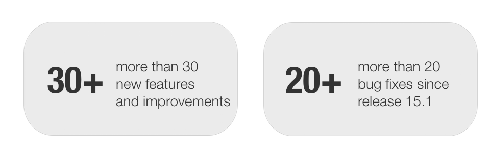

# Release notes 15.2

With OpenOlat 15.2 we release our next major release. It includes extensions
in the BigBlueButton module, for example, recordings can be released for
specific user groups. For the processing of the BBB-recordings an additional
handler was integrated, which stores the recordings on an Opencast server.
Recordings from the Opencast server can be integrated into OpenOlat via a
separate Opencast course module. Besides minor adjustments the multi-window
mode was further improved and if necessary the username can be changed in
OpenOlat.

Overall more than 30 new features and improvements have been added to OpenOlat
since release 15.1 and many processes have been improved. Here, you can find
the most important new features and changes. In addition to these
improvements, more than 20 bugs have been fixed. The complete list of changes
for 15.1 – 15.1.4 can be found
[here](https://confluence.openolat.org/display/OO151EN/Release+notes+15.1#Releasenotes15.1-Releasenotes-
versions).

* * *

## BigBlueButton - Extensions

{ class="shadow lightbox aside-right-lg" }

If BigBlueButton meetings are recorded, the publication of the recordings can
now be controlled specifically. For this purpose, a list of participants is
kept for each recording, which makes it possible to release the recording for
different groups of participants:

  * Owner and coach
  * Course and group participants
  * All participants of the meeting (except guests)
  * Guests

In addition, an infrastructure was created that allows BBB recordings to be
stored on an Opencast server. A re-integration of these recordings at other
OpenOlat locations is possible via the Opencast module.

* * *

## Course element Opencast

{ class="shadow lightbox aside-right-lg" }

With the course element Opencast, recordings of meetings and courses stored on
an Opencast server can be integrated into OpenOlat courses. The configuration
and connection of the Opencast server is done in the administration. In the
course element either single videos or whole series can be integrated.

* * *

## Additional notes

{ class="shadow lightbox aside-right-lg" }

  * Change of username is possible, frentix customers please contact the frentix support
  * Course tools can be integrated into Single pages and opened directly via link (see screenshot)
  * Number of users waiting for the exam to start in exam mode is displayed for the coach in the assessment tool
  * Users can be added to courses, groups, etc. using first and last names
  * Course tool "Calendar" can also be opened in a new window

* * *

## Technical details

  * Framework feature to create new windows from within a controller
  * Detach LDAP username from OpenOlat username and enable LDAP users via Excel import
  * Library Updates
  * Updating third-party libraries

!!! attention "Important note for administrators"
	The JDBC driver for MySQL has been updated. Please check if the timezone is
	set in the database, because the driver does not accept undefined timezones.
	
	Example:
	
		SET GLOBAL Time_Zone = 'Europe/Zurich';
	
	The following parameter should be checked in the olat.local.properties:  
	
		_db.url.options.mysql=?characterEncoding=UTF-8&connectionCollation=utf8_unicode_ci_
	
	The connection collation attribute is mandatory for a few queries in OpenOlat.
	Please set this attribute with the same collation that is used in the
	database.

* * *

  

## Release notes - versions

  * [15.2.13](https://jira.openolat.org/secure/ReleaseNote.jspa?projectId=10000&version=17012)
  * [15.2.12](https://jira.openolat.org/secure/ReleaseNote.jspa?projectId=10000&version=17011)
  * [15.2.11](https://jira.openolat.org/secure/ReleaseNote.jspa?projectId=10000&version=17009)
  * [15.2.10](https://jira.openolat.org/secure/ReleaseNote.jspa?projectId=10000&version=17006)
  * [15.2.9](https://jira.openolat.org/secure/ReleaseNote.jspa?projectId=10000&version=17003)
  * [15.2.8](https://jira.openolat.org/secure/ReleaseNote.jspa?projectId=10000&version=17001)
  * [15.2.7](https://jira.openolat.org/secure/ReleaseNote.jspa?projectId=10000&version=16946)
  * [15.2.6](https://jira.openolat.org/secure/ReleaseNote.jspa?projectId=10000&version=16944)
  * [15.2.5](https://jira.openolat.org/secure/ReleaseNote.jspa?projectId=10000&version=16943)
  * [15.2.4](https://jira.openolat.org/secure/ReleaseNote.jspa?projectId=10000&version=16942)
  * [15.2.3](https://jira.openolat.org/secure/ReleaseNote.jspa?projectId=10000&version=16940)
  * [15.2.2](https://jira.openolat.org/secure/ReleaseNote.jspa?projectId=10000&version=16939)
  * [15.2.1](https://jira.openolat.org/secure/ReleaseNote.jspa?projectId=10000&version=16937)
  * [15.2](https://jira.openolat.org/secure/ReleaseNote.jspa?projectId=10000&version=16923)

  

