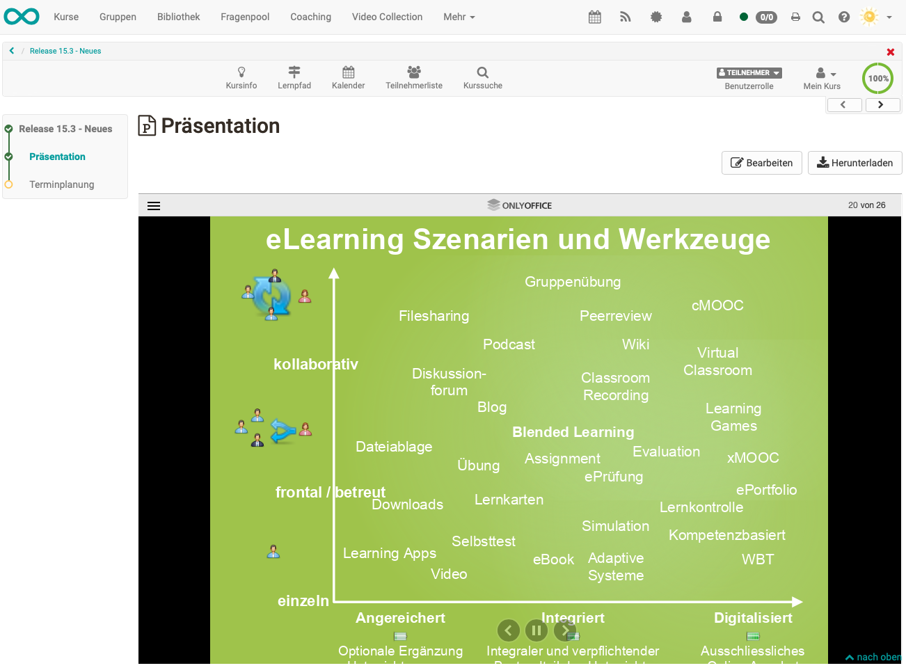
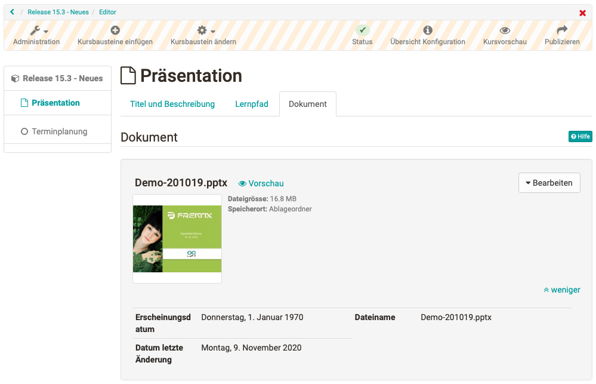
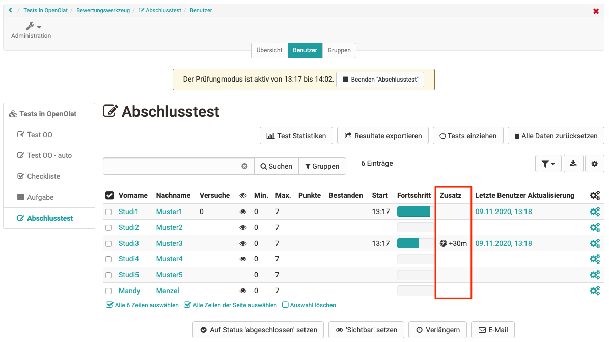
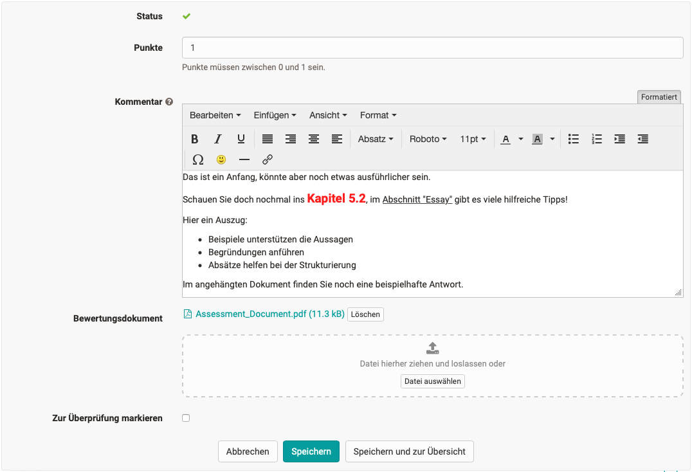
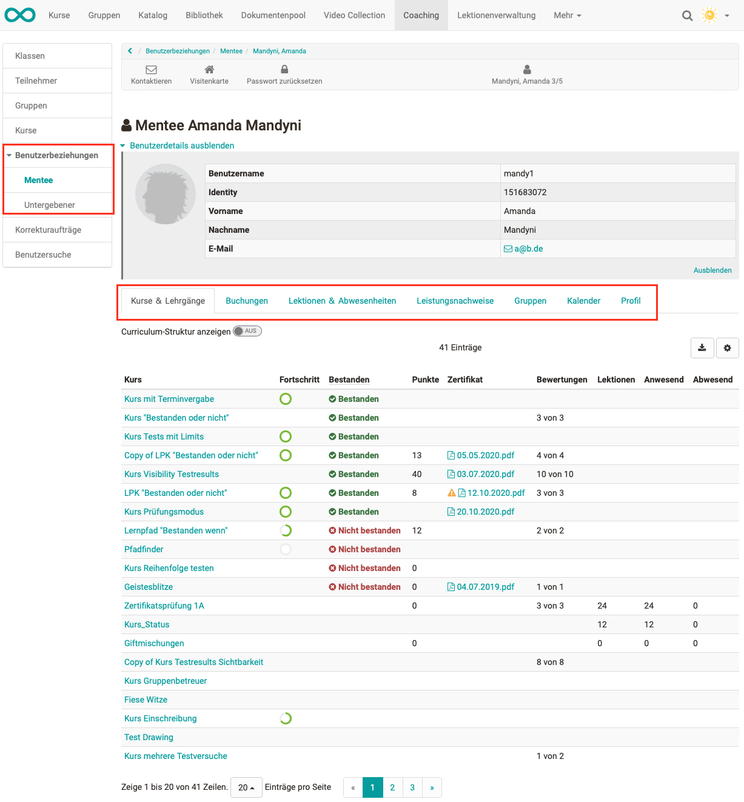
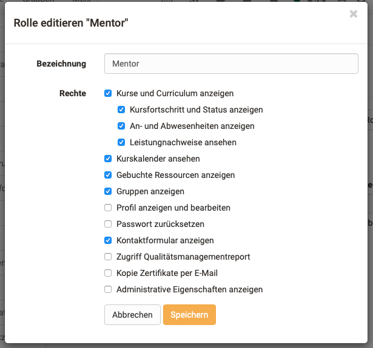

#  [Release Notes 15.3](Release+Notes+15.3.html)

**Keywords:**  Kontaktverfolgung -- Kursbaustein Dokument \-- OnlyOffice
Erweiterungen \-- Microsoft Azure Directory Login -- Office for the web --
Nachteilsausgleich -- Benutzerbeziehungen im Coachingtool -- Verbessertes
Drag&Drop -- Zahlreiche Optimierungen im Bereich E-Assessment,
Benutzerverwaltung und Autorenbereich

  

Mit OpenOlat 15.3 geben wir unseren nächsten Major Release frei. Aufgrund der
aktuellen Pandemie-Lage wurde ein Modul "Kontaktverfolgung" (Contact Tracing)
in OpenOlat integriert, um anhand von Aufenthaltsnachweisen bei Bedarf
mögliche ansteckende Kontakte zu erkennen. Die Implementierung des Dokumenten-
Kursbausteins ermöglicht die Einbindung verschiedenartiger Dokumente aus
unterschiedlichen Quellen in einen Kurs. Zusätzliche Erweiterungen der
OnlyOffice-Integration unterstützen die Dokumenten-Vorschau (Thumbnails) in
OpenOlat sowie die Ansicht und Bearbeitung von Dokumenten auf mobilen Geräten.
Neben der Realisierung des Microsoft Azure Directory Logins wurde die
Integration von Office for the web aktualisiert. Im Bereich E-Testing gab es
neben der Ergänzung des Nachteilsausgleichs für Teilnehmende mit körperlicher
oder geistiger Behinderung ebenfalls einige Neuerungen und Optimierungen.
Benutzer-zu-Benutzerbeziehungen können ab sofort über das Coachingtool
aufgerufen und der Zugriff auf Inhalte feingranular für jede Beziehung
gesteuert werden. Insbesondere die Drag&Drop-Funktion für den Datei-Upload
wurde OpenOlat-weit optimiert. Zahlreiche Verbesserungen finden sich auch im
Bereich Benutzerverwaltung, im Autorenbereich und in weiteren OpenOlat-
Modulen.

Seit Release 15.2 wurden über 75 neue Funktionen und Verbesserungen zu
OpenOlat hinzugefügt. Hier finden Sie die wichtigsten neuen Funktionen und
Änderungen. Zusätzlich zu wurden mehr als 95 Bugs behoben. Die komplette Liste
der Änderungen in 15.2 – 15.2.8 finden Sie
[hier](https://confluence.openolat.org/display/OO152DE/Release+Notes+15.2#ReleaseNotes15.2-ReleaseNotes-
Versionen).

  * 1 Release Notes 15.3 
  * 2Contact Tracing Modul
  * 3Kursbaustein "Dokument"
  * 4OnlyOffice Einsatz
  * 5Office for the web Editor
  * 6Authentifizierung via Microsoft Azure Directory
  * 7Nachteilsausgleich bei Online-Prüfungen
  * 8Optimierungen im Bereich E-Assessment und E-Testing
  * 9Benutzerbeziehungen im Coachingtool
  * 10Ergänzungen im Autorenbereich
  * 11Erweiterungen in der Benutzerverwaltung
  * 12Weiteres, kurz notiert
  * 13Technisches
  * 14Release Notes - Versionen

  

* * *

  

## Contact Tracing Modul

Mit der Kontaktverfolgung in OpenOlat lassen sich weitgehend anonyme
Aufenthaltsnachweise generieren, um im Bedarfsfall zur Pandemie-Eindämmung
mögliche ansteckende Kontakte zu rekonstruieren.

Das Modul funktioniert mit den folgenden fünf Schritten:

  * Erfassung der Standorte (manuell oder via Import)
  * Generierung der QR-Codes für die Platzierung an den Standorten
  * Registration von bestehenden OpenOlat-Benutzern oder Gästen an den Standorten
  * Versand einer E-Mail Bestätigung nach der Registration
  * Export der Daten bei einer behördlichen Anfrage

Die Daten werden datenschutzkonform in OpenOlat abgelegt und nach einer
definierten Frist automatisch gelöscht.

Die praktische Anwendung wird im nachfolgenden Video der OOacademy anschaulich
erklärt. Für Beratung und Support zur Einführung melden Sie sich unter
[support@openolat.com](mailto:support@openolat.com).

  

* * *

  

## Kursbaustein "Dokument"

Mit dem Dokument-Kursbaustein werden Office-Dokumente, PDF und auch Bilder
direkt in den Kurs eingebunden.

Verwendet werden können:

  * Dokumente aus dem Autorenbereich (existierende Lernressource)

  * Dokumente aus dem Ablageordner des Kurses

  * Neue Dokumente, die z.B. per Drag & Drop hochgeladen werden können

Dabei können neue Dokumente auch in Lernressourcen umgewandelt werden, um sie
beispielsweise in andere Kursen erneut einzubinden. Bereits vorhandene
Dokument-Lernressourcen lassen sich wiederum als Vorlage nutzen, indem von
ihnen lokale Kopien angefertigt werden.

  

Textverarbeitungsdokumente und PDF werden über den integrierten Dokument
Viewer angezeigt. Eine Bearbeitung der Textdokumente ist bei Aktivierung
entsprechender Lizenzen möglich, der Editor öffnet sich dann in einem
separaten Fenster.

  

* * *

  

## OnlyOffice Einsatz

Die Integration von OnlyOffice unterstützt ab sofort die Generierung der
Vorschaubilder (Thumbnails) von Dokumenten.

Die Bearbeitung von Dokumenten kann explizit aktiviert und entsprechende
Bearbeitungslizenzen können hinterlegt werden. Bei Deaktivierung steht
OnlyOffice als Viewer / Reader zur Verfügung.

Für eine verbesserte Ansicht und Bearbeitung von OnlyOffice-Dokumenten auf
mobilen Geräten wurde zusätzlich der mobile OnlyOffice Viewer / Editor in
OpenOlat eingebunden.

Dokumente werden zur Ansicht und Bearbeitung in einem separaten Fenster
geöffnet.

  

* * *

  

## Office for the web Editor

## Authentifizierung via Microsoft Azure Directory

Die Integration der Microsoft Office 365-Editoren für Office Dokumente
befindet sich derzeit im Rollout in der frentix Cloud (geplant bis Ende 2020).

Hinweis

Aus lizenztechnischen Gründen stehen die Microsoft Office 365-Editoren
ausschliesslich in der frentix Hosting Cloud zur Verfügung!

Neu werden Microsoft 365 Logins in OpenOlat über Azure Active Directory
unterstützt. Für Beratung und Einführung melden Sie sich unter
[support@openolat.com](mailto:support@openolat.com).

  

* * *

  

## Nachteilsausgleich bei Online-Prüfungen

Für Prüfungsteilnehmende mit körperlicher oder geistiger Behinderung kann vor
der Prüfung ein Nachteilsausgleich definiert werden. Teilnehmende erhalten
dabei mehr Zeit für den Test.

Der Nachteilsausgleich wird über die Benutzerverwaltung oder direkt im Kurs im
Bewertungswerkzeug am jeweiligen Teilnehmenden eingestellt.

Im Bewertungswerkzeug und auch in den Testresultaten ist die Verlängerung
transparent ausgewiesen. Die Testzeit und der Prüfungsmodus (bei manueller
Steuerung) wird automatisch um den Nachteilsausgleich verlängert.

  

* * *

  

## Optimierungen im Bereich E-Assessment und E-Testing

  * Optimierte Berechnung der Maximalpunktzahl bei X aus Y Fragen in Tests
  * Anzeige der individuellen Teststartzeit der Teilnehmenden im Bewertungswerkzeug
  * Ergänzung des Korrekturworkflows im Bewertungswerkzeug (s. Screenshot)
    * Formatierung der Kommentare
    * Datei-Upload pro User pro Frage
  * Fragenpool:
    * Anzeige der Anzahl selektierter Fragen im Fragenpool-Dialog
    * Weitere Spalten in der Fragenübersicht-Tabelle
  * Optionale Anonymisierung im KorretorenTool für externe Korrektoren

  

* * *

  

## Benutzerbeziehungen im Coachingtool

Mit der Benutzer-zu-Benutzerbeziehung in OpenOlat können kursübergreifende
Betreuungsfunktionen für beispielsweise Mentoren, Lernbegleiter und
Vorgesetzte abgebildet werden.

Über das Coachingtool ist nun für Betreuende der einfache und übersichtliche
Zugang zu den betreuten Benutzern realisiert.

Für jede Benutzer-zu-Benutzerbeziehung können spezifische Rechte definiert und
somit der Zugriff auf explizit freigegebene Inhalte der Betreuten erteilt
werden, wie z.B. Kursliste, Kalender, Absenzenübersicht, Leistungsnachweise
und Zertifikate.

  

Analog wurde auch die Rolle "Linienvorgesetzer" im Coachingtool abgebildet.
Hier kann ebenfalls auf definierte Inhalte von Benutzern der eigenen
Organisationseinheit zugegriffen werden.

  

* * *

  

## Ergänzungen im Autorenbereich

  * Automatischer Lebenszyklus von Kursen um "Endgültig löschen" erweitert (s. Screenshot)

  * Filter zur Einschränkung von Lernressourcen nach Taxonomie

  

  

* * *

  

## Erweiterungen in der Benutzerverwaltung

  * Übergangszeitraum (Grace-Periode) von 30 Tagen für reaktivierte Benutzer
  * Separate Behandlung von nicht löschbaren Benutzern im Benutzer-Lebenszyklus
  * Import von Benutzern ohne Authentifizierungen

  

* * *

  

## Weiteres, kurz notiert

  * BigBlueButton Neuerungen:

    * Integration in Kursbaustein "Terminplanung" (s. Screenshot)

    * Zustimmung der Teilnehmenden, wenn Aufzeichnungsfunktion für das Meeting aktiviert

  * Optimiertes Drag&Drop für Datei-Upload

  * Optimierung der Dokument-Vorschau für Word, Excel, Powerpoint und weitere Formate

  * Verbesserungen im Bereich Dropdown-Menüs und HTML-Editor-Anzeige

  * Weitere Rollen beim Rollenwechsel im Kurs

  * Kurserinnerungen: "Lernfortschritt" als weitere Bedingung (nur für Lernpfadkurs) und alphabetische Sortierung der angelegten Reminder

  * Gruppenverwaltung: neue Filter "Letzter Zugriff" und "Externe Verwaltung"

  * Curriculum: verbesserte Mitgliederverwaltung

  * Deaktivierung der Begründungen für Lektionen-Abschluss im Absenzenmanagement

  * LinkedIn Feld im Benutzerprofil

  

* * *

  

## Technisches

  * Technische Unterstützung von Java 11 und Servlet 4.0 (Tomcat 9.0 notwendig)
  * Codepflege nach Security Audit mit Sonarqube
  * Refactoring der Konfigurationsübersicht olat.local.properties im Adminbereich
  * Library Updates

  

* * *

  

## Release Notes - Versionen

  * [15.3.18](https://jira.openolat.org/secure/ReleaseNote.jspa?projectId=10000&version=17107)
  * [15.3.17](https://jira.openolat.org/secure/ReleaseNote.jspa?projectId=10000&version=17105)
  * [15.3.16](https://jira.openolat.org/secure/ReleaseNote.jspa?projectId=10000&version=17103)
  * [15.3.15](https://jira.openolat.org/secure/ReleaseNote.jspa?projectId=10000&version=17100)
  * [15.3.14](https://jira.openolat.org/secure/ReleaseNote.jspa?projectId=10000&version=17026)
  * [15.3.13](https://jira.openolat.org/secure/ReleaseNote.jspa?projectId=10000&version=17025)
  * [15.3.12](https://jira.openolat.org/secure/ReleaseNote.jspa?projectId=10000&version=17022)
  * [15.3.11](https://jira.openolat.org/secure/ReleaseNote.jspa?projectId=10000&version=17020)
  * [15.3.10](https://jira.openolat.org/secure/ReleaseNote.jspa?projectId=10000&version=17019)
  * [15.3.9](https://jira.openolat.org/secure/ReleaseNote.jspa?projectId=10000&version=17016)
  * [15.3.8](https://jira.openolat.org/secure/ReleaseNote.jspa?projectId=10000&version=17013)
  * [15.3.7](https://jira.openolat.org/secure/ReleaseNote.jspa?projectId=10000&version=17010)
  * [15.3.6](https://jira.openolat.org/secure/ReleaseNote.jspa?projectId=10000&version=17008)
  * [15.3.5](https://jira.openolat.org/secure/ReleaseNote.jspa?projectId=10000&version=17007)
  * [15.3.4](https://jira.openolat.org/secure/ReleaseNote.jspa?projectId=10000&version=17005)
  * [15.3.3](https://jira.openolat.org/secure/ReleaseNote.jspa?projectId=10000&version=17002)
  * [15.3.2](https://jira.openolat.org/secure/ReleaseNote.jspa?projectId=10000&version=17000)
  * [15.3.1](https://jira.openolat.org/secure/ReleaseNote.jspa?projectId=10000&version=16945)
  * [15.3](https://jira.openolat.org/secure/ReleaseNote.jspa?projectId=10000&version=16933)

  
