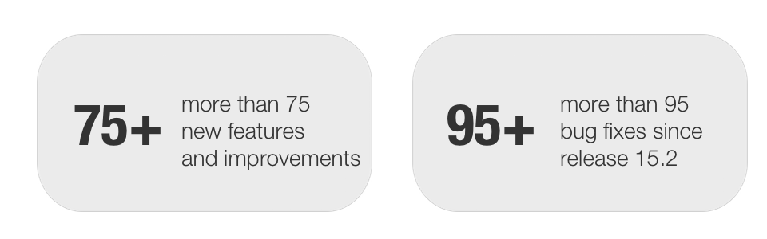
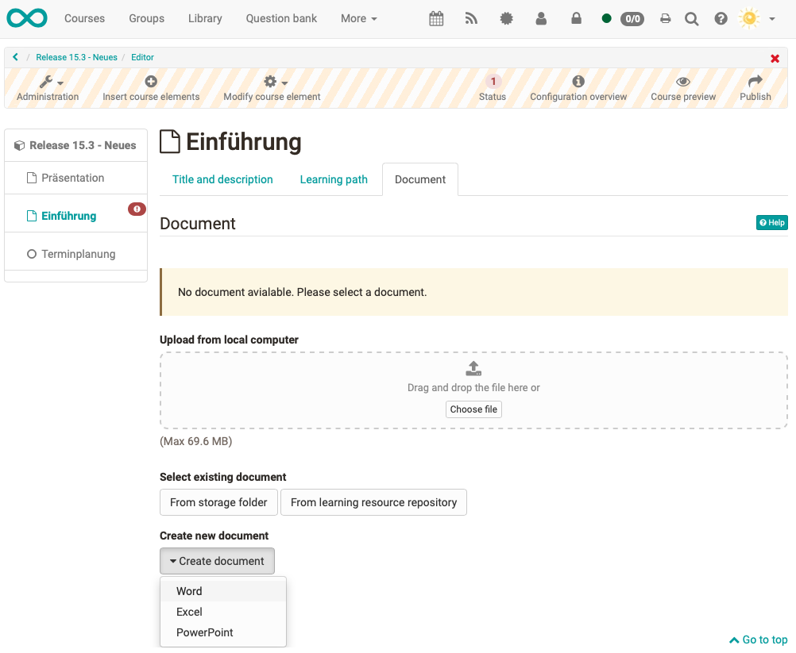
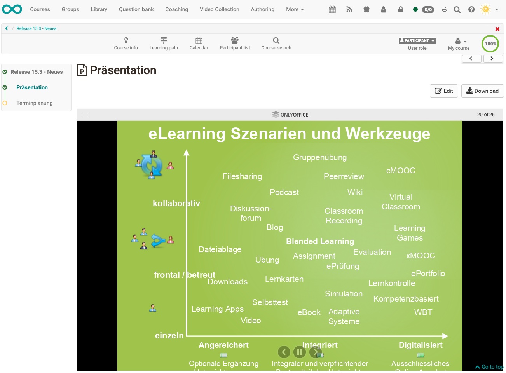
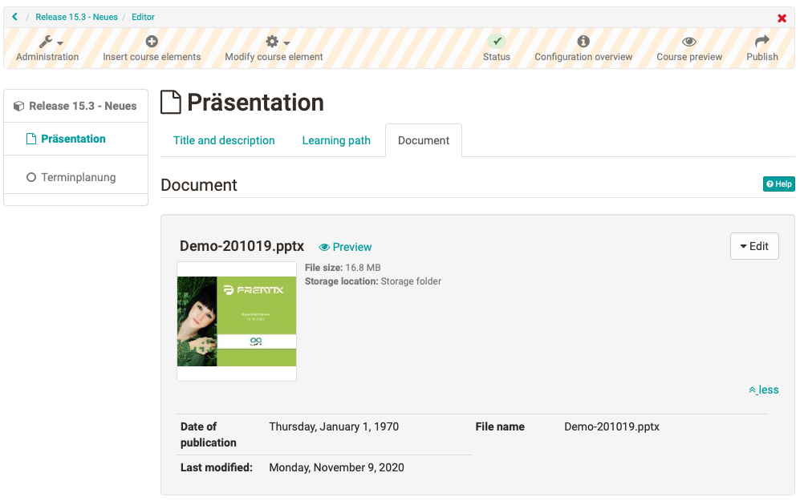
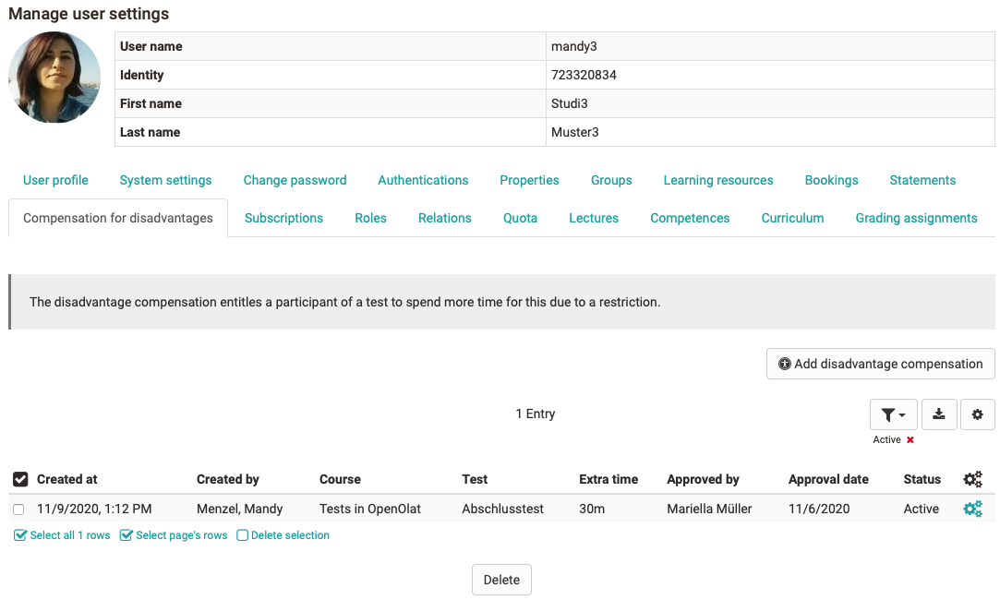
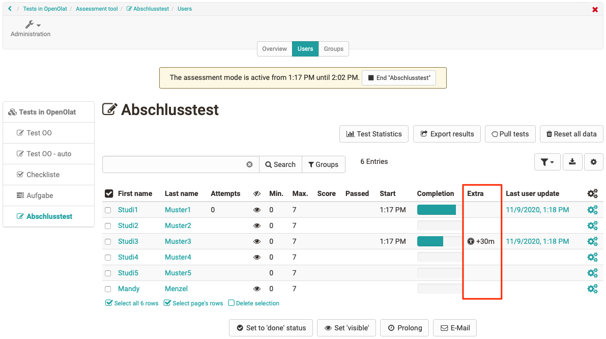
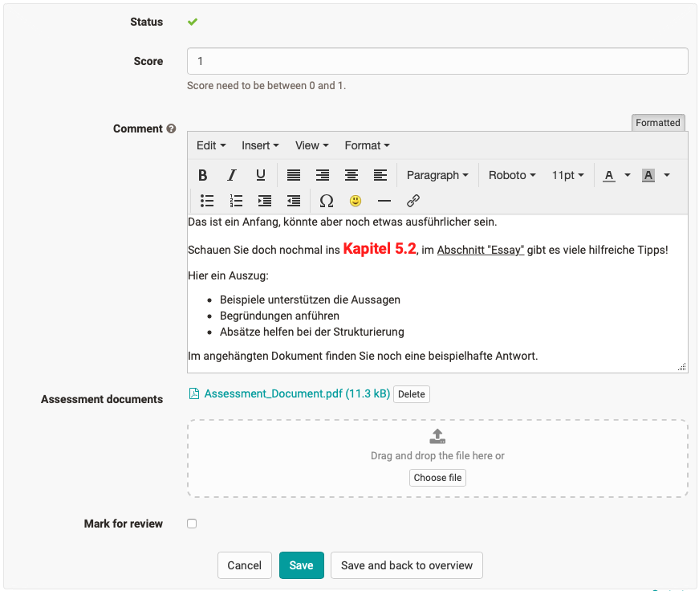
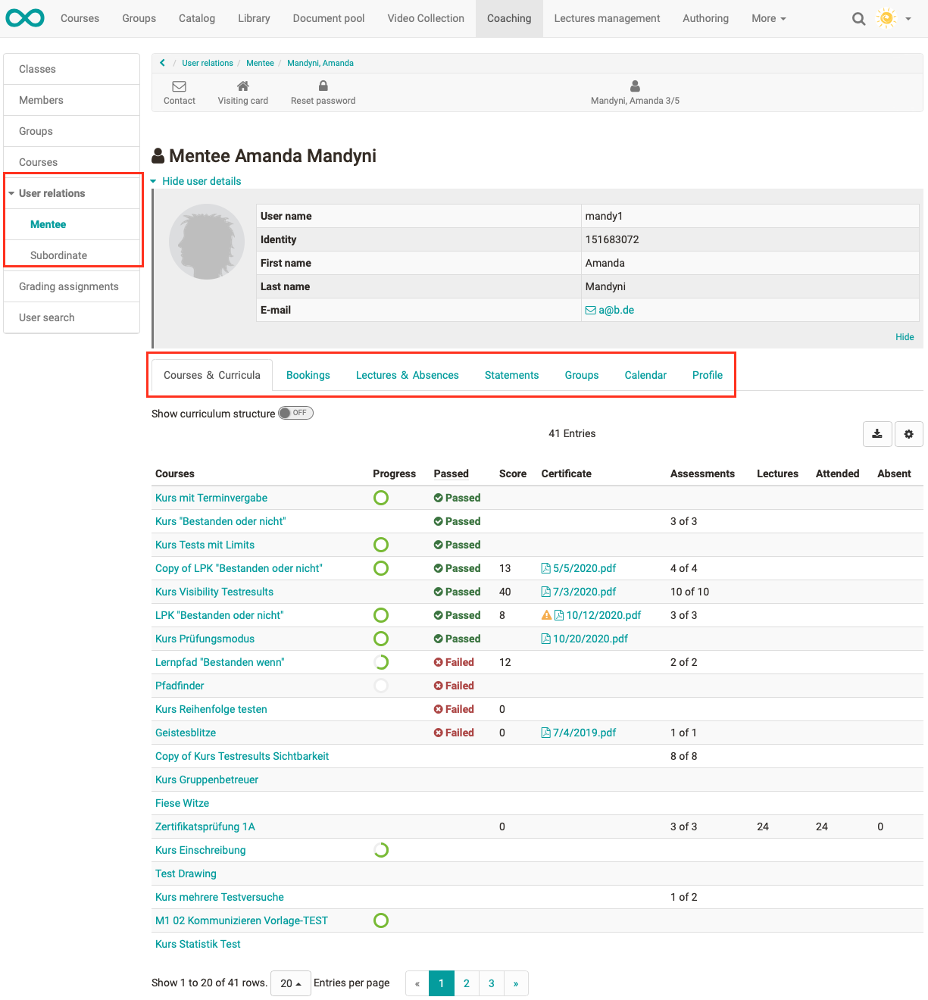
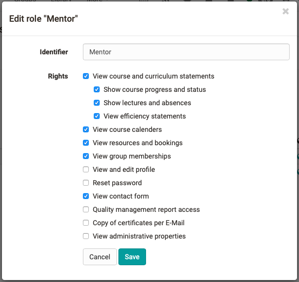

# Release notes 15.3

With OpenOlat 15.3 we release our next major release. Due to the current
pandemic situation, a module "Contact Tracing" was integrated into OpenOlat in
order to identify possible contagious contacts. The implementation of the
document course module allows the integration of different types of documents
from different sources into a course. Additional extensions of the OnlyOffice
integration support the document preview (thumbnails) in OpenOlat as well as
the viewing and editing of documents on mobile devices. In addition to the
implementation of the Microsoft Azure Directory Login, the integration of
Office for the web has been updated. In the area of e-testing, there were also
some innovations and optimizations in addition to the integration of
disadvantage compensation for participants with physical or mental
disabilities. User-to-user relationships can now be called up via the coaching
tool and access to content can be controlled precisely for each relationship.
In particular, the drag & drop function for file uploads has been optimized
throughout OpenOlat. Numerous improvements can also be found in the user
administration area, in the authoring area and in other OpenOlat modules.

Overall more than 75 new features and improvements have been added to OpenOlat
since release 15.2 and many processes have been improved. Here, you can find
the most important new features and changes. In addition to these
improvements, more than 95 bugs have been fixed. The complete list of changes
for 15.2 – 15.2.8 can be found
[here](https://confluence.openolat.org/display/OO152DE/Release+Notes+15.2#ReleaseNotes15.2-ReleaseNotes-Versionen).
 
* * *

## Contact Tracing Module

With the contact tracing in OpenOlat, anonymous proofs of location can be
generated in order to reconstruct possible contagious contacts if necessary to
stem the pandemic.

The module works with the following five steps:

  * Registration of the locations (manually or via import)
  * Generation of the QR codes for the placement at the locations
  * Registration of existing OpenOlat users or guests at the locations
  * Sending an e-mail confirmation after registration
  * Export of data in case of an official request

The data is stored in OpenOlat in accordance with data protection regulations
and automatically deleted after a defined period of time.

The practical application is clearly explained in the following video of the
OOacademy (german only). For advice and support on the introduction, please
contact us at [support@openolat.com](mailto:support@openolat.com).

(German only)

<iframe width="400" height="300" src="https://www.youtube.com/embed/4fO16U6iaiU" title="YouTube video player" frameborder="0" allow="accelerometer; autoplay; clipboard-write; encrypted-media; gyroscope; picture-in-picture" allowfullscreen></iframe>
  

* * *

  

## Course element "Document"

{ class="shadow lightbox aside-right-lg" }

With the document course element, Office documents, PDF and also images are
directly integrated into the course.

The following can be used

  * Documents from the author area (existing learning resource)
  * Documents from the course storage folder
  * New documents that can be uploaded e.g. via drag & drop

New documents can also be converted into learning resources, for example, to
re-integrate them into other courses. Existing document learning resources can
also be used as templates by making local copies of them.

<clear />
{ class="shadow lightbox aside-right-lg" }

Office documents and PDF are displayed via the integrated Document viewer.
Text documents can be edited if the corresponding licenses are activated. The
editor then opens in a separate window.

  

* * *

  

## OnlyOffice Application

{ class="shadow lightbox aside-right-lg" }

The integration of OnlyOffice now supports the generation of thumbnails of
documents.

The editing of documents can be explicitly activated and corresponding editing
licenses can be stored. When deactivated, OnlyOffice is available as viewer /
reader.

For an improved viewing and editing of OnlyOffice documents on mobile devices,
the mobile OnlyOffice Viewer / Editor has been integrated into OpenOlat.

Documents are opened in a separate window for viewing and editing.

  

* * *

  

{ class="shadow lightbox aside-right-lg" }

## Office for the web Editor

The integration of Microsoft Office 365 editors for Office documents is
currently being rolled out in the frentix cloud (planned by the end of 2020).

!!! warning "Note"

	For licensing reasons, the Microsoft Office 365 editors are only available in
	the frentix hosting cloud!

## Authentication via Microsoft Azure Directory

Microsoft 365 logins are now supported in OpenOlat via Azure Active Directory.
For consulting and introduction please contact
[support@openolat.com](mailto:support@openolat.com).

  

* * *

  

## Disadvantage compensation for online exams

For examinee with physical or mental handicap, a compensation for
disadvantages can be defined before the exam. Participants are given more time
for the test.

The compensation of disadvantages can be set via the user administration or
directly in the course in the assessment tool on the respective participant.

{ class="shadow lightbox" }

In the assessment tool and also in the test results the extension is
transparently shown. The test time and the test mode (in case of manual
control) are automatically extended by the disadvantage compensation.

{ class="shadow lightbox" }

  

* * *

  

## Optimization in the area of e-assessment and e-testing

{ class="shadow lightbox aside-right-lg" }

  * Optimized calculation of the maximum score for X from Y questions in tests
  * Display of the participants' individual test start time in the assessment tool
  * Enhancements to the correction workflow in the assessment tool (see screenshot)
    * Formatting of comments
    * File upload per user per question
  * Question pool:
    * Display of the number of selected questions in the question pool dialog
    * Additional columns in the question overview table
  * Optional anonymization in the correction tool for external graders

* * *

## User relations in coaching tool

With the user-to-user relationship in OpenOlat, cross-course support functions
for mentors, learning guides and supervisors can be represented.

The coaching tool now provides easy and clear access to the coached users.

{ class="shadow lightbox" }

{ class="shadow lightbox aside-right-lg" }

For each user-to-user relationship, specific rights can be defined and thus
access to explicitly released content of the coaches can be granted, e.g.
course list, calendar, absence overview, evidences of achievement and
certificates.

The role of "line manager" was also mapped in the coaching tool in the same
way. Here, defined contents can also be accessed by users of the own
organizational unit.

  

* * *

  

## Additions in authoring area

{ class="shadow lightbox aside-right-lg" }

  * Automatic lifecycle of courses extended by "Definitely delete" (see screenshot)
  * Filter learning resources by taxonomy

* * *

## Enhancements in the user administration

  * 30-day grace period for reactivated users
  * Separate handling of non-deletable users in the user life cycle
  * Import of users without authentication

* * *

## Additional notes

{ class="shadow lightbox aside-right-lg" }

  * BigBlueButton innovations:
    * Integration in course element "Appointment scheduling" (see screenshot)
    * Participants' consent, if recording function for the meeting is activated
  * Optimized Drag&Drop for file upload
  * Optimization of the document preview for Word, Excel, PowerPoint and other formats
  * Improvements in drop-down menus and HTML editor display
  * Additional roles in the course when changing roles
  * Course reminders: "Learning progress" as a further condition (only for learning path course) and alphabetical sorting of the created reminders
  * Group management: new filters "Last access" and "External management"
  * Curriculum: improved membership management
  * Deactivation of reasons for lecture completion in absence management
  * LinkedIn field in user profile

  

* * *

  

## Technical details

  * Technical support of Java 11 and Servlet 4.0 (Tomcat 9.0 required)
  * Code maintenance after security audit with Sonarqube
  * Refactoring the configuration overview olat.local.properties in the admin area
  * Library Updates

  

* * *

  

## Release notes - versions

  * [15.3.18](https://jira.openolat.org/secure/ReleaseNote.jspa?projectId=10000&version=17107)
  * [15.3.17](https://jira.openolat.org/secure/ReleaseNote.jspa?projectId=10000&version=17105)
  * [15.3.16](https://jira.openolat.org/secure/ReleaseNote.jspa?projectId=10000&version=17103)
  * [15.3.15](https://jira.openolat.org/secure/ReleaseNote.jspa?projectId=10000&version=17100)
  * [15.3.14](https://jira.openolat.org/secure/ReleaseNote.jspa?projectId=10000&version=17026)
  * [15.3.13](https://jira.openolat.org/secure/ReleaseNote.jspa?projectId=10000&version=17025)
  * [15.3.12](https://jira.openolat.org/secure/ReleaseNote.jspa?projectId=10000&version=17022)
  * [15.3.11](https://jira.openolat.org/secure/ReleaseNote.jspa?projectId=10000&version=17020)
  * [15.3.10](https://jira.openolat.org/secure/ReleaseNote.jspa?projectId=10000&version=17019)
  * [15.3.9](https://jira.openolat.org/secure/ReleaseNote.jspa?projectId=10000&version=17016)
  * [15.3.8](https://jira.openolat.org/secure/ReleaseNote.jspa?projectId=10000&version=17013)
  * [15.3.7](https://jira.openolat.org/secure/ReleaseNote.jspa?projectId=10000&version=17010)
  * [15.3.6](https://jira.openolat.org/secure/ReleaseNote.jspa?projectId=10000&version=17008)
  * [15.3.5](https://jira.openolat.org/secure/ReleaseNote.jspa?projectId=10000&version=17007)
  * [15.3.4](https://jira.openolat.org/secure/ReleaseNote.jspa?projectId=10000&version=17005)
  * [15.3.3](https://jira.openolat.org/secure/ReleaseNote.jspa?projectId=10000&version=17002)
  * [15.3.2](https://jira.openolat.org/secure/ReleaseNote.jspa?projectId=10000&version=17000)
  * [15.3.1](https://jira.openolat.org/secure/ReleaseNote.jspa?projectId=10000&version=16945)
  * [15.3](https://jira.openolat.org/secure/ReleaseNote.jspa?projectId=10000&version=16933)

  