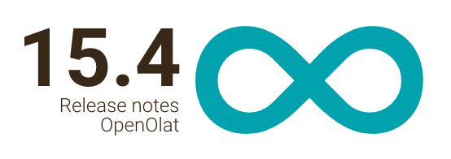
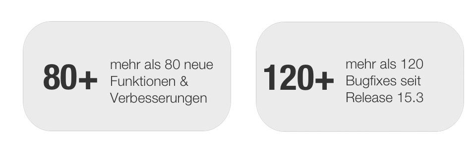
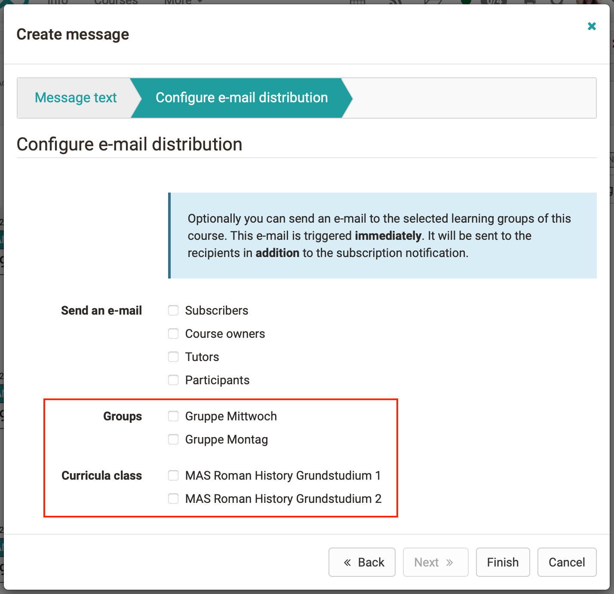

# Release Notes 15.4
  

Mit der Integration von **Microsoft Teams Online Meetings** wird die Palette
der virtuellen Räume in OpenOlat erneut ergänzt, diese Funktion steht in
mehreren Bereichen zur Verfügung. Der **Wizard für Prüfungskurse** erleichtert
das Anlegen von Online-Prüfungen und führt Schritt für Schritt durch die Kurs-
Konfiguration und den Aufbau. Auch die **Usability** kommt nicht zu kurz:
Besonders der **Terminplanungsbaustein** ist optisch klarer und verständlicher
geworden. Aber auch OpenOlat-weit sorgen verschiedene Optimierungen wie
nummerierte Zeilen bei Import-Formularen und die Hervorhebung der
Spaltensortierung in Tabellen für frischen Wind. Die **BigBlueButton**
-Integration bietet ebenfalls Neuerungen wie den Upload von
Präsentationsdateien bereits vor dem Online-Meeting, einen Zugangscode für
externe Teilnehmende sowie Ergänzungen im Verwaltungsbereich. Im Kurs- und
Autorenbereich wurde vor allem das **Mitgliedermanagement** optimiert, die
**Kurstypisierung** hilft, den Überblick zu behalten. Die Unterstützung von
**Keycloak oAuth Login** , die Einführung von **temporären Benutzerkonten**
und weitere zahlreiche Anpassungen runden diesen Release ab.

Seit Release 15.3 wurden über 80 neue Funktionen und Verbesserungen zu
OpenOlat hinzugefügt. Hier finden Sie die wichtigsten neuen Funktionen und
Änderungen. Zusätzlich zu wurden mehr als 120 Bugs behoben. Die komplette
Liste der Änderungen in 15.3 – 15.3.9 finden Sie
[hier](Release_notes_15.3.de.md#ReleaseNotes15.3-ReleaseNotes-Versionen).

* * *

:material-calendar-month-outline: **Releasedatum: 22.01.2021 • Letzte Veröffentlichung: 07.05.2021**

* * *

  

## Microsoft Teams Online Meeting Integration

{ class="shadow lightbox aside-right-lg" }

Ab sofort steht auch die Nutzung von Microsoft Teams Online Meetings in
OpenOlat zur Verfügung. Die Integration wurde - analog zu BigBlueButton - in
folgenden Bereichen umgesetzt:

  * Microsoft Teams Kursbaustein
  * Microsoft Teams Kurswerkzeug im Kursmenü
  * Microsoft Teams Gruppenwerkzeug
  * Microsoft Teams Meetingfunktion im Kursbaustein Terminplanung

!!! info
	Microsoft Teams ist ein Produkt von Microsoft. Um Microsoft Teams Online-
	Meetings in OpenOlat nutzen zu können, muss in Azure eine App angelegt und mit
	den entsprechenden Rechten ausgestattet werden. Dafür ist mindestens eine
	Microsoft Lizenz notwendig, z.B. „Microsoft 365 Business Standard“.

Die Funktion Microsoft Teams Online Meeting ist optional in OpenOlat verfügbar
und muss in der Administration aktiviert und konfiguriert werden.

Die Azure App Konfigurationsdaten werden in der OpenOlat Administration
hinterlegt. Optional kann ein Default-Benutzer angegeben werden, damit
Meetings auch gestartet werden können, falls der Benutzer nicht in dem
konfigurierten Azure-Mandanten gefunden wird. Kunden von frentix kontaktieren
dafür bitte [contact@frentix.com](mailto:contact@frentix.com.).

Für Beratung und Support zur Einführung melden Sie sich unter
[support@openolat.com](mailto:support@openolat.com).

  

* * *

  

## Kurstypisierung

Mit der Kurstypisierung werden Kurse zum einen "Technisch" und zum anderen
"Didaktisch" differenziert. Dies sorgt im Autorenbereich für einen besseren
Überblick über die Kurs-Lernressourcen, eine gezieltere Suche / Filterung nach
bestimmten Kurstypen und gibt Informationen zur Einordnung des Kurses an.

Der " _Technische Kurstyp_ " bezieht sich auf die Bauart sowie die verfügbaren
Strukturen und Einstellungen des Kurses. Hier kann zurzeit zwischen
Lernpfadkurs oder Herkömmlicher Kurs unterschieden werden.

" _Didaktische Kurstypen_ " berufen sich auf das Kurs-Setting bzw. den
eigentlichen Inhalt des Kurses. Es kann sich beispielsweise um einen
Prüfungskurs, Selbstlernkurs oder Seminarkurs handeln. Aktuell steht der
Prüfungskurs als Standardtyp zur Verfügung, die Liste der didaktischen
Kurstypen kann in der Administration erweitert werden. Didaktische Kurstypen
können mit einer eigenen CSS Klasse ausgestattet werden, um diese z.B. im Kurs
und in Kurslisten hervorzuheben.

Technischer und didaktischer Kurstyp sind unabhängig voneinander. So kann ein
Selbstlernkurs sowohl als herkömmlicher als auch in Form eines Lernpfadkurses
aufgebaut werden.

{ class="shadow lightbox" }

  

* * *

  

## Wizard für Prüfungskurs

{ class="shadow lightbox aside-right-lg" }

Das Anlegen eines einfachen Kurses mit Hilfe eines Wizards ist in OpenOlat
schon länger möglich. Mit dem neuen Prüfungskurs-Wizard kann nun auch gezielt
und schnell ein Prüfungskurs erstellt werden.

Schritt für Schritt können Zeitraum, Korrektur und Einsicht der Resultate für
die Prüfung konfiguriert werden. Auch das Anlegen einer Nachprüfung und die
Bereitstellung eines Zertifikats sind möglich. Abschliessend können Betreuer
und Prüfungsteilnehmer zugeordnet werden.

Sofern ein Prüfungszeitraum eingetragen wird, ist im erstellten Prüfungskurs
automatisch ein Prüfungsmodus für diese Zeit konfiguriert.

  

* * *

  

## Optimierung Kursbaustein "Terminplanung"

{ class="shadow lightbox aside-right-lg" }

Neben umfänglichen Usability-Verbesserungen ist es nun möglich, einen Anlass
(vormals "Thema") inkl. aller oder ausgewählter Termine zu duplizieren, was
bei ähnlichen Terminblöcken sehr hilfreich ist (s. Screenshots).

Das Anlegen mehrerer individueller Termine mit Angabe der Dauer ermöglicht es,
auch variable Zeiten zu berücksichtigen. Bei Bedarf kann die Anzeige der
eingeschriebenen Teilnehmer pro Termin verborgen werden. Zusätzlich zu
BigBlueButton-Räumen können analog auch Microsoft Teams Online Meeting Räume
für Termine aktiviert werden.

  
**Ansicht Teilnehmende**

**Ansicht Kursbetreuer**

  

  

* * *

  

## BigBlueButton - Erweiterungen

{ class="shadow lightbox aside-right-lg" }

Um die Autoren und Betreuer bei der Administration und Vorbereitung des
virtuellen Klassenraumes zu unterstützen, wurde die Integration von
BigBlueButton um einige Funktionen erweitert.

Betreuer können bereits vor Meeting-Beginn ihre _Präsentationsfolien_ am
BigBlueButton-Termin hochladen. Sobald das Meeting startet, werden die
Präsentationsdateien automatisch in den BigBlueButton-Raum geladen.

Ist ein Meeting auch für externe Benutzer via URL zugänglich, kann bei Bedarf
zusätzlich ein _Passwort  _generiert werden. Dies muss vor dem Betreten des
BigBlueButton-Raumes von den externen Teilnehmenden eingegeben werden, sonst
wird kein Zutritt erteilt.

Zur _besseren Verwaltung_ aller BBB-Termine in der Administration wurden eine
Suchfunktion und ein Filter ergänzt sowie die Möglichkeit, mehrere Termine
gesammelt zu löschen.

Wird zum Speichern von BigBlueButton- _Aufzeichnungen_ ein externer Opencast-
Server verwendet, so können diese Aufzeichnungen als " _Dauerhaft_ " markiert
werden. Beim Löschen des Meetings oder des Kurses werden diese Aufzeichnungen
dann nur auf OpenOlat gelöscht - nicht auf dem Opencast-Server.

  

* * *

  

## Neuerungen im Kurs

BigBlueButton und Microsoft Teams Online Meetings stehen nun auch als
_Kurswerkzeuge_ zur Verfügung. Durch den zentralen Zugriff über das Kursmenü
bleibt der eigentliche Lernablauf (insbesondere im sequenzierten Lernpfad)
ungestört.

{ class="shadow lightbox" }

Ein neuer Wizard für das Mitgliedermanagement im Kurs verbessert den Workflow,
um Rollen zum Kurs hinzuzufügen und aus dem Kurs zu entfernen.

{ class="shadow lightbox" }

Variablen, die in E-Mail-Formularen und Kurs-Mails zur Verfügung stehen,
wurden OpenOlat-weit harmonisiert, der Mail-Footer ergänzt.

Beim optionalen Mail-Versand von Mitteilungen können als _Empfänger_ auch
_Gruppen_ bzw. _Curricula_ ausgewählt werden.

{ class="shadow lightbox" }
  

* * *

  

## Ergänzungen im Autorenbereich

  * Sammelaktion, um Besitzer zu Lernressourcen hinzuzufügen oder zu entfernen
  * Anzeige der "Externen Referenz" im Auswahldialog von Lernressourcen

  

* * *

  

## Erweiterungen in der Benutzerverwaltung

{ class="shadow lightbox aside-right-lg" }

  * Einführung eines Ablaufdatums für zeitlich begrenzte Benutzerkonten (s. Screenshot)
    * Tool zum Erstellen von temporären Benutzern
    * Option für Selbstregistration aktivierbar
  * Login über [Keycloak](https://www.keycloak.org/) oAuth Provider wird unterstützt
  * Massensuche: Suche nach mehreren Benutzern anhand von Username, E-Mail oder Institutionsnummer möglich
  * Bestätigung der Änderung der E-Mail-Adresse eines Benutzers kann durch Administrator übersteuert werden

  

* * *

  

## Usability

  * Anzeige der Zeilennummern bei Importformularen (z.B. Benutzerimport)
  * Anzeige der Spaltensortierung in OpenOlat-Tabellen verbessert
  * Touch Support für Kalender (z.B. mobile Geräte)
  * Wizard mit Sub-Steps für komplexe Szenarien (z.B. Prüfungskurs)

  

* * *

  

## Weiteres, kurz notiert

  * Dokument-Baustein: Höhe der Dokumenten-Vorschau kann optional festgelegt werden
  * Dokumenten-Editoren: Letzter Bearbeitender des Dokumentes wird in den Metadaten angeben
  * Livestream-URLs können in der Administration hinterlegt und bei manueller Terminerstellung direkt ausgewählt werden
  * Einsatz generischer Benutzerattribute in Expertenregeln (betrifft herkömmlichen Kurs)
  * Import von Taxonomie-Strukturen
  * Unterstützung des Browser "Zurück"-Buttons für URLs mit und ohne www

  

* * *

  

## Technisches

  * Codepflege: Upgrader für OpenOlat 10.x and 11.x entfernt
  * Support JBoss EAP 7.3
  * Library Updates (insbesondere Hibernate 5.4.23)

  

* * *

  

## Release Notes - Versionen

* [YouTrack release notes 15.4](https://track.frentix.com/releaseNotes/OO?q=%2315.4)
* [YouTrack release notes 15.4 - 15.4.7](https://track.frentix.com/releaseNotes/OO?q=%2315.4.*&title=Release%20notes%2015.4.*)

