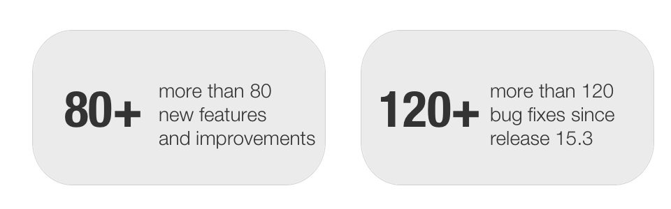
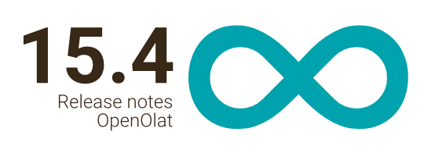

#  [Release notes 15.4](Release+notes+15.4.html)

With the integration of **Microsoft Teams Online Meetings** , the range of
virtual rooms in OpenOlat is again supplemented, this function is available in
several areas. The **wizard for exam courses** facilitates the creation of
online exams and guides step by step through the course configuration and
setup. **Usability** has not been neglected either: the **appointment
scheduling** element in particular has become visually clearer and easier to
understand. But also OpenOlat-wide, various optimizations such as numbered
rows in import forms and the highlighting of column sorting in tables provide
a breath of fresh air. The **BigBlueButton** integration also offers
innovations such as the upload of presentation files already before the online
meeting, an access code for external participants as well as additions in the
administration area. In the course and authoring area, **member management**
in particular has been optimized, and **course  typification** helps to
maintain an overview. The support of **Keycloak oAuth Login** , the
introduction of **temporary user accounts** and other numerous adjustments
complete this release.

Overall more than 80 new features and improvements have been added to OpenOlat
since release 15.3 and many processes have been improved. Here, you can find
the most important new features and changes. In addition to these
improvements, more than 120 bugs have been fixed. The complete list of changes
for 15.3 – 15.3.9 can be found
[here](Release+notes+15.3.html#Releasenotes15.3-Releasenotes-versions).

  

Release date:
22.01.2021

Last release: 07.05.2021

  * 1 Release notes 15.4 
  * 2Microsoft Teams Online Meeting integration
  * 3Course typification
  * 4Exam course wizard
  * 5Optimization for "Appointment Scheduling"
  * 6BigBlueButton - Enhancements
  * 7New features in the course
  * 8Additions to the author area
  * 9Enhancements in the user administration
  * 10Usability
  * 11Additional notes
  * 12Technical details
  * 13Release notes - versions

  

  

* * *

  

## Microsoft Teams Online Meeting integration

From now on, the use of Microsoft Teams Online Meetings is also available in
OpenOlat. The integration was implemented - analogous to BigBlueButton - in
the following areas:

Microsoft Teams course element  
Microsoft Teams course tool in the course menu  
Microsoft Teams group tool  
Microsoft Teams meeting tool in the course element appointment scheduling

Microsoft Teams is a product from Microsoft. To be able to use Microsoft Teams
online meetings in OpenOlat, an app must be created in Azure and equipped with
the appropriate rights. This requires at least one Microsoft license, e.g.
"Microsoft 365 Business Standard".

The Microsoft Teams Online Meeting feature is optionally available in OpenOlat
and must be enabled and configured in the administration.

The Azure App configuration data is stored in the OpenOlat administration.
Optionally, a default user can be specified so that meetings can also be
started if the user is not found in the configured Azure client. Customers of
frentix please contact [contact@frentix.com](mailto:contact@frentix.com) for
this.

For implementation advice and support, contact
[support@openolat.com](mailto:support@openolat.com).

  

* * *

  

## Course typification

With the course typification, courses are differentiated on the one hand
"Technically" and on the other hand "Didactically". This provides a better
overview of the course learning resources in the authoring area, a more
targeted search / filtering for specific course types and provides information
on the classification of the course.

The _"Technical_ _course type_ " refers to the design as well as the available
structures and settings of the course. Currently, a distinction can be made
here between Learning Path Course or Conventional Course.

" _Didactical course types_ " refer to the course setting or the actual
content of the course. For example, it can be an exam course, self-learning
course or seminar course. Currently the exam course is available as a standard
type, the list of didactical course types can be extended in the
administration. Didactical course types can be equipped with their own CSS
class, e.g. to highlight them in the course and in course lists.

Technical and didactical course types are independent of each other. Thus, a
self-learning course can be set up both as a conventional course and as a
learning path course.

  

* * *

  

## Exam course wizard

Creating a simple course with the help of a wizard has been possible in
OpenOlat for some time. With the new exam course wizard, an exam course can
now also be created specifically and quickly.

Step by step, the time period, correction and viewing of the results for the
exam can be configured. It is also possible to create a follow-up examination
and provide a certificate. Finally, coaches and examinees can be assigned.

If an examination period is entered, an assessment mode for this period is
automatically configured in the created examination course.

  

* * *

  

## Optimization for "Appointment Scheduling"

In addition to extensive usability improvements, it is now possible to
duplicate an occasion (formerly "topic") including all or selected
appointments, which is very helpful for similar appointment blocks (see
screenshots).

The creation of multiple individual appointments with specification of the
duration makes it possible to include variable times. If needed, the display
of enrolled participants per appointment can be hidden. In addition to
BigBlueButton rooms, Microsoft Teams Online Meeting rooms can be activated for
appointments analogously.

**Participant view**

**Owner view**

 ****

  

* * *

  

## BigBlueButton - Enhancements

To support the authors and coaches in the administration and preparation of
the virtual classroom, the integration of BigBlueButton has been extended by
some functions.

Coaches can upload their _presentation slides_ to the BigBlueButton
appointment before the meeting begins. As soon as the meeting starts, the
presentation files are automatically uploaded to the BigBlueButton room.

If a meeting is also accessible to external users via URL, a _password_ can
also be generated if required. This must be entered by the external
participants before entering the BigBlueButton room, otherwise no access will
be granted.

For _better management_ of all BBB appointments in the administration, a
search function and a filter have been added, as well as the possibility to
delete several appointments collectively.

If an external Opencast server is used to store BigBlueButton _recordings_ ,
these recordings can be marked as " _Permanent_ ". When deleting the meeting
or course, these recordings will then only be deleted on OpenOlat - not on the
Opencast server.

  

* * *

  

## New features in the course

BigBlueButton and Microsoft Teams Online Meetings are now also available as
_course tools_. Centralized access via the course menu means that the actual
learning process (especially in the sequenced learning path) remains
undisturbed.

A new wizard for course member management improves the workflow to add and
remove roles from the course.

Variables available in e-mail forms and course mails have been harmonized
OpenOlat-wide, the mail footer has been supplemented.

When optionally sending mail messages, _groups_ or _curricula_ can also be
selected as _recipients_.

  

* * *

  

## Additions to the author area

  * Bulk action to add or remove owners to learning resources
  * Display of "External reference" in learning resources selection dialog

  

* * *

  

## Enhancements in the user administration

  * Introduction of an expiration date for temporary user accounts (see screenshot).  

    * Tool for creating temporary users
    * Option for self-registration can be activated
  * Login via [Keycloak](https://www.keycloak.org/) oAuth provider is supported
  * Mass search: search for multiple users by username, email or institution number possible
  * Confirmation of change of a user's e-mail address can be overridden by administrator

  

* * *

  

## Usability

  * Display of row numbers in import forms (e.g. user import)
  * Improved display of column sorting in OpenOlat tables
  * Touch support for calendars (e.g. mobile devices)
  * Wizard with sub-steps for complex scenarios (e.g. exam course)

  

* * *

  

## Additional notes

  * Document course element: Height of the document preview can be set optionally
  * Document editors: Last editor of the document is specified in the metadata
  * Livestream URLs can be stored in the administration and selected directly when creating appointments manually
  * Use of generic user attributes in expert rules (affects conventional course)
  * Import of taxonomy structures
  * Support of browser "Back" button for URLs with and without www

  

* * *

  

## Technical details

  * Code maintenance: Upgraders for OpenOlat 10.x and 11.x removed

  * Support JBoss EAP 7.3

  * Library updates (especially Hibernate 5.4.23)

  

* * *

  

## Release notes - versions

  * [15.4.7](https://jira.openolat.org/secure/ReleaseNote.jspa?projectId=10000&version=17101)
  * [15.4.6](https://jira.openolat.org/secure/ReleaseNote.jspa?projectId=10000&version=17027)
  * [15.4.5](https://jira.openolat.org/secure/ReleaseNote.jspa?projectId=10000&version=17024)
  * [15.4.4](https://jira.openolat.org/secure/ReleaseNote.jspa?projectId=10000&version=17023)
  * [15.4.3](https://jira.openolat.org/secure/ReleaseNote.jspa?projectId=10000&version=17021)
  * [15.4.2](https://jira.openolat.org/secure/ReleaseNote.jspa?projectId=10000&version=17018)
  * [15.4.1](https://jira.openolat.org/secure/ReleaseNote.jspa?projectId=10000&version=17015)
  * [15.4](https://jira.openolat.org/secure/ReleaseNote.jspa?projectId=10000&version=16941)

  

