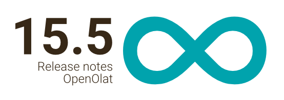
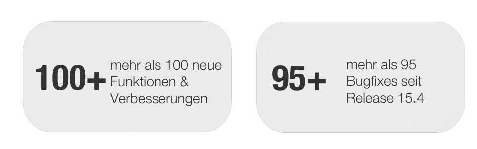
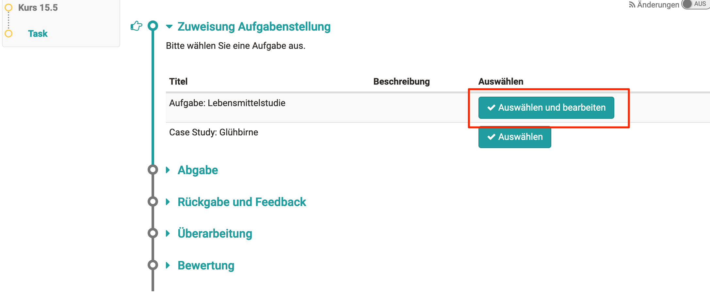
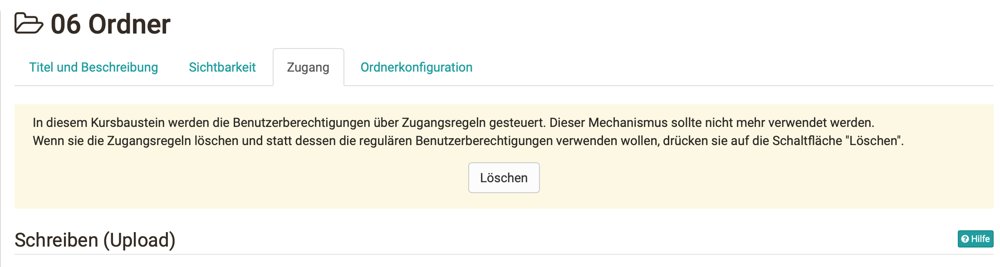
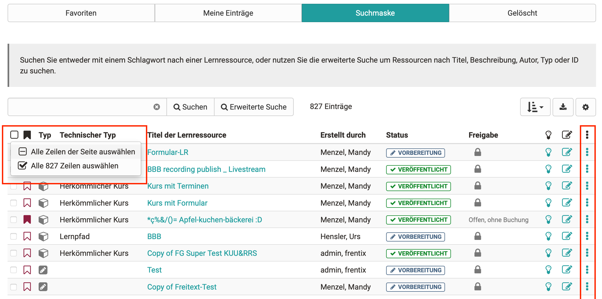

# Release Notes 15.5

Mit der neuen **LTI 1.3-Integration (BETA-Stadium!)** können zum Beispiel
h5p-Inhalte von [h5p.com](https://h5p.com/), oder auch Gruppen und Kurse von
OpenOlat für ein LTI 1.3-fähiges Fremdsystem freigegeben werden. Neue
Funktionen im  **Formular**  (ehemals Fragebogen) und ein passender neuer
**Formular-Kursbaustein** mit automatischer Bestätigung für Teilnehmende
unterstützen beispielsweise bei Anmeldeprozessen. Der **Aufgabenbaustein**
profitiert von aktivierten Dokumenteneditoren, wodurch Teilnehmende die
Aufgabenstellung direkt im Browser bearbeiten, Betreuende  **Dokumente online
korrigieren** und Feedback geben können. Die **Korrektur von Tests** ist
direkt auf dem Kursbaustein möglich und eine Sammelaktion erleichtert die
**Korrektur von Punktzahlen** (z.B. bei fehlerhaften Fragen). Über **e**
**rweiterte Benutzerberechtigungen** für Lernpfad-Kursbausteine können
Benutzerrechte pro Rolle, Gruppe oder Benutzer definiert werden. Im
**Prüfungskurs-Wizard** kann auch ein Prüfungsmodus grundlegend konfiguriert
werden. Im ePortfolio wird die Verwendung von **Einträgen in mehreren Mappen**
unterstützt. Portfolio-Einträge können ausserdem selbstständig mit
**Kompetenzen verschlagwortet** werden, eine gesammelte Darstellung ist im
Profil in der **Kompetenzübersicht** verfügbar. Zahlreiche weitere Neuerungen
und einer **verbesserte Usability bei Tabellen**  komplettieren diesen
Release.

Seit Release 15.4 wurden über 100 neue Funktionen und Verbesserungen zu
OpenOlat hinzugefügt. Hier finden Sie die wichtigsten neuen Funktionen und
Änderungen. Zusätzlich zu wurden mehr als 95 Bugs behoben. Die komplette Liste
der Änderungen in 15.4 – 15.4.7 finden Sie
[hier](Release_notes_15.4.de.md#ReleaseNotes15.4-ReleaseNotes-Versionen).

* * *

:material-calendar-month-outline: ** Releasedatum: 07.05.2021 • Letzte Veröffentlichung: 18.03.2022**

* * *

<iframe width="800" height="450" src="https://www.youtube.com/embed/4QIL8yhfQl8" title="YouTube video player" frameborder="0" allow="accelerometer; autoplay; clipboard-write; encrypted-media; gyroscope; picture-in-picture" allowfullscreen></iframe>

* * *

  

## Formular Erweiterungen

!!! warning "Der Fragebogen heisst jetzt Formular!"

	Der Fragebogen hat sich zu einer Lernressource mit vielfältigen Möglichkeiten
	entwickelt, die weit über einen einfachen Fragebogen hinausgehen. Um dem
	gerecht zu werden, wird die Lernressource "Fragebogen" ab Release 15.5. neu
	"Formular" genannt.

{ class="shadow lightbox aside-right-lg" }

Die Lernressource "Formular" (ehemals Fragebogen) wartet mit tollen neuen
Features auf.

Neue Konfigurationen ermöglichen z. B. die Definition von **Pflichtelementen**
, die von den Teilnehmenden obligatorisch ausgefüllt werden müssen. Das
Textfeld kann eingeschränkt werden, so dass als Eingabe entweder nur Text bzw.
nur Zahlen erlaubt sind, oder aber ein Datum gewählt werden muss.

Ab sofort sind auch **Abhängigkeiten** zwischen einzelnen Formularelementen
möglich. Über **[Frageregeln](../manual_user/forms)** können Elemente miteinander
verknüpft werden. Teilnehmende, die eine bestimmte Antwort auf eine Frage
wählen, können dadurch andere Fragen überspringen und direkt zur nächsten,
damit verbundenen Frage gelangen.

Um die Autoren bei der Erstellung von Fragebögen zu unterstützen, können die
einzelnen Elemente **dupliziert** werden. Dies ist besonders hilfreich, wenn
viele ähnlich konfigurierte Elemente (z. B. gleiche Fragetypen mit gleicher
Struktur und Skala) verwendet werden.

* * *

  

## Kursbaustein Formular

{ class="shadow lightbox aside-right-lg" }

Wo Anmeldungen für Wahlkurse oder Prüfungen mit dem Umfragebaustein nur
bedingt abzubilden sind, können diese und weitere Szenarien mit dem neuen
Kursbaustein "Formular" abgedeckt werden. Hier können ebenfalls Formulare
(ehemals Fragebögen) eingebunden werden.

Teilnehmende können das Formular bis zu einem definierten **Abgabedatum**
ausfüllen und einmalig einreichen. Eine Kurs-Erinnerung kann konfiguriert
werden, um Teilnehmende vor Ende der Abgabefrist an das Ausfüllen des
Formulars zu erinnern.

Anders als beim Umfragebaustein erhalten die Teilnehmenden bei Abgabe des
ausgefüllten Formulars automatisch eine **Bestätigungsmail** mit Datum und
Zeitpunkt der Abgabe sowie ihr ausgefülltes Formular als **PDF im Anhang**.

Betreuende sehen in der Übersichtstabelle den **Bearbeitungsstatus** der
Teilnehmenden. Bereits abgegebene Formulare können zur weiteren Bearbeitung
durch den Teilnehmenden vom Betreuer wieder geöffnet oder auch komplett
zurückgesetzt werden. Mit Klick auf die Teilnehmenden kann das ausgefüllte
Formular angesehen werden. Die Formulardaten aller Teilnehmenden stehen als
Excel-Export zur Verfügung.

  

  

* * *

  

## Aufgabenbaustein

{ class="shadow lightbox aside-right-lg" }

Mit der Einbindung und Aktivierung der Dokumenten-Editoren ergeben sich auch
am Aufgabenbaustein neue Möglichkeiten.

#### Ansicht Teilnehmende

Zum einen wurde eine Option ergänzt, um eine **Aufgabenstellung als Vorlage**
für die Teilnehmenden bereitzustellen, beispielsweise eine vorbereitete Excel-
oder Word-Datei. Bei Auswahl der Aufgabenstellung durch Teilnehmende wird eine
Kopie des Aufgabendokumentes erzeugt und zur **Bearbeitung direkt im Browser**
geöffnet.

#### Ansicht Betreuende

{ class="shadow lightbox aside-right-lg" }

Zum anderen können eingereichte **Lösungsdokumente** der Teilnehmenden vom
Betreuenden direkt im Browser geöffnet und **im Online-Editor korrigiert**
werden. Die bearbeitete Version der Dokumente kann anschliessend zur weiteren
Überarbeitung an den Teilnehmenden zurückgegeben werden.

  

* * *

  

## QTI / eAssessment

{ class="shadow lightbox aside-right-lg" }

Für den Zugriff auf das Testcockpit und die Korrektur von Tests mussten
Betreuende bisher ins Bewertungswerkzeug des Kurses wechseln. Bei Bausteinen
wie Aufgabe oder Checkliste hat sich die **Bewertung direkt auf dem
Kursbaustein**  bewährt, daher wurde diese Möglichkeit auch für den
Kursbaustein **Test** ergänzt.

Betreuende sehen nun in einem separaten Tab die, aus dem Bewertungswerkzeug
bekannte, Tabelle der Teilnehmenden und können wie gewohnt die Korrektur
vornehmen oder Daten exportieren. Auch der Prüfungsmodus kann in dieser
Ansicht gestartet bzw. beendet werden.

In einem zweiten Tab wird eine Vorschau des Tests angeboten.

{ class="shadow lightbox aside-right-lg" }

Enthält eine durchgeführte Online-Prüfung eine fehlerhafte Frage, ist meist
eine **Anpassung der Punktzahl** bei allen Teilnehmenden gewünscht. Diese
Korrektur war bisher nur einzeln bei jedem Teilnehmenden möglich. Mit dem
neuen Release wird eine **Sammelaktion** eingeführt, mit der für alle
Teilnehmenden bei der entsprechenden Frage

  * eine neue absolute Punktzahl gesetzt, oder
  * eine Punktzahl zum aktuellen Punktestand addiert werden kann.

Die Maximalpunktzahl der Frage kann dabei nicht überschritten werden.

{ class="shadow lightbox aside-right-lg" }

Als Hilfestellung für Teilnehmende wird bei Freitext-Fragen unterhalb des
Textfeldes die **aktuelle Wortanzahl** des bereits geschriebenen Textes
angezeigt. Falls vorhanden, folgt dahinter die konfigurierte minimale bzw.
maximale Wortanzahl.

Die Anzeige ist ebenfalls im Bewertungswerkzeug im Korrekturworkflow
verfügbar, um die Betreuenden bei der Bewertung der Freitext-Fragen zu
unterstützen.

{ class="shadow lightbox aside-right-lg" }

Der Fragetyp "Zeichnen" wurde komplett neu umgesetzt und um ein
**Textwerkzeug** ergänzt. Eingefügte Texte können in Farbe und Grösse
angepasst, gedreht sowie neu positioniert werden. Somit ist auch eine
Beschriftung von Grafiken einfacher möglich.

  

* * *

  

## Neue Features rund um Kurse

{ class="shadow lightbox aside-right-lg" }

#### Erweiterte Benutzerberechtigungen

Mit OpenOlat 15.0 wurden die Einstellungen der Benutzerrechte in
Kursbausteinen (z.B. "Hochladen" im Kursbaustein "Ordner") aus dem Tab
"Zugriff" in das Tab "Konfiguration" verlagert. Dieses rollenbasierte Konzept
ist für einige Szenarien nicht ausreichend.

Eine erweiterte Konfiguration ermöglicht ab sofort, die Benutzerrechte pro
Rolle, Gruppe oder Benutzer zu definieren und die verschiedenen Zugriffe
ausserdem zeitlich zu begrenzen. Beim Wechsel zwischen der rollenbasierten und
der erweiterten Konfiguration werden bestehende Einstellungen - soweit möglich
- übernommen.

{ class="shadow lightbox aside-right-lg" }

In Kursbausteinen, bei denen aufgrund der Abwärtskompatibilität noch die
"alte" Konfiguration im Tab "Zugriff" verfügbar ist, wird auf die neue
Konfiguration hingewiesen und eine Aktion angeboten, um auf die neuen
Konfigurationsmöglichkeiten zu wechseln.

  

#### Kursbaustein "Dokument": Verlinkung zu Ablageordner

Im Dokumentenbaustein kann ein Dokument aus dem Kurs-Ablageordner verlinkt
werden. Dies ist zum Beispiel hilfreich, wenn ein Ressourcenordner im Kurs
eingebunden ist, der bereits eine strukturierte Sammlung an Materialien
enthält, die in mehreren Kursen eingesetzt werden.

  

#### Konfiguration für Prüfungsmodus im Prüfungskurs-Wizard

Im Prüfungskurs-Wizard stehen weitere Einstellungen für den Prüfungsmodus zur
Verfügung. So kann entschieden werden, ob überhaupt ein Prüfungsmodus
gewünscht ist, ob dieser manuell oder automatisch gesteuert werden soll, und
es lassen sich Vor- und Nachlaufzeiten definieren.

  

* * *

  

## ePortfolio Erweiterungen

#### Mehrfachnutzung von Einträgen

{ class="shadow lightbox aside-right-lg" }

Einträge können ab sofort auch mehrfach in [verschiedenen ePortfolio-
Mappen](../manual_user/portfolio) verwendet
werden. Dies ist beispielsweise praktisch, wenn Benutzer in einer Sammelmappe
laufend die wichtigsten Einträgen zu ihrer Ausbildung zusammenstellen und sich
damit präsentieren möchten.

Bestehende Einträge können in andere Mappen **importiert** werden oder eine
neue Portfolio-Mappe wird direkt aus vorhandenen Einträgen erstellt.
Referenzierte Einträge werden als solche gekennzeichnet. Bei Änderung eines
referenzierten Eintrags in einer Mappe wird dieser auch in allen anderen
Mappen aktualisiert.

#### Verschlagwortung von Einträgen mit Kompetenzen (Taxonomie)

{ class="shadow lightbox aside-right-lg" }

Neu ist die Verknüpfung einer oder mehrere Taxonomien mit dem ePortfolio
möglich. Innerhalb der Taxonomien können die Stufen als
[Kompetenzen](../manual_user/portfolio) ausgewiesen werden.

Im Portfolio können dann vom Benutzer selbst die Einträge mit den zur Auswahl
stehenden Kompetenzen verschlagwortet werden. Die Kompetenzen können pro
Benutzer zusätzlich mit einem Verfallsdatum versehen werden.

Eine Übersicht aller verwendeten Kompetenzen erhält der Benutzers im
persönlichen Menü unter "Kompetenzen".

  

Im Zuge dieser Erweiterungen wurden ausserdem mehrere **UI/UX-Verbesserungen**
im ePortfolio vorgenommen, wie z.B. die Sichtbarkeit von Icons, Anzeige von
Tooltips, der Style von Tags und die Platzierung von Button im Menü. Ausserdem
können Einträge einer Portfolio-Aufgabe auch direkt für Kursbesitzer
freigegeben werden.

  

* * *

  

## LTI 1.3 Beta

Die **L** earning **T** ools **I** nteroperability (LTI) ist ein Standard zur
Integration von Tools in Lernplattformen. OpenOlat unterstützt diesen Standard
schon mit LTI 1.1 seit Längerem und dient den OpenOlat-Nutzer*innen zur
Integration von unterschiedlichen Tools wie Lernkarten und weiteren
interaktiven Elementen in OpenOlat-Kursen.

LTI 1.3 ist eine komplette Neu-Integration des Standards und gestaltet den
Austausch zwischen Tool und Plattform sicherer und bietet eine Vielzahl von
weiteren Möglichkeiten im Austausch von Daten.

OpenOlat unterstützt neu zwei wesentliche Szenarien:

 **OpenOlat als Plattform:  **Neben der Integration von Tools mit LTI 1.1
steht LTI 1.3 zur Verfügung - zusätzlich können Tools global in der
Administration für LTI 1.3 vorkonfiguriert und im Kurseditor im LTI-Baustein
bequem ausgewählt werden (Beispiel-Tool: h5p-Inhalte von
[h5p.com](https://h5p.com/))

 **OpenOlat als (mächtiges) Tool:**  Neu können Gruppen und Kurse von OpenOlat
für ein LTI 1.3-fähigen Fremdsystem freigegeben werden. Die Benutzer*innen aus
dem Fremdsystem werden dabei nach dem Start des Kurses oder der Gruppe
automatisch im OpenOlat in einer separaten Organisationseinheit als Benutzer
angelegt. Ohne separaten Login erhalten diese LTI-Benutzer*innen nun direkt
auf die für sie freigeschalteten Lernressourcen Zugriff (Beispiel: Moodle-
Nutzer*innen erleben so die volle Bandbreite von tollen Funktionen in
OpenOlat-Kursen und -Gruppen)

  

!!! info "Neugierig auf LTI 1.3 geworden (Funktion im Beta-Stadium)"
	
	Wir freuen uns auf den Austausch mit Ihnen zu den geplanten Einsatz-Szenarien.
	Fragen oder Anregungen zu LTI 1.3 (auch beispielsweise interessanten LTI
	1.3-fähigen Tools, die Sie gerne integrieren möchten) nehmen wir gerne unter
	[support@frentix.com](mailto:support@frentix.com) entgegen.

  

* * *

  

## Usability: Tabellen

{ class="shadow lightbox aside-right-lg" }

In diesem Release wurden vor allem **Neuerungen bei Tabellen** vorgenommen.

Mehr Informationen erhalten Benutzende durch die neuen spezifischen **"Empty
States"** bei Tabellen, wenn keine Daten vorhanden sind. Ergänzende Aktionen
unterstützen bei den nächsten Schritten.

{ class="shadow lightbox aside-right-lg" }

Das **Zahnrad-Symbol** für weitere Aktionen am rechten Rand der Tabelle wurde
beispielsweise durch das **neue
Icon :fontawesome-solid-ellipsis-vertical: ersetzt**.
Das ist nicht nur platzsparender, sondern auch weniger aufdringlich.

Ein Refactoring wurde für die **Auswahl von Zeilen** in Tabellen durchgeführt.
So können nun alle Einträge der Seite oder der gesamten Tabelle über die
Checkbox oben links selektiert werden.

  

* * *

  

## Weiteres, kurz notiert

{ class="shadow lightbox aside-right-lg" }

  * Anzeige ausstehender Bestätigungen für Kurs- und Gruppenmitgliedschaften im Gruppenbereich (Screenshot)
  * Unterstützung mehrerer separater Anhänge für Kurs-Mitteilungen
  * BigBlueButton Warteraum: Bestätigung der Teilnehmenden durch Moderator vor Meeting-Beitritt
  * Automatische Einschreibung in Kurse bei Selbstregistrierung
  * Option, welcher Kurstyp (Herkömmlich oder Lernpfad) als Standard bei der Kurserstellung ausgewählt ist
  * Dokumenteneditoren: Temporäre Datei-Versionen als Zwischenspeicher
  * Optimierung verschiedener Ansichten im Absenzenmanagement
  * Verbesserung Locking-Funktion und Metadatenanzeige von Dokumenten
  * Neue SCORM-Integration für die Einbindung von SCORM-Lernmodulen

  

* * *

  

## Ankündigung Support-Ende QTI 1.2

!!! warning "QTI 1.2 Support endet bald"
	Die Unterstützung für QTI 1.2 endet mit Release 16.0. Die Konvertierung von
	QTI 1.2 Fragen, Tests und Fragebögen ist dann nur noch über den Export auf
	ältere Release-Versionen möglich.
	
	Bitte prüfen Sie, ob noch QTI 1.2-Inhalte auf ihrem OpenOlat-System vorhanden
	sind, die Sie weiter verwenden möchten und konvertieren Sie diese zu QTI 2.1.
	Die Konvertierung von QTI 1.2-Fragebögen in neue Fragebögen / Formulare wird
	nicht unterstützt, diese müssen neu aufgebaut werden.

  

* * *

  

## Technisches

  * Umsetzung eines Tocco Login Providers
  * Unterstützung des automatischen Redirects beim Login für Keycloak und oAuth Provider
  * oAuth: Option, um Registrierungsschritte / Disclaimer bei der Account-Erstellung zu überspringen
  * LDAP: Unterstützung von Feldern mit mehreren Benutzerwerten
  * Library Updates

  

* * *

  

## Release Notes - Versionen

* [YouTrack release notes 15.5](https://track.frentix.com/releaseNotes/OO?q=%2315.5.0&title=Release%20notes%2015.5)
* [YouTrack release notes 15.5 - 15.5.22](https://track.frentix.com/releaseNotes/OO?q=%2315.5.*&title=Release%20Notes%2015.5.*)

