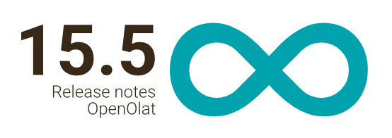

# Release notes 15.5

With OpenOlat 16.1 we release our next major release.

With the new **LTI 1.3 integration (BETA stage!)** , for example, h5p content
from [h5p.com](http://h5p.com) or also groups and courses from OpenOlat can be
released for an LTI 1.3-capable third-party system. New functions in the
learning resource **form** (formerly survey) and a matching new **form course
module** with automatic confirmation for participants support for example
registration processes. The **task module**  benefits from activated document
editors, allowing participants to edit the assignment directly in the browser,
and coaches to correct documents online and provide feedback. The **correction
of tests** is possible directly on the course element and a bulk action
facilitates the **correction of scores** (e.g. in case of incorrect
questions). Via **extended user permissions** for learning path course
elements, user rights can be defined per role, group or user. In the **exam
course wizard** , an exam mode can also be configured in a basic way. In
ePortfolio, the use of **entries in multiple folders** is supported. Portfolio
entries can also be independently **keyworded with competencies** , a
collected display is available in the profile in the **competency overview**.
Numerous other innovations and **improved usability for tables** complete this
release.

Overall more than 100 new features and improvements have been added to
OpenOlat since release 15.4 and many processes have been improved. Here, you
can find the most important new features and changes. In addition to these
improvements, more than 95 bugs have been fixed. The complete list of changes
for 15.4 – 15.4.7 can be found
[here](Release_notes_15.4.md#Releasenotes15.4-Releasenotes-versions).

  

Release date: 07-05-2021

Last update: 12-10-2021

  * 1 Release notes 15.5 
  * 2Form extensions
  * 3Course element "Form"
  * 4Course element "Task"
  * 5QTI / eAssessment
  * 6New features related to courses
  * 7ePortfolio extensions
  * 8LTI 1.3 Beta
  * 9Usability: Tables
  * 10Additional notes
  * 11Announcement support end QTI 1.2
  * 12Technical details
  * 13Release notes - versions

  

  

* * *

  

## Form extensions

**The survey is now called a form!**

The survey has developed into a learning resource with a wide range of
possibilities that go far beyond a simple questionnaire. To do credit to this,
the learning resource "Survey" is now called "Form" as of release 15.5.

The learning resource "Form" (formerly Survey) comes up with great new
features.

New configurations allow, for example, the definition of **mandatory
elements** that must be filled out by the participants. The text field can be
restricted so that either only text or only numbers are allowed as input, or a
date must be selected.

Now, **dependencies** between individual form elements are also possible.
Elements can be linked to each other via **[question
rules](../manual_user/forms)**. Participants who select a certain answer to a
question can thus skip other questions and go directly to the next related
question.

To assist authors in creating questionnaires, individual elements can be
**duplicated**. This is especially helpful if many similarly configured
elements are used (e.g. same question types with same structure and scale).

  

* * *

  

## Course element "Form"

Where registrations for optional courses or exams can only be mapped to a
limited extent with the survey element, these and other scenarios can be
covered with the new course element "Form". Learning resources "Forms"
(formerly surveys) can also be integrated here.

Participants can fill out the form by a defined **submission date** and submit
it once. A course reminder can be configured to remind participants to
complete the form before the submission deadline.

Unlike the survey course element, when participants submit the completed form,
they automatically receive a **confirmation email** with the date and time of
submission, including their completed form as a **PDF attachment**.

Coaches can see the **editing status** of the participants in the overview
table. Forms that have already been submitted can be reopened by the coach for
further processing by the participant, or they can be completely reset. By
clicking on the participant, the completed form can be viewed. The form data
of all participants is available as an Excel export.

  

* * *

  

## Course element "Task"

With the integration and activation of the document editors, new possibilities
also arise at the task course element.

#### Participant view

On the one hand, an option was added to provide a **task as a template** for
the participants, for example a prepared Excel or Word file. When participants
select the task, a copy of the task document is generated and **opened
directly in the browser for editing**.

#### Coach view

On the other hand, submitted **solution documents** of the participants can be
opened directly in the browser by the coach and **corrected in the online
editor**. The edited version of the documents can then be returned to the
participant for further revision.

  

* * *

  

## QTI / eAssessment

Until now, coaches had to switch to the course's assessment tool to access the
test cockpit and correct tests. In the case of elements such as assignments or
checklists, **assessment directly on the course element** has proven its
worth, which is why this option has also been added for the course element
**test**.

Coaches can now see the table of participants in a separate tab, which is
familiar from the assessment tool, and can make corrections or export data as
usual. The assessment mode can also be started or ended in this view.

A preview of the test is offered in a second tab.

If a completed online test contains an incorrect question, an **adjustment of
the score** is usually desired for all participants. Until now, this
correction was only possible individually for each participant. With the new
release a **bulk action** is introduced, with which for all participants with
the appropriate question:

  * set a new absolute score, or
  * a score can be added to the current score.

The maximum score of the question cannot be exceeded.

  

To help participants, the **current word count** of the text already written
is displayed below the text field for essay questions. If available, this is
followed by the configured minimum or maximum number of words.

The display is also available in the assessment tool in the correction
workflow to support the coaches in assessing the essay questions.

The "Drawing" question type has been completely reimplemented and a **text
tool** has been added. Inserted texts can be adjusted in color and size,
rotated as well as repositioned. This makes it easier to label graphics.

  

* * *

  

## New features related to courses

#### Extended user permissions

With OpenOlat 15.0, the settings of user permissions in course elements (e.g.
"Upload" in the course element "Folder") have been moved from the tab "Access"
to the tab "Configuration". This role-based concept is not sufficient for some
scenarios.

Now, an advanced configuration allows to define the user rights per role,
group or user and to limit the different accesses for a certain period of
time. When switching between the role-based and the advanced configuration,
existing settings will be adopted - as far as possible.

  

In course elements where the "old" configuration is still available in the
"Access" tab due to backward compatibility, the new configuration will be
pointed out and an action will be offered to switch to the new configuration
options.

  

#### Course element "Document": Link to storage folder

In the document course element a document from the course storage folder can
be linked. This is helpful, for example, if a resource folder is included in
the course that already contains a structured collection of materials that
will be used in several courses.

#### Configuration for assessment mode in the exam course wizard

Further settings for the assessment mode are available in the exam course
wizard. You can decide whether you want an assessment mode at all, whether it
should be controlled manually or automatically, and you can define lead and
follow-up times.

  

* * *

  

## ePortfolio extensions

#### Multiple use of entries

Entries can now be used multiple times in [different ePortfolio
binders](../manual_user/portfolio). This is practical, for example, if
users want to continuously compile the most important entries on their
education in a collective folder and use them to present themselves.

Existing entries can be imported into other folders or a new portfolio folder
can be created directly from existing entries. Referenced entries are marked
as such. When a referenced entry is changed in a folder, it is also updated in
all other folders.

#### Keywording of entries with competencies (taxonomy)

It is now possible to link one or more taxonomies to the ePortfolio. Within
the taxonomies, the levels can be identified as
[competencies](../manual_user/portfolio).

In the portfolio, the user can then keyword the entries with the competencies
available for selection. The competencies can additionally be provided with an
expiration date per user.

The user gets an overview of all used competencies in the personal menu under
"Competencies".

  

In the line of these enhancements, several **UI/UX improvements** were also
made in ePortfolio, such as icon visibility, tooltip display, tag style and
button placement in the menu. Furthermore, entries of a portfolio task can
also be shared directly with course owners.

  

* * *

  

## LTI 1.3 Beta

**L** earning **T** ools **I** nteroperability (LTI) is a standard for
integrating tools into learning platforms. OpenOlat has supported this
standard for a long time with LTI 1.1 and is used by OpenOlat users to
integrate different tools such as flashcards and other interactive elements in
OpenOlat courses.  
LTI 1.3 is a complete new integration of the standard, makes the exchange
between tool and platform more secure and offers a variety of further
possibilities in the exchange of data.

OpenOlat now supports two main scenarios:

 **OpenOlat as a platform:** Besides the integration of tools with LTI 1.1,
LTI 1.3 is available - in addition, tools can be globally preconfigured in the
administration for LTI 1.3 and conveniently selected in the course editor in
the LTI module (example tool: h5p content from [h5p.com](http://h5p.com))

 **OpenOlat as a (powerful) tool:  **Groups and courses from OpenOlat can now
be shared with an LTI 1.3-capable third-party system. The users from the
third-party system are automatically created as users in OpenOlat in a
separate organizational unit after the start of the course or group. Without a
separate login, these LTI users now have direct access to the learning
resources that have been activated for them (example: Moodle users can
experience the full range of great functions in OpenOlat courses and groups).

  

Curious about LTI 1.3 (feature in beta)

We look forward to exchanging ideas with you on the planned deployment
scenarios. Questions or suggestions about LTI 1.3 (also, for example,
interesting LTI 1.3-capable tools that you would like to integrate) are
welcome at [support@frentix.com](mailto:support@frentix.com).

  

* * *

  

## Usability: Tables

In this release, **new** **table features** have been implemented in
particular.

Users receive more information through the new specific **"Empty States"** for
tables when no data is available. Supplementary actions support the next
steps.

For example, the **cogwheel icon** for further actions on the right edge of
the table has been **replaced** by the new
icon. This is not
only more space-saving, but also less intrusive.

A refactoring was done for the **selection of rows** in tables. Now all
entries of the page or the entire table can be selected via the checkbox in
the upper left corner.

  

* * *

  

## Additional notes

  * Display of pending confirmations for course and group memberships in the group area (screenshot)
  * Support for multiple separate attachments for course notifications
  * BigBlueButton Waiting room: Confirmation of participants by moderator before meeting entry
  * Automatic enrollment in courses upon self-registration
  * Option which course type (Conventional or Learning Path) is selected as default when creating courses
  * Document editors: Temporary file versions as caches
  * Optimization of various views in absence management
  * Improved locking function and metadata display of documents
  * New SCORM integration for inclusion of SCORM learning modules

  

* * *

  

## Announcement support end QTI 1.2

Support for QTI 1.2 will end with Release 16.0. Conversion of QTI 1.2
questions, tests and questionnaires will then only be possible via export to
older release versions.

Please check if there is still QTI 1.2 content on your OpenOlat system that
you would like to continue using and convert it to QTI 2.1. The conversion of
QTI 1.2 questionnaires to new surveys / forms is not supported, these must be
rebuilt.

  

* * *

  

## Technical details

  * Implementation of a Tocco login provider

  * Support of automatic redirect at login for Keycloak and oAuth providers

  * oAuth: option to skip registration steps / disclaimer during account creation

  * LDAP: support multiple user values fields

  * Library Updates

  

* * *

  

## Release notes - versions

  * [15.5.14](https://jira.openolat.org/secure/ReleaseNote.jspa?projectId=10000&version=17803)
  * [15.5.13](https://jira.openolat.org/secure/ReleaseNote.jspa?projectId=10000&version=17801)
  * [15.5.12](https://jira.openolat.org/secure/ReleaseNote.jspa?projectId=10000&version=17700)
  * [15.5.11](https://jira.openolat.org/secure/ReleaseNote.jspa?projectId=10000&version=17608)
  * [15.5.10](https://jira.openolat.org/secure/ReleaseNote.jspa?projectId=10000&version=17601)
  * [15.5.9](https://jira.openolat.org/secure/ReleaseNote.jspa?projectId=10000&version=17500)
  * [15.5.8](https://jira.openolat.org/secure/ReleaseNote.jspa?projectId=10000&version=17301)
  * [15.5.7](https://jira.openolat.org/secure/ReleaseNote.jspa?projectId=10000&version=17200)
  * [15.5.6](https://jira.openolat.org/secure/ReleaseNote.jspa?projectId=10000&version=17111)
  * [15.5.5](https://jira.openolat.org/secure/ReleaseNote.jspa?projectId=10000&version=17110)
  * [15.5.4](https://jira.openolat.org/secure/ReleaseNote.jspa?projectId=10000&version=17109)
  * [15.5.3](https://jira.openolat.org/secure/ReleaseNote.jspa?projectId=10000&version=17106)
  * [15.5.2](https://jira.openolat.org/secure/ReleaseNote.jspa?projectId=10000&version=17104)
  * [15.5.1](https://jira.openolat.org/secure/ReleaseNote.jspa?projectId=10000&version=17102)
  * [15.5](https://jira.openolat.org/secure/ReleaseNote.jspa?projectId=10000&version=17004)

