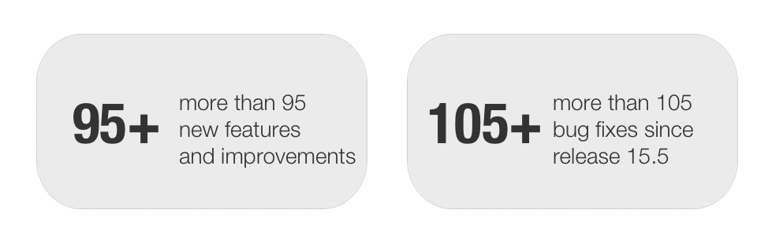
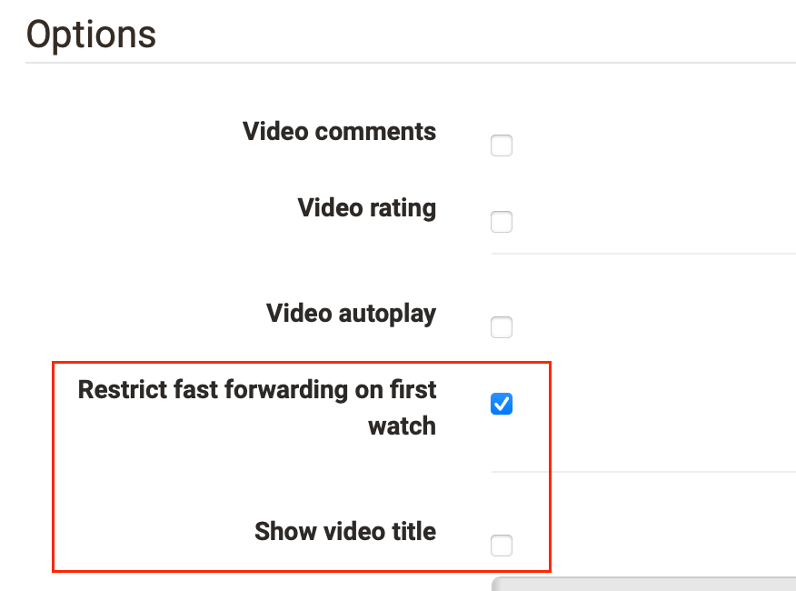

# [Release notes 16.0](Release+notes+16.0.html)

With OpenOlat 16.1 we release our next major release.

This introduces new design options for the course and in the **course
preview** , **optimized usability** and more flexible **filter options** for
tables, as well as a **copy wizard for Learn Path Courses**. The capture of a
**3G Covid certificate** is possible in the user profile and simplifies the
verification e.g. when entering rooms. In the eAssessment area, the **display
of test durations** has been extensively revised and the functionality of
various **QTI question types** has been enhanced. **Reminders** can now also
be managed at course element level. The progress determination for the viewing
of videos in OpenOlat allows an improved control of the **processing status**
of participants. Individual colors for **calendar entries** and new features
for **BigBlueButton** integration such as the adoption of OpenOlat **profile
pictures** provide personalization and a good overview. Numerous enhancements
for individual course elements, additions to the Learn Path course, and
**optimized displays** complete this release.

Since release 15.5, over 95 new functions and improvements have been added to
OpenOlat. Here you can find the most important new features and changes. In
addition, more than 105 bugs have been fixed. The complete list of changes in
15.5 - 15.5.6 can be found
[here](Release+notes+15.5.html#Releasenotes15.5-Releasenotes-versions).

Release date: 08-27-2021

Last update: 12-10-2021

  * 1 Release notes 16.0 
  * 23G Covid certificate
  * 3Custom course layout, course element preview, and advanced metadata
  * 4Usability for tables
  * 5Copy Wizard for learn path courses
  * 6QTI: End of support for QTI 1.2
  * 7QTI / eAssessment
  * 8Course reminders
  * 9Videos in OpenOlat
  * 10Other innovations regarding courses
  * 11New in the learning path
  * 12BigBlueButton extensions
  * 13Additional notes
  * 14Technical details
  * 15Release notes - versions

  

  

* * *

  

## 3G Covid certificate

Proof of a [3G Covid certificate](COVID+certificate.html) can be stored in the
user profile.

If the presentation is a prerequisite for attending an event, users can scan
or upload a valid COVID certificate beforehand or manually add 3G data
details.

No data is stored in the process, only the information is validated. The
status of the certificate (green, yellow or red) can be called up by users in
their profile and can be shown, for example, when entering rooms.

The capture of the certificate can also be performed by selected 3G
representatives, e.g. the secretary's office.

We will be happy to advise you on the activation and introduction of the
module: [contact@frentix.com](mailto:contact@frentix.com)

(German only)

  

* * *

  

## Custom course layout, course element preview, and advanced metadata

#### Custom course layout

In the Layout tab of the course settings, the default style for the header of
the course elements can now be defined. With the selection of a **teaser
image** (template or own image) as well as a **color category** and **optional
design options** , such as positioning and gradient, a customized course
layout can be implemented. Various standard images and categories are already
available as templates.

In the preview, you can directly see how the options affect the design.

On the course element level, the standard style defined for the course can be
overwritten. In this way, certain course elements can be equipped with other
images or colors, or each element can be given its own specific header layout.

  

#### Optimized course element preview

The header design for course elements also results in an attractive design of
the automatically generated overview pages at the top course node and at the
structure element. These preview overviews have been adapted to the display of
the course element layouts.

#### New metadata fields for course elements

The description field for course elements is often not enough to include all
the necessary information and to display them in a structured way for the
participants. Therefore, additional fields have been added to provide
information on the **learning objectives** of the course element as well as
**instructions** for participants on how to complete the element. In addition,
**notes for the course coach** can be deposited by the course author. At the
same time, the display of the field contents in the course run has also been
optimized.

  

* * *

  

## Usability for tables

In Release 16.0, we have once again dedicated ourselves to the tables in
OpenOlat and, in addition to minor visual adjustments, we primarily made the
filter and search function more compact.

  

#### Tabs, filter menu and search

The display above the tables has become slimmer. Instead of tabs, the previous
areas are available as predefined filters. The new **dynamic filter function**
can be accessed when needed and allows to filter the data of the table
according to different criteria, individually or in combination.

 **Individual filters** can be saved for later use.

A full text search is available across the whole table.

#### Bulk actions

For a reduced and clear display, mass actions for table data are now only
shown if data is actually selected. Available mass actions then appear above
the table.

#### Visual improvements

For very wide tables that require horizontal scrolling, the left and/or right
side is visually highlighted with a shadow to show that there are additional
non-visible columns there. The leftmost and rightmost selection and action
columns in the table are now always displayed, even when scrolling
horizontally. This way, both functions are always available.

For visual support, selected columns are highlighted with color.

  

* * *

  

## Copy Wizard for learn path courses

When copying courses, the requirements as to what exactly should and should
not be copied are often very different. Once, for example, groups, folder
contents or an integrated blog are to be reused. Another time, no groups are
needed, but a newly created, empty wiki. Or it is desired that course-specific
terms of use and reminders are adopted.

As of Release 16.0, these different scenarios can be implemented with the Copy
Wizard for Learn Path Courses. Copy the course **automatically** with a few
clicks using **predefined default settings** , or make **individual copy
settings** for course elements. Update the metadata for the new course and
determine, for example, which course members should be retained and which
learning resources should be reused.

The Copy Wizard also allows you to **move existing dates** , such as course
execution period, survey release date, or assignment submission deadlines, to
specifically match these dates to a new course execution.

  

* * *

  

## QTI: End of support for QTI 1.2

  

Note

  

**The support for QTI 1.2 ends with release 16.0!**

The conversion of QTI 1.2 questions, tests and questionnaires is only possible
via export to older release versions.

 **Before updating** , please check if there is still QTI 1.2 content on your
OpenOlat system that you would like to continue using and convert it to QTI
2.1. The conversion of QTI 1.2 questionnaires to new questionnaires / forms is
not supported, they have to be rebuilt.

  

* * *

  

## QTI / eAssessment

#### Additions to question types

 **Essay**  questions have been equipped with an option to prevent copying and
pasting text from external sources (office documents, web pages, chat
messages, etc.).

The question type **File Upload** now supports uploading of up to 10 separate
files. The author can specify the maximum number of uploads allowed to answer
the question.

In the question type **Hotspot** , the positioning of hotspots has been
improved. Elements can now be copied and aligned horizontally or vertically
via button. This makes creating identical shapes and visually appealing
positioning quick and easy.

#### Optimization of the displayed information about the test period

Before and during the test, it is important for participants to be able to
gather all necessary information about the test period and the current test
time as quickly as possible and at one glance. The display of time information
has been extensively optimized in Release 16.0.

**Display before test
start**

 **Displays during test execution**

 ****

  

* * *

  

## Course reminders

  

#### Reminders at the course element

Reminders at the course element  
Reminders could previously be created via the course administration. This
previously rather hidden feature is now also available directly on the
respective course element in the editor and in the execution view so that
authors can quickly and easily create new reminders.

All existing reminders that apply to this course element are displayed in a
separate tab. Additional reminders can be created and existing ones can be
edited or deleted. Only the reminder conditions that are available for the
respective course element type are available for selection.

At the top course node all reminders are listed that are not bound to a
specific course element. A log of already sent reminders is also available.

#### Additional recipients

Reminders are sent only to participants by default. In certain cases it is
important to inform additional recipients about certain events. Optionally, a
copy of the reminder email can now also be sent to course owners, assigned
coaches or an external mail address (e.g. secretary's office or
administration).

#### Further improvements

The rule "Passed" has been extended to cover the state Not yet assessed in
addition to Passed / Not passed.

  

* * *

  

## Videos in OpenOlat

#### Prevent fast-forwarding in videos

This option in the **video course element** prevents participants from using
the slider in the video navigation to fast-forward in the video. If the option
is enabled, fast-forwarding is limited to sections of the video that
participants have already viewed. Fast-forwarding is then only possible to the
point that was viewed last.

In Learn Path Courses, the progress of watching a video is also saved as the
progress of the course element and is displayed in the learning path tool. If
participants open the course element again and the video was not finished the
first time, a continuation dialog appears.

#### Hide video title

Sometimes the display of the video title is not desired or not useful,
therefore this can be activated or deactivated using a new option.

  

#### Learning path: Watch video to the end

Videos in the learning path previously had to be completed manually by
participants. The information about how far participants have already watched
a video now makes it possible to use this progress as a **completion
criteria** in the learning path. The criterion "video watched to the end
(95%)" has therefore been added for video modules.

  

#### Download video

A download button for locally stored video files has been added to the "Video"
learning resource. If multiple transcodes are available, they are displayed in
a drop-down menu including the master file.

  

* * *

  

## Other innovations regarding courses

  * **Participant folder** : Show defined "time window for submission" of documents as information for participants
  *  **Task module** : configuration for administration of tasks and sample solutions by coaches placed centrally (screenshot)
  *  **Group task** : File upload for group or individual assessment documents added
  *  **Individual page** : improved readability of "Edit page" function
  * Separate course folder for coaches (no access for participant)
  * Removed "Groups" tab in assessment tool in favor of new table filters
  * Selection of multiple files for final deletion in course folder added
  * Addition of didactic course types, visual identification in the course overview and on the course info page.

  

* * *

  

## New in the learning path

  * Completion criteria "E-mail sent" for course element "E-mail" (screenshot)
  * Course element-specific default values for completion criteria
  * Additional course navigation below the content
  * Manual assessment: Automatic status change "Correction" if participant access granted

  

* * *

  

## BigBlueButton extensions

An existing meeting can be used as a **configuration template** for another
one by copying it. The "Create Meeting" dialog will open and already contains
the copied settings, which can be adjusted if needed.

OpenOlat **profile pictures** are transferred to BBB and displayed as an
avatar in the meeting participant list.

Those who want to join a BBB meeting via an external link can **authenticate**
with their OpenOlat account in addition to logging in as an anonymous meeting
guest.

In the list of recordings, the type "Download" is supported and indicated
accordingly with its own icon.

  

* * *

  

## Additional notes

  * Calendar:
    * Individual color customization of calendar entries (screenshot)
    * Optimization of text and background colors of calendar entries for WCAG-compliant contrast
  * Quality management: Exclusion of courses based on course type when sending questionnaires
  * General optimization of error and warning displays
  * Improvement of tab navigation in forms
  * Enhanced display of radio button as "card" for additional details, e.g. description and images
  * Send mail copy to user life-cycle mails to configurable mail address

  

* * *

  

## Technical details

  * LDAP: Support for fields containing multiple values
  * New technical implementation of the learning path progress bar based on SVG
  * "Forgot password" link to external page for Tocco login provider
  * Unsupported Transcodings removed from Administration

  

* * *

  

## Release notes - versions

  * [16.0.7](https://jira.openolat.org/secure/ReleaseNote.jspa?projectId=10000&version=17804)
  * [16.0.6](https://jira.openolat.org/secure/ReleaseNote.jspa?projectId=10000&version=17800)
  * [16.0.5](https://jira.openolat.org/secure/ReleaseNote.jspa?projectId=10000&version=17701)
  * [16.0.4](https://jira.openolat.org/secure/ReleaseNote.jspa?projectId=10000&version=17602)
  * [16.0.3](https://jira.openolat.org/secure/ReleaseNote.jspa?projectId=10000&version=17600)
  * [16.0.2](https://jira.openolat.org/secure/ReleaseNote.jspa?projectId=10000&version=17400)
  * [16.0.1](https://jira.openolat.org/secure/ReleaseNote.jspa?projectId=10000&version=17300)
  * [16.0](https://jira.openolat.org/secure/ReleaseNote.jspa?projectId=10000&version=17014)

  

