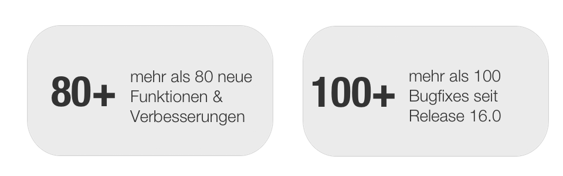

#  [Release Notes 16.1](Release+Notes+16.1.html)

Mit OpenOlat 16.1 geben wir unseren nächsten Major Release frei.

Neben der Einführung des **automatischen Lebenszyklus für Gruppen** wurde
fleissig am **Lernpfad** gearbeitet. Es können **relative Daten** verwendet
und Kursbausteine aufgrund bestimmter Kriterien für Lernende
**ausgeschlossen** werden. Kursbausteine können nun von einem Kurs in einen
anderen importiert werden. Ein **PDF Export für Tests** inklusive Deckblatt
ermöglicht es, OpenOlat Tests auch für **handschriftliche Prüfungen**
einzusetzen. Im Bereich Assessment wurde Anpassungen für die Sichtbarkeit und
**Freigabe von Bewertungen** vorgenommen, das **Coaching Tool** wurde um einen
Navigationspunkt "Aufträge" ergänzt. Das UX-Team hat sich um **verbesserte
Hinweise** zur Unterstützung von Autoren und Teilnehmenden gekümmert, ebenso
die überarbeitete Positionierung von Metadaten in der Testdurchführung und in
der Kursübersicht unter "Meine Kurse" angestossen sowie **weitere Filter** auf
den Weg gebracht.

Seit Release 16.0 wurden über 80 neue Funktionen und Verbesserungen zu
OpenOlat hinzugefügt. Hier finden Sie die wichtigsten neuen Funktionen und
Änderungen. Zusätzlich zu wurden mehr als 100 Bugs behoben. Die komplette
Liste der Änderungen in 16.0 – 16.0.7 finden Sie
[hier](Release_notes_16.0.md).

Releasedatum: 17.12.2021

Letztes Update: 17.12.2021

  

* * *

  

## Ausnahmen im Lernpfad

Verschiedene Aufgaben oder Themen für Gruppe A und B im Lernpfad?
Teilnehmende, die den Test bestanden haben, können ein Kapitel überspringen?

Die Option  **Ausnahmen** macht die Gestaltung von individuellen Lernpfaden
für verschiedene Lernende in einem Kurs möglich. Damit kann der Zugriff auf
Kursbausteine für bestimmte Benutzer ausgeschlossen werden - sei es durch ein
entsprechendes Attribut, einen bestandenen Test oder die Zugehörigkeit zu
einer Gruppe bzw. einer Organisation.

**Neue Funktionen**

  * Erweiterte Ausnahmensteuerung: Zustand "Ausgenommen" für Kurs- und Strukturbausteine
  * Ausnahmen für Lernende anhand bestimmter Kriterien konfigurierbar:
    * Gruppenzugehörigkeit
    * Benutzername
    * Spezifisches Benutzerattribut
    * Bestanden/Nicht bestanden eines bewertbaren Bausteins
  * Kennzeichnung eines Kursbausteines im Editor-Modus, wenn dieser Ausnahmeregeln besitzt

 **Individuelle Lernpfadsteuerung bei den Lernenden**

  * Ausnahmen können bei Bedarf in der individuellen Lernpfadsteuerung durch den Betreuer überschrieben werden
  * Anzeige der nur für diese Person zugänglichen Kursbausteine oder aller Kursbausteine des Lernpfades

 **Änderungen an bestehenden Elementen**

  * Umbenennen des Labels "Pflicht" in "Durchführung" im Tab Lernpfad
  * Strukturbaustein: Umbenennen der Durchführungsoptionen im Lernpfad-Tab in "Teil des Lernpfades" und "Ausgenommen"

  

  

**Neugierig?**

Im **Video** erhalten Sie einen Überblick zu den Ausnahmen im Lernpfad:

Im **Whitepaper**  sind die wichtigsten Informationen zum Lernpfad und den
Ausnahmen kompakt zusammengefasst:

<a href="../assets/161/Whitepaper_Lernpfadkurse_final.pdf">

 
Whitepaper_Lernpfadkurse_final.pdf
</a>
  

* * *

  

## Weitere Neuerungen im Lernpfadkurs

**Konfiguration von relativen Daten**

Im Lernpfad können für die Bearbeitung eines Kursbausteines ein absolutes
Beginn- und Enddatum konfiguriert werden. Starten Teilnehmende den Kurs zu
unterschiedlichen Zeitpunkten, werden viele Erinnerungsemails bei der
Kursdurchführung eingesetzt, oder wird der Kurs inklusive Daten kopiert (s.
Kopie-Wizard), so sind relative Daten wesentlicher praktischer. Diese sind
abhängig vom Startdatum des Kurses, dem Datum der Einschreibung oder des
ersten Kursbesuchs der Teilnehmenden und ermöglichen sowohl eine
individuellere Begleitung der Teilnehmenden als auch den einfacheren Einsatz
von Kurstemplates als Kopiervorlage.

  

**Konfiguration der Anzeige des Navigationsmenüs**

In Lernpfadkursen wird der Lernpfad auch im Navigationsmenü visualisiert. Dies
ist für strengere Lernpfadszenarios mit überwiegend obligatorischen
Kursbausteinen sinnvoll. Bei offeneren Kursen ohne vorgegebene
Bearbeitungsreihenfolge braucht es diese Visualisierung nicht, die typischen
Kursbaustein-Icons eignen sich dafür besser.

Mit den neuen Konfigurationsmöglichkeiten für die Anzeige von Pfad und Icons
(Kurseinstellungen > Layout > Navigation) können diese flexibel für
unterschiedliche Bedürfnisse eingestellt werden.

  

Lernpfad und Baustein-Icons aktiviert vs. nicht aktiviert:

  

* * *

  

## Automatischer Lebenszyklus für Gruppen

Gruppen werden in OpenOlat sehr oft verwendet, die Verwaltung und insbesondere
das Löschen nicht mehr genutzter Gruppen bleibt allerdings vielmals auf der
Strecke. Gruppen ohne Mitglieder verwaisen und häufig ist unklar, wer für die
Gruppe verantwortlich ist.

Zur Unterstützung wurde in OpenOlat der automatische Lebenszyklus für Gruppen
eingeführt - ähnlich dem Lebenszyklusmanagement von Benutzern und Kursen. Die
Gruppenverwaltung wurde dahingehend umgebaut und erweitert.

Die Gruppen durchlaufen dabei **verschiedene Status** (Aktiv - Inaktiv -
Gelöscht), bis sie schliesslich unwiderruflich aus OpenOlat gelöscht werden.
Die Daten bleiben bis zum Zeitpunkt des unwiderruflichen Löschens erhalten,
ein **Reaktivieren** der Gruppen ist jederzeit möglich.

Die **Fristen** für die verschiedenen Statuswechsel, optionale
Reaktionsfristen sowie das Auslösen von **Benachrichtigungsmails** an die
Gruppenverantwortlichen können systemweit definiert werden.

Jeder Statuswechsel kann alternativ auch manuell durch Gruppenverwalter oder
Administratoren ausgeführt werden, ein kombiniertes Lebenszyklusmanagement aus
teilweise **automatischem und manuellem** Prozess ist empfehlenswert.

  

  

* * *

  

## Test-Export Wizard: Handschriftliche Prüfung mit Deckblatt generieren

Tests in OpenOlat können als Word-Dokument (mit und Lösungen) exportiert
werden. Diese Möglichkeit ist vor allem für Ablagezwecke nützlich, für Paper-
Pencil-Tests ist es eher nicht geeignet.

Mit dem neuen Test-Export Wizard können ab sofort **individuelle Tests** im
PDF-Format inklusive Deckblatt für eine beliebige Anzahl an Teilnehmenden
generiert werden, um sie für handschriftliche Prüfungen zu verwenden. Die
Test-Konfigurationen "Zufällige Reihenfolge der Fragen oder Sektionen" sowie
"Anzahl Fragen in dieser Sektion" berücksichtigt.

Verschiedene Optionen erlauben eine Anpassung an das Prüfungssetting:

  *  **Wählbare Anzahl** der generierten Test
  * Ausgabe im **PDF-Format**
  * Festlegung der **Ausgabesprache** (konfigurierte Systemsprachen)
  * Ausgabe von Tests mit zufälligen **Testcodes** möglich
  *  **Vorschau** des Exports
  * Generierung des Exports mit unterscheidbarem **Lösungsblatt**
  * Erstellung eines **Deckblattes** mit konfigurierbaren Attributen wie beispielsweise Platzhalter für Name der Prüflinge, Datum oder Anzeige von Prüfungsdauer
  *  **Zusatzseite** mit weiteren Informationen zur Prüfung, z.B. für Instruktionen

  

* * *

  

## Weitere Features im Bereich eAssessment, Tests und Bewertung

**Lernressource "Test"**

  *     * Umbenennung Test-Lernressourcen zur besseren Unterscheidung des Formats beim Filtern (s. Screenshot)
    * Erweiterung Importvorlage für Fragetyp "Numerische Eingabe"
    * Aktion für Word-Export von Tests aus Testeditor ins Administrationsmenü verschoben

  

**Testdurchführung**

  *     * Verbesserte Positionierung der Titel- und Punkte-Anzeige bei Testdurchführung

  

**Bewertung**

  *     * Anzeige der individuellen Maximalpunktzahl des Kurses im Bewertungswerkzeug > Leistungsübersicht des Benutzers
    * Verbesserte Filter im Bewertungswerkzeug
    * Lernpfad:
      * Freigabe von Bewertungen nur für Kursbesitzer, wenn nicht für Betreuer erlaubt (s. Screenshot rechts)
      * Besitzer kann "Bestanden / Nicht bestanden" überschreiben
    * Überarbeitung der Freigabe-Optionen (ehemals "Sichtbarkeit setzen") für Bewertungen (s. Screenshot)

  

  

  

* * *

  

## Import von Kursbausteinen aus anderen Kursen

Sollen einzelne Kursinhalte und -strukturen aus bestehenden Kursen erneut in
anderen Kursen verwendet werden, ist dies nun über die **Importfunktion** von
Kursbausteinen im **Kurseditor** lösbar.

Aus dem **Zielkurs** heraus wird der Import gestartet, ein kleiner Wizard
führt durch den Prozess. So kann zunächst der **Ursprungskurs** gewählt und
die gewünschten **Bausteine oder ganze Strukturen** für den Import selektiert
werden. Der Wizard zeigt **Hinweismeldungen**  an, wenn beispielsweise ein
Baustein nicht importiert werden kann oder Abhängigkeiten bestehen, die neu
angelegt werden müssen.

Bei bestimmten Bausteinen kann (analog zum Kopie-Wizard für Lernpfadkurse)
entschieden werden, wie genau der Baustein nach dem Import vorliegen soll.
(Beispiel: soll das Wiki neu und leer angelegt oder die bestehende Verknüpfung
zur Lernressource beibehalten werden?)

Im letzten Schritt werden auch **Dateien** aus dem Ursprungskurs, die zum
Beispiel im Ablageordner vorliegen, zur Auswahl angezeigt. So können auch
vorhandene HTML-Seiten oder verwendete Bilder wieder in den neuen Kurs
importiert werden.

  

* * *

  

## Weitere Verbesserungen rund um Kurse

**Für Autoren:**

  * Verbesserte Anzeige von Warnmeldungen zu unvollständigen Kursbausteinen (s. Screenshot)
  * Platzierung der Aktionen für Kursbausteine (Löschen, Verschieben, Duplizieren) auf dem Baustein selbst

  

**Für Teilnehmende:**

  * Verbesserte Darstellung von Kursinformationen (wie z.B. Titel, Durchführungszeitraum, Durchführungsort) in der Kursübersicht (Meine Kurse)
  * Verbesserte Darstellung der Angaben auf der Kurs-Infoseite
  * Verbesserte Meldungen im Kurs, warum bestimmte Kursbausteine (noch) nicht zugänglich sind (s. Screenshot rechts)

  

  

  

  

* * *

  

## Weiteres, kurz notiert

**Import von extern erstellten Zertifikaten**

Manchmal möchten Benutzer ihre Leistungsnachweise in OpenOlat mit extern
erstellten Zertifikaten oder Teilnahmebestätigungen ergänzen, um ihr Profil
abzurunden. Der Upload externer Zertifikate kann nun für die Benutzer im
persönlichen Bereich "Leistungsnachweise" freigeschaltet werden
(Administration > eAssessment > Zertifikate). Zusätzlich ist diese Funktion
auch für Benutzerverwalter, Linienvorgesetzte derselben Organisation oder für
verantwortliche Personen, die über eine Benutzer-zu-Benutzer-Beziehungen
verbunden sind, verfügbar und kann jeweils separat konfiguriert werden.

**Coaching Tool:  Offene und freizugebende Bewertungen**

Damit Betreuende den Überblick über noch offene oder freizugebende Bewertungen
sowie ihre anstehenden Korrekturaufträge behalten, wurde das Coaching-Tool
erweitert. Die Verwaltung von Korrektoren und Korrekturaufträgen erfolgt in
einem separaten Bereich.

 **Sonstiges**

  * Lektionenmanagement: Verbesserte Erfassung von Absenzen
  * Leistungsnachweise auch in Curriculumsansicht verfügbar in den Bereichen CoachingTool, Benutzerverwaltung und dem persönlichen Bereich Leistungsnachweise
  * Neue Datumsmethoden in PDF-Zertifikaten zur Anzeige von Daten relativ zum Originaldatum

  

* * *

  

## Technisches

  * Bibliotheken von Drittanbietern aktualisiert
  * Performance-Verbesserung im Bewertungswerkzeug
  * Code-Bereinigung und kleinere Überarbeitungen

  

* * *

  

## Weitere Informationen

  * [Jira Release notes 16.1](https://jira.openolat.org/secure/ReleaseNote.jspa?projectId=10000&version=17108)

  

