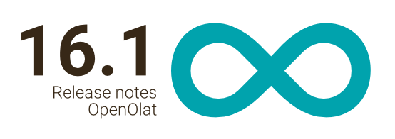
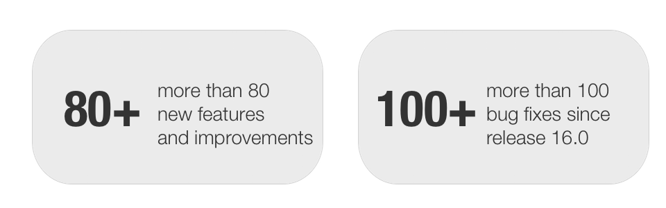
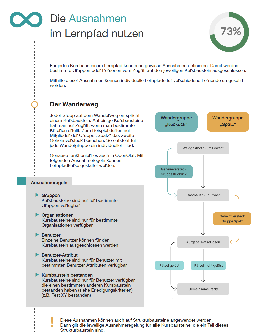

# Release notes 16.1

With OpenOlat 16.1 we release our next major release.

In addition to the introduction of the **automatic life cycle for groups** ,
diligent work was done on the **learning path**. **Relative data** can be used
and course elements can be **excluded** for learners based on certain
criteria. Course elements can now be imported from one course to another. A
**PDF export for tests** including a cover sheet makes it possible to use
OpenOlat tests for **handwritten exams** as well. In the Assessment section,
adjustments were made for the visibility and **release of assessments** , and
a navigation item "Orders" was added to the **Coaching Tool**. The UX team
took care of **improved hints** to support authors and participants, as well
as triggered the revised positioning of metadata in the test execution and in
the course overview under "My courses", and launched **additional filters**.

Since release 16.0, over 80 new features and improvements have been added to
OpenOlat. Here you can find the most important new features and changes. In
addition to, more than 100 bugs have been fixed. The complete list of changes
in 16.0 - 16.0.8 can be found
[here](Release_notes_16.0.md).

* * *

:material-calendar-month-outline: **Release: 17.12.2021 • Last update: 17.12.2021**

* * *

## Exceptions in the learning path

Different tasks or topics for group A and B in the learning path? Participants
who have passed the test can skip a chapter?

The **Exceptions** option makes it possible to design individual learning
paths for different learners in a course. This makes it possible to exclude
access to course elements for certain users - be it through a corresponding
attribute, a passed test, or membership in a group or organization.

#### New functions

  * Extended exception control: "Excluded" state for course and structure elements
  * Exceptions for learners configurable based on specific criteria:  

    * Group membership
    * User name
    * Specific user attribute
    * Passed/failed status of an assessable course element
  * Marking of a course element in editor mode if it has exception rules

#### Individual learning path control for learners

  * Exceptions can be overwritten in the individual learning path control by the Coach if required
  * Display of course elements only accessible for this user or all course elements of the learning path

#### Modifications of existing elements

  * Renaming of label "Obligatory" to "Execution" in Learning path tab
  * Structure element: Rename implementation options in learning path tab to "Part of learning path" and "Excluded"
  
{ class="shadow lightbox" }

#### Interested?

Watch the **video** for an overview of the exceptions in the learning path (german only):

<iframe width="688" height="387" src="https://www.youtube.com/embed/MWWUmma2Cr0" title="YouTube video player" frameborder="0" allow="accelerometer; autoplay; clipboard-write; encrypted-media; gyroscope; picture-in-picture" allowfullscreen></iframe>

  
The **whitepaper** summarizes the most important information about the learning
path and the exceptions in a compact way:

[{ class="thumbnail-xl border" } whitepaper_learning_path_courses_en_final.pdf](assets/161/whitepaper_learning_path_courses_en_final)
  

* * *

  
## Other innovations in the learning path course

#### Configuration of relative dates

In the learning path, an absolute start and end date can be configured for
completing a course element. If participants start the course at different
times, if many reminder emails are used during the course execution, or if the
course including dates is copied (see Copy Wizard), relative dates are much
more practical. These depend on the start date of the course, the date of
enrollment or the first course attendance of the participants and allow both a
more individual support of the participants and the easier use of course
templates as a copy template.

{ class="shadow lightbox" }

#### Configuration of the navigation menu display

In learning path courses, the learning path is also visualized in the
navigation menu. This is useful for stricter learning path scenarios with
predominantly mandatory course elements. For more open courses without a
predefined processing sequence, this visualization is not needed; the typical
course element icons are more suitable for this purpose.

With the new configuration options for the display of path and icons `Course settings > Layout > Navigation`), these can be flexibly set for different
needs.

Learning path and building block icons enabled vs. not enabled:

  

* * *

  

## Automatic life cycle for groups

Groups are used very often in OpenOlat, but the management and especially the
deletion of groups that are no longer used often falls by the wayside. Groups
without members become orphaned and it is often unclear who is responsible for
the group.

To support this, the automatic lifecycle for groups was introduced in OpenOlat
- similar to the lifecycle management of users and courses. The group
management has been rebuilt and extended to this end.

The groups pass through **different statuses** (Active - Inactive - Deleted)
until they are finally irrevocably deleted from OpenOlat. The data remains
until the time of the irrevocable deletion, a **reactivation** of the groups
is possible at any time.

The **deadlines** for the various status changes, optional reaction periods
and the triggering of **notification emails** to the group owners can be
defined system-wide.

Each status change can alternatively be executed manually by group managers or
administrators, a combined lifecycle management of partially **automatic and
manual process** is recommended.

  
{ class="shadow lightbox" }

* * *

  

## Additional features in the area of eAssessment, tests and evaluation

{ class="shadow lightbox aside-right-lg" }

#### Learning resource "Test"

  * Renaming test learning resources to better distinguish the format when filtering (see screenshot)
  * Extension of import template for question type "Numerical input"
  * Action for Word export of tests from test editor moved to administration menu

#### Test execution

  * Improved positioning of title and points display during test execution

#### Assessment

{ class="shadow lightbox aside-right-lg" }

  * Display of the individual maximum score of the course in the `assessment tool > User's performance overview`
  * Improved filters in the assessment tool
  * Learning Path:  

    * Release of assessments only for course owner, if not allowed for Coach (see screenshot on the right)
    * Owner can override "Passed / Failed
  * Revised sharing options (formerly "Set Visibility") for assessments (see screenshot)

{ class="shadow lightbox" }

  

* * *

  

## Import of course elements from other courses

{ class="shadow lightbox aside-right-lg" }

If individual course contents and structures from existing courses are to be
used again in other courses, this can now be solved using the import function
of course elements in the course editor.

The import is started from the target course, a small wizard guides you
through the process. First, the original course can be selected and the
desired elements or entire structures can be selected for the import. The
wizard displays messages if, for example, a block cannot be imported or if
there are dependencies that have to be recreated.

For certain modules, you can decide (analogous to the Copy Wizard for learning
path courses) how exactly the module should be available after the import.
(Example: should the wiki be created new and empty or should the existing link
to the learning resource be kept?)

In the last step, files from the original course that exist in the storage
folder, for example, are also displayed for selection. In this way, existing
HTML pages or used images can also be imported back into the new course.

  

* * *

  

## Further improvements around courses

{ class="shadow lightbox aside-right-lg" }

#### For authors:

  * Improved display of warnings about incomplete course elements (see screenshot)
  * Placement of actions for course elements (delete, move, duplicate) on the element itself

<clear/>
{ class="shadow lightbox aside-right-lg" }

#### For participants:

  * Improved display of course information (such as title, implementation period, implementation location) in the course overview (My Courses)
  * Improved display of information on the course info page
  * Improved messages in the course, why certain course elements are not (yet) accessible (see screenshot on the right)

  

* * *

  

## Additional notes

{ class="shadow lightbox aside-right-lg" }

#### Import of externally created certificates

Sometimes users want to add externally created certificates or attendance
confirmations to their track record in OpenOlat to round out their profile.
Uploading external certificates can now be enabled for users in the personal
"Track record" area (`Administration > eAssessment > Certificates`). In
addition, this feature is also available for user administrators, line
managers of the same organization, or responsible users connected via a user-
to-user relationship, and can be configured separately for each.

#### Coaching Tool:  Open reviews and reviews to be released

The Coaching Tool has been expanded so that coaches can keep track of
assessments that are still open or need to be released, as well as their
pending correction orders. The administration of reviewers and correction
orders is done in a separate area.

#### Other

  * Lectures management: Improved recording of absences
  * Certificates of achievement also available in curriculum view in Coaching Tool, user management and the personal area Certificates of achievement
  * New date methods in PDF certificates to display dates relative to the original date

  

* * *

  

## Technical details

  * Third-party libraries updated
  * Performance improvement in the evaluation tool
  * Code cleanup and minor revisions

  

* * *

  

## Other resources

  * [Jira relase notes 16.1](https://jira.openolat.org/secure/ReleaseNote.jspa?projectId=10000&version=17108)
 
