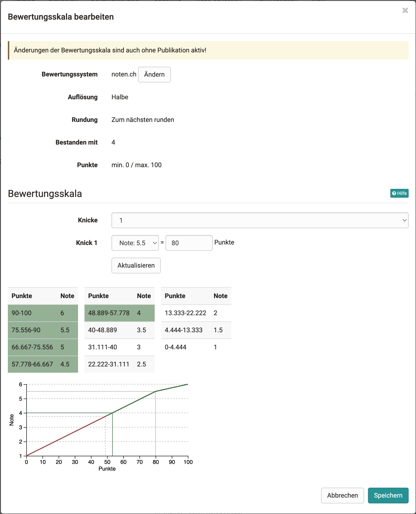

# Release Notes 16.2

* * *

:material-calendar-month-outline: **Releasedatum: 01.04.2022 • Letztes Update: 20.10.2022**

* * *

Mit OpenOlat 16.2 geben wir unseren nächsten Major Release frei.

Vor allem im Bereich der Online-Tests und Bewertung gibt es viele Neuerungen. Ein umfangreiches neues Feature ist der **Prüfungschat** mit eigenem Kommunikationsbereich, um Teilnehmende während der Online-Prüfung besser betreuen und auf deren Fragen reagieren zu können. Die **Übertragung von Punkten in Noten oder andere Bewertungsskalen** schafft bessere Vergleichbarkeit und die Voraussetzung zur Weiterverarbeitung der Leistungen. Ein konsistenter Freigabeprozess der Leistungen, die neu strukturierte und mit Grafiken angereicherte **Gestaltung der Bewertungswerkzeug-Übersicht**, der **PDF-Export** für Testresultate und CP-Lerninhalte sowie ergänzende Informationen im Bewertungsformular für Betreuende sind nur einige der zahlreichen Verbesserungen. Die **erweiterte Safe Exam Browser Konfiguration** erleichtert dessen Einsatz. **Upgrades** für den HTML-Editor "TinyMCE", Mathjax für Latex-Formeln und ein neuer integrierter Formeleditor bereichern diesen Release. Darüber hinaus wurde das **OpenOlat-Handbuch migriert** von Confluence ins Markdown basierten MKDocs für einen effizienten Bearbeitungsworkflow und flexiblere Aufteilung der einzelnen Bereiche.

Seit Release 16.1 wurden über 65 neue Funktionen und Verbesserungen zu OpenOlat hinzugefügt. Hier finden Sie die wichtigsten neuen Funktionen und Änderungen. Zusätzlich wurden mehr als 100 Bugs behoben. Die komplette Liste der Änderungen in 16.1 – 16.1.8 finden Sie [hier](Release_notes_16.1.de.md).

* * *

<iframe width="560" height="315" src="https://www.youtube.com/embed/nZ_zskD6R60" title="YouTube video player" frameborder="0" allow="accelerometer; autoplay; clipboard-write; encrypted-media; gyroscope; picture-in-picture" allowfullscreen></iframe>

* * *

## Ankündigung: Support-Ende IE11

!!! warning "Die Unterstützung für IE11 endet!"

    Für Internet Explorer 11 wird ab **Release 16.2** keine Wartung mehr erfolgen.
    
    Ab **Release 17.0** wird die Unterstützung komplett eingestellt. 

* * *

## Punkte in "Noten/Bewertungsskalen" übertragen

Das Bewertungsmodell von OpenOlat unterstützt bisher Punkte, die Ausgabe von Bestanden / Nicht bestanden und qualitative Bewertungen. Um die Leistungen vergleichen und weiterverarbeiten zu können, ist neu die Überführung der kursinternen Punkte in eine allgemein bekannte und anerkannte Skala "Note" oder andere Bewertungsskalen möglich.

Dafür können systemweit verschiedene **Bewertungssysteme** (numerisch oder textuell) angelegt werden. Diese sind anschliessend für alle bewertbaren Kursbausteine als **Bewertungsskala** verfügbar. Bei Bedarf kann die gewählte Bewertungsskala zur Verwendung für den jeweiligen Kursbaustein angepasst werden.

Bei Aktivierung auf dem Kursbaustein werden - über eine **manuelle oder automatische Zuweisung** - die Punkte der Teilnehmenden zusätzlich auch als beispielsweise "Note", "Level", "Niveau" oder ähnliches ausgewiesen.

[Mehr dazu direkt im Handbuch](../manual_user/learningresources/Assessment_translate_points_in_grades.de.md)

{ class="shadow lightbox" }

#### Beispiele für Bewertungsskalen

* 1-6
* A-F
* „sehr gut“ - „ungenügend“
* „Einsteiger“/„Spezialist“/„Experte“
* :smile: , :neutral_face: , :cry:

!!! info "Bewertungssystem-Vorlagen"

    Mit dem Feature werden gängige Noten- und Bewertungssysteme bereits auf ihrem OpenOlat-System angelegt sein.

#### Anzeige der Bewertung

Im Bewertungswerkzeug werden die Kennzahlen und Statistiken zu Noten/Bewertungsskalen in einem eigenen Abschnitt angezeigt.

{ class="shadow lightbox" }

Im Coachingtool finden Betreuende eine Übersicht der noch offenen Zuweisungen in einem neuen Bereich unter "Aufträge".

Teilnehmende sehen die zugewiesenen Bewertungen in ihrer Leistungsübersicht und überall dort, wo auch die Punkte ausgegeben werden.

* * *

## Betreuung von Online-Prüfungen per Chat und Video-Call

Bei Prüfungen, die von den Prüflingen zu Hause geschrieben werden (z.B. Open-Book Prüfung, Take-Home Exam), müssen die Aufsichtspersonen in der Lage sein, **mit den Prüflingen zu kommunizieren**. Ebenso müssen Prüflinge die Prüfungsaufsicht kontaktieren können, sollten z.B. Fragen zur Prüfung oder technische Probleme auftreten.

In OpenOlat wurde für diese Anforderungen eine entsprechende Infrastuktur geschaffen:

* Aufsichtspersonen können Nachrichten an alle Prüflinge senden (einseitige Broadcast-Nachticht)
* Der integrierte Prüfungs-Chat ermöglicht einen direkter Austausch zwischen Aufsichtsperson und Prüfling. Der Chat kann von beiden Seiten gestartet werden.
* Aufsichtspersonen können bei Bedarf eine BigBlueButton-Videokonferenz mit dem Prüfling starten und dort die Bildschirmfreigabe nutzen.

{ class="shadow lightbox" }

Zur Verwaltung der Benachrichtigungen steht den Aufsichtspersonen (Betreuenden) ein **neuer Bereich "Kommunikation"** am Kursbaustein "Test" zur Verfügung. Dort ist der Status der Anfragen ersichtlich und es wird angezeigt, welche Aufsichtsperson eine Anfrage bearbeitet. Es können auch mehrere Aufsichtspersonen einer Anfrage beitreten.

{ class="shadow lightbox" }

Darüber hinaus werden Aufsichtspersonen aktiv über Anfragen der Teilnehmenden aus laufenden Prüfung informiert, wenn sie den Prüfungskurs nicht geöffnet haben.

{ class="shadow lightbox" }

* * *

## Safe Exam Browser Konfiguration

Für die Verwendung des Safe Exam Browsers bei Online-Prüfungen konnten bisher die im [Safe Exam Browser](https://safeexambrowser.org) erstellten Konfigurations-Keys in OpenOlat hinterlegt werden.

Ergänzend wurden nun die **gängigen Safe Exam Browser Konfigurationen** ebenfalls in OpenOlat integriert, so dass Standard-Konfigurationen direkt in OpenOlat vorgenommen werden können. Die Konfigurationsdatei kann - je nach ausgewählter Option - vom Betreuenden oder auch von den Prüflingen selbst vor der Prüfung herunterlgeladen werden.

{ class="shadow lightbox" }

* * *

## Features im Bereich eAssessment

#### Bewertung: Verbesserung des Freigabeprozesses

Der bisherige Freigabestatus-Workflow für Bewertungen war für Autoren/Betreuende teilweise sehr intransparent und wurde je nach Kursbaustein unterschiedlich umgesetzt. Mit diesem Release wurde der **Freigabestatus-Workflow vereinheitlicht** und die Anzeige überarbeitet.

Gleichzeitig wurde das **Bewertungsformular optimiert** zur übersichtlichen Darstellung des jeweiligen Freigabestatus und die Aktionen zum Zwischenspeichern bzw. Abschliessen der Bewertung mit oder ohne Freigabe neu angeordnet.

#### Bessere Usability im Bewertungswerkzeug

Die Übersichtsseite des Bewertungswerkzeugs sowie die Darstellung der Daten wurde komplett **überarbeitet**. Nach dem neuen Konzept ist die Übersicht ein eigenständiger Navigationspunkt. Die Kurs-, Gruppen- und Curriculum-Teilnehmenden werden jeweils in separaten Bereichen zusammengefasst, **Grafiken** geben auf einen Blick den aktuellen Stand (z.B. zu Punktzahl oder Bestanden) wieder. Offene und noch freizugebende Bewertungen sind auf der rechten Seite kompakt dargestellt. Über **Verlinkungen** gelangt man zur entsprechend gefilterten Ansicht. Auf den einzelnen Kursbausteinen ist die neu strukturierte Übersicht ebenfalls verfügbar.

{ class="shadow lightbox" }

#### PDF-Export für Kursbaustein "Test"

Zusätzlich zur HTMl-Variante und den Rohdaten im Excel sind Testresultate nun auch als **Export inklusive PDF-Version** verfügbar.

Da der Export von Testresultaten im PDF-Format für viele Teilnehmer viel Zeit in Anspruch nimmt, werden Testresultat-Exporte nun asynchron durchgeführt. Das heisst, ausgelöste Exporte werden zunächst in OpenOlat generiert und können nach Fertigstellung heruntergeladen werden. Man kann also in der Zwischenzeit weiter in OpenOlat arbeiten. Sobald der Export zum Download verfügbar ist, erhält man eine E-Mail-Benachrichtigung mit dem Link zum Download. Die einzelnen Exporte können in einem eigenen **Exportbereich** am Kursbaustein "Test" verwaltet werden.

{ class="shadow lightbox" }

#### Neuer Formeleditor

Der neue Formeleditor ist im HTML-Editor integriert. Zusätzlich ermöglicht der Modus **"Rich Text Formattierung" bei Freitextfragen** mit dem neuen Formeleditor die **Eingabe mathematischer Formeln** als Antwort auf eine Fragestellung. Teilnehmende werden durch den visuellen Editor bei der Formelerfassung unterstützt und können zusätzliche Texte, z.B. zur Herleitung oder Erklärung ergänzen. Die dabei eingegebenen Formeln werden dabei _nicht_ mathematisch interpretiert und auf Korrektheit geprüft.

{ class="shadow lightbox" }

#### Teststatistiken auf Sektionsebene

Statistische Daten zu Tests waren bisher nur auf der obersten Ebene des Tests bzw. zu den einzelnen Fragen verfügbar. Ab sofort stehen die Statistiken auch auf Sektionsebene zur Verfügung.

* * *

## Neuerungen rund um Kurse

#### Für Autoren

{ class="shadow lightbox aside-right" }

* Quick-Add Aktion im Kurseditor, um neue Kursbausteine hinzuzufügen (s. Screenshot)
* Kurs-Teasertext, der unter "Meine Kurse" und auf der Infoseite angezeigt wird
* Verbessertes Hervorheben der Kursbausteintypen im Editor
* Option zum Öffnen von Scorm-Modulen im Vollbildmodus
* Kurs Kopier-Wizard:
    * Anzeige der Standardoptionen
    * Optionen für Test-Kusbaustein
    * Optionen für Dokumenten- und Betreuer-Ordner
    * Verschiebung von kursbausteinspezifischen Terminen auf ein bestimmtes Datum oder um eine bestimmte Anzahl von Tagen
* Kurslayout: verbessertes Verhalten bei Wechsel der Hintergrundfarbe
* Neues Design des HTML-Editors durch Versionsupdate

#### Für Betreuende

* Lernpfad: Lesesbestätigung von einzelnen Teilnehmenden kann durch Betreuer zurückgesetzt werden
* PDF-Export für Content Package Inhalte

* * *

## Weiteres, kurz notiert

* MathLive Editor Integration im HTML-Editor
    * Vorschau mathematischer Formeln im HTML-Editor
    * Formel-Element im Formular-Editor (Content-Editor)
* Platzhalter für Autovervollständigung in Suchfeldern
* Allgemeine Verbesserungen im Sinne der Barrierefreiheit, Login-Screen Optimierung
* Standard-Dokumenteneditor individuell konfigurierbar
* Steuerung der Veröffentlichung von Informations- und Wartungsmeldungen
* Neues Standardverhalten bei Klick auf Logo

* * *

## Technisches

* Handbuch-Migration von Confluence zu MKDocs
* Upgrade TinyMCE von Version 4 auf Version 5
* Upgrade Mathjax von Version 2 auf Version 3
* Bibliotheken von Drittanbietern aktualisiert
* Stabilisierung der Selenium-Tests

* * *

## Weitere Informationen

* [YouTrack Release Notes 16.2](https://track.frentix.com/releaseNotes?q=16.2.x&title=Release%20Notes%2016.2)
