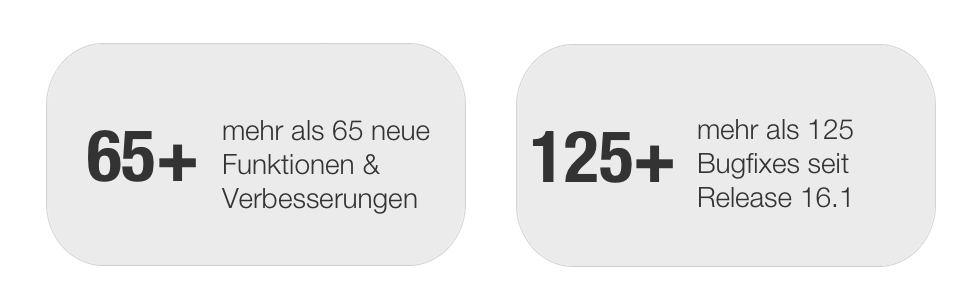

# Release Notes 16.2

Mit OpenOlat 16.2 geben wir unseren nächsten Major Release frei.

Seit Release 16.1 wurden über XX neue Funktionen und Verbesserungen zu OpenOlat hinzugefügt. Hier finden Sie die wichtigsten neuen Funktionen und Änderungen. Zusätzlich zu wurden mehr als 100 Bugs behoben. Die komplette Liste der Änderungen in 16.1 – 16.1.8 finden Sie [hier](Release_notes_16.1.md).

* * *

:material-calendar-month-outline: **Releasedatum: 01.04.2022 • Letztes Update: 01.04.2022**

* * *

## Ankündigung: Support-Ende IE11

!!! warning "Die Unterstützung für IE11 endet!"

    Für Internet Explorer 11 wird ab **Release 16.2** keine Wartung mehr erfolgen.
    
    Ab **Release 17.0** wird die Unterstützung komplett eingestellt. 

* * *

## Punkte in "Noten" übertragen

Das Bewertungsmodell von OpenOlat unterstützt bisher Punkte, die Ausgabe von Bestanden / Nicht bestanden und qualitative Bewertungen. Um die Leistungen vergleichen und weiterverarbeiten zu können, ist neu die Überführung der kursinternen Punkte in eine allgemein bekannte und anerkannte Skala "Note" möglich.

Dafür können systemweit verschiedene **Notensysteme** (numerisch oder textuell) angelegt werden. Diese sind anschliessend für alle bewertbaren Kursbausteine als **Notenskala** verfügbar. Bei Bedarf kann die gewählte Notenskala zur Verwendung für den jeweiligen Kursbaustein angepasst werden. Bei Aktivierung auf dem Kursbaustein werden - über eine **manuelle oder automatische Zuweisung** - die Punkte der Teilnehmenden zusätzlich als "Note" ausgewiesen.

#### Beispiele für Notenskalen

* 1-6
* A-F
* „sehr gut“ - „ungenügend“
* „Einsteiger“/„Spezialist“/„Experte“
* Smileys (lachend, neutral, traurig)

!!! info "Notensystem-Vorlagen"

    Mit dem Feature werden gängige Notensysteme bereits auf ihrem OpenOlat-System angelegt sein.

#### Anzeige der Noten

Im Bewertungswerkzeuges werden Noten und deren Statistiken in einem eigenen Abschnitt angezeigt. Im Coachingtool ist ein neuer Bereich unter "Aufträge" verfügbar, in dem Betreuenden eine Übersicht der noch offenen Notenzuweisungen finden. Teilnehmende finden die zugewiesenen Noten in ihrer Leistungsübersicht und überall dort, wo auch die Punkte ausgegeben werden.

* * *

## Betreuung von Online-Prüfungen per Chat

Bei Prüfungen, die von den Prüflingen zu Hause geschrieben werden (z.B. Open-Book Prüfung, Take-Home Exam), müssen die Aufsichtspersonen in der Lage sein, **mit den Prüflingen zu kommunizieren**. Ebenso müssen Prüflinge die Prüfungsaufsicht kontaktieren können, sollten z.B. Fragen zur Prüfung oder technische Probleme auftreten.

In OpenOlat wurde für diese Anforderungen eine entsprechende Infrastuktur geschaffen:

* Aufsichtspersonen können Nachrichten an alle Prüflinge senden (einseitige Broadcast-Nachticht)
* Der integrierte Prüfungs-Chat ermöglicht einen direkter Austausch zwischen Aufsichtsperson und Prüfling. Der Chat kann von beiden Seiten gestartet werden.
* Aufsichtspersonen können bei Bedarf eine BigBlueButton-Videokonferenz mit dem Prüfling starten und dort die Bildschirmfreigabe nutzen.

Zur Verwaltung der Benachrichtigungen steht den Aufsichtspersonen (Betreuenden) ein **neuer Bereich "Kommunikation"** am Kursbaustein "Test" zur Verfügung. Dort ist der Status der Anfragen ersichtlich und es wird angezeigt, welche Aufsichtsperson eine Anfrage bearbeitet. Es können auch mehrere Aufsichtspersonen einer Anfrage beitreten.

Darüber hinaus werden Aufsichtspersonen aktiv über Anfragen der Teilnehmenden aus laufenden Prüfung informiert, wenn sie den Prüfungskurs nicht geöffnet haben.

* * *

## Safe Exam Browser Konfiguration

Für die Verwendung des Safe Exam Browsers bei Online-Prüfungen konnten bisher die im Safe Exam Browser erstellten Konfigurations-Keys in OpenOlat hinterlegt werden.

Ergänzend wurden nun die **gängigen Safe Exam Browser Konfigurationen** ebenfalls in OpenOlat integriert, so dass Standard-Konfigurationen direkt in OpenOlat vorgenommen werden können. Die Konfigurationsdatei kann - je nach ausgewählter Option - vom Betreuenden oder auch von den Prüflingen selbst vor der Prüfung herunterlgeladen werden.

* * *

## Features im Bereich eAssessment

#### Bewertung: Verbesserung des Freigabeprozesses

Der bisherige Freigabestatus-Workflow für Bewertungen war für Autoren/Betreuende teilweise sehr intransparent und wurde je nach Kursbaustein unterschiedlich umgesetzt. Mit diesem Release wurde der **Freigabestatus-Workflow vereinheitlicht** und die Anzeige überarbeitet.

Gleichzeitig wurde das **Bewertungsformular optimiert** zur übersichtlichen Darstellung des jeweiligen Freigabestatus und die Aktionen zum Zwischenspeichern bzw. Abschliessen der Bewertung mit oder ohne Freigabe neu angeordnet.

Ausserdem wurde die **Leistungsübersicht des Teilnehmenden** in das Bewertungsformular aufgenommen, so dass der/die Betreuende im Freigabeprozess dies zur Ansicht vorliegen hat.

#### Bewertungswerkzeug

Die Übersichtsseite des Bewertungswerkzeugs sowie die Darstellung der Daten wurde komplett **überarbeitet**. Nach dem neuen Konzept ist die Übersicht ein eigenständiger Navigationspunkt. Die Kurs-, Gruppen- und Curriculum-Teilnehmenden werden jeweils in separaten Bereichen zusammengefasst, **Grafiken** geben auf einen Blick den aktuellen Stand (z.B. zu Punktzahl oder Bestanden) wieder. Offene und noch freizugebende Bewertungen sind auf der rechten Seite kompakt dargestellt. Über **Verlinkungen** gelangt man zur entsprechend gefilterten Ansicht. Auf den einzelnen Kursbausteinen ist die neu strukturierte Übersicht ebenfalls verfügbar.

#### Kursbaustein "Test"

Zusätzlich zur HTMl-Variante und den Rohdaten im Excel sind Testresultate nun auch als **Export inklusive PDF-Version** verfügbar.

Da der Export von Testresultaten im PDF-Format für viele Teilnehmer viel Zeit in Anspruch nimmt, werden Testresultat-Exporte nun asynchron durchgeführt. Das heisst, ausgelöste Exporte werden zunächst in OpenOlat generiert und können nach Fertigstellung heruntergeladen werden. Man kann also in der Zwischenzeit weiter in OpenOlat arbeiten. Sobald der Export zum Download verfügbar ist, erhält man eine E-Mail-Benachrichtigung mit dem Link zum Download. Die einzelnen Exporte können in einem eigenen **Exportbereich** am Kursbaustein "Test" verwaltet werden.

#### Fragetyp "Formeleditor"

Der neue Fragetyp "Formeleditor" ermöglicht die **Eingabe mathematischer Formeln** als Antwort auf eine Fragestellung. Teilnehmende werden durch den visuellen Editor bei der Formelerfassung unterstützt und können zusätzliche Texte, z.B. zur Herleitung oder Erklärung ergänzen. Die dabei eingegebenen Formeln werden _nicht_ mathematisch interpretiert und auf Korrektheit geprüft.

#### Teststatistiken auf Sektionsebene

Statistische Daten zu Tests waren bisher nur auf der obersten Ebene des Tests bzw. zu den einzelnen Fragen verfügbar. Ab sofort stehen die Statistiken auch auf Sektionsebene zur Verfügung.

* * *

## Neuerungen rund um Kurse

#### Für Autoren

* Quick-Add Aktion, um neue Kursbausteine hinzuzufügen
* Kurs-Teasertext, der unter "Meine Kurse" und auf der Infoseite angezeigt wird
* Verbessertes Hervorheben der Kursbausteintypen im Editor
* Option zum Öffnen von Scorm-Modulen im Vollbildmodus
* Kurs Kopier-Wizard:
    * Anzeige der Standardoptionen
    * Optionen für Test-Kusbaustein
    * Optionen für Dokumenten- und Betreuer-Ordner
    * Verschiebung von kursbausteinspezifischen Terminen auf ein bestimmtes Datum oder um eine bestimmte Anzahl von Tagen
* Kurslayout: verbessertes Verhalten bei Wechsel der Hintergrundfarbe
* Neues Design des HTML-Editors durch Versionsupdate

#### Für Betreuende

* Lernpfad: Lesesbestätigung von einzelnen Teilnehmenden kann durch Betreuer zurückgesetzt werden
* PDF-Export für Content Package Inhalte

* * *

## Weiteres, kurz notiert

* MathLive Editor Integration im HTML-Editor
    * Vorschau mathematischer Formeln im HTML-Editor
    * Formel-Element im Formular-Editor (Content-Editor)
* Platzhalter für Autovervollständigung in Suchfeldern
* Allgemeine Verbesserungen im Sinne der Barrierefreiheit, Login-Screen Optimierung
* Standard-Dokumenteneditor individuell konfigurieren
* Steuerung der Veröffentlichung von Informations- und Wartungsmeldungen
* Neues Standardverhalten bei Klick auf Logo
* Trennung der Module "Lektionen" und "Abmeldungserfassung"

* * *

## Technisches

* Handbuch-Migration von Confluence zu MKDocs
* Upgrade TinyMCE von Version 4 auf Version 5
* Upgrade Mathjax von Version 2 auf Version 3
* Bibliotheken von Drittanbietern aktualisiert
* Stabilisierung der Selenium-Tests

* * *

## Weitere Informationen

* [Jira Release notes 16.2](https://jira.openolat.org/secure/ReleaseNote.jspa?projectId=10000&version=17802)
