# Release notes 16.2

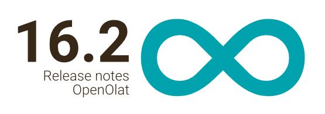

* * *

:material-calendar-month-outline: **Release date: 04/01/2022 - Last update: 04/14/2022**

* * *

With OpenOlat 16.2 we release our next major release.

Especially in the area of online testing and evaluation there are many new features. A major new feature is the **exam chat** with its own communication area to better support participants during the online exam and to respond to their questions. The **transfer of points into grades or other evaluation scales** creates better comparability and the prerequisite for further processing of the performances. A consistent approval process of the performances, the newly structured **design of the assessment tool overview** enriched with graphics, the **PDF export** for test results and CP learning content as well as supplementary information in the assessment form for supervisors are just some of the numerous improvements. The **enhanced Safe Exam Browser configuration** facilitates its use. **Upgrades** for the HTML editor "TinyMCE", Mathjax for Latex formulas and a new integrated formula editor enrich this release. In addition, the **OpenOlat manual has been migrated** from Confluence to the Markdown-based MKDocs for an efficient editing workflow and more flexible division of the individual sections.

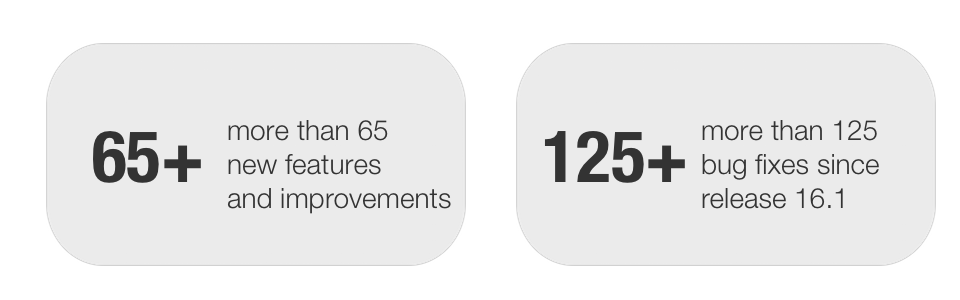

Since release 16.1, over 65 new features and improvements have been added to OpenOlat. Here you can find the most important new features and changes. In addition to, more than 100 bugs have been fixed. The complete list of changes in 16.1 - 16.1.8 can be found [here](Release_notes_16.1.md).

## Announcement: End of support IE11

!!! warning "Support for IE11 ends!"

    There will be no more maintenance for Internet Explorer 11 from **Release 16.2**.
    
    As of **Release 17.0**, support will be completely discontinued. 

* * *

## Transfer points to "Levels/Grading scales"

OpenOlat's scoring model previously supported points, pass/fail output, and qualitative scores. In order to be able to compare and further process the performances, the transfer of the course-internal points into a generally known and recognized scale "grade" or other evaluation scales is now possible.

For this purpose, different **grading systems** (numeric or textual) can be created system-wide. These are subsequently available for all assessable course elements as **grading scales**. If required, the selected grading scale can be adapted for use for the respective course element.

When activated on the course element - via **manual or automatic assignment** - the participant's points are additionally displayed as, for example, "grade", "level" or similar.

[More directly in the manual](../manual_user/course_operation/Assessment_translate_points_in_grades.md)

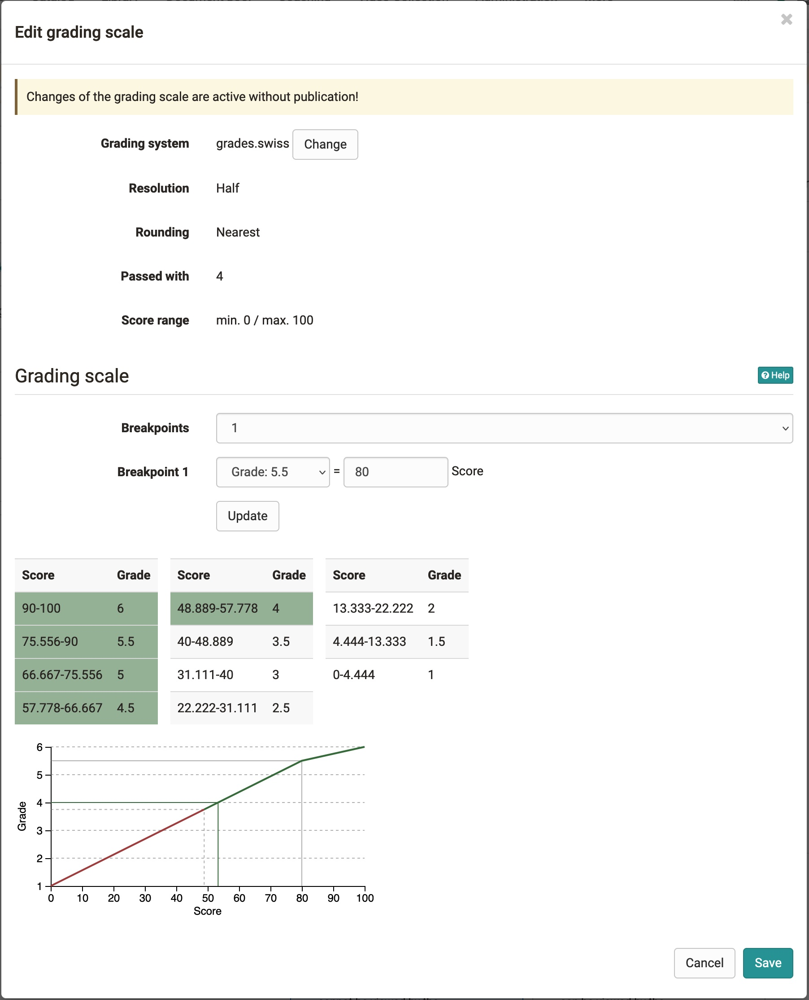{ class="shadow lightbox" }

#### Examples of grading scales

* 1-6
* A-F
* "very good" - "insufficient
* "beginner"/"specialist"/"expert
* :smile: , :neutral_face: , :cry:

!!! info "Grading System Templates"

    With this feature common grading systems will be already created on your OpenOlat system.

#### Display of the grades

In the grading tool, the key figures and statistics for grades are displayed in a separate section.

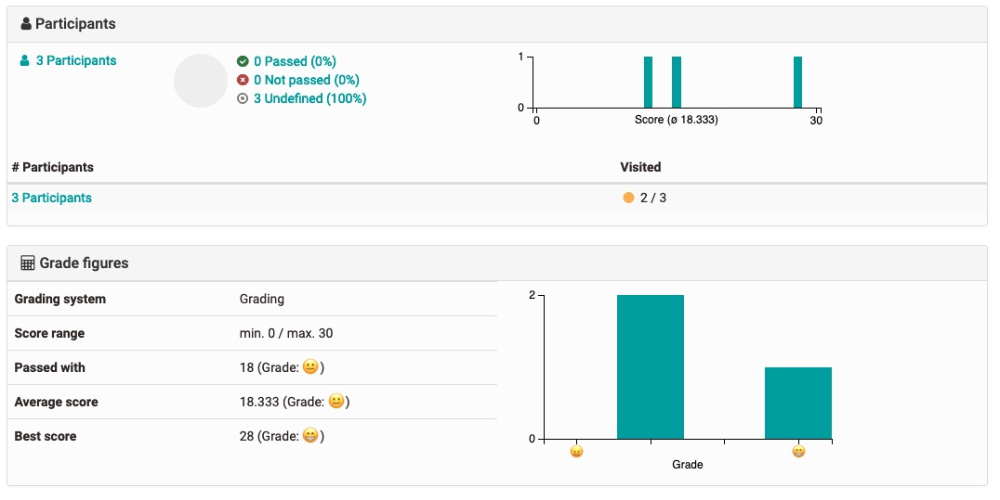{ class="shadow lightbox" }

In the coaching tool, coaches can find an overview of outstanding grade assignments in a new section under "Assignments".

Participants can see the assigned grades in their performance overview and everywhere where the points are also issued.

* * *

## Supervision of online exams via chat and video call

For exams written by examinees at home (e.g., Open-Book Exam, Take-Home Exam), proctors must be able to **communicate** with examinees. Similarly, examinees must be able to contact the exam proctor should, for example, questions about the exam or technical problems arise.

In OpenOlat, an appropriate infrastructure has been created for these requirements:

* Invigilators can send messages to all examinees (one-way broadcast message).
* The integrated exam chat enables a direct exchange between supervisor and examinee. The chat can be started from both sides.
* Supervisors can start a BigBlueButton video conference with the examinee if needed and use screen sharing there.

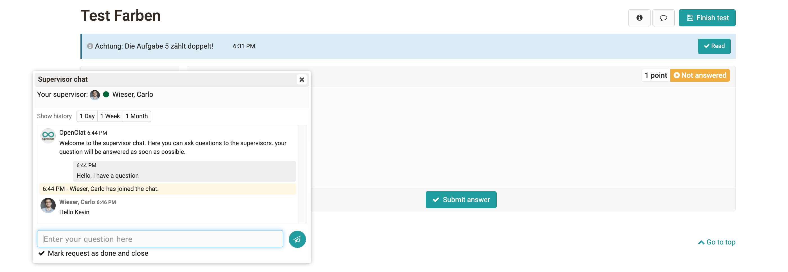{ class="shadow lightbox" }

For the administration of notifications, a **new area "Communication "** is available for the supervisors (supervisors) at the course element "Test". There, the status of the requests can be seen and it is displayed which supervisor is processing a request. It is also possible for several supervisors to join a request.

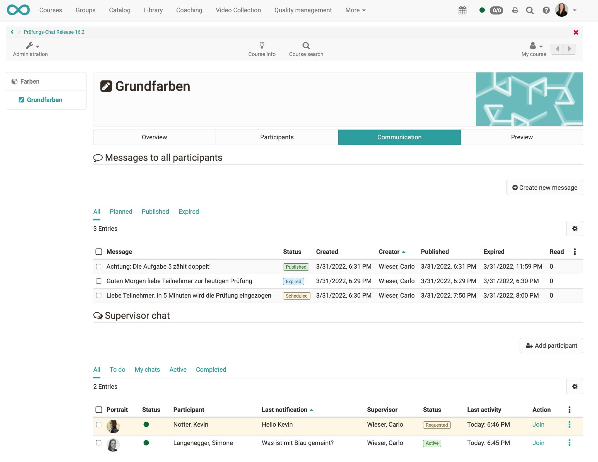{ class="shadow lightbox" }

In addition, supervisors are actively notified of participant requests from ongoing exams if they have not opened the exam course.

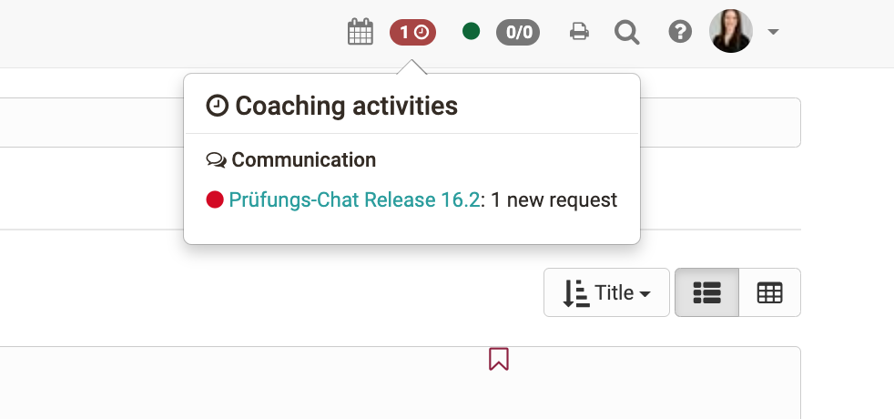{ class="shadow lightbox" }

* * *

## Safe Exam Browser configuration

For the use of the Safe Exam Browser in online exams, the configuration keys created in the [Safe Exam Browser](https://safeexambrowser.org) could previously be stored in OpenOlat.

In addition, the **standard Safe Exam Browser configurations** have now also been integrated into OpenOlat, so that standard configurations can be made directly in OpenOlat. The configuration file can - depending on the selected option - be downloaded by the supervisor or by the examinees themselves before the exam.

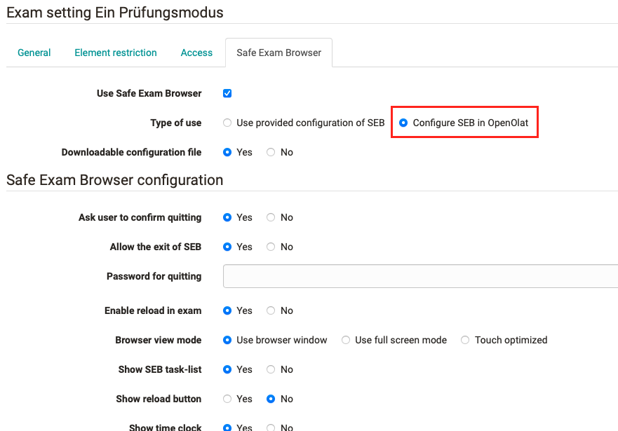{ class="shadow lightbox" }

* * *

## Features in the eAssessment area

#### Assessment: Improvement of the release process

The previous release status workflow for assessments was sometimes very intransparent for authors/supervisors and was implemented differently depending on the course element. With this release, the **release status workflow has been standardized** and the display has been revised.

At the same time, the **assessment form has been optimized** for a clear display of the respective release status and the actions for buffering or completing the assessment with or without release have been rearranged.

#### Better usability in the evaluation tool

The overview page of the assessment tool as well as the presentation of the data has been completely **revised**. According to the new concept, the overview is an independent navigation point. Course, group and curriculum participants are each summarized in separate areas, **graphs** show the current status (e.g. on score or pass) at a glance. Open assessments and assessments still to be released are shown compactly on the right-hand side. Via **links** you can access the corresponding filtered view. The newly structured overview is also available on the individual course elements.

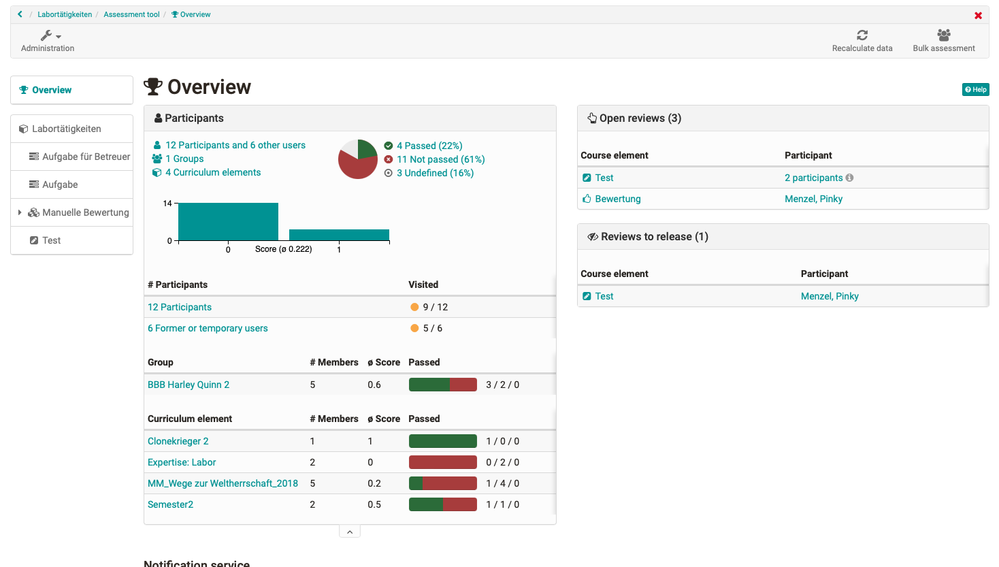{ class="shadow lightbox" }

#### PDF export for course element "Test".

In addition to the HTMl variant and the raw data in Excel, test results are now also available as **export including PDF version**.

Since exporting test results in PDF format takes a lot of time for many participants, test result exports are now performed asynchronously. This means that triggered exports are first generated in OpenOlat and can be downloaded after completion. So you can continue working in OpenOlat in the meantime. As soon as the export is available for download, one receives an e-mail notification with the link to the download. The individual exports can be managed in a separate **export area** at the course element "Test".

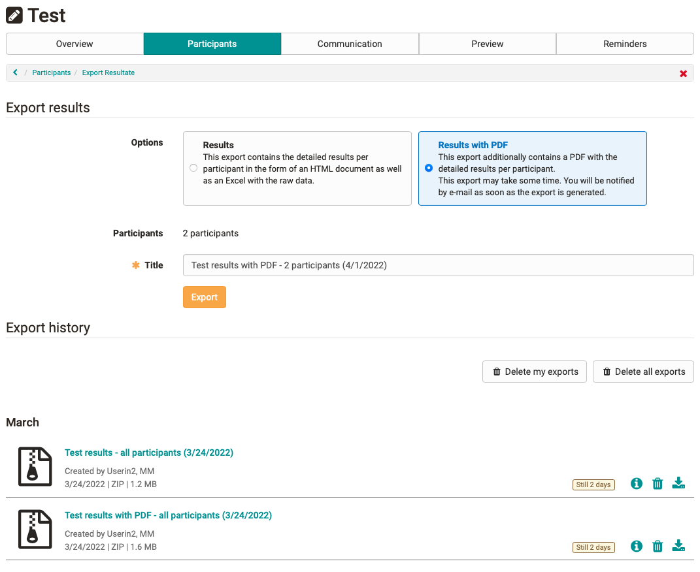{ class="shadow lightbox" }

#### New formula editor

The new formula editor is integrated into the HTML editor. In addition, the **"Rich Text Formatting" mode for free text questions** with the new formula editor allows **entering mathematical formulas** in response to a question. Participants are supported by the visual editor when entering formulas and can add additional text, e.g. for derivation or explanation. The formulas entered are _not_ mathematically interpreted and checked for correctness.

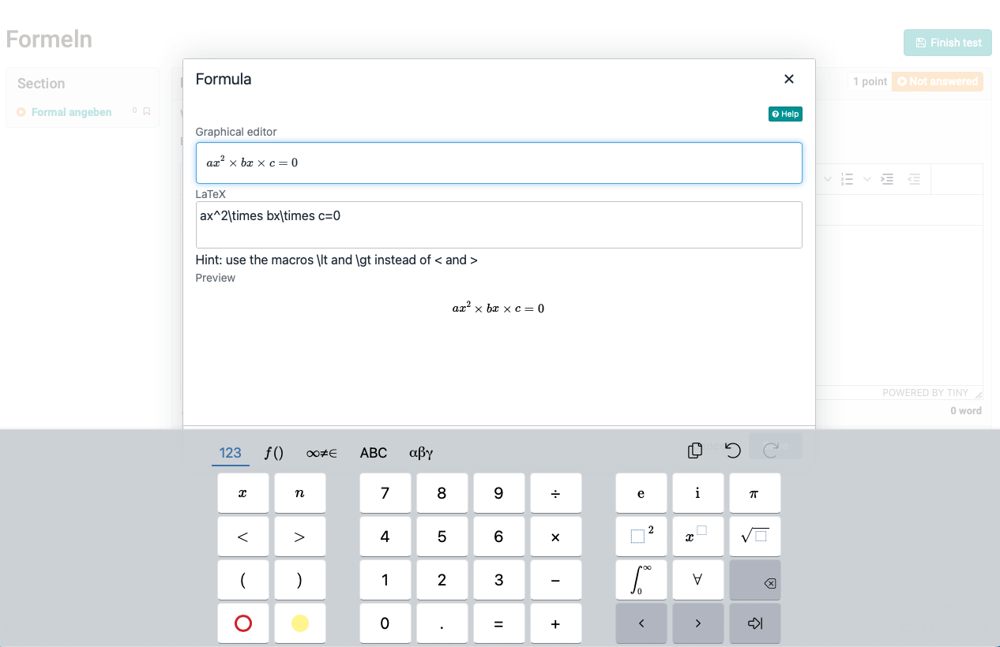{ class="shadow lightbox" }

#### Test statistics at section level

Until now, statistical data on tests was only available at the top level of the test or for the individual questions. From now on, statistics are also available on section level.

* * *

## New features around courses

#### For authors

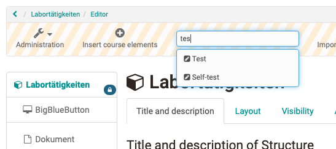{ class="shadow lightbox aside-right" }

* Quick-Add action in course editor to add new course elements (see screenshot).
* Course teaser text displayed under "My courses" and on the info page
* Improved highlighting of course element types in the editor
* Option to open Scorm modules in full screen mode
* Course copy wizard:
    * Display of default options.
    * Options for test course element
    * Options for document and tutor folders
    * Shifting of course element specific dates to a specific date or by a specific number of days
* Course layout: improved behavior when changing background color
* New design of HTML editor due to version update

#### For tutors

* Learning path: reading confirmation of individual participants can be reset by supervisor
* PDF export for content package content

* * *

## Further, briefly noted

* MathLive editor integration in HTML editor
    * Preview of mathematical formulas in HTML editor
    * Formula element in the form editor (content editor)
* Placeholder for autocomplete in search fields
* General improvements in terms of accessibility, login screen optimization
* Standard document editor individually configurable
* Control of publication of information and maintenance messages
* New default behavior when clicking on logo

* * *

## Technical

* Manual migration from Confluence to MKDocs
* Upgrade TinyMCE from version 4 to version 5
* Upgrade Mathjax from version 2 to version 3
* Third party libraries upgraded
* Stabilization of Selenium tests

* * *

## More information

* [Jira release notes 16.2.2](https://jira.openolat.org/secure/ReleaseNote.jspa?projectId=10000&version=18600)
* [Jira release notes 16.2.1](https://jira.openolat.org/secure/ReleaseNote.jspa?projectId=10000&version=18500)
* [Jira release notes 16.2](https://jira.openolat.org/secure/ReleaseNote.jspa?projectId=10000&version=17802)
