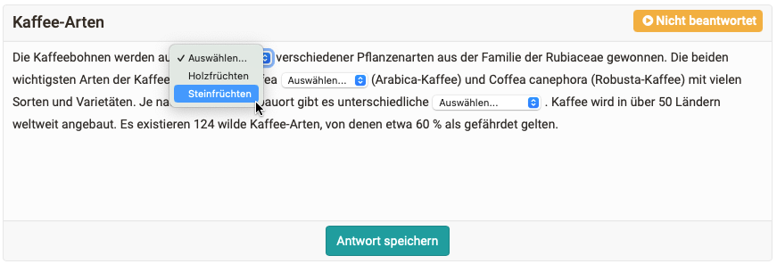

# Release Notes 17.0

* * *

:material-calendar-month-outline: **Releasedatum: 22.07.2022 • Letztes Update: 20.10.2022**

* * *

Mit OpenOlat 17.0 geben wir unseren nächsten Major Release frei.

Um den Wissenstransfer zu unterstützen, stellt der neue **Kursbaustein "Übung"** mit Lernkarten-Logik eine attraktive Alternative zu Tests und Selbsttest dar. Neben dem neuen Fragetyp **"Lückentext mit Dropdown"** sowie der Berücksichtigung von Testzeit-Verlängerungen und Nachteilsausgleich beim automatischen Prüfungsmodus wurden weitere Verbesserungen im Bereich eTesting umgesetzt. Im **Katalog 2.0** steht das Konzept "Suchen und Filtern" im Vordergrund sowie die optimierte und strukturierte **Darstellung des Angebots** durch Verknüpfung mit einer Taxonomie. Die **überarbeitete Freigabe- und Buchungskonfiguration** in Kursen ermöglicht es, das **Angebot organisationsspezifisch** zu präsentieren. **Externe Benutzer** können via Einladung gezielt Zugriff auf bestimmte Kurse und Gruppen erhalten. Die **Zoom-Integration** erweitert die Palette der Videokonferenztools, die in Kursen und Gruppen eingesetzt werden können. Vor allem der **Aufgabenbaustein** und die **Ordner-Komponente** wurden in Darstellung und Usability optimiert. Zudem werden weitere **OAuth Login-Provider** unterstützt.

Seit Release 16.2 wurden über 70 neue Funktionen und Verbesserungen zu OpenOlat hinzugefügt. Hier finden Sie die wichtigsten Neuerungen zusammengefasst. Zusätzlich wurden mehr als 105 Bugs behoben. Die komplette Liste der Änderungen in 16.2 – 16.2.8 finden Sie [hier](Release_notes_16.2.de.md).

* * *

<iframe width="560" height="315" src="https://www.youtube.com/embed/nduDDysYzws" title="YouTube video player" frameborder="0" allow="accelerometer; autoplay; clipboard-write; encrypted-media; gyroscope; picture-in-picture" allowfullscreen></iframe>

* * *

## Neuer Kursbaustein "Übung"

Ganz im Sinne von "Übung macht den Meister!" dient der neue Kursbaustein "Übung" vor allem dem Wissenstransfer und der Selbstüberprüfung.

#### Sicht Teilnehmende

Kursteilnehmende absolvieren sogenannte Challenges, in denen eine definierte Anzahl von Fragen beantwortet werden muss. Nicht korrekt beantwortete Fragen werden nach dem Lernkarten-Prinzip erneut abgefragt und somit gezielt wiederholt.

{ class="shadow lightbox" }

Nach Abschluss einer Challenge sind neben der Einordnung in Ranglisten auch detaillierte Statistiken zum Lernstand sowie eine zusammenfassende Übersicht verfügbar.

{ class="shadow lightbox" }

#### Sicht Kursautoren

Mit dem Baustein können geschlossene Fragen aus bestehenden Tests oder aus dem Fragenpool zum Üben wiederverwendet werden. Anhand der Metadaten der Frage-Items sind Übungszusammenstellungen wie beispielsweise "alle formativen Fragen aus dem Fachbereich *Addition Zahlenraum 100*" schnell und einfach möglich. Es können später auch weitere Fragen hinzugefügt oder bestehende geändert werden.

{ class="shadow lightbox" }

* * *

## Katalog 2.0

Kein umständliches "Browsen" mehr! Der neue Katalog 2.0 verwendet ein modernes "Suchen und Filtern"-Konzept, ist visuell ansprechend und attraktiv. Die Startseite kann mit Hilfe von "Launchern" individuell angepasst und das Angebot bestmöglich beworben werden. So können neben den neuesten, beliebtesten oder am häufigsten besuchten auch Kurse bestimmter Kategorien übersichtlich dargestellt werden. Die Katalogstruktur baut sich anhand der verwendeten Verschlagwortung (Taxonomie / Fachbereiche) auf. Die Kurse eines Fachbereiches können direkt über dir Microsites aufgerufen werden.

Mithilfe des integrierten Migrationstools kann einmalig die bestehende Katalogstruktur in das neue Format überführt werden. Ein Wechsel auf die alte Katalog-Ansicht wird ebenfalls untersützt.

[Mehr dazu direkt im Handbuch](../manual_user/area_modules/catalog2.0.de.md)

{ class="shadow lightbox" }

* * *

## Freigabe von Kursen: Angebot und Buchungen

Die Freigabe-Konfiguration für Kurse wurde überarbeitet und vereinfacht. Das neue Konzept realisiert eine Trennung zwischen dem administrativen Zugang (Wo ist der Kurs "zu Hause" und wer darf ihn administrieren?) sowie der Gültigkeit des Angebotes. Die Umstrukturierung dient insbesondere der Vorbereitung für die Freigabe im Katalog 2.0 und der mittelfristig geplanten Web-Publikation von Angeboten.

#### Sicht Autoren

Autoren können bei der Freigabe wählen zwischen *Privat* (Mitgliederverwaltung) sowie *Buchbare und offene Angebote*. Unter den Angeboten werden alle bestehenden Buchungsmethoden und neu auch die Optionen *Ohne Buchung* sowie der *Gastzugang* vereint.

Die Gültigkeit jedes einzelnen Angebotes kann - unabhängig vom Kursstatus - zeitlich terminiert und auf ausgewählte Organisationseinheiten eingeschränkt werden. Das bedeutet, der Kurs kann beispielsweise in Organisation A über einen Zugangscode gebucht werden, in Organisation B ist der Kurs nur die nächsten 6 Monate buchbar und muss via Paypal bezahlt werden.

{ class="shadow lightbox" }

Besonders hilfreich für Autoren ist die neue Freigabeübersicht, die angibt, welche (Zugriffs-)Berechtigungen die verschiedenen Kurs- und Systemrollen mit der aktuellen Freigabe-Konfiguration haben.

{ class="shadow lightbox" }

#### Sicht Teilnehmende

Teilnehmende sehen unter "Meine Kurse" alle Kurse, in denen sie eingebucht sind. Es wird dabei neu unterschieden zwischen Kursen *in Vorbereitung* und denen, die *Aktiv* sind.

{ class="shadow lightbox" }

* * *

## Zugriff via Einladung: Externe Benutzer

Analog zum ePortfolio ist es nun auch möglich, externe Benutzer als Teilnehmende oder Betreuende zu Kursen oder Gruppen einzuladen. Die Einladung erfolgt an eine E-Mail-Adresse, die Empfänger können sich anschliessend für OpenOlat ein Passwort setzen.

{ class="shadow lightbox" }

Nach dem Login gelangen sie auf eine vereinfachte Startseite mit der Übersicht zu allen Kursen, Gruppen und Portfolio-Mappen, für die sie eine Einladung erhalten haben.

{ class="shadow lightbox" }

#### Administration: Stufenweise Freigabe

Die Freigabe der Funktion für die genannten Bereiche und die Berechtigungen zum Versenden von Einladungen ist stufenweise konfigurierbar.

{ class="shadow lightbox" }

* * *

## Integration des Videokonferenztools "Zoom"

Nach BigBlueButton und MS Teams steht nun auch die Zoom-Integration zur Verfügung, die ebenfalls als *Kursbaustein sowie als Kurs- und Gruppenwerkzeug* aktiviert werden kann. Erstellte Zoom-Meetings sind automatisch inklusive Direkt-Link zum Meeting im OpenOlat-Kalender eingetragen.

{ class="shadow lightbox" }

#### Konfiguration

Die Integration ist über die LTI 1.3 App von Zoom realisiert. Nach erfolgreicher Konfiguration ist für Studierende und Dozierende kein zusätzliches Login notwendig. Zusätzlich werden auch mehrere parallele Zoom-Konfigurationen unterstützt. [Details zur Konfiguration](../manual_admin/administration/Zoom.de.md)

* * *

## Neuer Fragetyp: Lückentext mit Dropdown

Mit dem neuen Fragetyp "Lückentext mit Dropdown" ist es möglich, für jede Lücke mehrere Antwortmöglichkeiten vorzugeben. Teilnehmende wählen die passende Antwort aus einer Dropdown-Liste aus.

Es können *lokale* (= nur für diese Lücke verfügbare) oder *globale* (= in allen Lücken der Frage verfügbare) Antwortmöglichkeiten definiert werden. Optional kann eine zufällige Reihenfolge der Antwortmöglichkeiten im Dropdown aktiviert werden.

{ class="shadow lightbox" }

* * *

## Weitere Neuerungen im Bereich eAssessment

* Automatischer Prüfungsmodus: Berücksichtigung von Nachteilsausgleich und manueller Testzeit-Verlängerung
* Testdurchführung: Umbruch sehr langer Sektionstitel im Navigationsbereich links
* Verbesserung der Status-Anzeige für "Nicht bestanden"

* * *

## UI/UX Optimierungen

* Mitgliederverwaltung von Kursen und Lernressourcen: Neues Tabellen-Konzept mit Filtern
* Einführung von Ghost-Button
* **Aufgabenbaustein:** Vorschau-Aktion für bereitgestellte und abgegebene Dokumente/Videos sowie verbesserte Darstellung

    { class="thumbnail shadow lightbox" }

* **Ordner-Komponente:** Allgemein verbesserte Darstellung, Abspiel-Funktion für Videos sowie Verwendung der Ghost-Button
* Neuer Taxonomie-Browser mit verbesserter Such- und Auswahlfunktion für Fachbereiche

* * *

## Anpassungen im Bereich Administration

* Gruppen-Site: Neue Option zur Anzeige der Site nur für Gruppenmitglieder und -verwalter
* LTI1.3: Anpassung der Konfigurationsoptionen für mehr Konsistenz

* * *

## Weiteres, kurz notiert

* Kurse: Kurztitel-Anzeige in der Vorschau nur, wenn nicht im Titel enthalten
* Adaptive Anpassung der Grösse von Video-Untertiteln
* Direktes Abspielen von Videos, die als Datei vorliegen (ohne Player)
* QM-Modul: Migration der Black- und Whitelist von Curriculum-basiert zu Kurs-basiert

* * *

## Technisches

* Neue Login-Möglichkeiten:
    * OAuth 2.0 (mit Code-Flow)
    * Switch edu-ID (OAuth 2.0 Basis)
    * Datenlotsen SSO (Campusnet)
  
        { class="thumbnail shadow lightbox" }

* Neues UI für Login-Provider und zusätzliche Text-Bausteine auf der Startseite im Login-Screen
* Shibboleth: Mapping der Organisationszugehörigkeit
* Bibliotheken von Drittanbietern aktualisiert
* REST API:
    * Verbesserte Handhabung externer Zertifikate
    * Erweiterung zum Entfernen von Gruppen aus Kursen
* Sortierung der Übersetzungsschlüssel auf dem Translation Server zur Vorbereitung der Umsetzung genderneutraler Sprache

* * *

## Weitere Informationen

* [YouTrack Release Notes 17.0](https://track.frentix.com/releaseNotes?q=17.0.x&title=Release%20Notes%2017.0)
