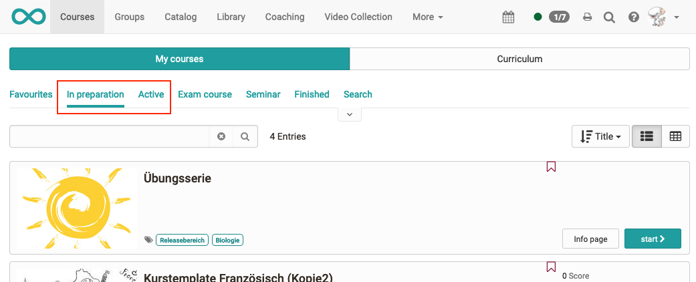

# Release notes 17.0

* * *

:material-calendar-month-outline: **Release date: 22/07/2022 • Last update: 10/20/2022**

* * *

With OpenOlat 17.0 we release our next major release.

To support knowledge transfer, the new **course element "Practice "** with flashcard logic is an attractive alternative to tests and self-testing. In addition to the new **"Gap with dropdown"** question type and the consideration of test time extensions and disadvantage compensation in the automatic exam mode, further improvements have been implemented in the e-testing area. In **Catalog 2.0**, the focus is on the "search and filter" concept as well as the optimized and structured **display of  offers** by linking it to a taxonomy. The **revised share and booking configuration** in courses enables the **offer to be presented in an organization-specific** manner. **External users** can be given targeted access to specific courses and groups via invitation. **Zoom integration** expands the range of video conferencing tools that can be used in courses and groups. Above all, the **Task component** and the **Folder component** have been optimized in terms of presentation and usability. In addition, further **OAuth login providers** are supported.

Since release 16.2, over 70 new features and improvements have been added to OpenOlat. Here you can find the most important new features and changes. In addition, more than 105 bugs have been fixed. The complete list of changes in 16.2 - 16.2.8 can be found [here](Release_notes_16.2.md).

* * *

## New course element "Practice"

In keeping with the motto "Practice makes perfect!", the new course element "Practice" is primarily intended for knowledge transfer and self-testing.

#### Participants view

Course participants complete so-called challenges in which a defined number of questions must be answered. Questions that are not answered correctly are asked again according to the flashcard principle and thus repeated in a targeted manner.

{ class="shadow lightbox" }

After completion of a challenge, detailed statistics on the learning status as well as a summary overview are available in addition to ranking lists.

{ class="shadow lightbox" }

#### Authors view

With this course element closed questions from existing tests or from the question pool can be reused for practicing. Based on the metadata of the question items, practice compilations such as "all formative questions from the subject area *addition number space 100*" are quick and easy. More questions can be added later or existing ones can be changed.

{ class="shadow lightbox" }

* * *

## Catalog 2.0

No more cumbersome "browsing"! The new catalog 2.0 uses a modern "search and filter" concept, is visually appealing and attractive. The start page can be customized with the help of "launchers" and the offer can be promoted most effectively. In this way, courses in specific categories can be clearly displayed alongside the newest, most popular or most frequently visited. The catalog structure is built up on the basis of the keywording used (taxonomy / subject areas). The courses of a subject area can be accessed directly via the microsites.

With the help of the integrated migration tool, the existing catalog structure can be transferred to the new format once. A change to the old catalog view is also supported.

[More information in the manual](../manual_user/area_modules/catalog2.0.md)

{ class="shadow lightbox" }

* * *

## Share of courses: Offer and bookings

The share configuration for courses has been revised and simplified. The new concept realizes a separation between the administrative access (Where is the course "at home" and who is allowed to administrate it?) and the validity of the offer. The restructuring serves in particular the preparation for the release in the catalog 2.0 and the medium-term planned web publication of offers.

#### Authors view

Authors can choose between *Private* (member administration) and *Bookable and open offers* when releasing. Under the offers all existing booking methods and new also the options *Without booking* as well as the *Guest access* are united.

The validity of each individual offer - independent of the course status - can be scheduled and restricted to selected organizational units. This means, for example, the course can be booked in organization A via an access code, in organization B the course is only bookable for the next 6 months and has to be paid via Paypal.

{ class="shadow lightbox" }

Especially helpful for authors is the new share overview, which indicates which (access) permissions the different course and system roles have with the current sharing configuration.

{ class="shadow lightbox" }

#### Participants view

Participants can see all courses they are enrolled in under "My courses". There is a new distinction between courses *in preparation* and those that are *active*.

{ class="shadow lightbox" }

* * *

## Access via invitation: External users

Analogous to ePortfolio, it is now also possible to invite external users as participants or coaches to courses or groups. The invitation is sent to an e-mail address, the recipients can then set a password for OpenOlat.

{ class="shadow lightbox" }

After logging in, they will be taken to a simplified home page with an overview of all courses, groups, and portfolio folders for which they have received an invitation.

{ class="shadow lightbox" }

#### Administration: Gradual release

The release of the function for the mentioned areas and the permissions to send invitations can be configured gradually.

{ class="shadow lightbox" }

* * *

## Integration of the "Zoom" video conferencing tool

After BigBlueButton and MS Teams, the Zoom integration is now available, which can also be activated as a *course element as well as a course and group tool*. Created Zoom meetings are automatically entered in the OpenOlat calendar including a direct link to the meeting.

{ class="shadow lightbox" }

#### Configuration

The integration is implemented via Zoom's LTI 1.3 app. After successful configuration, no additional login is required for students and coaches. Additionally, multiple parallel Zoom configurations are supported. [Configuration details](../manual_admin/administration/Zoom.md)

* * *

## New question type: Gap with dropdown

With the new question type "Gap with dropdown" it is possible to specify multiple answer options for each gap. Participants select the appropriate answer from a dropdown list.

It is possible to define *local* (= only available for this gap) or *global* (= available in all gaps of the question) answer options. Optionally, a random order of answer choices can be enabled in the dropdown.

{ class="shadow lightbox" }

* * *

## Further enhancements in the area of eAssessment

* Automatic assessment mode: Consideration of disadvantage compensation and manual test time extension
* Test execution: pagination of very long section titles in the navigation area on the left side
* Improvement of the status display for "failed

* * *

## UI/UX optimizations

* Member management of courses and learning resources: New table concept with filters
* Introduction of ghost button
* **Task course element:** Preview action for provided and submitted documents/videos as well as improved display

    { class="thumbnail shadow lightbox" }

* **Folder component:** General improved rendering, playback function for videos as well as use of ghost button
* New taxonomy browser with improved search and selection function for subject areas

* * *

## Administration customizations

* Group Site: New option to display the site only for group members and administrators
* LTI1.3: Adjustment of configuration options for more consistency

* * *

## Further, briefly noted

* Courses: Short title display in preview only if not included in title
* Adaptive resizing of video subtitles
* Direct playback of videos that are available as a file (without player)
* QM module: Migration of blacklist and whitelist from curriculum-based to course-based

* * *

## Technical

* New login options:
    * OAuth 2.0 (with code flow)
    * Switch edu-ID (OAuth 2.0 basis)
    * Data pilot SSO (Campusnet)
  
        { class="thumbnail shadow lightbox" }

* New UI for login providers and additional text modules on the start page in the login screen
* Shibboleth: mapping of organization membership
* Third party libraries updated
* REST API:
    * Improved handling of external certificates
    * Enhancement to remove groups from courses
* Translation key sorting on translation server to prepare for gender-neutral language implementation

* * *

## More information

* [YouTrack Release Notes 17.0](https://track.frentix.com/releaseNotes/OO?q=%2317.0.0%20&title=Release%20notes%2017.0)
* * [YouTrack Release Notes 17.0 - 17.0.8](https://track.frentix.com/releaseNotes/OO?q=%2317.0.*&title=Release%20notes%2017.0.*)

