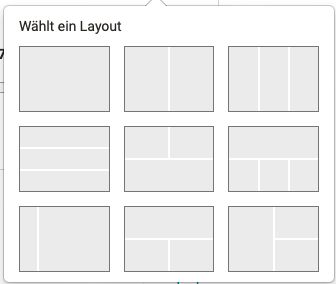

# Release Notes 17.1

* * *

:material-calendar-month-outline: **Releasedatum: 14.10.2022 • Letztes Update: 20.10.2022**

* * *

Mit OpenOlat 17.1 geben wir unseren nächsten Major Release frei.

In diesem Release stehen vor allem zahlreiche Optimierungen, funktionale Ergänzungen sowie jede Menge **UX/Usability** im Vordergrund. So ist das konstrutkive Feedback in die Verbesserung des **Katalogs 2.0** eingeflossen, der **Aufgabenbaustein** wurde visuell runderneuert, Fristen werden hervorgehoben, eine **verspätete Abgabe** ist möglich und es können Videos direkt im Browser als Lösung aufgenommen und hochgeladen werden. Darüber hinaus wurde der Content Editor um eine neue **Layout-Komponente** erweitert und im Authoring Bereich sind neue **Bulk-Actions** und ein optimierter **Wizard zur Kurserstellung** verfügbar. Die automatische **Teilnehmeransicht** für Autoren und Betreuende ist nur eine von vielen Verbesserungen in und um Kurse. Auch in der **Benutzerverwaltung** wurde aufgeräumt mit neuer Tabelle, neuem Filterkonzept und der Ausgabe zusätzlicher Daten wie Organisationen. Die Funktion zur **Einladung externer Benutzer** wurde weiter ausgebaut, und auch bei **BigBlueButton**, **Zoom** und am **Content Package** hat sich etwas getan. Ein weiterer Schritt wurde bei **Accessibility** und **Gender Neutralität** gemacht - diese   Themen werden uns noch einige Releases begleiten.

Seit Release 17.0 wurden über 70 neue Funktionen und Verbesserungen zu OpenOlat hinzugefügt. Hier finden Sie die wichtigsten Neuerungen zusammengefasst. Zusätzlich wurden mehr als 100 Bugs behoben. Die komplette Liste der Änderungen in 17.0 – 17.0.6 finden Sie [hier](Release_notes_17.0.de.md).

* * *

## Katalog 2.0 - Verbesserungen und Ergänzungen

Nach dem Start des Katalogs 2.0 im Release 17.0 wurde dieser weiter verfeinert und das Feedback unserer Community eingearbeitet. Folgende Neuerungen sind nun verfügbar:

* Die Katalog- und Taxonomieverwaltung wird vom Lernressourcenverwalter vorgenommen und kann direkt über den Katalog aufgerufen werden.
* Launcher für die Katalog-Startseite können auf Organisationseinheiten eingeschränkt und somit nur für User der entsprechenden Organisation freigegeben werden.
* Für den statischen Text-Launcher, der zum Beispiel als Beschreibung oder Einleitung für den Katalog dient, werden neu auch Media-Elemente wie Bilder und Videos unterstützt.
* "Leere" Launcher, die keine Lernressourcen-Angebote enthalten, werden ausgeblendet.
* Freigabe-Konfiguration von Lernressourcen: Die definierten Fachbereiche (= Taxonomie-Ebenen) für die Katalogfreigabe werden auch im Angebot entsprechend aufgeführt.
* Für die Darstellung der Lernressourcen auf der Katalog-Startseite (= Compact Card View) kann konfiguriert werden, welche zusätzlichen Informationen ausgegeben werden.
* Die Suche für mehrere Begriffe wurde optimiert.

* * *

## Authoring Bereich

#### Redesign des Wizards zur Erstellung von Kursen

Der Wizard zur Kurs-Erstellung wurde grundlegend überarbeitet, um die Autorenschaft noch besser zu unterstützen.

* Die Optimierung der Kurstypauswahl mit ergänzenden Informationen sowie Angabe geeigneter Szenarien erleichtert die Wahl des richtigen Kurstyps für das gewünschte Setup.
* Zusätzliche Eingabewerte ermöglichen es, bei der Kurserstellung bereits über den Wizard alle wichtigen Werte und Daten zu erfassen.
* Um Kurs-Duplikate zu vermeiden, wurden verschiedene Validierungen und Warnhinweise ergänzt.

{ class="shadow lightbox" }

#### Weitere Verbesserungen

* Über die Sammelaktion "Status ändern" kann der Publikationsstatus gleichzeitig für mehrere ausgewählte Lernressourcen gesetzt werden.
* Der "Didaktische Typ" heisst nun "Durchführungsformat".

* * *

## Optimierter und erweiterter Aufgabenbaustein

Der Aufgabenbaustein wartet mit einer visuellen Generalüberholung und neuen Funktionen auf.

#### Visuelles Redesign und Timer-Funktionalität

Die Strukturierung der einzelnen Schritte wurde klarer gestaltet und eine Status-Anzeige eingeführt, um einen besseren Überblick zum aktuellen Bearbeitungsstand zu gewährleisten. Zeiten und Fristen, wie zum Beispiel eine Abgabe-Deadline, werden deutlicher für Teilnehmende und Betreuende ausgewiesen.

{ class="shadow lightbox" }

#### Verspätete Abgabe

Für Aufgabenstellungen, die eine längere Bearbeitungsdauer vorsehen, wird oft nach Ablauf der Einreichungsfrist ein zusätzlicher späterer Abgabetermin ermöglicht. So werden abgegebene Lösungen auch nach der offiziellen Einreichungsfrist akzeptiert, meist in Verbindung mit einem Punkteabzug.

Im Aufgabenbaustein wurde die Möglichkeit ergänzt, eine solche verspätete Abgabe zu konfigurieren. Diese Nachfrist wird den Teilnehmenden transparent bei der Bearbeitung der Aufgabe angezeigt. Für Betreuende ist ebenfalls ersichtlich, wenn Teilnehmende ihre Dokumente erst in der Nachfrist eingereicht haben.

{ class="shadow lightbox" }

####  Video Recorder

Bisher konnten im Aufgabenbaustein Dokumente verschiedener Formate sowie Videos hochgeladen werden. Für einen noch flexibleren Einsatz des Bausteins können neu auch Videos direkt im Baustein erstellt und eingereicht werden. Ein generischer Videoaufnahme-Controller bietet dabei die Funktionalität, eine Live-Aufnahme im Browser über die lokale Computer-Kamera oder separate Handy-Kamera anzufertigen und diese hochzuladen.

So können zum einen Betreuende schnell und unkompliziert Video-Aufgabenstellungen bereitstellen, zum anderen können Teilnehmende ihre selbst erstellten Videos einreichen. Dies bietet vor allem für Aufgabenstellungen im Sprachbereich oder mit praktischem Anteil neue Möglichkeiten.

<!--
Nicht-frentix Kunden: Achtung -- Transcoding
-->

* * *

## Optimierungen für ePortfolio- und Formular-Editor

Der bestehende Editor zur Erstellung von Formularen und ePortfolio-Einträgen wurde neu gestaltet.

Die bisher verwendeten Container wurden durch eine neue Layout-Komponente ersetzt. So kann schnell und einfach aus den fertigen Vorlagen das gewünschte Layout zusammengesetzt und nachfolgend mit Inhalten gefüllt werden.

{ class="shadow lightbox" }

Zudem wurden die Einstellungen vom jeweiligen Inhaltselement (z.B. Paragraph oder Bild) in den "Inspector" zur Formatierung der Inhalte überführt.

{ class="shadow lightbox" }

Mittelfristig soll der Editor standardmässig zur Erstellung von Kursinhalten zur Verfügung stehen und wird in den folgenden Releases immer weiter ausgebaut.

* * *

## Neuerungen im Kurs

#### Teilnehmeransicht: Kursvorschau für Autoren und Betreuende

Kursautoren und -betreuende mussten sich bisher manuell auch die Teilnehmer-Rolle zuweisen (lassen), um den Kurs aus Sicht der Lernenden einzusehen. Als "echte" Teilnehmende wurden sie dadurch auch in der Liste der Kursmitglieder und im Bewertungswerkzeug aufgeführt.

Mit Release 17.1 wird die Teilnehmeransicht eingeführt. Dieses ist automatisch für Kursbesitzer und -betreuende verfügbar und ermöglicht eine Vorschau des Kurses aus der Teilnehmendenperspektive. Alle Aktivitäten, die in der Teilnehmeransicht durchgeführt werden, werden vom System gepeichert.

{ class="shadow lightbox" }

#### Template Ordnerstruktur im Teilnehmerordner

Mit dem Teilnehmerordner können Betreuende individuelle Handouts an Teilnehmende verteilen und auf die eingereichten Dokumente der Teilnehmenden zugreifen.

Neu können Betreuende bereits eine bestimmte Ordnerstruktur im Voraus für die Teilnehmenden anlegen, um die Strukturierung der eingereichten Dokumente zu vereinheitlichen und die Abgabe zu erleichtern.

#### UX / Usability im Kurs

* Die Benennung der Kursbaustein-Tabs wurde vereinheitlicht und die Tab-Navigation beim Wechsel zwischen Kursbausteinen optimiert.
* Eine verbesserte Anordnung der Bewertungseinstellungen in Kursen sorgt für Übersichtlichkeit.
* Die Anzeige und Filterung von Mitgliedern / Nicht-Mitgliedern in der Übersicht und Teilnehmendenliste bewertbarer Bausteine wurde optimiert.
* Benutzer erhalten einen Hinweis und zusätzliche Informationen, warum ein Kurs noch nicht zugänglich ist.

#### Weitere Neuerungen, ganz kompakt

* Tests:
    * Korrektur während Testdurchlauf gesperrt
    * Zusätzlicher Hinweis für Autoren, wenn manuelle Korrektur und sofortige Anzeige der Test-Resultate konfiguriert ist
    * Testarchivierung ohne PDF möglich
* Lernpfad-Kurs:
    * Neues Erledigungskriterium “alle Checkboxen” zum Abschluss des Bausteins
    * Kursvorschau (Simulation) für Lernpfadkurse entfernt
* Anonyme Gäste in Bewertungswerkzeug nicht mehr anzeigen
* Manuelle Bewertung: Optimierte Bearbeitung von Rubric-Formularen
* E-Mail Baustein: Vorkonfigurierter Betreff ist für Versendende nicht editierbar
* Abspiel-Funktion für Audios im Ordner und Aufgabenbaustein sowie beim Upload als Lernressource

* * *

## Gender Neutralität

Diese umfangreiche Thema startet mit den unterschiedlichen Anreden in Mailtexten. Bisher verwendete Anreden wie "Sehr geehrte/r", "Liebe/r" und ähnliches wurden einheitlich auf “Guten Tag” geändert. (betrifft nur deutsche Texte)

* * *

## Accessibility Initiative

Hier wurden vor allem Alternativ-Texte und zusätzliche Aria-Tags für Bilder umgesetzt.

* * *

## Optimierte Benutzerverwaltung

Auch in der Benutzerverwaltung wurden vor allem Optimierungen aus UX- und Usability-Sicht umgesetzt:

* Tabellen wurden in das neue Konzept mit verbesserten Filtern überführt.
* Für die Benutzer ist nun auch die Zurodnung zu Organisationen sichtbar und es kann nach Organisationen gefiltert werden.
* Die Sammelaktionen wurden optimiert und um die Datenfelder Benutzerrolle und Organisation ergänzt.

{ class="shadow lightbox" }

* * *

## Noch mehr UX- und Usability, kurz notiert

* Optimierungen Group Life Cycle:
    * Optimiertes Labeling sowie ergänzende Informationen für Filter und Tabellen
    * Option zum Ausschluss einzelner Gruppen von den automatischen Lösch-Methoden
    * Verbesserte Visualisierung pro Gruppe, ob das manuelle oder automatische Löschen greift
        { class="shadow lightbox" }

* Optimiertes Labeling zur besseren Unterscheidung von Test-Korrektur im Kurs, Korrektur mit Aufträgen und Noteneinstufung
* Verbesserte Meldung für anonyme Gäste bei Zugriff auf nicht zugängliche Bereiche in OpenOlat
* Kleinere kosmetische und funktionale Verbesserungen für den Taxonomy Chooser
* Optimierte Ausrichtung der zugeordneten Taxonomien in der Kursübersicht
* Optimiertes Dropdown-Menü zur Auswahl von Organisationen

* * *

## Was sonst noch neu ist

* Externe Benutzer:
    * Es können nun auch mehrere externe Personen gleichzeitig zu einem Kurs oder einer Gruppe eingeladen werden.
    * Einladungen können inaktiviert bzw. reaktiviert werden.
    * Es wurden zahlreiche weitere Optimierungen in Bezug auf die Anzeige und den Einladungsworkflow umgesetzt.
* Big Blue Button: Zum Speicherplatz sparen kann das automatische Löschen von BBB-Meetings und Aufzeichnungen in der Administration konfiguriert werden.
* Zoom:
    * Optional kann das automatische Anlegen von Kalendereinträgen durch Zoom verhindert werden.
    * Eine Referenzliste zeigt, wo (Kursbaustein, Kurswerkzeug, Gruppenwerkzeug) das Zoom-Profil verwendet wird.
* Content Package:
    * Ein systemweiter CSS Header / Footer ist für PDF-Export möglich.
    * Bei inhaltlichen Änderungen kann optional eine Benachrichtigung an Mitglieder der Kurse versendet werden, in denen das Content Package referenziert ist.
* SEB Integration: Die Unterstützung für den Quit-Link wurde ergänzt.

* * *

## Technisches

* Bibliotheken von Drittanbietern aktualisiert und Code-Bereinigung
* Performance-Optimierung unter Kurse > "Meine Kurse"

* * *

## Weitere Informationen

* [Jira Release Notes 17.1.1](https://jira.openolat.org/secure/ReleaseNote.jspa?projectId=10000&version=19501)
* [Jira Release Notes 17.1.0](https://jira.openolat.org/secure/ReleaseNote.jspa?projectId=10000&version=18900)
