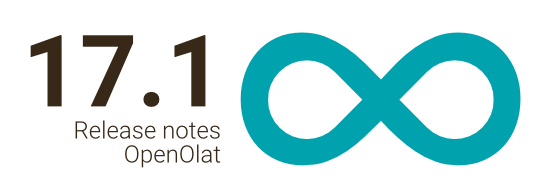

# Release notes 17.1

* * *

:material-calendar-month-outline: **Release date: 10/14/2022 • Last update: 03/03/2023**

* * *

With OpenOlat 17.1 we release our next major release.

In this release, the focus is primarily on numerous optimizations, functional additions and a lot of **UX/Usability**. For example, the construtive feedback has been incorporated into the improvement of the **Catalog 2.0**, the **Task element** has been visually reworked, deadlines are highlighted, a **late submission** is possible and videos can be recorded and uploaded directly in the browser as a solution. In addition, a new **layout component** has been added to the content editor, and new **bulk actions** and an optimized **course creation wizard** are available in the authoring area. The automatic **participant view** for authors and coaches is just one of many improvements in and around courses. The **User Management** has also been cleaned up with a new table, new filter concept and the output of additional data like organizations. The function to **invite external users** has been further expanded, and also **BigBlueButton**, **Zoom** and **Content Package** have been further improved. A further step was made in **Accessibility** and **Gender Neutrality** - these topics will accompany us for a few more releases.

Since release 17.1, over 70 new features and improvements have been added to OpenOlat. Here you can find the most important new features and changes. In addition, more than 100 bugs have been fixed. The complete list of changes in 17.0 - 17.0.6 can be found [here](Release_notes_17.0.md).

* * *

## Catalog 2.0 - Improvements and Additions

After the launch of Catalog 2.0 in Release 17.0, it has been further refined and feedback from our community has been incorporated. The following new features are now available:

* Catalog and taxonomy management is done by the learning resource manager and can be accessed directly from the catalog.
* Launcher for the catalog start page can be restricted to organizational units and thus only shared with users of the corresponding organization.
* Media elements such as images and videos are now also supported for the static text launcher, which serves as a description or introduction for the catalog, for example.
* "Empty" launchers that do not contain learning resource offerings are hidden.
* Learning resource share configuration: The defined subject areas (= taxonomy levels) for catalog release are also listed accordingly in the offer.
* For the display of learning resources on the catalog start page (= Compact Card View), it is possible to configure which additional information is output.
* Searching for multiple terms has been optimized.

* * *

## Authoring area

#### Redesign of the course creation wizard

The course creation wizard has been thoroughly redesigned to better support authorship.

* Optimization of the course type selection with additional information as well as specification of suitable scenarios makes it easier to choose the right course type for the desired setup.
* Additional input values make it possible to enter all important values and data already via the wizard during course creation.
* To avoid course duplicates, various validations and warnings have been added.

{ class="shadow lightbox" }

#### Other improvements

* Using the bulk action "Change status", the publication status can be set for several selected learning resources at the same time.
* The " Didactical type" is now called "Implementation format".

* * *

## Optimized and extended task element

The task element comes up with a visual general overhaul and new functions.

#### Visual redesign and timer functionality

The structuring of the individual steps has been made clearer and a status display has been introduced to provide a better overview of the current processing status. Times and deadlines, such as a submission deadline, are displayed more clearly for participants and coaches.

{ class="shadow lightbox" }

#### Late submission

For tasks that require a longer time to complete, an additional late submission date is often allowed after the submission deadline. Thus, submitted solutions are accepted even after the official submission deadline, usually in conjunction with a point deduction.

In the task element, the possibility to configure such a late submission has been added. This grace period is transparently displayed to the participants when processing the task. Coaches can also see if participants have submitted their documents after the grace period.

{ class="shadow lightbox" }

#### Video Recorder

Up to now, documents of different formats as well as videos could be uploaded in the task element. For an even more flexible use of the task, videos can now also be created and submitted directly in the element. A generic video recording controller offers the functionality to create a live recording in the browser via the local computer camera or separate cell phone camera and upload it.

On the one hand, coaches can quickly and easily provide video assignments, and on the other hand, participants can submit their own videos. This offers new possibilities, especially for tasks in the language area or with a practical component.

<!--
Non-frentix customers: Attention -- Transcoding
-->

* * *

## Optimizations for ePortfolio and form editor

The existing editor for creating forms and ePortfolio entries has been redesigned.

The previously used containers have been replaced by a new layout component. Thus, the desired layout can be quickly and easily assembled from the ready-made templates and subsequently filled with content.

{ class="shadow lightbox" }

In addition, the settings from the respective content element (e.g. paragraph or image) were transferred to the "Inspector" for formatting the content.

{ class="shadow lightbox" }

In the medium term, the editor should be available by default for the creation of course content and will be extended more and more in the following releases.

* * *

## New features in the course

#### Participant view: Course preview for authors and coaches

Until now, course authors and coaches had to manually assign the participant role to view the course from the learner's perspective. As a result, they were also listed as "real" participants in the list of course members and in the assessment tool.

Release 17.1 introduces the participant view. This is automatically available to course owners and coaches and allows them to preview the course from the participant perspective. All activities performed in the participant view are saved by the system.

{ class="shadow lightbox" }

#### Template Folder structure in participant folder

With the participant folder, coaches can distribute individual handouts to participants and access the documents submitted by the participants.

Coaches can now create a specific folder structure for participants in advance in order to standardize the structure of submitted documents and facilitate submission.

#### UX / Usability in the course

* Unified course element tab naming and optimized tab navigation when switching between course elements.
* Improved arrangement of assessment settings in courses provides clarity.
* Display and filtering of members / non-members in the overview and participant list of assessable course elements has been optimized.
* Users receive a hint and additional information why a course is not yet accessible.

#### Other innovations, quite compact

* Tests:
    * Correction locked during test run
    * Additional hint for authors if manual correction and immediate display of test results is configured
    * Test archiving without PDF possible
* Learning path course:
    * New completion criterion "all checkboxes" to complete the module
    * Course preview (simulation) for learning path courses removed
* No longer show anonymous guests in assessment tool
* Manual assessment: Optimized editing of Rubric forms
* Email module: Preconfigured subject is not editable for sender
* Playback function for audios in folder and task module as well as when uploading as learning resource

* * *

## Gender neutrality

This extensive topic starts with the different salutations in mail texts. Previously used salutations such as "Sehr geehrte/r", "Liebe/r" and similar have been uniformly changed to "Guten Tag". (concerns only German texts)

* * *

## Accessibility Initiative

Here, mainly alternative texts and additional aria tags for images were implemented.

* * *

## Optimized user administration

Optimizations from UX and usability point of view were also mainly implemented in the user administration:

* Tables were transferred to the new concept with improved filters.
* For users, the assignment to organizations is now also visible and it is possible to filter by organization.
* The bulk actions have been optimized and the data fields user role and organization have been added.

{ class="shadow lightbox" }

* * *

## Even more UX and usability, briefly noted

* Optimizations Group Life Cycle:
    * Optimized labeling as well as additional information for filters and tables.
* Option to exclude individual groups from automatic deletion methods
    * Improved visualization per group, if manual or automatic deletion takes effect
        { class="shadow lightbox" }

* Optimized labeling to better distinguish test correction in course, correction assignments, and grading.
* Improved notification for anonymous guests when accessing inaccessible areas in OpenOlat
* Minor cosmetic and functional improvements for the Taxonomy Chooser
* Optimized alignment of assigned taxonomies in the course outline
* Optimized dropdown menu for selecting organizations

* * *

## What else is new

* External users:
    * Multiple external people can now be invited to a course or group at the same time.
    * Invitations can be inactivated or reactivated.
    * Numerous other display and invitation workflow optimizations have been implemented.
* Big Blue Button: To save storage space, automatic deletion of BBB meetings and recordings can be configured in Administration.
* Zoom:
* Optionally, automatic creation of calendar entries by Zoom can be prevented.
    * A reference list shows where (course element, course tool, group tool) the Zoom profile is used.
* Content Package:
    * A system-wide CSS header / footer is possible for PDF export.
    * In case of content changes, a notification can optionally be sent to members of the courses in which the content package is referenced.
* SEB Integration: Support for the Quit link has been added.

* * *

## Technical

* Third-party libraries updated and code cleaned up
* Performance optimization under Courses > "My Courses

* * *

## More information

* [Jira Release Notes 17.1.10](https://jira.openolat.org/secure/ReleaseNote.jspa?projectId=10000&version=20400){:target="_blank”}
* [Jira Release Notes 17.1.9](https://jira.openolat.org/secure/ReleaseNote.jspa?projectId=10000&version=20300){:target="_blank”}
* [Jira Release Notes 17.1.8](https://jira.openolat.org/secure/ReleaseNote.jspa?projectId=10000&version=20100){:target="_blank”}
* [Jira Release Notes 17.1.7](https://jira.openolat.org/secure/ReleaseNote.jspa?projectId=10000&version=20000){:target="_blank”}
* [Jira Release Notes 17.1.6](https://jira.openolat.org/secure/ReleaseNote.jspa?projectId=10000&version=19803){:target="_blank”}
* [Jira Release Notes 17.1.5](https://jira.openolat.org/secure/ReleaseNote.jspa?projectId=10000&version=19802){:target="_blank”}
* [Jira Release Notes 17.1.4](https://jira.openolat.org/secure/ReleaseNote.jspa?projectId=10000&version=19800){:target="_blank”}
* [Jira Release Notes 17.1.3](https://jira.openolat.org/secure/ReleaseNote.jspa?projectId=10000&version=19700){:target="_blank”}
* [Jira Release Notes 17.1.2](https://jira.openolat.org/secure/ReleaseNote.jspa?projectId=10000&version=19603){:target="_blank”}
* [Jira Release Notes 17.1.1](https://jira.openolat.org/secure/ReleaseNote.jspa?projectId=10000&version=19501){:target="_blank”}
* [Jira Release Notes 17.1.0](https://jira.openolat.org/secure/ReleaseNote.jspa?projectId=10000&version=18900){:target="_blank”}
