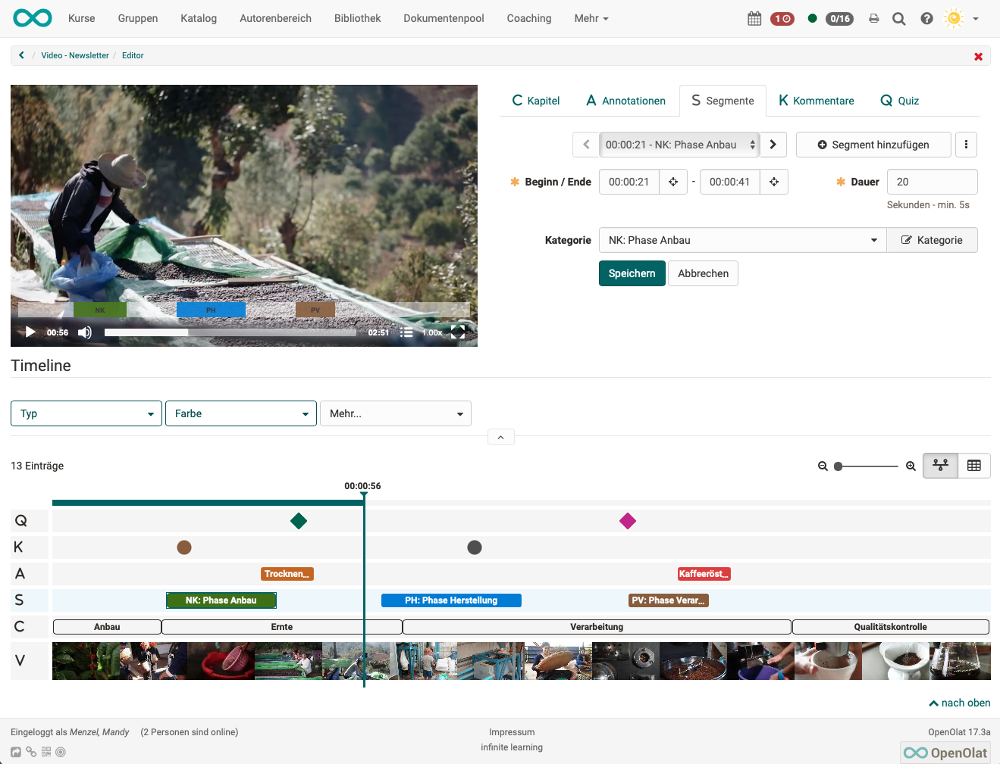
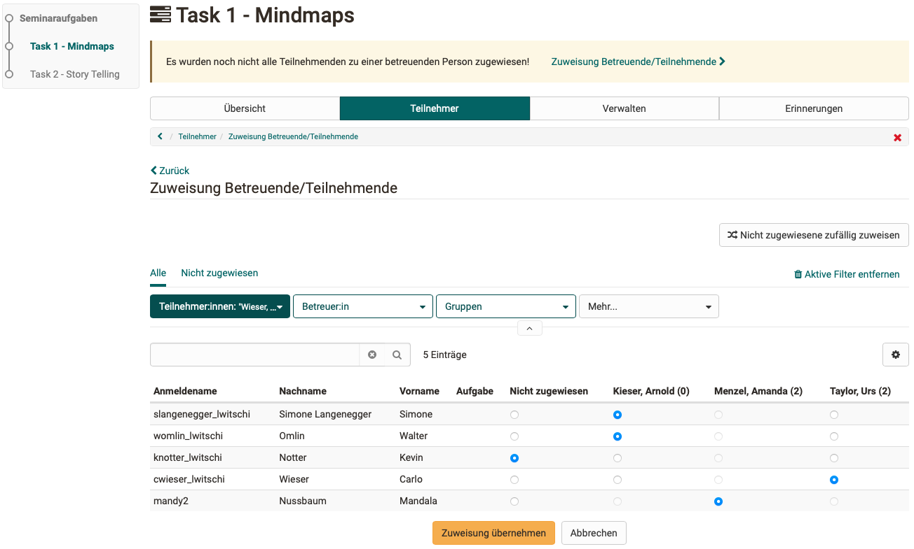
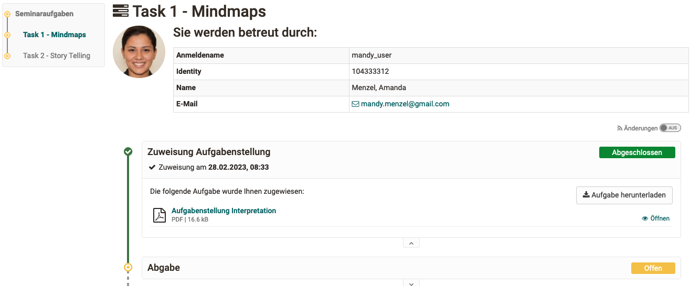

# Release Notes 17.2

<!---->

* * *

:material-calendar-month-outline: **Releasedatum: 10.02.2023 • Letztes Update: 17.03.2023**

* * *

Mit OpenOlat 17.2 geben wir unseren nächsten Major Release frei.

Mithilfe des neuen **Kursbausteins "Videoaufgabe"** üben Teilnehmende, Situationen aus der Praxis zu identifizieren und können dies im Test-Modus unter Beweis stellen. Der neu konzipierte **Video Editor mit Timeline** unterstützt die Autoren bei der Bearbeitung von Video-Lernressourcen (z.B. zur Vorbereitung von Videoaufgaben). Die dort konfigurierten Annotationen, Quizzes und mehr sind auch im **Kursbaustein "Video"** (de)aktivierbar. Am Aufgabenbaustein sorgt die gezielte **Zuweisung von Betreuenden** zu Teilnehmenden in Kurs-Settings mit mehreren Lehrpersonen für eine bessere Übersicht über die eigenen Bewertungsaufträge. Zum Thema **Accessibility** wurden einige Anpassungen vorgenommen, ebenso wurde für eine **gendergerechte Sprache** in den Menüs die Konfiguration des gewünschten Trennzeichens eingeführt. Der Release bringt neben einer **Bestätigungsmail nach Testabschluss** für Teilnehmende und zusätzliche Empfänger sowie neuen **Sammelaktionen** im Authoring Bereich weitere Verbesserungen rund um **Erinnerungen** und der **Zertifikatsfunktion** mit. Neu wird der Standard **OAI-PMH** unterstützt, mit dem z.B. Metadaten von Lernressourcen zur Indexierung an Suchmaschinen-Anbieter weitergeleitet werden können (**SEO**). Zahlreiche **UX/Usability**-Optimierungen und verschiedene **technische Aktualisierungen** runden diesen Release ab.

Seit Release 17.1 wurden über 80 neue Funktionen und Verbesserungen zu OpenOlat hinzugefügt. Hier finden Sie die wichtigsten Neuerungen zusammengefasst. Zusätzlich wurden mehr als 115 Bugs behoben. Die komplette Liste der Änderungen in 17.1 – 17.1.8 finden Sie [hier](Release_notes_17.1.de.md){:target="_blank”}.

* * *

## Video Editor in Lernressource "Video"

Für eine effiziente Bearbeitung der Lernressource "Video" wurde der neue Video Editor konzipiert. Dieser ist separat über die Lernressourcen-Administration aufrufbar und ermöglicht die gezielte Konfiguration von Kapiteln, Anmerkungen und Quizzes. Zudem werden hier Segmente und Kommentare gepflegt, die insbesondere für den neuen Baustein "Videoaufgabe" relevant sind.

#### Timeline und mehr

Der Video Editor umfasst drei Bearbeitungsbreiche: Neben dem eigentlichen Konfigurationsbereich rechts sind in der Video-Vorschau auf der linken Seite die Anpassungen direkt sichtbar. Die Timeline im unteren Abschnitt zeigt sämtliche Elemente strukturiert und in zeitlicher Abfolge an.

<figure markdown>
  { class="shadow lightbox thumbnail-xl" }
  <figcaption>Video-Editor mit Timeline</figcaption>
</figure>

#### Segmente

Segmente kommen in der Videoaufgabe zum Einsatz. Sie markieren definierte Bereiche im Video, denen die Teilnehmenden vorgegebene Begriffe oder Situationen (= Kategorien) zuordnen müssen.

#### Kommentare

Kommentare können gezielt an einem bestimmten Punkt im Video gesetzt werden und zum Beispiel wichtige Kernaussagen des Videos hervorheben, ergänzende Informationen zum Thema oder Hinweise zum folgenden Videoabschnitt bereitstellen. Beim Ansehen stoppt das Video an der entsprechenden Stelle. Um fortzusetzen, muss entweder der Kommentar aktiv geschlossen oder der Play-Button des Videos manuell angeklickt werden.

Neben einfachen Text-Kommentaren und der Einbindung bestehender Videos (Import als Datei oder per URL, z.B. von Youtube) können Video-Kommentare auch direkt im Editor über die Recording-Funktion aufgenommen und integriert werden.

<figure markdown>
  { class="shadow lightbox thumbnail-xl" }
  <figcaption>Video mit integriertem Text-Kommentar</figcaption>
</figure>

<figure markdown>
  { class="shadow lightbox thumbnail-xl" }
  <figcaption>Video mit integriertem Video-Kommentar</figcaption>
</figure>

#### Erweiterte Konfiguration für Kursbaustein "Video"

Bestehende Videoelemente wie Anmerkungen, Quizzes, Kommentare und Segmente können auch im Kursbaustein "Video" verwendet werden. Je nach Bedarf und Setting können diese für Teilnehmende angezeigt oder ausgeblendet werden.

* * *

## Neuer Kursbaustein "Videoaufgabe"

Mit dem neuen Kursbaustein „Videoaufgabe“ können Video-Lernressourcen für interaktive (formative) Übungen oder Aufgaben mit Bewertungen (summativ) wiederverwendet werden. Dabei müssen Teilnehmende in einem Video relevante Situationen ("teachable moment") erkennen und einer Kategorie zuordnen.

Die dafür notwendigen Platzhalter im Video (= Segmente) sowie die Kategorien werden in der Lernressource "Video" definiert (s. Video Editor).

<figure markdown>
  { class="shadow lightbox thumbnail-xl" }
  <figcaption>Videoaufgabe Startanzeige</figcaption>
</figure>

#### Übungs- und Testmodus

Im Übungsmodus können entweder die Begriffe (= Kategorien) direkt zu den sichtbaren Segmenten zugeordnet werden oder die Teilnehmenden müssen die Situationen in den entsprechenden Videoabschnitten selbstständig identifizieren. Für scharfe Prüfungen mit formalen Endresultaten steht der Test-Modus zur Verfügung.

<figure markdown>
  { class="shadow lightbox thumbnail-xl" }
  <figcaption>Videoaufgabe - Übungsmodus</figcaption>
</figure>

* * *

## Kursbaustein "Aufgabe"

#### Gezielte Zuweisung von Betreuenden zu Teilnehmenden

In Kurs-Settings mit sehr vielen Teilnehmenden werden diese häufig von mehreren Lehrpersonen betreut. Bisher musste durch gegenseite Abstimmung festgelegt werden, wer die Bewertung für welche Teilnehmenden vornimmt. Neu ist am Aufgabenbaustein eine gezielte Zuordnung (manuell oder automatisch) von Betreuenden zu einzelnen Teilnehmenden möglich.

<figure markdown>
  { class="shadow lightbox thumbnail-xl" }
  <figcaption>Zuweisung von Betreuenden zu Teilnehmenden</figcaption>
</figure>

Am Baustein, im Bewertungswerkzeug sowie im Coaching Tool werden die Zuweisungen und daraus entstandenen Bewertungsaufträge angezeigt. Die Lehrpersonen werden direkt per E-Mail benachrichtigt, wenn zugewiesene Teilnehmende eine Aufgabe abgegeben haben und somit ein Bewertungsauftrag verfügbar ist.

Teilnehmende sehen jeweils oberhalb der Aufgabe, wer sie betreut.

<figure markdown>
  { class="shadow lightbox thumbnail-xl" }
  <figcaption>Information zum Betreuenden in der Teilnehmeransicht</figcaption>
</figure>

#### Optimierte E-Mail-Bestätigung
  
Ist die entsprechende Option aktiviert, so erhalten Teilnehmende nach der aktiven Abgabe einer Aufgabe eine E-Mail-Bestätigung. Die Konfiguration für diese Funktion wurde optimiert und es wurden weitere relevante Variablen, wie z.B. Kursname und Bausteinname, zur Verwendung im E-Mail-Text ergänzt.

<figure markdown>
  { class="shadow lightbox thumbnail-xl" }
  <figcaption>Konfiguration der Bestätigungsmail am Aufgabenbaustein</figcaption>
</figure>

* * *

## Neues in den Bereichen eAssessments, Tests & Fragetypen

#### E-Mail-Bestätigung nach Testabschluss

In Szenarien wie Einstufungstests, die von Teilnehmenden selbstständig aufgerufen und durchgeführt werden, ist eine Bestätigung per E-Mail nach dem Abschluss des Tests hilfreich und zum Teil notwendig. Eine entsprechende Option wurde in der Test-Konfiguration ergänzt, um eine Bestätigungsmail an Teilnehmende selbst sowie ausgewählte zusätzliche Empfänger wie Betreuende oder externe Empfänger auszulösen.

<figure markdown>
  { class="shadow lightbox thumbnail-xl" }
  <figcaption>Konfiguration der Bestätigungsmail am Testbaustein</figcaption>
</figure>

#### Weitere Neuerungen

* Optimierte Darstellung formatierter Antworten für den Fragetyp "Reihenfolge"
* Leistungsnachweis: Verbesserter Informationsbereich und Ergänzung von Zertifikatsdaten (Erstellungsdatum, Gültigkeit)
* Unterstützung der Sortierung von Noten- und Text-Bewertungen
* Gruppenaufgabe: Gruppenansicht im Bewertungswerkzeug

* * *

## Neues im Kurs

* Kursbaustein "Formular": Ergänzung zusätzlicher Empfänger für Bestätigungs-E-Mail nach Abgabe des Formulars durch Teilnehmende
* Kursbaustein "Terminplanung": Optimierungen für nachträglichen Wechsel des Anlass-Typs
* Zugangsbeschränkungen für Kursbausteine auf Strukturebene sichtbar (Herkömmlicher Kurs)
* Erinnerungen:
    * Erinnerungsfunktion nach Ablauf des Zertifikats
    * Konfiguration datumsgesteuerter Erinnerungen mit der Angabe "davor" und "danach"
* Gelöschte / Im Papierkorb liegende Videos werden nicht mehr im Kurs abgespielt, es wird stattdessen ein entsprechender Hinweis angezeigt
* Unterstützung des "tel protocol handler" zur automatischen Auflösung von Telefonnummern in HTML-Seiten inklusive Anzeige eines Telefon-Symbols

* * *

## Neues im Authoring Bereich

Ein neuer Wizard wurde implementiert, um per Sammelaktion die Einstellungen für mehrere Lernressourcen und Kurse gleichzeitig zu bearbeiten. Darüber können u.a. folgende Daten angepasst werden: Metadaten, Daten zu Durchführung, Taxonomie und Freigabe, Autorenrechte, Werkzeuge in der Kurs-Toolbar.

<figure markdown>
  { class="shadow lightbox thumbnail-xl" }
  <figcaption>Auswahl der gewünschten Bereiche im Wizard für Sammelaktionen</figcaption>
</figure>

Auf der Übersichtsseite am Ende des Wizards können die durchgeführten Anpassungen nochmals kontrolliert werden.

<figure markdown>
  { class="shadow lightbox thumbnail-xl" }
  <figcaption>Zusammenfassung der Anpassungen</figcaption>
</figure>

* * *

## Administratives

* Mitgliederverwaltung von Kursen und Gruppen: Zusammenführen der Aktionen zum Hinzufügen von einzelnen oder mehreren Mitgliedern zum Kurs
* Erweiterung der Auswahl des systemweiten Standard-Kurstyps: Mit Lernpfad, Mit Lernfortschritt, Klassisch
* Taxonomie: Verbesserter Export sowie erweiterter Import inklusive Wizard-Anpassung, um Hintergrund- und Teaser-Bilder hinzuzufügen
* Nur für Administratoren: Manuelles Hinzufügen und Ändern von Authentifizierungs-Tokens über die Benutzerverwaltung

* * *

## Unterstützung der OAI-PMH Metadatenschnittstelle / SEO

!!! note "Was ist OAI-PMH?"

    The Open Archives Initiative Protocol for Metadata Harvesting (OAI-PMH) is a low-barrier mechanism for repository interoperability. Data Providers are repositories that expose structured metadata via OAI-PMH. Service Providers then make OAI-PMH service requests to harvest that metadata. OAI-PMH is a set of six verbs or services that are invoked within HTTP.
    
    Quelle: <https://www.openarchives.org/pmh/>{:target="_blank”}

Die Integration in OpenOlat ermöglicht es, dass die Metadaten von dafür freigegebenen Kursen an Suchmaschinen-Anbieter zur Indexierung weitergeleitet, oder auch von anderen Service Providern gesammelt werden können. Somit kann das Kurs-Angebot auch ausserhalb von OpenOlat veröfentlicht werden.

[Mehr dazu direkt im Handbuch](../manual_admin/administration/Modules_OAI.de.md){:target="_blank"}

* * *

## Rund um UX / Usability

* Zahlreiche Optimierungen zur Unterstützung von Autoren bei der Konfiguration von Tests im Kurs, wie zum Beispiel:
    * Ausgabe unterstützender Hinweise und Warnungen
    * Labelanpassungen
    * Zusammenfassung der wichtigsten Daten oberhalb der Konfiguration

<figure markdown>
  { class="shadow lightbox thumbnail-xl" }
  <figcaption>Testkonfigration - Infobox</figcaption>
</figure>

* Zertifikate:
    * Entfernung der automatischen Generierung von Zertifikaten nach Ablauf der Gültigkeitsdauer in Lernpfadkursen
    * Optimierte Konfiguration der Zertifikatsfunktion
    * Bereinigung der Anzeige, wie lange ein Zertifikat gültig ist

<figure markdown>
  { class="shadow lightbox thumbnail-xl" }
  <figcaption>Zertifikatsfunktion im Kurs aktivieren</figcaption>
</figure>

* Lernpfad: Rote Fortschrittsanzeige für "Nicht bestanden"
* Tabellenfilter: Optische Hervorhebung aktiver Filter
* Ersatz grauer Infoboxen durch neue Variante inklusive optionaler Link zum Handbuch
* Wizards: Verbesserte Fokusbehandlung für Formulare mit Validierung
* Optimierte Handhabung von HTML-Dateien als Seiteninhalt in Kursen

* * *

## Accessibility Initiative

* Entfernung unnötiger Animationen auf dem Login-Screen für Personen, die reduzierte Bewegungen bevorzugen ("reduced-motion" Einstellung)
* Zahlreiche Verbesserungen der Screenreader-Kompatibilität in der Menüführung und der Navigation
* Diverse Optimierungen in der HTML Ausgabe
* Erhöhung des Kontrasts im OpenOlat Design

Alle Details zu den Anpassungen sind im Jira [hier](https://jira.openolat.org/browse/OO-6597){:target="_blank”} sowie über die Suche nach dem Stichwort / Label "a11y" verfügbar.

* * *

## Gendergerechte Sprache

Die Umstellung auf eine gendergerechte Sprache bedeutet in einer Software wie OpenOlat grössere Änderungen. Neben bereits [umgesetzten Anpassungen](https://jira.openolat.org/browse/OO-6631){:target="_blank”} in der deutschen Sprache wurde OpenOlat für die weiteren Textbausteine vorbereitet.

Konkret ist es ab sofort möglich, in der `Administration > Core Konfiguration > Sprachen` das gewünschte Trennzeichen (z.B. * : / etc.) in den Systemeinstellungen zu definieren:

<figure markdown>
  { class="shadow lightbox thumbnail-xl" }
  <figcaption>Trennzeichen konfigurieren</figcaption>
</figure>

* * *

## Weiteres, kurz notiert

* Absenzenmanagement: Anzeige des Erstzulassungsdatums in Tabelle der Teilnehmenden
* Katalog: Eränzung weiterer Filter zur Eingrenzung der Suchergebnisse
* Optimierte Handhabung von GIF-Dateien
* Curriculum: Verbesserung der Sichtbarkeit referenzierter Kurse in Curricula
* QM: Externe Verwaltung des Durchführungstyps eines Kurses
* Aktualisierung "Über OpenOlat"-Seite: Ergänzung der Social Media Referenz für Mastodon sowie Anpassung des Spenden-Links

* * *

## Technisches

* Aktualisierung der Bibliotheken von Drittanbietern und Code-Bereinigung
* Modifizierung des Flexi-Form-Frameworks, um das unabhängige Rendern von Formularen und Elementen zu ermöglichen
* REST API: Neuer Endpunkt zur Erstellung und Verwaltung externer Benutzer
* Ausgabe einer Fehlermeldung, wenn externe Inhalte aufgrund von SSL-Problemen nicht angezeigt werden können
* Update Bootstrap auf 3.4.1
* Migration zu Jakarta EE 9.1 und damit verbundene [Anpassungen](https://jira.openolat.org/browse/OO-6514){:target="_blank”}

    !!! info "Jakarta EE 9.1"

        Jakarta EE 9.1 setzt den Einsatz von Tomcat 10 und Java 17 voraus! Für einen reibungslosen Betrieb von OpenOlat 17.2. prüfen Sie bitte ihr Setup.

* * *

## Systemadministratoren: Neue Funktionen aktivieren / konfigurieren

!!! note "Checkliste nach Update auf 17.2"

    Folgende Funktionen müssen nach einem Update auf Release 17.2 in der Administration aktiviert bzw. konfiguriert werden:
    
    * [x] Standard-Kurstyp für die Erstellung neuer Kurse: `Module > Kurs` - Auswahl "Mit Lernpfad" / "Mit Lernfortschritt" / "Klassisch"
    * [x] Trennzeichen für gendergerechte Sprache: `Core Konfiguration > Sprachen` - Abschnitt "Geschlechtergerechte Sprache"
    * [x] OAI-PMH-Standard / SEO für Suchmaschinen-Indexierung: `Module > SEO / OAI-PMH Metadaten` - Modul "OAI-PMH Schnittstelle" und "Suchmaschinenoptimierung" aktivieren

* * *

## Weitere Informationen

* [Jira Release Notes 17.2.4](https://jira.openolat.org/secure/ReleaseNote.jspa?projectId=10000&version=20500){:target="_blank”}
* [Jira Release Notes 17.2.3](https://jira.openolat.org/secure/ReleaseNote.jspa?projectId=10000&version=20401){:target="_blank”}
* [Jira Release Notes 17.2.2](https://jira.openolat.org/secure/ReleaseNote.jspa?projectId=10000&version=20200){:target="_blank”}
* [Jira Release Notes 17.2.1](https://jira.openolat.org/secure/ReleaseNote.jspa?projectId=10000&version=20101){:target="_blank”}
* [Jira Release Notes 17.2.0](https://jira.openolat.org/secure/ReleaseNote.jspa?projectId=10000&version=19000){:target="_blank”}
