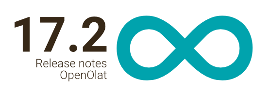
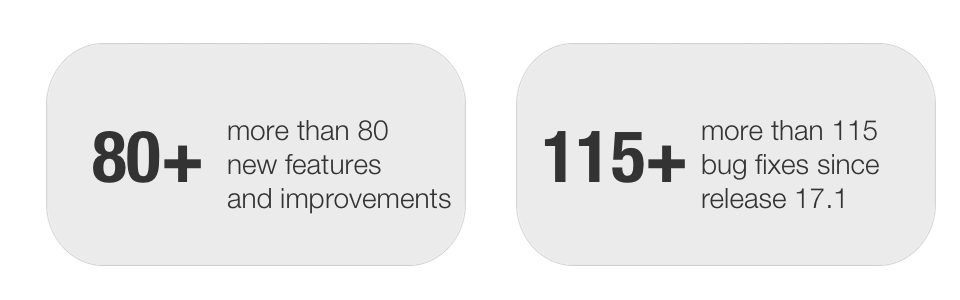
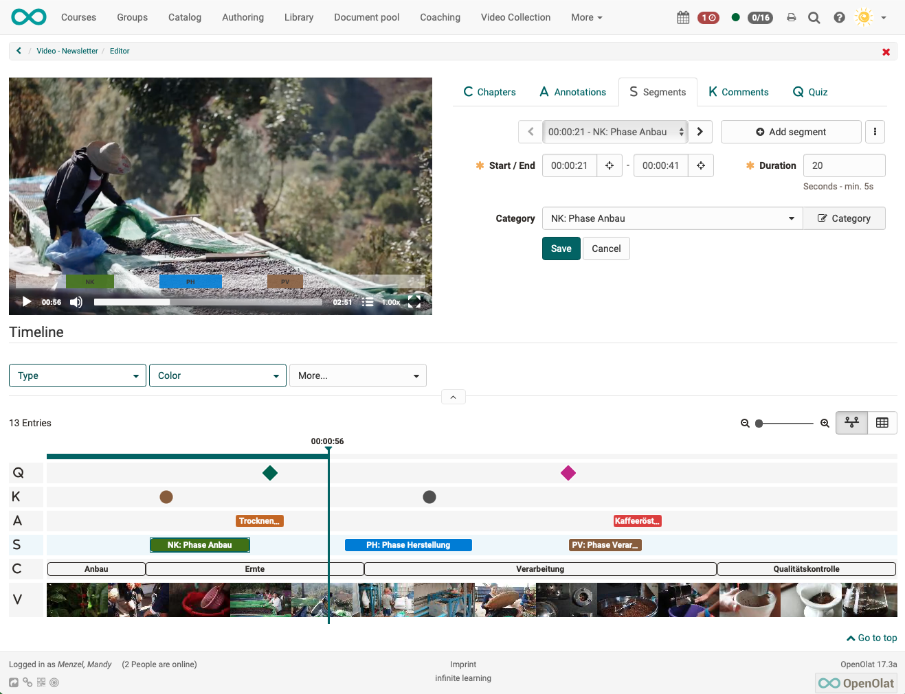
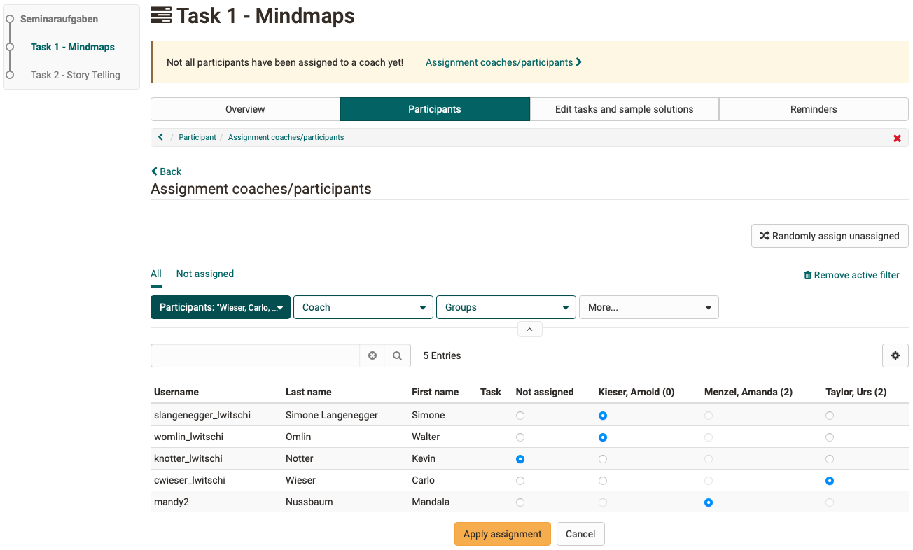
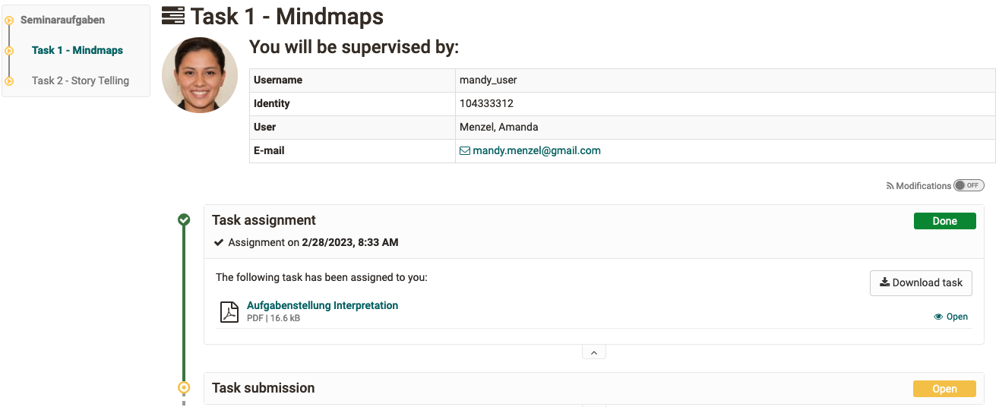

# Release notes 17.2

<!---->

* * *

:material-calendar-month-outline: **Release date: 02/24/2023 • Last update: 03/03/2023**

* * *

With OpenOlat 17.2 we release our next major release.

Using the new **course element “Video task "**, participants practice identifying real-life situations and can put this to the test in test mode. The newly designed **Video editor with timeline** supports authors in editing video learning resources (e.g. for preparing video tasks). The annotations, quizzes and more configured there can also be (de)activated in the **course element "Video "**. In the course element “Task", the targeted **assignment of coaches** to participants in course settings with multiple teachers ensures a better overview of one's own assessment assignments. On the subject of **accessibility**, some adjustments have been made, as well as the configuration of the desired delimiter has been introduced for **gender-sensitive language** in the menus. In addition to a **confirmation mail after test completion** for participants and additional recipients as well as new **bulk actions** in the authoring area, the release brings further improvements covering **reminders** and the **certificate function**. The **OAI-PMH** standard is now supported, which can be used, for example, to forward metadata from learning resources to search engine providers for indexing (**SEO**). Numerous **UX/Usability** optimizations and various **technical updates** complete this release.

Since release 17.1, over 80 new features and improvements have been added to OpenOlat. Here you can find the most important new features and changes. In addition, more than 115 bugs have been fixed. The complete list of changes in 17.1 - 17.1.8 can be found [here](Release_notes_17.1.md){:target="_blank”}.

* * *

## Video editor in learning resource "Video

The new Video editor has been designed for efficient editing of the learning resource "Video". It can be accessed separately via the learning resource administration and enables the specific configuration of chapters, annotations and quizzes. In addition, segments and comments are maintained here, which are particularly relevant for the new module "Video task".

#### Timeline and more

The Video editor comprises three editing areas: In addition to the actual configuration area on the right, adjustments are directly visible in the video preview on the left. The timeline in the lower section shows all elements structured and in chronological order.

{ class="shadow lightbox" }

#### Advanced configuration for course element "Video

Existing video elements such as annotations, quizzes and segments can also be configured in the course element "Video". Depending on requirements and settings, these elements can be displayed or hidden for participants.

* * *

## New course element "Video task"

With the new course element "Video task" video learning resources can be reused for interactive (formative) exercises or tasks with assessments (summative). Participants have to identify relevant situations ("teachable moment") in a video and assign them to a category.

The necessary placeholders in the video (= segments) as well as the categories are defined in the learning resource "Video" (see Video editor).

{ class="shadow lightbox" }

#### Practice and test mode

In practice mode, either the terms (= categories) can be assigned directly to the visible segments or the participants have to identify the situations in the corresponding video segments on their own. For real tests with formal final results the test mode is available.

{ class="shadow lightbox" }

* * *

## Course element “Task"

#### Specific assignment of coaches to participants

In course settings with a large number of participants, they are often supervised by several coaches. Up to now it had to be determined by mutual agreement who will do the assessment for which participants. Now it is possible to assign coaches to individual participants in the task element (manually or automatically).

{ class="shadow lightbox" }

On the course element, in the assessment tool as well as in the coaching tool, the assignments and resulting assessment orders are displayed. Coaches are notified directly by email when assigned participants have submitted a task solution and thus when an assessment order is available.

Participants can see above the task who is supervising them.

{ class="shadow lightbox" }

#### Optimized e-mail confirmation
  
If the corresponding option is activated, participants receive an e-mail confirmation after actively submitting a task solution. The configuration for this feature has been optimized and additional relevant variables, such as course name and course element name, have been added for use in the e-mail text.

{ class="shadow lightbox" }

* * *

## What's new in eAssessments, tests & question types

#### Email confirmation after test completion

In scenarios such as diagnostic tests that are accessed and taken by participants on their own, an email confirmation after test completion is helpful and sometimes necessary. A corresponding option has been added to the test configuration to trigger a confirmation email to participants themselves as well as selected additional recipients such as coaches or external recipients.

{ class="shadow lightbox" }

#### Other new features

* Optimized display of formatted answers for the question type "Order".
* Evidence of achievement: Improved information area and addition of certificate data (creation date, validity)
* Support for sorting grade and text assessments
* Group task: Group view in the assessment tool

* * *

## New in course

* Course element "Form": Additional recipients for confirmation e-mail after submission of form by participant added
* Course element " Appointment scheduling": Optimizations for subsequent change of event type
* Reminders:
    * Reminder function after certificate expiration
    * Configuration of date-controlled reminders with the indication "before" and “after"
* Deleted / Trashed videos will no longer be played in the course, instead a corresponding note will be displayed
* Support of "tel protocol handler" for automatic resolution of phone numbers in HTML pages including display of a phone icon

* * *

## New in the authoring area

A new wizard has been implemented to edit settings for multiple learning resources and courses simultaneously via bulk action. The following data, among others, can be adjusted: Metadata, data on execution, taxonomy and share, authoring rights, tools in the course toolbar.

{ class="shadow lightbox" }

On the overview page at the end of the wizard the performed adjustments can be checked before saving.

{ class="shadow lightbox" }

* * *

## Administrative

* Member management of courses and groups: Merging of actions to add single or multiple members to the course.
* Expanding the selection of the system-wide default course type: With Learning path, With Learning progress, Classic
* Taxonomy: Improved export as well as enhanced import including wizard modification to add background and teaser images
* For administrators only: Manually add and change authentication tokens via user management

* * *

## Support of the OAI-PMH metadata interface / SEO

!!! note "What is OAI-PMH?"

    The Open Archives Initiative Protocol for Metadata Harvesting (OAI-PMH) is a low-barrier mechanism for repository interoperability. Data Providers are repositories that expose structured metadata via OAI-PMH. Service Providers then make OAI-PMH service requests to harvest that metadata. OAI-PMH is a set of six verbs or services that are invoked within HTTP.
    
    Source: <https://www.openarchives.org/pmh/>{:target="_blank"}

The integration in OpenOlat makes it possible that the metadata of courses released for this purpose can be forwarded to search engine providers for indexing, or also collected by other service providers. Thus, the course offering can also be published outside of OpenOlat.

[More information in the manual](../manual_admin/administration/Modules_OAI.md){:target="_blank"}

* * *

## All around UX / Usability

* Numerous optimizations to help authors configure tests in the course, such as:
    * Display of supporting hints and warnings
    * Label adjustments
    * Summary of the most important data above the configuration

        { class="shadow lightbox" }

* Certificates:
    * Removal of automatic generation of certificates after expiration in learning path courses
    * Optimized configuration of the certificate function
    * Cleaned up the display of valid time of a certificate

        { class="shadow lightbox" }

* Learning path: red progress indicator for "Failed"
* Table filter: Optical highlighting of active filters
* Replacement of gray infoboxes by new variant including optional link to the manual
* Wizards: Improved focus handling for forms with validation
* Optimized handling of HTML files as page content in courses

* * *

## Accessibility Initiative

* Removal of unnecessary animations on the login screen for people who prefer "reduced-motion" setting.
* Numerous screen reader compatibility improvements in (menu) navigation
* Various optimizations in the HTML output
* Increase of contrast in the OpenOlat design

Full details of the customizations are available in Jira [here](https://jira.openolat.org/browse/OO-6597){:target="_blank"} and by searching for the keyword / label "a11y".

* * *

## Gender-sensitive language

Switching to a gender-sensitive language means major changes in a software like OpenOlat. Besides already [implemented adjustments](https://jira.openolat.org/browse/OO-6631){:target="_blank"} in the German language, OpenOlat was prepared for the other text modules.

Specifically, it is now possible to define the desired separator (e.g. * : / etc.) in the system settings in the 'Administration > Core Configuration > Languages':

{ class="shadow lightbox" }

* * *

## Further, briefly noted

* Absence management: display of first date of admission in table of participants
* Catalog: Addition of more filters to narrow down search results
* Optimized handling of GIF files
* Curriculum: Improved visibility of referenced courses in curricula
* QM: external management of the execution type of a course
* Update "About OpenOlat" page: addition of social media reference for Mastodon as well as adaptation of donation link

* * *

## Technical

* Updating third-party libraries and code cleanup
* Modification of Flexi-Form framework to allow independent rendering of forms and elements
* REST API: New endpoint to create and manage external users
* Provide an error message when external content cannot be displayed due to SSL issues
* Update Bootstrap to 3.4.1
* Migration to Jakarta EE 9.1 and related [customizations](https://jira.openolat.org/browse/OO-6514){:target="_blank"}

    !!! info "Jakarta EE 9.1"

        Jakarta EE 9.1 requires the use of Tomcat 10 and Java 17! For a smooth operation of OpenOlat 17.2. please check your setup.

* * *

## System administrators: Activate / configure new functions

!!! note "Checklist after update to 17.2"

    The following functions have to be activated / configured in the administration after an update to release 17.2:
    
    * Default course type for the creation of new courses: `Modules > Course` - Selection "With learning path" / "With learning progress" / "Classic"
    * Separator for gender-sensitive language: `Core Configuration > Languages` - section "Gender-sensitive language"
    * OAI-PMH standard / SEO for search engine indexing: `Modules > SEO / OAI-PMH metadata` - activate module "OAI-PMH interface" and "Search engine optimization"

* * *

## More information

* [Jira Release Notes 17.2.2](https://jira.openolat.org/secure/ReleaseNote.jspa?projectId=10000&version=20200){:target="_blank”}
* [Jira Release Notes 17.2.1](https://jira.openolat.org/secure/ReleaseNote.jspa?projectId=10000&version=20101){:target="_blank”}
* [Jira Release Notes 17.2.0](https://jira.openolat.org/secure/ReleaseNote.jspa?projectId=10000&version=19000){:target="_blank”}
